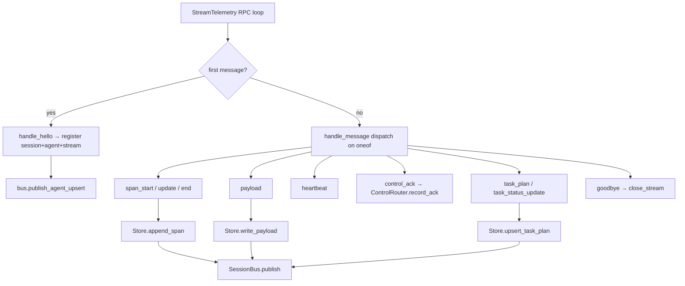
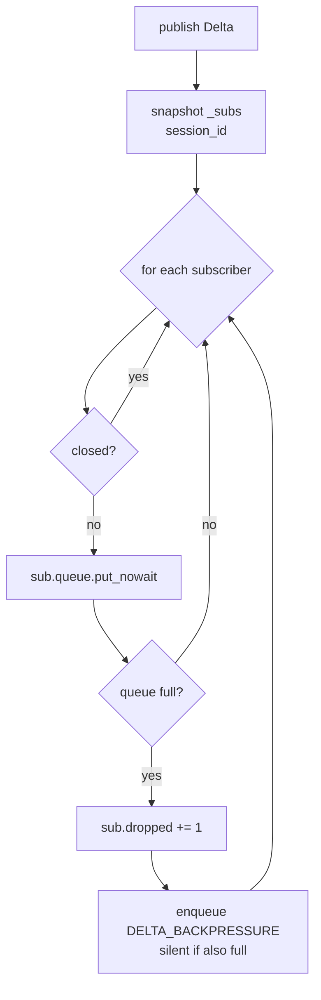
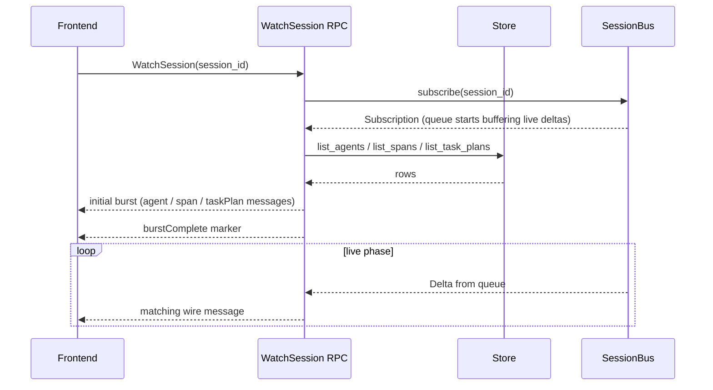
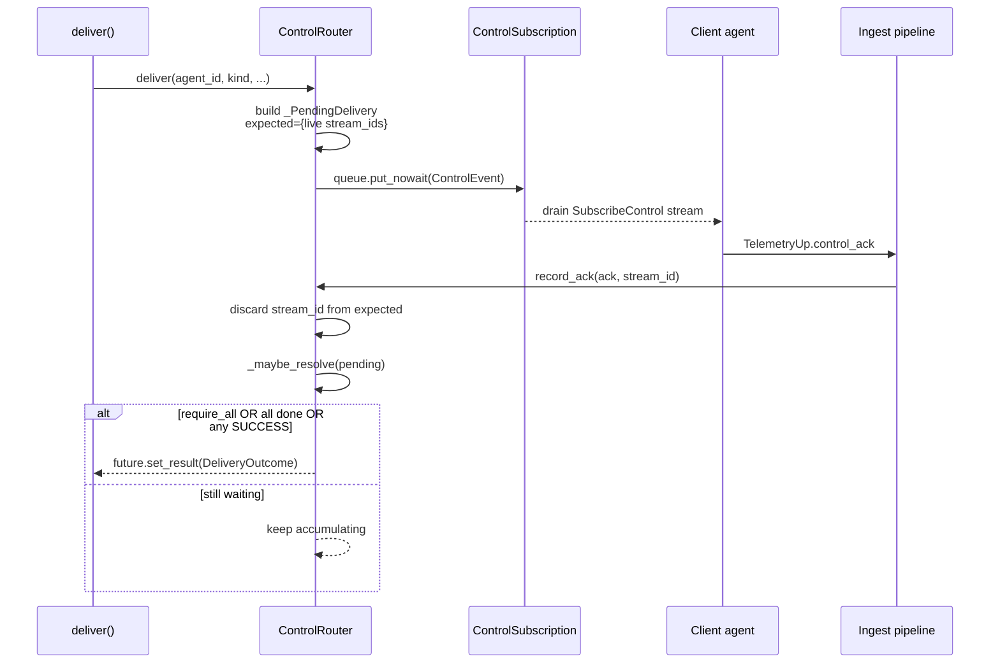

# Server ingest, bus, and control router

The server's fan-in surface is split across four files:

- `server/harmonograf_server/ingest.py` (~1000 lines) — the telemetry
  envelope pipeline. Receives every message from every client's
  `StreamTelemetry` RPC, deduplicates, persists, publishes, and
  maintains the per-session drift ring for late-subscribe replay.
- `server/harmonograf_server/bus.py` (~260 lines) — the per-session
  pub/sub bus with bounded per-subscriber queues and drop-oldest
  backpressure.
- `server/harmonograf_server/control_router.py` (~350 lines) — the
  reverse direction. Frontend sends control, server routes to live
  client streams, correlates acks back to pending requests.
- `server/harmonograf_server/interventions.py` (~550 lines) — the
  intervention aggregator. Merges annotations + drift ring + plan
  revisions into one chronological list; dedups by `annotation_id`.

All four are single-process, in-memory. Persistence is delegated to
the storage layer (see [`storage-sqlite.md`](storage-sqlite.md)); the
bus only fans out the live stream to subscribers currently watching.

For wire shapes, see
[`../protocol/telemetry-stream.md`](../protocol/telemetry-stream.md)
and
[`../protocol/control-stream.md`](../protocol/control-stream.md).

## The envelope pipeline (`ingest.py`)

The pipeline is a flat dispatch on the TelemetryUp oneof, with every
branch following the same *dedup → persist → publish* pattern. The
`control_ack` branch is the one outlier — it forwards into the
ControlRouter instead of touching storage.



For the wire-level message shapes, see
[`../protocol/telemetry-stream.md`](../protocol/telemetry-stream.md).


The RPC entry point for the `StreamTelemetry` bidi is in
`server/harmonograf_server/rpc/telemetry.py` (not covered here). That
module opens a `StreamContext`, calls `handle_hello` on the first
message, then loops calling `handle_message` for every subsequent
message. When the RPC exits (or the stream breaks), `close_stream`
is called.

`StreamContext` is a dataclass at `ingest.py:110-133`:

```python
@dataclass
class StreamContext:
    stream_id: str
    agent_id: str
    session_id: str
    connected_at: float
    last_heartbeat: float
    metadata: dict
    seen_span_ids: set[str] = field(default_factory=set)
```

The `seen_span_ids` set is the per-stream dedup cache. It is
intentionally per-stream, not global: two different streams for the
same agent might legitimately emit different spans that happen to
share an id, and we want to dedup only within a single stream's
flight. Global dedup would also require locking; the per-stream set
needs no lock because each stream is serviced by exactly one asyncio
task.

### `handle_hello` (`ingest.py:182-239`)

Called on the first message of a new telemetry stream. Its job is
session / agent bring-up:

1. Generate a `session_id` if the Hello didn't supply one
   (`ingest.py:190`).
2. Validate the format (`ingest.py:191-194`).
3. Create the session record in storage if it doesn't exist
   (`ingest.py:196-207`).
4. Register the agent on that session (`ingest.py:209-213`).
5. Allocate a unique `stream_id` for dedup and control routing
   (`ingest.py:216-217`).
6. Publish an `agent_upsert` Delta to the bus so live watchers see
   the new agent immediately.

The validation step is important — session ids are used as SQLite
primary keys and as URL segments in the frontend, so any
non-matching-pattern input must be rejected loudly. Bad hellos
generate a structured error back to the client, not a 500.

### `handle_message` (`ingest.py:241-268`)

The dispatcher. Branches on message kind:

- `span_start` → `_handle_span_start`
- `span_update` → `_handle_span_update`
- `span_end` → `_handle_span_end`
- `payload` → `_handle_payload`
- `heartbeat` → `_handle_heartbeat`
- `control_ack` → forwarded to `ControlRouter.record_ack`
- `goldfive_event` → `_handle_goldfive_event` (dispatches on the
  `Event.payload` oneof — `run_started`, `plan_submitted`,
  `plan_revised`, `task_started/progress/completed/failed/blocked/
  cancelled`, `drift_detected`, `run_completed/aborted`,
  `agent_invocation_*`, `delegation_observed`, ...)
- `goodbye` → mark stream shut

`task_plan = 9` and `task_status_update = 10` are **reserved** in the
proto — pre-goldfive-migration they were their own oneof variants;
plan / task state now rides inside `goldfive_event`.

Every branch follows the same three-phase pattern: *dedup if
applicable → persist → publish*.

### Span dedup

`_handle_span_start` at `ingest.py:327-350` is the canonical case:

```python
if span.id in ctx.seen_span_ids:
    return
ctx.seen_span_ids.add(span.id)
stored = await self._store.append_span(span)
self._bus.publish_span_start(stored)
```

The dedup prevents retry-on-disconnect from inserting the same span
twice into storage and fanning it out twice to subscribers. Span
updates and ends do not dedup because they are idempotent at the
storage layer (update-by-id and end-by-id).

### Storage and bus calls

The calls into storage and bus are explicit and unshared. Storage
writes happen first (`await self._store.append_span(stored)` at
`ingest.py:348`), followed by the bus publish
(`self._bus.publish_span_start(stored)` at `ingest.py:349`). This
ordering matters for the WatchSession replay case: a watcher
attaching during a burst queries storage to get the replay, then
subscribes to the bus for the live stream. If publishing preceded
storage, the watcher could see a live span that the replay hadn't
yet observed and end up with a duplicate. By persisting first, the
storage state is always at least as fresh as what's on the bus.

### Session routing (harmonograf #63 / #66 / #85)

Spans and goldfive events route to different session ids on the same
telemetry stream:

- **Spans** route by `pb_span.session_id` (falling back to
  `ctx.session_id`). A `HarmonografTelemetryPlugin` configured with
  the outer adk-web session id stamps it on every span, so spans
  land on the correct session row even when ADK's `AgentTool`
  sub-Runner minted its own id. See
  [ADR 0021](../adr/0021-session-id-pinning.md).
- **Goldfive events** route by `Event.session_id` (goldfive field
  5, added in goldfive #155). When an event carries a session id
  different from the stream's Hello session,
  `_handle_goldfive_event` wraps the context in a read-only
  `_SessionView` that pins `session_id` without mutating the
  shared `StreamContext`, then calls `_ensure_route` to
  auto-create the session / agent row if unseen.

Both paths preserve back-compat: empty `session_id` on a span or
goldfive event falls back to the Hello session.

### Agent auto-registration (harmonograf #74 / #80)

`_ensure_route` is the first-sight handler. On a fresh
`(session_id, agent_id)` pair it:

1. Creates the session row if missing.
2. Reads `hgraf.agent.name` / `hgraf.agent.parent_id` /
   `hgraf.agent.kind` / `hgraf.agent.branch` attributes off the
   span and writes them as `adk.agent.name`,
   `harmonograf.parent_agent_id`, `harmonograf.agent_kind`,
   `adk.agent.branch` in the agent's `metadata`.
3. Prefers `hgraf.agent.name` over the bare `span.name` for the
   display name (LLM/tool span names are the model/tool name, not
   the agent name).
4. Registers the Agent row with `Framework.ADK` when a name hint
   is present, and publishes an `agent_upsert` delta.

`seen_routes` on the `StreamContext` short-circuits subsequent
spans so the hot path pays the harvest cost once per agent, never
per span. See
[ADR 0024](../adr/0024-per-adk-agent-gantt-rows.md).

The plugin side of the contract is in
[`client/harmonograf_client/telemetry_plugin.py`](../../client/harmonograf_client/telemetry_plugin.py)
(`_register_agent_for_ctx`, `_stamp_agent_attrs`).

### Stream lifecycle

`close_stream` at `ingest.py:270-303` is the cleanup path. When the
RPC exits for any reason:

1. Remove the stream from `_streams_by_agent[agent_id][stream_id]`.
2. If no live streams remain for that agent, mark the agent
   `DISCONNECTED` in storage and publish an `agent_status` Delta
   (`ingest.py:288-295`).
3. Clear any control router aliases that pointed at this stream
   (via `ControlRouter.clear_aliases_for_stream`).

The "no live streams remain → mark disconnected" gate is how the
frontend knows to gray out an agent. If a client reconnects
immediately (e.g. network blip), the old stream closes, the new
one opens, and between the two the agent is briefly disconnected.
That flicker is intentional — the alternative is a hidden grace
period that masks real failures.

### Heartbeats

`_handle_heartbeat` at `ingest.py:611-626` updates
`ctx.last_heartbeat` and publishes a heartbeat Delta with agent
status, buffered event counts, CPU usage, etc. The sweeper
`sweep_heartbeats()` at `ingest.py:306-318` runs on a timer,
scanning all live streams and marking any whose last heartbeat is
older than the threshold as stale. Stale streams are not
auto-disconnected — the RPC layer decides whether to close them —
but the state change fans out to watchers so the frontend can
indicate "agent looks stuck".

## The pub/sub bus (`bus.py`)

`SessionBus` at `bus.py:66-77` is the broadcast surface. One bus per
harmonograf process, with an internal
`dict[session_id, list[Subscription]]`.

### Subscription

`Subscription` at `bus.py:51-64` wraps an `asyncio.Queue[Delta]` with
the configured `queue_maxsize` (default 1024, from the bus
constructor at `bus.py:74`), plus a `dropped: int` counter and a
`closed: bool` flag.

`subscribe(session_id)` at `bus.py:79-83` creates a Subscription and
appends it to the session's list. `unsubscribe(sub)` at `bus.py:85-96`
closes the subscription and removes it from the list; if the list
becomes empty, the session key is deleted from the dict to prevent
unbounded growth.

### Publish and backpressure

`publish(delta)` at `bus.py:98-119` is the core fanout. The
noteworthy detail is that it does **not** hold the bus's async lock
while publishing:

```python
# Snapshot subscribers under the lock, then iterate without it.
subs = list(self._subs.get(delta.session_id, ()))
for sub in subs:
    try:
        sub.queue.put_nowait(delta)
    except asyncio.QueueFull:
        sub.dropped += 1
        # Best-effort signal that backpressure occurred.
        try:
            sub.queue.put_nowait(_BACKPRESSURE_DELTA(dropped=sub.dropped))
        except asyncio.QueueFull:
            pass
```

The snapshot approach is what makes publish non-blocking. Taking
the lock, snapshotting, releasing, and then iterating means a slow
subscriber can never block the fanout to fast subscribers.

**Backpressure strategy: drop-oldest per subscriber.** When a
subscriber's queue is full, `put_nowait` raises `QueueFull`. The bus
increments the dropped counter and attempts to enqueue a
`DELTA_BACKPRESSURE` marker so the subscriber can learn it missed
data. Ingest itself is never blocked — the cost of a slow subscriber
is measured in that subscriber's missed deltas, never in delayed
telemetry ingestion.

The alternative — block the publisher until all subscribers catch
up — was explicitly rejected because it would let one hung frontend
client stall all telemetry ingest. The dropped-delta signal is the
escape hatch: the frontend sees the counter rise, knows it's
falling behind, and can request a resync via WatchSession.

### Convenience publishers

`bus.py:125-227` has one `publish_*` method per Delta kind.
`publish_span_start`, `publish_span_update`, `publish_span_end`,
`publish_agent_upsert`, `publish_agent_status`, `publish_annotation`,
`publish_heartbeat`, `publish_task_plan`, `publish_task_status`,
`publish_context_window_sample`, `publish_task_report`. They all
wrap the underlying `publish(Delta(session_id, kind, payload))`
call; the convenience is the per-kind type signature.

### Subscriber fan-out

`SessionBus.publish` snapshots the per-session subscriber list outside
the async lock, then calls `put_nowait` on each. Slow subscribers do not
block ingest — instead, the full-queue case enqueues a synthetic
`backpressure` Delta on that one subscriber and increments its `dropped`
counter.



## WatchSession replay + initial burst

The `WatchSession` RPC (defined in the frontend RPC handler, not
covered in detail here) implements the initial-burst-then-live
pattern:

1. On subscribe, the handler first queries storage for the session's
   existing agents, spans, task plans, and context samples, and
   sends them as `initialSpan` / `agent` / `taskPlan` / etc.
   messages.
2. Concurrently it calls `bus.subscribe(session_id)` to get live
   deltas queued up.
3. When the replay finishes, it sends a `burstComplete` marker.
4. Then it drains the live queue, forwarding each Delta as the
   matching message kind.

The key invariant: **storage writes precede bus publishes**, so a
Delta that's live on the bus is guaranteed to also be present (or
imminently present) in storage. The burst phase will observe the
newer state and the live phase will re-send the same deltas — the
frontend dedups by span id on the `SpanIndex.append` path.

Sequence of a fresh WatchSession from the frontend's perspective:



The `initialBurstComplete` flag in the frontend's `useSessionWatch`
(hooks.ts:257-261) is what flips the "connecting..." UI into
"live" — it is set on receipt of the burstComplete message, not on
first Delta.

## Control routing (`control_router.py`)

`ControlRouter` at `control_router.py` is the reverse direction of
ingest: frontend sends control events (PAUSE, STEER, CANCEL,
STATUS_QUERY, etc.) and the router fans them out to live
SubscribeControl streams per agent, waits for acks, and correlates
the results back to the caller.

### Subscription

`ControlSubscription` at `control_router.py:59-76` is a lightweight
wrapper around an `asyncio.Queue[ControlEvent]` with max size 256
(`control_router.py:67`). The control stream queue is smaller than
the telemetry bus queue because control events are rare
(human-triggered) and a backlog of 256 already indicates a broken
subscriber.

`subscribe(session_id, agent_id, stream_id)` at
`control_router.py:139-151` registers a new live control stream.
`unsubscribe(sub)` at `control_router.py:153-176` cleans up — and,
importantly, for any *pending deliveries* waiting on this stream's
ack, removes the stream from the expected set and calls
`_maybe_resolve()` so the pending delivery doesn't hang forever
waiting for an ack that will never come.

### Agent alias registration

`register_alias(sub_agent_id, stream_agent_id)` at
`control_router.py:105-114` maps ADK sub-agent names to the actual
transport stream's agent id. This is necessary because ADK subagents
report their own name in spans (`"research-agent"`) but the
transport stream was opened under the root agent's id
(`"coordinator"`). When the frontend wants to steer
`"research-agent"`, the router looks up the alias and delivers to
the coordinator's stream instead.

`clear_aliases_for_stream(stream_agent_id)` at
`control_router.py:116-131` removes aliases on stream close.

### `deliver` — the sendpath

`deliver(...)` at `control_router.py:185-269` takes a request
(agent_id, kind, optional span_id, optional payload, timeout,
`require_all_acks` flag) and:

1. Fast-fail if there are no live subscriptions for the target
   (`control_router.py:210-212`) — returns UNAVAILABLE.
2. Build a `ControlEvent` protobuf with a fresh id, target,
   kind, payload, and `issued_at` timestamp.
3. Build a `_PendingDelivery` record (`control_router.py:77-87`)
   with the expected stream set, the `require_all` flag, an
   `asyncio.Future` for async waiting, and an accumulating acks
   list.
4. Enqueue the ControlEvent to each live stream's queue. If a
   queue is full, record a synthetic `QueueFull` ack
   (`control_router.py:245-257`) — the stream is effectively
   dead-lettered for this one event, but other deliveries can
   still try.
5. `await asyncio.wait_for(pending.future, timeout_s)`
   (`control_router.py:260`). On timeout, pop the pending entry
   and return DEADLINE_EXCEEDED with whatever partial acks
   accumulated.

### Ack correlation

`record_ack(ack, stream_id=None)` at `control_router.py:271-300` is
called from the ingest pipeline when a `control_ack` telemetry
message arrives. It:

1. Looks up the pending delivery by control_id. If no match
   (control_id not in `_pending`), the ack is late — discard.
2. Appends an `AckRecord` (stream_id, result, detail, `acked_at`)
   to the pending delivery's acks list.
3. Removes the acking stream from `expected_stream_ids`
   (`control_router.py:298`).
4. Calls `_maybe_resolve()` (`control_router.py:300`).

`_maybe_resolve()` at `control_router.py:322-349` decides whether
the delivery is done:

- If `require_all_acks=True`, wait until `expected_stream_ids` is
  empty.
- If `require_all_acks=False`, resolve as soon as *any* stream
  acks with SUCCESS.

On resolution, it sets the pending's future and pops the entry
from `_pending`.

The full deliver→ack→resolve loop, with the ack arriving back on the
*telemetry* stream (not on the control stream itself):



For the wire shape of ControlEvent / ControlAck and the
require_all_acks semantics, see
[`../protocol/control-stream.md`](../protocol/control-stream.md).

### STATUS_QUERY hook

`on_status_query_response(cb)` at `control_router.py:133-135`
registers a callback invoked when a STATUS_QUERY ack returns
SUCCESS. This is how the "refresh status" button in the frontend
gets its delayed response — the ack payload carries the agent's
state_delta snapshot, which the router forwards to registered
listeners.

## Drift ring and late-subscribe replay

`IngestPipeline._drifts_by_session: dict[str, list[dict]]` is a
per-session bounded ring (`_drift_ring_max = 500`) that captures
every `drift_detected` event the ingest pipeline observed.
`_on_drift_detected` both publishes onto the bus *and* pushes a
compact dict (kind, severity, detail, task_id, agent_id,
emitted_at, annotation_id) onto the ring.

The `WatchSession` handler in `rpc/frontend.py` re-emits each ring
entry as a synthesized `goldfive.v1.Event` with `drift_detected`
populated (and `annotation_id` / `emitted_at` preserved) during the
initial burst, before attaching to the live bus. Client-side
dispatch is identical for live vs replayed events, so actor
synthesis (`__user__` / `__goldfive__` row materialization) and
trajectory ribbon population happen correctly for reconnects.

The ring is rebuilt from the live stream on server restart — no
SQLite persistence for drifts yet. Per-session cap of 500 bounds
memory without losing the useful prefix of any reasonable run.

## Intervention aggregator (`interventions.py`)

`list_interventions(store, session_id, ingest)` is the
chronologically merged view of every point where the plan changed
direction. Three source projections:

- **Annotations** (`_project_annotations`) — STEER / HUMAN_RESPONSE
  rows from the `annotations` table become user-sourced
  interventions with `annotation_id` populated.
- **Drift ring** (`_project_drifts`) — every drift in
  `IngestPipeline.drifts_for_session(...)` becomes a row; user-source
  drift kinds (`user_steer` / `user_cancel`) get `source="user"` with
  the annotation id carried through; autonomous drifts get
  `source="drift"`.
- **Plan revisions** (`_project_plans`) — `task_plans` rows whose
  `revision_kind` matches a known drift kind or goldfive-autonomous
  kind become an intervention row; when a matching drift carries an
  `annotation_id`, it's propagated onto the plan row so the final
  dedup pass can fold the plan outcome back onto the annotation.

The projected rows pass through two passes:

1. `_attribute_outcomes(records)` — walks rows in time order,
   attributing a drift/plan row to its successor within the
   attribution window. Window is **5 minutes for user-control
   kinds** (`user_steer` / `user_cancel`) — the refine LLM
   roundtrip routinely takes tens of seconds — and **5 seconds for
   autonomous drifts**. The narrow default keeps unrelated late
   events from stealing attribution.
2. `_merge_by_annotation_id(records)` — collapses rows that share an
   `annotation_id` into a single user-authored card, merging
   outcome / severity / plan_revision_index onto the surviving
   annotation row. Rows without an `annotation_id` pass through
   unchanged (that's how autonomous drifts keep their own cards).

See [ADR 0023](../adr/0023-intervention-dedup-by-annotation-id.md).

The frontend deriver (`frontend/src/lib/interventions.ts`) mirrors
the same projection + attribution + dedup so live deltas from
`WatchSession` reconcile incrementally without a second RPC.

## Backpressure semantics summary

There are three distinct backpressure paths and they behave
differently:

- **Ingest → storage.** Sync/await; storage is the slowest link but
  reliable. If storage blocks, ingest blocks, which backpressures
  the client's telemetry upload. This is the one path where
  blocking is acceptable — if storage is down, dropping telemetry
  is worse than slowing the agent.
- **Ingest → bus → subscribers.** Drop-oldest per subscriber. Ingest
  is never blocked on subscribers. A slow frontend costs itself
  missed deltas, not global throughput.
- **Frontend → control router → agent.** Bounded queue per control
  stream; QueueFull is recorded as a synthetic failure ack. The
  delivery either resolves with partial success or times out.

## Gotchas

- **Don't publish before persisting.** The ordering storage-first,
  bus-second is what makes WatchSession replay correct. Swapping
  them reintroduces the duplicate-delta race.
- **Don't hold the bus lock across publishes.** The snapshot pattern
  is load-bearing. A single slow subscriber with the lock held
  would stall all ingestion.
- **`seen_span_ids` must stay per-stream, not per-agent.** Two
  concurrent streams from the same agent (rare but legal during
  reconnect overlap) legitimately have independent dedup state.
  Sharing the set across streams would silently drop spans from
  the new stream.
- **Control acks correlate by control_id, not by stream.** If you
  add a new control kind, do not assume the ack stream id matches
  the deliver stream id — alias-resolved deliveries will have
  different stream ids on the send and ack paths.
- **Alias cleanup on stream close is not optional.** A stale alias
  pointing at a closed stream will route new control events into
  a dead queue and the delivery will timeout. Always call
  `clear_aliases_for_stream` in the unsubscribe path.
