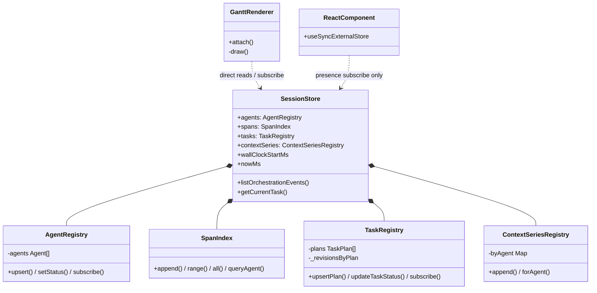
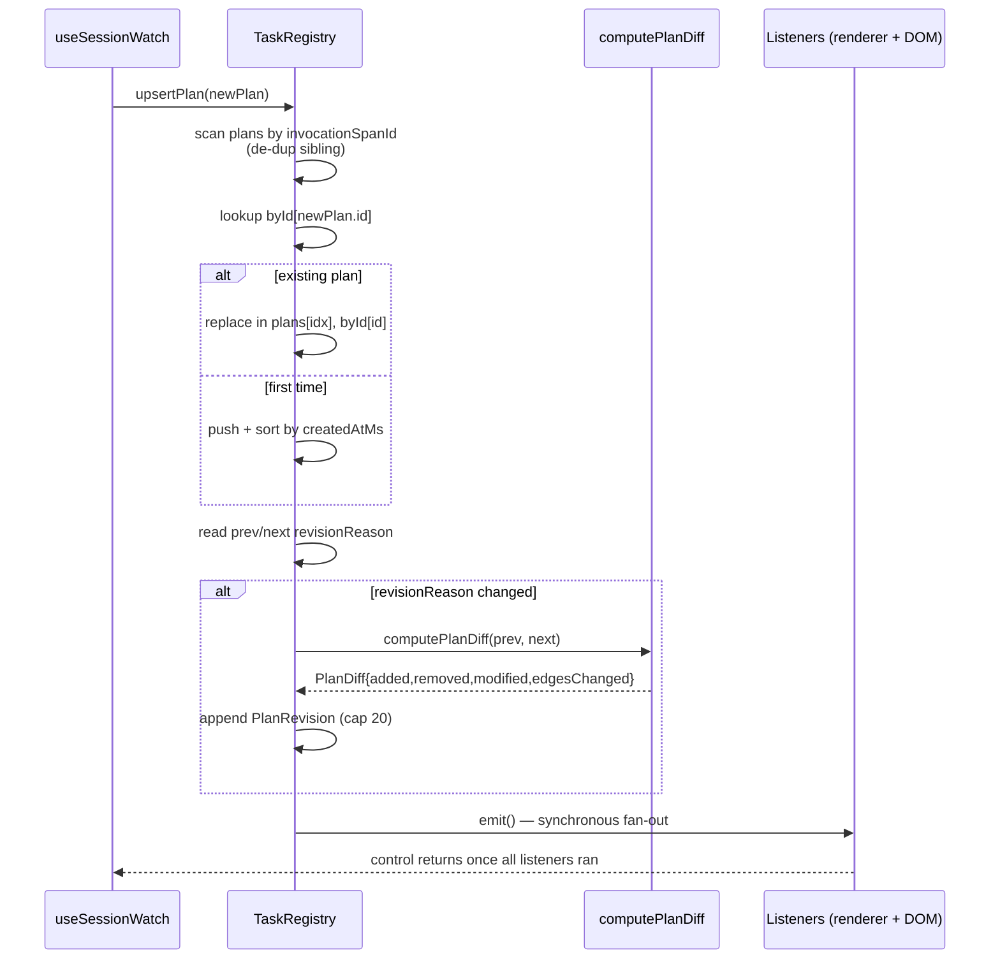
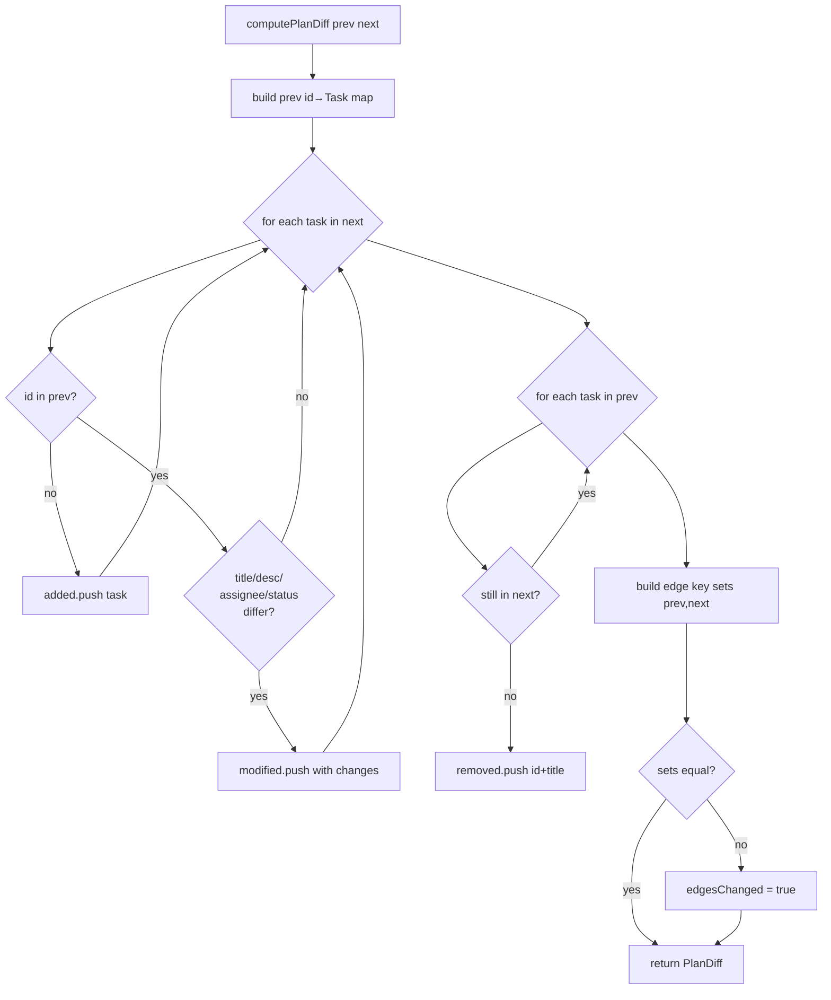

# SessionStore and TaskRegistry

`frontend/src/gantt/index.ts` (~600 lines) owns the frontend data model
for a live session. It exposes four registries — `AgentRegistry`,
`SpanIndex`, `TaskRegistry`, `ContextSeriesRegistry` — bundled together
under a `SessionStore` class, and it is deliberately *not* a Zustand /
Redux / signals store. The hot rendering path reads directly from these
objects on every frame with zero React in the middle.

## Why not Zustand

The opening comment at `index.ts:1-3` explains the decision:

> Mutable, non-React data store for the Gantt. React components
> subscribe for presence (agent list, counts) but the hot rendering
> path reads directly from these stores every frame — no setState in
> the data path.

The motivation is measurable: at 60 Hz with thousands of spans and
dozens of subscribers, a persistent-immutable store would allocate
megabytes per second worth of garbage. Even signal-based stores still
require per-field accessor call overhead. The mutable path is
direct-field-read: `store.spans.range(agentId, vs, ve)` returns the
existing internal array slice, no copy, no proxy.

The tradeoff is that mutations are not transactional — if you read
`store.agents.list` while another code path is in the middle of an
`upsert`, you can see a half-updated array. This is mitigated in
practice by:

1. All mutation happens on the main thread, synchronously, from the
   `useSessionWatch` RPC handler.
2. The draw loop also runs on the main thread.
3. Subscribers are notified *after* mutations complete.

So in practice readers never see a torn state because they never run
concurrently with writers. If you add a web-worker path someday, you
will need to rethink this.

## SessionStore composition

`SessionStore` is a thin container — its real value is the four child
registries it holds and the relationship those have to the renderer and
to the React DOM components that need presence-only reads.




`SessionStore` is defined at `index.ts:455-593`. It owns:

- `agents: AgentRegistry` — active agents, status, metadata.
- `spans: SpanIndex` — the time-indexed span store.
- `tasks: TaskRegistry` — plans, tasks, revisions.
- `contextSeries: ContextSeriesRegistry` — per-agent context-window
  samples.
- `wallClockStartMs: number` (`index.ts:580`) — session start on the
  wall clock, used to convert absolute timestamps from the server into
  session-relative `tMs` values the renderer uses.
- `nowMs: number` (`index.ts:584`) — current session-relative now,
  advanced by the renderer each frame.

Two higher-level helpers also live here:

- `listOrchestrationEvents(limit=200)` (`index.ts:464-507`) scans
  recent TOOL_CALL spans whose tool name matches one of the reporting
  tools and returns them newest-first. The Drawer's "activity" tab
  uses this.
- `getCurrentTask()` (`index.ts:521-577`) returns either the currently
  RUNNING task or the most recent COMPLETED, enriched with live
  context (in-flight tool name, thinking status). This is the
  authoritative source for the "what is the agent doing right now"
  banner.

## AgentRegistry

Defined at `index.ts:25-104`.

- `agents: Agent[]` — stable join-time order, sorted by `connectedAtMs`.
- `byId: Map<string, Agent>` — O(1) lookup.
- `listeners: Set<() => void>` — subscribers.
- `upsert(agent)` (`index.ts:48-58`) — insert or update, re-sort, emit.
- `setStatus(id, status)` (`index.ts:60-65`) — fast path for heartbeat
  updates without re-sorting.
- `subscribe(fn)` (`index.ts:96-99`) — returns an unsubscribe function.

The "join-time order" is important for the Gantt: the order in which
agents appear in the gutter matches the order in which they first
connected, and that order stays stable for the lifetime of the
session. A newly connected agent appears at the bottom, never inserted
in the middle.

## TaskRegistry

Defined at `index.ts:184-315`. This is the most load-bearing structure
in the file because the plan can be rewritten by refine at any moment
and the frontend has to handle that gracefully.

Fields:

- `plans: TaskPlan[]` — sorted by `createdAtMs` (`index.ts:185`).
- `byId: Map<string, TaskPlan>`.
- `_revisionsByPlan: Map<string, PlanRevision[]>` — capped at 20 per
  plan (`index.ts:247`).
- `_lastReasonByPlan: Map<string, string>` — remembers the previous
  revision reason so we can skip duplicate entries.

### `upsertPlan(plan)` — the critical path (`index.ts:204-252`)

The full critical-path sequence — from a `task_plan` Delta arriving in
`useSessionWatch` through diff computation, in-place replacement, and
synchronous subscriber notification:




The contract: given a new `TaskPlan` from the server (via
`task_plan` Delta), incorporate it into the registry. It handles three
cases:

1. **First-time insert.** No existing plan for this `invocationSpanId`
   — just append, build revisions list with a synthetic "initial"
   entry, and notify subscribers.
2. **Revision of existing plan.** A plan already exists for this
   `invocationSpanId`. Compute the diff between the old and new plans
   via `computePlanDiff` (`index.ts:130-182`), build a `PlanRevision`
   entry with the diff and the `revision_reason` / `revision_kind` /
   `revision_severity` fields, and append to
   `_revisionsByPlan`. The old plan is replaced in-place so any
   subscribers holding a reference see the update.
3. **Duplicate suppression.** If the new plan's `revision_reason` is
   identical to `_lastReasonByPlan[planId]`, skip the revision entry
   entirely — refine is sometimes called twice in quick succession
   for the same drift and we don't want to double-record it.

The 20-revision cap (`arr.length > 20 && arr.shift()`,
`index.ts:247`) is a simple bounded window. In practice no run
generates that many revisions; the cap is a guard against pathological
refine loops eating memory.

### `updateTaskStatus(planId, taskId, status, boundSpanId)` (`index.ts:259-272`)

Fast-path mutation for live status updates. Finds the task in the
plan, patches in place, emits. Does not rebuild the diff — status
transitions within a stable plan are not tracked as revisions, only
plan-structure changes are.

### `tasksForAgent(agentId)` / `revisionsForPlan(planId)`

Convenience getters used by the Drawer.

## `computePlanDiff`

At `index.ts:130-182`. The algorithm compares two `TaskPlan`s and
returns a `PlanDiff`:

```ts
interface PlanDiff {
  added: Task[];
  removed: Array<{ id: string; title: string }>;
  modified: Array<{
    id: string; title: string;
    changes: PlanDiffFieldChange[];
  }>;
  edgesChanged: boolean;
}
```

Steps:

1. Build a `Map<id, Task>` from the previous plan.
2. For each task in the new plan, look it up in the map. If absent
   → `added`. If present, compare title, description,
   `assigneeAgentId`, and `status` fields; any differences go into
   `modified.changes`.
3. For each task in the previous plan not in the new plan → `removed`.
4. Compare edge sets by building `"fromId->toId"` key sets from both
   plans. `edgesChanged = !setsEqual(prevEdges, nextEdges)`.

The algorithm is O(max(|prev|, |next|)) because of the map lookup. It
is called once per refine, not per frame, so the algorithmic budget
is generous — simplicity beats cleverness here. Earlier iterations
tried to do an ordered edit script, which was overkill and introduced
subtle bugs when the planner reordered tasks without changing them.

The diff is what powers the "Plan revised" banner on the frontend:
the banner lists added / modified / removed tasks and lets the user
expand to see exactly what changed.

### Revision diff classification

`computePlanDiff` (`index.ts:130-182`) classifies every task in the new
plan against the previous one. The flow shows the four buckets the diff
fills and the separate edge-set comparison.



## Observer notification ordering

`emit()` at `index.ts:102-103` iterates listeners synchronously. When
`useSessionWatch` processes a `taskPlan` message it calls
`store.tasks.upsertPlan(plan)`, which mutates internal state and
then emits. All subscribers fire before the message handler returns.

The renderer subscribes in `attach()` (`renderer.ts:197-211`) in a
fixed order: `spans`, `agents`, `tasks`, `contextSeries`. The order
matters for one case: when a new agent appears in the same Delta as
new spans for it, the renderer must have the agent row layout ready
before drawing the spans. Because notifications are synchronous,
multiple mutations in the same message handler coalesce into a
single re-draw in the next frame — so the ordering is effectively
"all mutations complete, then one redraw".

DOM-layer subscribers (the React components that use the store's
subscribers for presence info) are notified in the same pass.
Because they do not run in the draw loop, their cost is pay-on-change
rather than pay-per-frame.

## ContextSeriesRegistry

Defined at `index.ts:390-449`. Per-agent monotonic sample series.

- `byAgent: Map<string, ContextWindowSample[]>`.
- `append(agentId, sample)` at `index.ts:407-413` — walks from the
  tail to preserve `tMs` order. In practice samples arrive in order
  so the insertion is O(1) at the end, but the linear walk is kept
  as a correctness fallback for out-of-order samples after a
  reconnect.
- `forAgent(agentId)` at `index.ts:417-419` — returns the internal
  array by reference. Readers must not mutate.
- `subscribe(fn: (agentId: string) => void)` at `index.ts:441-443` —
  fan-out is per-agent so a listener can ignore updates for agents it
  doesn't care about.

There is no explicit pruning. In a long-running session this grows
linearly with sample count. Context-window telemetry samples are
emitted at ~1 Hz per agent (see
[`../protocol/telemetry-stream.md`](../protocol/telemetry-stream.md)),
so an hour-long run with three agents accumulates ~10k samples total
— small enough to ignore.

## Memory pressure

There are two bounded registries:

- `TaskRegistry._revisionsByPlan`: 20 revisions per plan.
- `SpanIndex` is bounded by the session's span count (unbounded in
  principle).

Everything else grows with the live session. For typical
multi-agent runs (minutes to an hour) this has never been a problem;
for very long-lived sessions (day-plus) the prune-on-session-end
path in the server is what keeps memory in check, not the frontend
itself. If you need to add frontend-side pruning, the natural
place is `SpanIndex`: drop spans older than some time window from
the most recent frame, but be careful — if the user pans backwards
into a pruned range they will see an empty region.

## Public exports

From `index.ts:5-22`:

- Classes: `SessionStore`, `AgentRegistry`, `SpanIndex`,
  `TaskRegistry`, `ContextSeriesRegistry`.
- Types: `Agent`, `ContextWindowSample`, `Span`, `SpanKind`,
  `SpanStatus`, `SpanLink`, `Capability`, `Task`, `TaskEdge`,
  `TaskPlan`, `TaskStatus`.

## Gotchas

- **Do not copy an array out of the store.** Renderer code that
  does `const spans = [...store.spans.all]` loses the whole point of
  the mutable design. Always use `range()` or other view methods
  that return references.
- **Do not mutate across async boundaries.** All mutations must be
  synchronous from the main thread. If you need to integrate a web
  worker or background fetch, queue the mutation back onto the main
  thread via `postMessage`.
- **`upsertPlan` is not idempotent for revision counting.** Calling
  it twice with identical content is deduped by
  `_lastReasonByPlan`, but calling it with slight variations (e.g.
  a re-serialized plan that differs only in task order) can still
  double-count. Upstream code should avoid re-submitting a plan
  unless it actually changed.
- **`computePlanDiff` compares by id, not by title.** If the planner
  returns a plan that regenerated ids for "the same tasks", the
  diff will be a full replacement — every task removed, every task
  added. Either keep ids stable across refine (the planner contract
  requires this) or extend the diff to also do a fuzzy title match.
- **Subscribers run synchronously.** If a listener does expensive
  work, it blocks the mutation path and delays subsequent mutations
  in the same handler. Keep listeners cheap; hand off heavy work
  to `requestIdleCallback` or the next frame.
