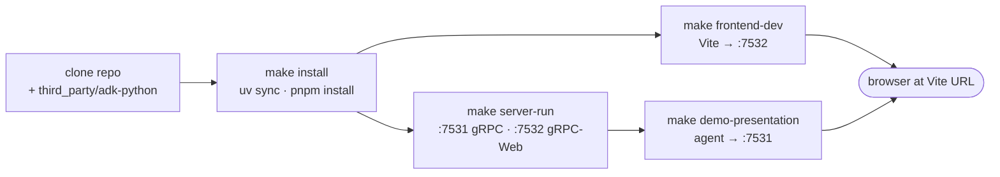

# Operator Quickstart

The operator view: how to start watching a running goldfive rollout, how
to steer it live from the UI, and how to interpret the intervention cards
the Trajectory view shows. Every command below is copy-pasteable from the
repository root.

For deeper architectural context see [docs/design/03-server.md](design/03-server.md) and [docs/design/02-client-library.md](design/02-client-library.md).

The path from clone to live demo, with the network bindings each step opens up:



## 1. Prerequisites

- Python 3.11+ with [`uv`](https://github.com/astral-sh/uv) on `PATH`
- Node 20+ with `pnpm`
- `git` (for cloning the adk-python dependency into `third_party/`)

## 2. Install

The root `pyproject.toml` installs Google's `adk-python` as an editable path dependency, so you need a local checkout of it before running `make install`:

```bash
git clone https://github.com/google/adk-python.git third_party/adk-python
make install
```

`make install` runs `uv sync` for `server/` and `client/` and `pnpm install --frozen-lockfile` for `frontend/`. `third_party/` is git-ignored in this repo — ADK is a read-only vendored dependency that never ships with harmonograf.

## 3. Run the server

```bash
make server-run
```

The `server-run` target invokes:

```
cd server && uv run python -m harmonograf_server --store sqlite --data-dir <repo>/data
```

Defaults you get from that invocation:

| Flag | Default | Notes |
|---|---|---|
| `--host` | `127.0.0.1` | Loopback only. Binding non-loopback emits a warning; v0 has no TLS. |
| `--port` | `7531` | Native gRPC (agent clients). |
| `--web-port` | `7532` | gRPC-Web via sonora + hypercorn (browser frontend). |
| `--store` | `sqlite` | Overridden by the Makefile target; use `--store memory` for ephemeral runs. |
| `--data-dir` | `~/.harmonograf/data` | Makefile target overrides this to `<repo>/data`. |
| `--log-level` | `INFO` | Also accepts `DEBUG`, `WARNING`, `ERROR`. |
| `--log-format` | `text` | Switch to `json` for log shippers. |

To run the server directly with different flags:

```bash
cd server && uv run python -m harmonograf_server \
    --store sqlite --data-dir ~/.harmonograf/data \
    --log-level DEBUG --log-format json
```

## 4. Run the frontend dev server

In a second terminal:

```bash
make frontend-dev
```

This runs `pnpm dev` under `frontend/` (Vite). The UI defaults to talking to the gRPC-Web listener at `http://127.0.0.1:7532`. To point it elsewhere, set `VITE_HARMONOGRAF_API` before starting Vite:

```bash
cd frontend && VITE_HARMONOGRAF_API=http://127.0.0.1:7532 pnpm dev
```

## 5. Run the presentation_agent demo

With the server running, drive one real ADK invocation into Harmonograf:

```bash
make demo-presentation
```

That expands to:

```
HARMONOGRAF_SERVER=127.0.0.1:7531 uv run --extra e2e python -m presentation_agent.run_harmonograf \
    --topic "Python programming" --server 127.0.0.1:7531
```

Override the topic or server address on the command line:

```bash
make demo-presentation TOPIC="Rust memory model" HARMONOGRAF_SERVER=127.0.0.1:7531
```

The demo prints `[harmonograf] session_id=<id>` as soon as the server assigns one — open the frontend and that session should materialize on the Gantt view while the coordinator → research → web_developer → reviewer → (debugger) pipeline runs.

The `presentation_agent` coordinator drives five agents:

- **coordinator_agent** — orchestrates the flow and dispatches to each sub-agent via AgentTool.
- **research_agent** — gathers facts and notes about the user's topic.
- **web_developer_agent** — generates the presentation HTML/CSS/JS and saves them via `write_webpage`.
- **reviewer_agent** — reads the generated files with `read_presentation_files` and returns a structured critique (issues + severity).
- **debugger_agent** — invoked only when `write_webpage` fails or the reviewer flags critical issues; patches files in place with `patch_file`.

### Using a local OpenAI-compatible endpoint

`presentation_agent` defaults to `gemini-2.5-flash` (which routes through ADK's native Google models path and needs `GOOGLE_API_KEY` or ADC). To point it at a local OpenAI-compatible server (Ollama, vLLM, llama.cpp, LM Studio, anything that speaks `/v1/chat/completions`), set `USER_MODEL_NAME` to a LiteLLM provider-style identifier and export `OPENAI_API_BASE`:

```bash
export USER_MODEL_NAME="openai/qwen3.5:122b"
export OPENAI_API_BASE="http://localhost:8080/v1"
# OPENAI_API_KEY is optional for local endpoints; the demo target defaults
# it to "dummy" if unset so LiteLLM stops complaining.
make demo
```

`tests/reference_agents/presentation_agent/agent.py` detects provider-style strings (anything with a `/` before any `:`) and wraps them in `google.adk.models.lite_llm.LiteLlm`. Plain `gemini-*` names keep the native path and don't pull LiteLLM in. The `demo` / `demo-presentation` Makefile targets install LiteLLM via `uv run --extra demo …` — no extra steps required.

## 6. Health probes

Both endpoints live on the gRPC-Web port (`7532` by default) and are **always unauthenticated** so orchestrators can probe without credentials:

```bash
curl -sf http://127.0.0.1:7532/healthz   # -> "ok"
curl -sf http://127.0.0.1:7532/readyz    # -> "ready" (200) or "not ready" (503)
```

`/healthz` returns 200 as long as the process is serving. `/readyz` additionally calls `store.ping()` and returns 503 if the backing store is not reachable.

## 7. Bearer-token auth

Auth is off by default. To require a shared secret on every RPC (native gRPC *and* gRPC-Web), start the server with `--auth-token`:

```bash
cd server && uv run python -m harmonograf_server \
    --store sqlite --data-dir ~/.harmonograf/data \
    --auth-token "s3cret"
```

Clients then pass the same token:

```python
from harmonograf_client import Client

client = Client(
    name="my-agent",
    server_addr="127.0.0.1:7531",
    framework="ADK",
    token="s3cret",
)
```

For the presentation_agent demo, set the token on the command line (the sample currently does not thread a token through — use an unauthenticated dev server, or run the demo script directly and add `token=...` to the `Client(...)` call in `tests/reference_agents/presentation_agent/run_harmonograf.py`).

`/healthz` and `/readyz` remain open regardless of `--auth-token`.

## 8. Logs, retention, and GC

Logs go to stderr. `--log-format text` (the default) is the human-readable formatter; `--log-format json` emits one JSON record per line with a stable `{ts, level, logger, msg}` shape plus any `extra={}` fields.

Retention is opt-in. By default, terminal (COMPLETED / ABORTED) sessions are kept forever. To sweep them:

```bash
cd server && uv run python -m harmonograf_server \
    --store sqlite --data-dir ~/.harmonograf/data \
    --retention-hours 24 \
    --retention-interval-seconds 300
```

- `--retention-hours 0` (default) disables the sweeper entirely.
- `--retention-hours N` deletes terminal sessions whose `ended_at` (or `created_at` if unset) is older than `N` hours.
- `--retention-interval-seconds` controls how often the sweeper wakes (default `300`). Live sessions are never touched.

Periodic metrics snapshots (sessions / spans / ingest rate / active streams) are emitted every `--metrics-interval-seconds` (default `30`); set to `0` to disable.

## 9. Watching a live goldfive run

Once the server, frontend, and an agent are up:

1. The **Sessions** picker auto-selects the newest live session. Post
   lazy-Hello (harmonograf#85) there is one row per ADK session you drive
   — no ghost rows per app-build. The session id pinned on the row is
   whatever `adk web` / your orchestrator passed through as
   `goldfive.Session.id` (harmonograf#66).
2. The **Activity** (Gantt) view renders one row per ADK agent in the
   wrapped tree. Rows auto-register on the first span each agent emits —
   coordinator, specialists, and any `AgentTool` / sequential / parallel /
   loop wrappers (harmonograf#74 / #80).
3. The **Trajectory** view (↪ in the nav rail) is the operator's primary
   handle — one horizontal ribbon with one marker per intervention event.

## 10. Steering from the UI

Every intervention path lives in one of three places:

- **Inspector drawer → Control tab.** Pick any span in Activity, open the
  drawer, and use the Control tab to send PAUSE, RESUME, STEER (free-form
  text), or CANCEL. The client's `ControlBridge` validates the STEER body
  (empty / over 8 KiB UTF-8 rejected, ASCII control chars stripped) before
  forwarding; the server stamps `author` + `annotation_id` (harmonograf#72).
- **Keyboard shortcut (Space).** Toggles global PAUSE / RESUME in the
  Gantt view.
- **Annotation with deliver-to-agent.** Posting an annotation on a span /
  task with the "deliver to agent" box checked synthesizes a STEER
  targeting the annotated actor.

Every successful STEER / CANCEL / PAUSE you issue becomes one marker in
Trajectory. If the same target sees a second user-control intervention
within 5 minutes, its card **merges** with the previous one so the
timeline doesn't spray out duplicates (harmonograf#81 / #87 closing
prior #75 / #73 / #86).

## 11. Reading intervention cards

Clicking a marker in Trajectory opens the intervention popover. Each card
carries:

- **Source** — `user` (you, via the UI) vs. autonomous (goldfive's steerer).
  Colour and marker glyph differ by source.
- **Kind** — STEER, CANCEL, PAUSE, RESUME for user-control; `tool_error`,
  `agent_refusal`, `new_work_discovered`, `task_failed_recoverable`, …
  for autonomous drift. Glyphs differ by kind.
- **Severity** — info / warn / critical, rendered as an outer ring on the
  marker.
- **Body** — the STEER text or drift detail.
- **Author** — who issued the intervention (usually `operator` for user
  control).
- **Outcome** — if the intervention was immediately followed (within ~5 s)
  by a plan revision or cascade-cancel, the card links to it
  (`plan_revised:rN`, `cascade_cancel:N_tasks`). See
  [`server/harmonograf_server/interventions.py`](../server/harmonograf_server/interventions.py)
  for the join logic.

If markers look clustered or the timestamps feel off, see
harmonograf#87 — convertAnnotation now stores session-relative ms, which
is the shape the density clusterer expects.

## 12. Known limitations

- **In-memory vs. sqlite.** `make server-run` uses `--store sqlite` against `<repo>/data`. `--store memory` is fine for tests but loses everything on restart.
- **sonora CORS shim.** The server monkey-patches `sonora.asgi` at startup to work around a bytes/str comparison bug in sonora's preflight path (see `server/harmonograf_server/_sonora_shim.py`, commit `5c00817`). An `INFO` line is logged on startup confirming the shim is active. If you upgrade sonora and the preflight path is fixed upstream, the shim can be removed.
- **No TLS.** The gRPC and gRPC-Web listeners are plaintext. Keep them on loopback; `--host` values other than `127.0.0.1` log a warning.
- **Frontend does not currently send a bearer token.** If you start the server with `--auth-token`, the UI will be rejected with 401 until frontend auth lands. Run the UI against an unauthenticated dev server for now.
- **Single-process, single-node.** There is no clustering, no replication, no horizontal scale. One server process owns the canonical timeline.
- **Gantt viewport on completed sessions** currently opens past the last
  span rather than framed on it; tracked as harmonograf#89 (in flight).
