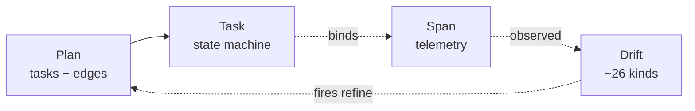
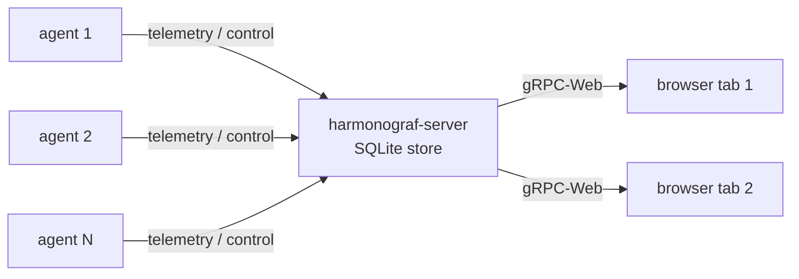

# Harmonograf — project overview

Harmonograf is a console for observing, understanding, and coordinating multi-agent
systems. This document is the longer-form companion to the top-level
[README](../README.md): it explains what problem harmonograf is built to solve, the
design principles the implementation commits to, what ships today, what is
intentionally out of scope, and where the project is going.

If you want to get a demo running first and read later, start at
[docs/quickstart.md](quickstart.md).

The four primitives below are what the rest of the document keeps coming back to. Read this map first; the prose under each design principle is just expansion of these relationships.

And the three processes that share the data model — one canonical timeline, many agents reporting in, many viewers subscribing.

---

## Motivation — why span-based observability isn't enough

Most agent observability tools today are distributed-tracing systems with the word
"agent" grafted on. You instrument each LLM call and each tool call as a span, the
spans nest into a tree, and a UI renders the tree as a waterfall. For a single
agent calling four tools that is a perfectly good model. For a multi-agent system
it starts losing information almost immediately:

1. **A plan is a first-class artefact, and traces don't carry plans.** Real agent
   rollouts begin with a plan — a structured list of tasks, often with dependencies
   — and the whole point of running the agent is to execute that plan. Span trees
   flatten the plan into "whatever happened to call whatever", leaving the operator
   to reconstruct the original intent from chronology. If the plan changes halfway
   through a run (the model decides to tackle the tasks in a different order, or
   discovers a missing step, or hits an error and reroutes), the trace has no way
   to represent the change as a change — you just see a different tree.

2. **Task state inferred from span lifecycle is wrong more often than it is
   right.** Harmonograf's own earlier iterations tried this and broke on every
   real agent. A sub-agent whose span closes is not necessarily done — it may have
   returned control to the parent while a long-running background tool call
   continues. An LLM that emits "task complete" in prose may or may not have
   actually finished the work. Prose parsing can't tell "I will complete the task"
   apart from "task complete". Concurrent sub-agents racing through a parallel DAG
   produce ordering bugs whenever state transitions are tied to span close
   callbacks rather than to the agent explicitly announcing them.

3. **Observability is not the job.** An operator who can see a stuck agent but
   cannot unstick it without killing the process has half a tool. Multi-agent
   runs are long, multi-step, and expensive; the cost of discarding one and
   restarting from scratch is much higher than the cost of nudging a running one.
   A console for multi-agent systems has to let you intervene from the same place
   you observe from, on the same live connection.

4. **Framework sandbox realities.** ADK (and frameworks like it) run agents under
   strict lifecycle hooks with tight restrictions on how you can influence
   execution from the outside. Any design that assumes "just attach a debugger and
   patch the flow" doesn't work inside those sandboxes. Coordination has to go
   through the official seams — session state, tool calls, event callbacks — or
   it doesn't go through at all.

Harmonograf is the console we wanted for this problem: plan-aware, explicit about
task state, honest about drift, and bidirectional on the wire.

---

## Design principles

The implementation commits to five principles. Every architectural decision can be
traced back to at least one of them.

### 1. Explicit state machine beats span inference

Task state in harmonograf transitions only when an agent explicitly says so, via a
small set of reporting tools injected into every sub-agent:

- `report_task_started`
- `report_task_progress`
- `report_task_completed`
- `report_task_failed`
- `report_task_blocked`
- `report_new_work_discovered`
- `report_plan_divergence`

The tool bodies return `{"acknowledged": true}` and nothing else; the real side
effect happens in `before_tool_callback`, which routes the call into the client
library's `_AdkState` and applies the transition. Spans are still emitted for every
ADK callback — they are telemetry, they are not state.

The state machine is monotonic and single-writer per task: one call, one
transition, one source of truth. Full reference:
[reporting-tools.md](reporting-tools.md).

### 2. Drift is a first-class event

When something about the plan no longer matches reality — a tool errored, an agent
refused, a new sub-task was discovered, a deadline slipped, a user steered, context
pressure crossed a threshold — the client library fires a *deferential refine*: a
structured call back into the planner with the current plan and the drift context.
The planner returns a revised plan, which flows back through `TaskRegistry` and
produces a plan diff (added / removed / reordered / re-parented tasks). The frontend
renders that diff as a banner with a side-drawer comparison.

The drift taxonomy has roughly two dozen kinds today, ranging from `tool_error` and
`agent_refusal` through `context_pressure`, `new_work_discovered`,
`plan_divergence`, `user_steer`, `user_cancel`, `task_failed_recoverable`, and
`task_failed_fatal`. Each kind has a defined refine behaviour.

### 3. Bidirectional by default

The transport between client and server is a long-lived bidirectional gRPC stream.
Telemetry flows up; control messages flow down; both share the same connection and
the same auth. The frontend uses gRPC-Web against the same server and can emit
control messages that the server routes to the correct agent. Any feature in the
UI that requires an agent to do something (pause, resume, send a note, cancel a
task) goes through this path.

### 4. Respect the framework sandbox

Harmonograf integrates with ADK through the official seams: callbacks
(`before_tool_callback`, `after_model_callback`, `on_event_callback`), session
state (`session.state["harmonograf.*"]`), and normal tools. It does not monkeypatch
ADK internals. One consequence: if a feature cannot be expressed inside ADK's
model, harmonograf does without it rather than reaching around the framework.

The client library is framework-agnostic at its core; the ADK-specific code lives
in `client/harmonograf_client/adk.py` so a future Strands or OpenAI Agents SDK
adapter is a sibling module, not a rewrite.

### 5. One canonical timeline

There is exactly one server process per deployment. It terminates every client
connection, owns the canonical timeline, persists it (SQLite today, in-memory for
tests), and fans out live updates to any number of frontend subscribers. There is
no peer-to-peer, no gossip, no leader election. "One server, many agents, many
viewers" is the only topology, and it is enough.

---

## Current feature set

What ships today. Read this as a floor, not a ceiling — individual features are
landing continuously.

### Client library (`client/`)

- **ADK plugin** (`attach_adk`) that wires reporting tools, callbacks, session-state
  keys, and the ingest transport into an existing ADK agent graph.
- **Reporting tools** injected into every sub-agent wrapped by `HarmonografAgent`.
- **Session-state protocol** (`state_protocol.py`) defining the canonical
  `harmonograf.*` keys agents read and write.
- **Three orchestration modes** — sequential, parallel (DAG walker), delegated.
- **Dynamic replan** with ~26 drift kinds and plan-diff computation on the server.
- **Buffered transport** (`buffer.py`, `transport.py`) that survives server
  restarts and short network blips without dropping telemetry.
- **Heartbeat + liveness tracking** so the UI can show stuck / slow agents.
- **Identity and invariants** — agent naming, span ordering guarantees, monotonic
  task state invariants.

### Server (`server/`)

- **gRPC + gRPC-Web** on separate listeners (`:7531` and `:7532`).
- **Ingest pipeline** with fan-out bus for live subscribers.
- **SQLite and in-memory stores** behind a common interface; retention sweeper for
  terminal sessions.
- **Control router** for frontend → agent messages.
- **Health probes** (`/healthz`, `/readyz`) always open; optional bearer-token
  auth via `--auth-token`.
- **Stats RPC** (`make stats`) for "how is the server doing right now".
- **Metrics snapshots** emitted periodically to logs.

### Frontend (`frontend/`)

- **Gantt canvas** — per-agent rows, interactive blocks, zoom + pan, minimap,
  live-tail cursor.
- **Agent topology graph view** — nodes = agents, edges = transfers and tool
  invocations.
- **Span inspector drawer** — arguments, return values, errors, payloads.
- **Plan-diff banner + drawer** — shows added/removed/reordered tasks after a
  refine.
- **Transport bar** — play/pause/scrub for session playback.
- **Session picker** with auto-select of the newest live session.
- **App shell** — drawer nav, view switcher, keyboard shortcuts.

### Protocol (`proto/harmonograf/v1/`)

- `types.proto` — shared data model (Session, Agent, Task, Plan, Span, Payload).
- `frontend.proto` — frontend-facing RPC surface.
- `telemetry.proto` — client-to-server ingest.
- Regenerated into all three components via `make proto`.

---

## Non-goals

Things harmonograf deliberately does not try to do in v0. Each of these is a
defensible product position, not a TODO.

- **No TLS, no multi-tenant auth.** Local-loopback only by default; non-loopback
  binds emit a warning. Bearer-token auth exists for shared-secret deployments,
  but there is no OAuth, no per-user RBAC, no audit log. If you need those,
  harmonograf is not the right tool yet.
- **No clustering, no HA, no horizontal scale.** One server process owns the
  canonical timeline. Restart recovery, yes; active-active, no.
- **Not a generic tracing backend.** Harmonograf is not trying to replace OTel
  collectors or Jaeger. It does one thing — multi-agent plan-aware coordination —
  and the data model is shaped around that.
- **Not a model evaluation harness.** Harmonograf observes and steers runs; it
  does not score them, run regression suites, or A/B test prompts. Evals are a
  different tool.
- **Not framework-agnostic on day one.** ADK is the first-class target. A
  framework-neutral core exists, but the only shipped adapter is ADK and
  features that depend on ADK-specific semantics (`task_id` ContextVar, session
  state, tool injection) are not held back waiting for other frameworks.
- **No cloud-hosted tier.** Harmonograf is a thing you run locally or on your own
  infrastructure.

---

## Roadmap

These are directions, not commitments. See [docs/milestones.md](milestones.md) for
the live milestone plan.

- **Richer coordination surface.** Today the UI can pause, resume, and send notes;
  next is structured steering — pinning tasks, forcing re-plans from a particular
  point, rewinding.
- **Second framework adapter.** Strands or OpenAI Agents SDK is the likely second
  target. The client library's core is already framework-agnostic; the work is
  mostly wiring and deciding which framework-specific features to expose.
- **Persistent session archive + playback.** Replay a completed session the way
  you would scrub through a video, including stepping through every tool call.
- **Cross-session analytics.** "How often does this agent hit `tool_error` on
  task X?" — the data is already there, the frontend surface isn't.
- **Auth v1.** At minimum, per-session tokens and a path to SSO for shared
  deployments. Not a v0 concern.
- **Structured eval hooks.** Not an evaluation harness itself, but a clean seam
  for plugging one in.

---

## Further reading

- [README.md](../README.md) — top-level tagline and quickstart.
- [docs/quickstart.md](quickstart.md) — step-by-step from clone to running demo.
- [docs/operator-quickstart.md](operator-quickstart.md) — flags, retention, auth,
  health probes.
- [docs/reporting-tools.md](reporting-tools.md) — the reporting-tool protocol.
- [docs/design/](design/) — per-component design notes.
- [docs/user-guide/](user-guide/) — *(task #6)* navigating the UI.
- [docs/dev-guide/](dev-guide/) — *(task #7)* building from source, contributing.
- [docs/protocol/](protocol/) — *(task #8)* wire protocol and state-key reference.
- [AGENTS.md](../AGENTS.md) — project vision + plan-execution protocol, checked
  into the repo as durable guidance.
