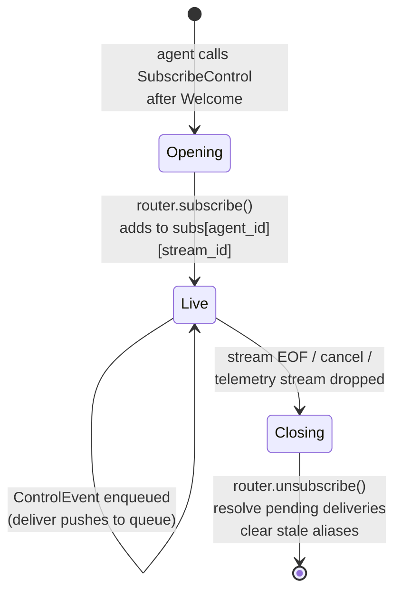
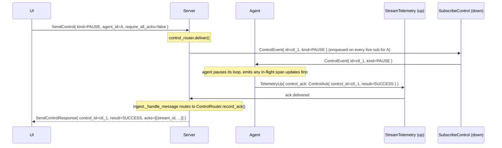
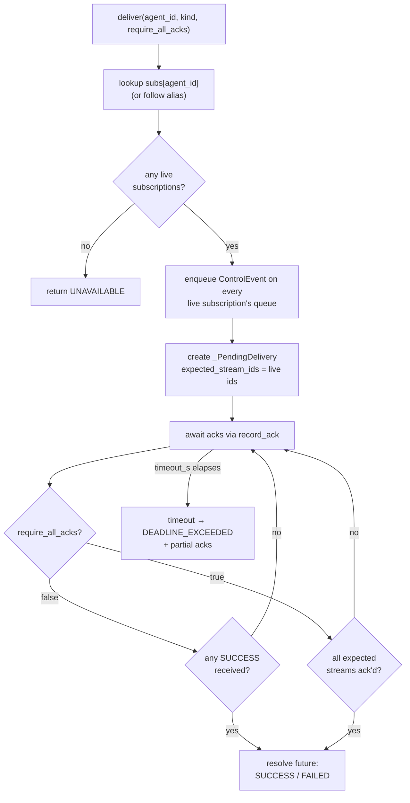
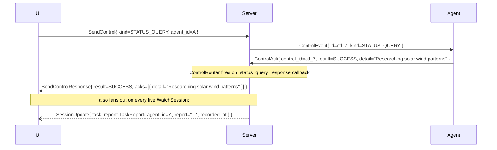

# `SubscribeControl` reference

```proto
rpc SubscribeControl(SubscribeControlRequest) returns (stream ControlEvent);
```

`SubscribeControl` is a server-streaming RPC opened by the agent right
after its `StreamTelemetry` handshake (`Welcome`) completes. The server
pushes `ControlEvent`s that the agent should honor; the agent's
responses (`ControlAck`) travel **back upstream on
`StreamTelemetry`**, not on this stream.

## Why acks ride telemetry

Keeping control delivery on its own RPC gives control its own gRPC
flow-control window — a stalled payload upload on telemetry can never
delay a `PAUSE`. But folding acks back onto telemetry gives
happens-before **for free**: when the server sees an ack, every span
the client emitted before issuing the ack is already in the telemetry
stream ahead of it. See
[`wire-ordering.md#control-ack-happens-before`](wire-ordering.md#control-ack-happens-before)
for the full argument.

A `SubscribeControl` subscription's lifecycle in the router — note that subscriptions are *not* queued across reconnects:



## Request

```proto
message SubscribeControlRequest {
  string session_id = 1;
  string agent_id = 2;
  string stream_id = 3;
}
```

All three fields are required. They must match a telemetry stream the
server has already accepted — i.e. one that received a `Welcome`. In
particular, `stream_id` must be the `assigned_stream_id` the server
returned in that `Welcome`.

## Response

The response stream is a sequence of `ControlEvent`s. `ControlEvent`
lives in [`types.proto`](../../proto/harmonograf/v1/types.proto) so
`SendControl` (in `frontend.proto`) can also reference it.

```proto
message ControlEvent {
  string id = 1;
  google.protobuf.Timestamp issued_at = 2;
  ControlTarget target = 3;
  ControlKind kind = 4;
  bytes payload = 5;
}

message ControlTarget {
  string agent_id = 1;
  string span_id = 2;  // optional, kind-dependent
}
```

### Control kinds

| `ControlKind` | Payload format | Semantics | Required capability |
|---|---|---|---|
| `CONTROL_KIND_PAUSE` | empty | Pause the agent's execution loop until RESUME. | `CAPABILITY_PAUSE_RESUME` |
| `CONTROL_KIND_RESUME` | empty | Resume after a PAUSE. | `CAPABILITY_PAUSE_RESUME` |
| `CONTROL_KIND_CANCEL` | empty | Abort the current invocation and unwind. Irrecoverable. | `CAPABILITY_CANCEL` |
| `CONTROL_KIND_REWIND_TO` | UTF-8 string — target span id | Rewind execution to before `target.span_id`, re-emitting from that point. | `CAPABILITY_REWIND` |
| `CONTROL_KIND_INJECT_MESSAGE` | UTF-8 string, or structured JSON | Inject a user message into the current invocation. | `CAPABILITY_STEERING` |
| `CONTROL_KIND_APPROVE` | optional JSON — edited args | Approve a pending human-in-the-loop tool call. | `CAPABILITY_HUMAN_IN_LOOP` |
| `CONTROL_KIND_REJECT` | UTF-8 string — reason | Reject a pending HITL call. | `CAPABILITY_HUMAN_IN_LOOP` |
| `CONTROL_KIND_INTERCEPT_TRANSFER` | UTF-8 string — new target agent_id, or empty to block | Override or block a pending agent transfer. | `CAPABILITY_INTERCEPT_TRANSFER` |
| `CONTROL_KIND_STEER` | UTF-8 string — steering body | Free-form steering note; routed through the drift pipeline as `user_steer`. | `CAPABILITY_STEERING` |
| `CONTROL_KIND_STATUS_QUERY` | empty | Ask the agent to describe what it's currently doing. Agent's answer rides back in `ControlAck.detail` and also fans out as a `TaskReport` on `WatchSession`. | (no capability gate — always honored) |

`ControlAck.result = CONTROL_ACK_RESULT_UNSUPPORTED` is the correct
response when the server sends a `kind` the agent can't honor despite
the capability not being advertised. Prefer `FAILURE` when the call was
attempted and failed at runtime.

### Capability negotiation

Capabilities are advertised on `Hello.capabilities` and stored on the
`Agent` row. The frontend uses them to grey out control buttons the
agent cannot honor, but the server **does not itself gate on them** —
if the frontend issues a `PAUSE` to an agent without `PAUSE_RESUME`,
the event is still delivered and the agent is expected to respond with
`UNSUPPORTED`.

## The ack path



Implementation pointers:

- The server-side fan-out and ack correlation live in
  [`server/harmonograf_server/control_router.py`](../../server/harmonograf_server/control_router.py).
  One `_PendingDelivery` per in-flight `control_id` tracks
  `expected_stream_ids`; each `record_ack` ticks one off and resolves
  the future when either the first success arrives (default) or every
  expected stream has ack'd (`require_all_acks=true`).
- On the client, the harmonograf-for-ADK adapter routes PAUSE / RESUME
  / STATUS_QUERY through dedicated handlers in
  [`client/harmonograf_client/adk.py`](../../client/harmonograf_client/adk.py)
  and reports acks via `transport.send_control_ack(...)` — which emits
  a `TelemetryUp.control_ack` on the same telemetry stream that
  originated the agent.

## Multi-stream fan-out

A single agent may run multiple concurrent telemetry streams (one per
process, or one per connection to a remote server). Each stream gets
its own `stream_id`, and the agent opens **one** `SubscribeControl`
per telemetry stream. The control router maintains:

```
subs: agent_id -> { stream_id -> ControlSubscription }
```

When `SendControl` is called, the router fans the `ControlEvent` out
to **every** live subscription for that `agent_id`. The default
resolution rule (`require_all_acks = false`) is **first-success wins**
— as soon as any stream returns `CONTROL_ACK_RESULT_SUCCESS`, the
caller's `deliver()` future resolves `SUCCESS` and further acks are
discarded.

When `require_all_acks = true`, the router waits for every expected
stream to ack (or a timeout). The result is:

- `SUCCESS` if **all** acks were `SUCCESS`,
- `FAILED` otherwise,
- `DEADLINE_EXCEEDED` with partial acks if `timeout_s` elapses first.

See `ControlRouter._maybe_resolve` in `control_router.py` for the
exact logic.

How the router resolves a fan-out delivery — the `require_all_acks` flag picks between first-success and full-quorum semantics:



### Stream drop during in-flight delivery

If a `SubscribeControl` stream closes while a delivery is in flight,
the router discards the expected stream id and re-evaluates
`_maybe_resolve`. A delivery waiting on a single dropped stream will
resolve immediately as `UNAVAILABLE` (if it was the only expected
stream) or continue waiting for the remaining streams.

## Agent alias map

ADK agents often expose a sub-agent by a human-readable name (e.g.
`weather_agent`) while the telemetry transport registered under an
identity-file UUID (e.g. `agent_abc123...`). When a span arrives with
an `agent_id` that differs from the stream's registered Hello
`agent_id`, the ingest pipeline calls
`ControlRouter.register_alias(sub_agent_id=span.agent_id,
stream_agent_id=stream.agent_id)`. Subsequent `SendControl` calls
addressed to the sub-agent name are forwarded to the stream that owns
it.

The alias map is:

- **Per-process** (no cross-server persistence).
- **Cleared when the underlying stream disconnects** — aliases pointing
  at a dropped stream are removed in `ControlRouter.unsubscribe`.

## Reject / failure modes

| Condition | Resolution |
|---|---|
| No live subscriptions for `agent_id` | `deliver()` returns `UNAVAILABLE` immediately. No queuing. |
| Subscription queue full (>256 events buffered) | Router records a synthetic `CONTROL_ACK_RESULT_FAILURE` ack for that stream (`detail="control queue full"`). |
| No ack within `timeout_s` | `DEADLINE_EXCEEDED` with partial acks. |
| `ControlAck.control_id` unknown | Dropped silently (`record_ack` no-op). |
| `ControlAck` arrives on a stream that was not expected | Dropped silently. |

## STATUS_QUERY flow

`CONTROL_KIND_STATUS_QUERY` is special: the agent's reply doubles as
both the SendControl response **and** a broadcast `TaskReport` on
every active `WatchSession` subscription.



See `control_router.on_status_query_response` and
`WatchSession.task_report` (delta oneof tag 15).
