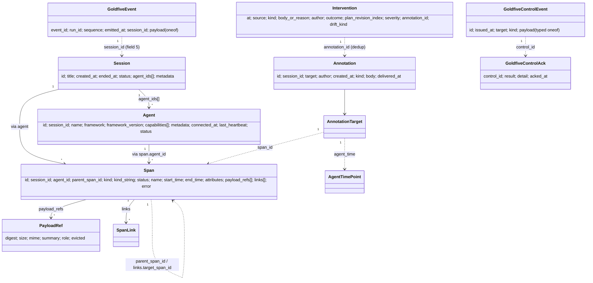
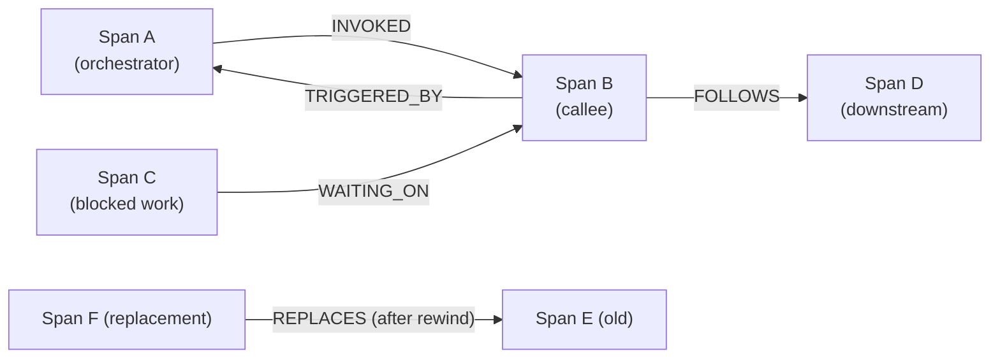

# Data model

Every shared entity on the wire. Definitions live in
[`types.proto`](../../proto/harmonograf/v1/types.proto). Messages
specific to one RPC (`Hello`, `Welcome`, `SessionUpdate`, etc.) live in
the channel-specific protos and are covered in the channel docs.

> **Scope note (post-goldfive migration).** Orchestration types
> (`Plan` / `Task` / `TaskEdge` / `UpdatedTaskStatus` / `TaskStatus`)
> and control types (`ControlKind` / `ControlEvent` / `ControlAck` /
> `SteerPayload` / `RewindPayload` / `ApprovePayload` /
> `RejectPayload` / `InjectMessagePayload` / `ControlTarget` /
> `ControlAckResult`) now live in
> `goldfive/v1/types.proto` and `goldfive/v1/control.proto`.
> Harmonograf imports them wherever they cross the wire. See
> [../goldfive-integration.md](../goldfive-integration.md).

## Entity map



## `Session`

```proto
message Session {
  string id = 1;
  string title = 2;
  google.protobuf.Timestamp created_at = 3;
  google.protobuf.Timestamp ended_at = 4;
  SessionStatus status = 5;
  repeated string agent_ids = 6;
  map<string, string> metadata = 7;
}
```

- **`id`** — human-readable. Regex `^[a-zA-Z0-9_-]{1,128}$`. Either
  user-supplied (`Hello.session_id`), derived from the outer adk-web
  `ctx.session.id` (see
  [ADR 0021](../adr/0021-session-id-pinning.md)), or server-generated
  as `sess_YYYY-MM-DD_NNNN`.
- **`title`** — defaults to `id` if empty. Set by the first Hello via
  `Hello.session_title`; later Hellos **cannot change it**.
- **`created_at`** — server wall-clock at session creation.
- **`ended_at`** — null while `status == LIVE`.
- **`status`** — one of:

  | Enum | Meaning |
  |---|---|
  | `SESSION_STATUS_UNSPECIFIED` | Invalid; never written |
  | `SESSION_STATUS_LIVE` | At least one agent still has an active stream |
  | `SESSION_STATUS_COMPLETED` | All agents cleanly disconnected |
  | `SESSION_STATUS_ABORTED` | Session was force-terminated |

- **`agent_ids`** — denormalized for fast listing. Populated as agents
  Hello in (or auto-register on first span — see
  [ADR 0024](../adr/0024-per-adk-agent-gantt-rows.md)).
- **`metadata`** — free-form; deep-merged from each Hello.

## `Agent`

```proto
message Agent {
  string id = 1;
  string session_id = 2;
  string name = 3;
  Framework framework = 4;
  string framework_version = 5;
  repeated Capability capabilities = 6;
  map<string, string> metadata = 7;
  google.protobuf.Timestamp connected_at = 8;
  google.protobuf.Timestamp last_heartbeat = 9;
  AgentStatus status = 10;
}
```

- **`id`** — client-chosen and persisted to disk so a restarted
  agent reclaims its row in the Gantt. Under the
  `HarmonografTelemetryPlugin`, per-ADK-agent ids have the form
  `{client_id}:{adk_name}` — the plugin stacks them per ADK agent
  in the tree (see
  [ADR 0024](../adr/0024-per-adk-agent-gantt-rows.md)).
- **`framework`** — `FRAMEWORK_ADK`, `FRAMEWORK_CUSTOM`, or
  `FRAMEWORK_UNSPECIFIED`.
- **`capabilities`** — what the agent will honor on `SubscribeControl`:
  `PAUSE_RESUME`, `CANCEL`, `REWIND`, `STEERING`, `HUMAN_IN_LOOP`,
  `INTERCEPT_TRANSFER`. Frontend uses these to grey out control
  buttons.
- **`metadata`** — free-form. Reserved keys populated by the server
  on auto-register when `hgraf.agent.*` hints arrive on the first
  span from an agent:

  | Key | Source attribute | Meaning |
  |---|---|---|
  | `adk.agent.name` | `hgraf.agent.name` | ADK-level agent name (e.g. `research_agent`) |
  | `harmonograf.parent_agent_id` | `hgraf.agent.parent_id` | Parent per-agent id in the ADK tree |
  | `harmonograf.agent_kind` | `hgraf.agent.kind` | `coordinator` / `specialist` / `agent_tool` / `sequential_container` / etc. |
  | `adk.agent.branch` | `hgraf.agent.branch` | ADK's dotted ancestry string |

- **`status`** — one of:

  | Enum | Meaning |
  |---|---|
  | `AGENT_STATUS_UNSPECIFIED` | Invalid; never written |
  | `AGENT_STATUS_CONNECTED` | At least one live telemetry stream |
  | `AGENT_STATUS_DISCONNECTED` | Last stream closed (`Goodbye` or heartbeat timeout) |
  | `AGENT_STATUS_CRASHED` | Process crashed or heartbeat timeout while spans still RUNNING |

## `Span`

The core primitive.

```proto
message Span {
  string id = 1;
  string session_id = 2;
  string agent_id = 3;
  string parent_span_id = 4;
  SpanKind kind = 5;
  string kind_string = 6;
  SpanStatus status = 7;
  string name = 8;
  google.protobuf.Timestamp start_time = 9;
  google.protobuf.Timestamp end_time = 10;
  map<string, AttributeValue> attributes = 11;
  repeated PayloadRef payload_refs = 12;
  repeated SpanLink links = 13;
  ErrorInfo error = 14;
}
```

- **`id`** — UUIDv7 (sortable, collision-free across reconnects). The
  server dedups by `id` when a client replays buffered spans.
- **`session_id`** / **`agent_id`** — may differ from the owning
  telemetry stream's Hello defaults. Per-span overrides let one
  client emit on behalf of multiple sub-agents / sessions on a
  single stream (see `ingest._ensure_route`). This is how the
  `HarmonografTelemetryPlugin` lands per-ADK-agent spans on
  per-agent rows under one Client.
- **`parent_span_id`** — intra-agent parent. Empty for roots.
- **`kind`** — categorical type:

  | `SpanKind` | Meaning |
  |---|---|
  | `SPAN_KIND_INVOCATION` | One complete agent turn (outer wrapper) |
  | `SPAN_KIND_LLM_CALL` | One model call |
  | `SPAN_KIND_TOOL_CALL` | One tool invocation |
  | `SPAN_KIND_USER_MESSAGE` | User → agent message |
  | `SPAN_KIND_AGENT_MESSAGE` | Agent → user message |
  | `SPAN_KIND_TRANSFER` | Agent transfer (handoff to another agent) |
  | `SPAN_KIND_WAIT_FOR_HUMAN` | Blocking on human approval (drives AWAITING_HUMAN UI states) |
  | `SPAN_KIND_PLANNED` | A placeholder span for a planned-but-not-yet-started task |
  | `SPAN_KIND_CUSTOM` | Framework-specific; the real label is in `kind_string` |

- **`kind_string`** — populated **only when `kind == SPAN_KIND_CUSTOM`**.
  Otherwise empty.
- **`status`** — lifecycle:

  | `SpanStatus` | Meaning |
  |---|---|
  | `SPAN_STATUS_PENDING` | Queued, not started |
  | `SPAN_STATUS_RUNNING` | Active |
  | `SPAN_STATUS_COMPLETED` | Finished OK |
  | `SPAN_STATUS_FAILED` | Errored |
  | `SPAN_STATUS_CANCELLED` | Externally cancelled |
  | `SPAN_STATUS_AWAITING_HUMAN` | Blocked on HITL input; drives the urgent UI badge |

- **`start_time` / `end_time`** — `google.protobuf.Timestamp` at
  microsecond precision. `end_time` unset on `SpanStart`; populated by
  `SpanEnd`.
- **`attributes`** — free-form typed key/value. Reserved keys:

  | Key | Meaning |
  |---|---|
  | `hgraf.task_id` | Task binding stamp (see [`span-lifecycle.md#task-binding`](span-lifecycle.md#task-binding)) |
  | `hgraf.agent.name` / `.parent_id` / `.kind` / `.branch` | First-span agent-hint attributes (harvested into `Agent.metadata`; see [ADR 0024](../adr/0024-per-adk-agent-gantt-rows.md)) |
  | `task_report` | Proactive status report; broadcast as a `TaskReport` delta |
  | `drift_kind`, `drift_severity`, `drift_detail`, `error` | Stamped on the active INVOCATION span by critical drifts |
  | `finish_reason` | LLM finish reason (`MAX_TOKENS`, `LENGTH`, etc.) — used for context-pressure drift |
  | `llm.reasoning` / `llm.has_thinking` | Reasoning / thinking content extracted by the plugin from provider-specific fields |
  | `adk.session_id` | Per-ctx ADK session id kept for forensic debugging when session id is pinned to the outer adk-web session |

- **`payload_refs`** — zero or more payloads, distinguished by `role`.
- **`links`** — cross-span edges. See [`SpanLink`](#spanlink).
- **`error`** — populated when `status == FAILED`.

## `AttributeValue` / `AttributeArray`

```proto
message AttributeValue {
  oneof value {
    string string_value = 1;
    int64 int_value = 2;
    double double_value = 3;
    bool bool_value = 4;
    bytes bytes_value = 5;
    AttributeArray array_value = 6;
  }
}

message AttributeArray {
  repeated AttributeValue values = 1;
}
```

Mirrors a subset of OpenTelemetry `AnyValue`. An `AttributeValue` with
**no oneof set** is a **clear sentinel**: in `SpanUpdate.attributes`, it
tells the server to drop the key. This is the only way to delete an
attribute mid-span.

## `PayloadRef`

```proto
message PayloadRef {
  string digest = 1;     // sha256 hex
  int64 size = 2;
  string mime = 3;
  string summary = 4;    // ~200 chars
  string role = 5;
  bool evicted = 6;
}
```

- **`digest`** — content-addressed sha256 hex. Same bytes share one
  digest across sessions; `DeleteSession` only frees bytes with no
  remaining references.
- **`role`** — logical slot on the owning span. Conventional values:
  `"input"`, `"output"`, `"args"`, `"result"`, `"prompt"`, `"completion"`.
  An `LLM_CALL` typically carries two refs, one for prompt and one for
  completion.
- **`evicted`** — true when the client dropped the bytes under
  backpressure. The ref still ships (so the drawer shows the summary)
  but `GetPayload` returns `not_found=true`.

The ref is the **hot path** summary: it rides SpanStart / Update / End
immediately. The bytes upload out-of-band via `PayloadUpload`. See
[`payload-flow.md`](payload-flow.md).

## `SpanLink`

```proto
message SpanLink {
  string target_span_id = 1;
  string target_agent_id = 2;
  LinkRelation relation = 3;
}
```

Cross-span edge. `target_agent_id` is optional — when empty, the link
is intra-agent.

| `LinkRelation` | Use |
|---|---|
| `LINK_RELATION_INVOKED` | "I started that span" (caller → callee) |
| `LINK_RELATION_WAITING_ON` | Blocked until target completes |
| `LINK_RELATION_TRIGGERED_BY` | Inverse of INVOKED |
| `LINK_RELATION_FOLLOWS` | Sequential dependency across agents |
| `LINK_RELATION_REPLACES` | This span supersedes a prior one (e.g. after rewind) |



Links become rendered arrows on the Gantt. See
[`span-lifecycle.md#links`](span-lifecycle.md#links).

## `ErrorInfo`

```proto
message ErrorInfo {
  string type = 1;     // e.g. "ValueError"
  string message = 2;
  string stack = 3;    // optional, may be truncated
}
```

Attached to failed spans. `stack` is free-form; clients may truncate
or omit.

## `Annotation`

```proto
enum AnnotationKind {
  ANNOTATION_KIND_UNSPECIFIED = 0;
  ANNOTATION_KIND_COMMENT = 1;
  ANNOTATION_KIND_STEERING = 2;
  ANNOTATION_KIND_HUMAN_RESPONSE = 3;
}

message AnnotationTarget {
  oneof target {
    string span_id = 1;
    AgentTimePoint agent_time = 2;
  }
}

message AgentTimePoint {
  string agent_id = 1;
  google.protobuf.Timestamp at = 2;
}

message Annotation {
  string id = 1;
  string session_id = 2;
  AnnotationTarget target = 3;
  string author = 4;
  google.protobuf.Timestamp created_at = 5;
  AnnotationKind kind = 6;
  string body = 7;
  google.protobuf.Timestamp delivered_at = 8;
}
```

- `target` is a `oneof`: either a concrete `span_id` or an
  `(agent_id, timestamp)` point on the timeline.
- `COMMENT` is UI-only.
- `STEERING` is routed as a synthesized `goldfive.v1.ControlEvent`
  with `kind=STEER`. The server populates `SteerPayload.author`
  and `SteerPayload.annotation_id` from the stored annotation so
  goldfive can dedup retries and propagate operator identity
  (goldfive #171; see
  [ADR 0023](../adr/0023-intervention-dedup-by-annotation-id.md)).
- `HUMAN_RESPONSE` is routed as `CONTROL_KIND_INJECT_MESSAGE` or
  `CONTROL_KIND_APPROVE` depending on the response shape; expected
  to target a `SPAN_STATUS_AWAITING_HUMAN` span.

`delivered_at` is stamped by `PostAnnotation` after a successful
ack.

## `Intervention`

Added in harmonograf #71 / #81. A chronologically merged view of
every point where the plan changed direction.

```proto
message Intervention {
  google.protobuf.Timestamp at = 1;
  string source = 2;
  string kind = 3;
  string body_or_reason = 4;
  string author = 5;
  string outcome = 6;
  int32 plan_revision_index = 7;
  string severity = 8;
  string annotation_id = 9;
  string drift_kind = 10;
}
```

- **`source`** — `"user"` | `"drift"` | `"goldfive"`.
- **`kind`** — source-specific label:
  - User: `"STEER"` / `"CANCEL"` / `"PAUSE"` / `"RESUME"`.
  - Drift: upper-case drift kind (e.g. `"LOOPING_REASONING"`).
  - Goldfive: `"CASCADE_CANCEL"` / `"REFINE_RETRY"` /
    `"HUMAN_INTERVENTION_REQUIRED"`.
- **`body_or_reason`** — user text, drift detail, or cascade/goldfive
  reason.
- **`author`** — populated for user-sourced rows; empty otherwise.
- **`outcome`** — attribution string: `"plan_revised:rN"`,
  `"cascade_cancel:N_tasks"`, `"paused"`, `"run_cancelled"`, or
  `"recorded"` when no follow-up event was observed within the
  attribution window.
- **`plan_revision_index`** — set when the outcome produced a new
  revision.
- **`severity`** — for drift-sourced rows, drives timeline ring
  (see [ADR 0025](../adr/0025-intervention-timeline-viz.md)).
- **`annotation_id`** — populated for annotation-backed rows. Used by
  the aggregator (and the frontend deriver) to deduplicate rows that
  share a source annotation (see
  [ADR 0023](../adr/0023-intervention-dedup-by-annotation-id.md)).
- **`drift_kind`** — raw lowercase drift kind name, kept separate
  from `kind` so the renderer stays tree-agnostic.

Exposed via `ListInterventions(session_id)` on
`frontend.proto` and re-derived live from `WatchSession` deltas by
`frontend/src/lib/interventions.ts`.

## Types imported from goldfive

Harmonograf no longer declares its own control or orchestration
types. Everything on the wire that crosses the agent / server
boundary for plan / task / drift / control flows comes from
goldfive's protos, imported where they appear:

| Message | Lives in | Used by harmonograf |
|---|---|---|
| `goldfive.v1.ControlEvent` | `goldfive/v1/control.proto` | `SubscribeControl` stream, `SendControl` request |
| `goldfive.v1.ControlAck` | `goldfive/v1/control.proto` | `TelemetryUp.control_ack` (field 7) |
| `goldfive.v1.ControlKind` | `goldfive/v1/control.proto` | `ControlEvent.kind` |
| `goldfive.v1.ControlAckResult` | `goldfive/v1/control.proto` | `ControlAck.result`, `SendControlResponse.result`, `PostAnnotationResponse.delivery` |
| `goldfive.v1.ControlTarget` | `goldfive/v1/control.proto` | `ControlEvent.target` |
| `goldfive.v1.SteerPayload` / `RewindPayload` / `ApprovePayload` / `RejectPayload` / `InjectMessagePayload` | `goldfive/v1/control.proto` | Typed oneof on `ControlEvent` |
| `goldfive.v1.Event` | `goldfive/v1/events.proto` | `TelemetryUp.goldfive_event` (field 11), `SessionUpdate.goldfive_event` (field 19) |
| `goldfive.v1.Plan` / `Task` / `TaskEdge` / `TaskStatus` / `DriftKind` / `DriftSeverity` | `goldfive/v1/types.proto` + `events.proto` | Carried inside `goldfive.v1.Event` payload variants |

See `goldfive/v1/events.proto` for the full set of Event payload
variants (RunStarted / GoalDerived / PlanSubmitted / PlanRevised /
TaskStarted / TaskProgress / TaskCompleted / TaskFailed / TaskBlocked
/ TaskCancelled / DriftDetected / RunCompleted / RunAborted /
ConversationStarted / ConversationEnded / ApprovalRequested /
ApprovalGranted / ApprovalRejected / AgentInvocationStarted /
AgentInvocationCompleted / DelegationObserved).

### New fields flagged (2026-04)

- `goldfive.v1.Event.session_id` (field 5) — added in goldfive #155 /
  PR #157. The Runner / Steerer / Executors stamp it on every
  emitted event so one transport stream can multiplex events across
  sessions. Empty = fall back to the Hello session.
- `goldfive.v1.SteerPayload.author` (field 3) — operator identity,
  propagated from `Annotation.author` (goldfive #171).
- `goldfive.v1.SteerPayload.annotation_id` (field 4) — source
  annotation id; used by goldfive for STEER idempotency and by
  harmonograf's intervention aggregator for dedup
  (goldfive #171 / harmonograf #75).
- `goldfive.v1.DriftDetected.annotation_id` (field 6) — propagated
  through to drift records so the server-side aggregator can
  collapse annotation + drift + plan-revision rows into one card
  (goldfive #176 / #177, harmonograf #75).
