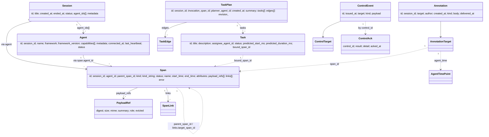

# Data model

Every shared entity on the wire. All definitions live in
[`types.proto`](../../proto/harmonograf/v1/types.proto). Messages
specific to one RPC (`Hello`, `Welcome`, `SessionUpdate`, etc.) live in
the channel-specific protos and are covered in the channel docs.

## Entity map



## `Session`

```proto
message Session {
  string id = 1;
  string title = 2;
  google.protobuf.Timestamp created_at = 3;
  google.protobuf.Timestamp ended_at = 4;
  SessionStatus status = 5;
  repeated string agent_ids = 6;
  map<string, string> metadata = 7;
}
```

- **`id`** — human-readable. Regex `^[a-zA-Z0-9_-]{1,128}$`. Either
  user-supplied (`Hello.session_id`) or server-generated as
  `sess_YYYY-MM-DD_NNNN`.
- **`title`** — defaults to `id` if empty. Set by the first Hello via
  `Hello.session_title`; later Hellos **cannot change it**.
- **`created_at`** — server wall-clock at session creation.
- **`ended_at`** — null while `status == LIVE`.
- **`status`** — one of:

  | Enum | Meaning |
  |---|---|
  | `SESSION_STATUS_UNSPECIFIED` | Invalid; never written |
  | `SESSION_STATUS_LIVE` | At least one agent still has an active stream |
  | `SESSION_STATUS_COMPLETED` | All agents cleanly disconnected |
  | `SESSION_STATUS_ABORTED` | Session was force-terminated |

- **`agent_ids`** — denormalized for fast listing. Populated as agents
  Hello in.
- **`metadata`** — free-form; deep-merged from each Hello.

## `Agent`

```proto
message Agent {
  string id = 1;
  string session_id = 2;
  string name = 3;
  Framework framework = 4;
  string framework_version = 5;
  repeated Capability capabilities = 6;
  map<string, string> metadata = 7;
  google.protobuf.Timestamp connected_at = 8;
  google.protobuf.Timestamp last_heartbeat = 9;
  AgentStatus status = 10;
}
```

- **`id`** — client-chosen, persisted to disk so a restarted agent
  reclaims its row in the Gantt chart. Multiple concurrent telemetry
  streams may exist under one `id` — each gets its own `stream_id`
  from `Welcome`.
- **`framework`** — `FRAMEWORK_ADK`, `FRAMEWORK_CUSTOM`, or
  `FRAMEWORK_UNSPECIFIED`.
- **`capabilities`** — what the agent will honor on `SubscribeControl`:
  `PAUSE_RESUME`, `CANCEL`, `REWIND`, `STEERING`, `HUMAN_IN_LOOP`,
  `INTERCEPT_TRANSFER`. Frontend uses these to grey out control
  buttons.
- **`status`** — one of:

  | Enum | Meaning |
  |---|---|
  | `AGENT_STATUS_UNSPECIFIED` | Invalid; never written |
  | `AGENT_STATUS_CONNECTED` | At least one live telemetry stream |
  | `AGENT_STATUS_DISCONNECTED` | Last stream closed (`Goodbye` or heartbeat timeout) |
  | `AGENT_STATUS_CRASHED` | Process crashed or heartbeat timeout while spans still RUNNING |

## `Span`

The core primitive.

```proto
message Span {
  string id = 1;
  string session_id = 2;
  string agent_id = 3;
  string parent_span_id = 4;
  SpanKind kind = 5;
  string kind_string = 6;
  SpanStatus status = 7;
  string name = 8;
  google.protobuf.Timestamp start_time = 9;
  google.protobuf.Timestamp end_time = 10;
  map<string, AttributeValue> attributes = 11;
  repeated PayloadRef payload_refs = 12;
  repeated SpanLink links = 13;
  ErrorInfo error = 14;
}
```

- **`id`** — UUIDv7 (sortable, collision-free across reconnects). The
  server dedups by `id` when a client replays buffered spans.
- **`session_id`** / **`agent_id`** — may differ from the owning
  telemetry stream's Hello defaults. Per-span overrides let one
  client emit on behalf of multiple sub-agents / sessions on a single
  stream (see `ingest._ensure_route`).
- **`parent_span_id`** — intra-agent parent. Empty for roots.
- **`kind`** — categorical type:

  | `SpanKind` | Meaning |
  |---|---|
  | `SPAN_KIND_INVOCATION` | One complete agent turn (outer wrapper) |
  | `SPAN_KIND_LLM_CALL` | One model call |
  | `SPAN_KIND_TOOL_CALL` | One tool invocation |
  | `SPAN_KIND_USER_MESSAGE` | User → agent message |
  | `SPAN_KIND_AGENT_MESSAGE` | Agent → user message |
  | `SPAN_KIND_TRANSFER` | Agent transfer (handoff to another agent) |
  | `SPAN_KIND_WAIT_FOR_HUMAN` | Blocking on human approval (drives AWAITING_HUMAN UI states) |
  | `SPAN_KIND_PLANNED` | A placeholder span for a planned-but-not-yet-started task |
  | `SPAN_KIND_CUSTOM` | Framework-specific; the real label is in `kind_string` |

- **`kind_string`** — populated **only when `kind == SPAN_KIND_CUSTOM`**.
  Otherwise empty.
- **`status`** — lifecycle:

  | `SpanStatus` | Meaning |
  |---|---|
  | `SPAN_STATUS_PENDING` | Queued, not started |
  | `SPAN_STATUS_RUNNING` | Active |
  | `SPAN_STATUS_COMPLETED` | Finished OK |
  | `SPAN_STATUS_FAILED` | Errored |
  | `SPAN_STATUS_CANCELLED` | Externally cancelled |
  | `SPAN_STATUS_AWAITING_HUMAN` | Blocked on HITL input; drives the urgent UI badge |

- **`start_time` / `end_time`** — `google.protobuf.Timestamp` at
  microsecond precision. `end_time` unset on `SpanStart`; populated by
  `SpanEnd`.
- **`attributes`** — free-form typed key/value. Reserved keys:

  | Key | Meaning |
  |---|---|
  | `hgraf.task_id` | Task binding stamp (see [`span-lifecycle.md#task-binding`](span-lifecycle.md#task-binding)) |
  | `task_report` | Proactive status report; broadcast as a `TaskReport` delta |
  | `drift_kind`, `drift_severity`, `drift_detail`, `error` | Stamped on the active INVOCATION span by critical drifts |
  | `finish_reason` | LLM finish reason (`MAX_TOKENS`, `LENGTH`, etc.) — used for context-pressure drift |

- **`payload_refs`** — zero or more payloads, distinguished by `role`.
- **`links`** — cross-span edges. See [`SpanLink`](#spanlink).
- **`error`** — populated when `status == FAILED`.

## `AttributeValue` / `AttributeArray`

```proto
message AttributeValue {
  oneof value {
    string string_value = 1;
    int64 int_value = 2;
    double double_value = 3;
    bool bool_value = 4;
    bytes bytes_value = 5;
    AttributeArray array_value = 6;
  }
}

message AttributeArray {
  repeated AttributeValue values = 1;
}
```

Mirrors a subset of OpenTelemetry `AnyValue`. An `AttributeValue` with
**no oneof set** is a **clear sentinel**: in `SpanUpdate.attributes`, it
tells the server to drop the key. This is the only way to delete an
attribute mid-span.

## `PayloadRef`

```proto
message PayloadRef {
  string digest = 1;     // sha256 hex
  int64 size = 2;
  string mime = 3;
  string summary = 4;    // ~200 chars
  string role = 5;
  bool evicted = 6;
}
```

- **`digest`** — content-addressed sha256 hex. Same bytes share one
  digest across sessions; `DeleteSession` only frees bytes with no
  remaining references.
- **`role`** — logical slot on the owning span. Conventional values:
  `"input"`, `"output"`, `"args"`, `"result"`, `"prompt"`, `"completion"`.
  An `LLM_CALL` typically carries two refs, one for prompt and one for
  completion.
- **`evicted`** — true when the client dropped the bytes under
  backpressure. The ref still ships (so the drawer shows the summary)
  but `GetPayload` returns `not_found=true`.

The ref is the **hot path** summary: it rides SpanStart / Update / End
immediately. The bytes upload out-of-band via `PayloadUpload`. See
[`payload-flow.md`](payload-flow.md).

## `SpanLink`

```proto
message SpanLink {
  string target_span_id = 1;
  string target_agent_id = 2;
  LinkRelation relation = 3;
}
```

Cross-span edge. `target_agent_id` is optional — when empty, the link
is intra-agent.

| `LinkRelation` | Use |
|---|---|
| `LINK_RELATION_INVOKED` | "I started that span" (caller → callee) |
| `LINK_RELATION_WAITING_ON` | Blocked until target completes |
| `LINK_RELATION_TRIGGERED_BY` | Inverse of INVOKED |
| `LINK_RELATION_FOLLOWS` | Sequential dependency across agents |
| `LINK_RELATION_REPLACES` | This span supersedes a prior one (e.g. after rewind) |

Links become rendered arrows on the Gantt. See
[`span-lifecycle.md#links`](span-lifecycle.md#links).

## `ErrorInfo`

```proto
message ErrorInfo {
  string type = 1;     // e.g. "ValueError"
  string message = 2;
  string stack = 3;    // optional, may be truncated
}
```

Attached to failed spans. `stack` is free-form; clients may truncate
or omit.

## `TaskPlan` / `Task` / `TaskEdge`

```proto
message TaskPlan {
  string id = 1;
  string session_id = 2;
  string invocation_span_id = 3;
  string planner_agent_id = 4;
  google.protobuf.Timestamp created_at = 5;
  string summary = 6;
  repeated Task tasks = 7;
  repeated TaskEdge edges = 8;
  string revision_reason = 9;
  string revision_kind = 10;
  string revision_severity = 11;
  int64 revision_index = 12;
}

message Task {
  string id = 1;
  string title = 2;
  string description = 3;
  string assignee_agent_id = 4;
  TaskStatus status = 5;
  int64 predicted_start_ms = 6;
  int64 predicted_duration_ms = 7;
  string bound_span_id = 8;
}

message TaskEdge {
  string from_task_id = 1;
  string to_task_id = 2;
}
```

- **`TaskPlan.id`** is stable across revisions. Re-submitting a plan
  with the same id replaces it; `revision_index` increments.
- **`revision_kind`** is the structured drift tag that triggered the
  revision (e.g. `"tool_error"`, `"new_work_discovered"`). Empty on
  initial plans. See [`task-state-machine.md#drift-taxonomy`](task-state-machine.md#drift-taxonomy).
- **`revision_severity`** is `"info"` / `"warning"` / `"critical"`.
- **`Task.status`** transitions are **monotonic** — see
  [`task-state-machine.md#state-machine`](task-state-machine.md#state-machine).
- **`Task.bound_span_id`** is set when a span carrying
  `hgraf.task_id = <task.id>` begins running, or by explicit
  `UpdatedTaskStatus.bound_span_id`.
- **`predicted_start_ms` / `predicted_duration_ms`** are session-relative
  hints from the planner. Both zero → the frontend falls back to t=0
  stacking.

| `TaskStatus` | Meaning |
|---|---|
| `TASK_STATUS_PENDING` | Queued, deps not yet satisfied |
| `TASK_STATUS_RUNNING` | Bound to a live span |
| `TASK_STATUS_COMPLETED` | Terminal, success |
| `TASK_STATUS_FAILED` | Terminal, failure |
| `TASK_STATUS_CANCELLED` | Terminal, cascaded from an unrecoverable upstream failure |

## `UpdatedTaskStatus`

```proto
message UpdatedTaskStatus {
  string plan_id = 1;
  string task_id = 2;
  TaskStatus status = 3;
  string bound_span_id = 4;
  google.protobuf.Timestamp updated_at = 5;
}
```

Escape hatch for task state changes not tied to a span. Rides
`TelemetryUp.task_status_update` upstream and fans out on
`WatchSession.updated_task_status` downstream.

## `Annotation`

```proto
enum AnnotationKind {
  ANNOTATION_KIND_UNSPECIFIED = 0;
  ANNOTATION_KIND_COMMENT = 1;
  ANNOTATION_KIND_STEERING = 2;
  ANNOTATION_KIND_HUMAN_RESPONSE = 3;
}

message AnnotationTarget {
  oneof target {
    string span_id = 1;
    AgentTimePoint agent_time = 2;
  }
}

message AgentTimePoint {
  string agent_id = 1;
  google.protobuf.Timestamp at = 2;
}

message Annotation {
  string id = 1;
  string session_id = 2;
  AnnotationTarget target = 3;
  string author = 4;
  google.protobuf.Timestamp created_at = 5;
  AnnotationKind kind = 6;
  string body = 7;
  google.protobuf.Timestamp delivered_at = 8;
}
```

- `target` is a `oneof`: either a concrete `span_id` or an
  `(agent_id, timestamp)` point on the timeline.
- `COMMENT` is UI-only.
- `STEERING` is routed as a synthesized `CONTROL_KIND_STEER` event; the
  agent ack fills in `delivered_at`.
- `HUMAN_RESPONSE` is routed as `CONTROL_KIND_APPROVE` and is expected
  to target a `SPAN_STATUS_AWAITING_HUMAN` span.

## `ControlEvent` / `ControlTarget` / `ControlAck`

```proto
message ControlTarget {
  string agent_id = 1;
  string span_id = 2;
}

message ControlEvent {
  string id = 1;
  google.protobuf.Timestamp issued_at = 2;
  ControlTarget target = 3;
  ControlKind kind = 4;
  bytes payload = 5;
}

message ControlAck {
  string control_id = 1;
  ControlAckResult result = 2;
  string detail = 3;
  google.protobuf.Timestamp acked_at = 4;
}
```

- `ControlEvent.id` is the correlation token. The agent must echo it
  verbatim in `ControlAck.control_id`.
- `span_id` on `ControlTarget` is meaningful for some kinds only
  (`REWIND_TO`, `APPROVE`/`REJECT`, `STEER` when targeting a specific
  span).
- `payload` interpretation is `ControlKind`-specific — see
  [`control-stream.md#control-kinds`](control-stream.md#control-kinds).

See [`control-stream.md`](control-stream.md) for the full lifecycle.
