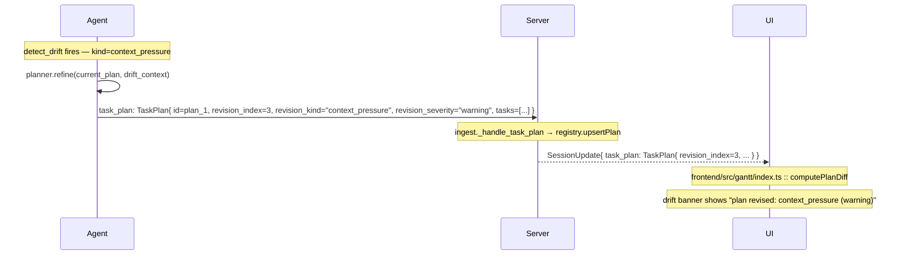

# Frontend RPCs

UI-facing RPCs hosted on the same gRPC service as telemetry and
control. Requests here come from the harmonograf web frontend (or any
other tool that wants to read session state). Definitions live in
[`frontend.proto`](../../proto/harmonograf/v1/frontend.proto); the
service declaration is in
[`service.proto`](../../proto/harmonograf/v1/service.proto).

| RPC | Shape | Purpose |
|---|---|---|
| [`ListSessions`](#listsessions) | unary | Session picker |
| [`WatchSession`](#watchsession) | server-streaming | Open a session: initial burst + live deltas |
| [`GetPayload`](#getpayload) | server-streaming | Drawer / tooltip payload fetch, chunked |
| [`GetSpanTree`](#getspantree) | unary | Span snapshot for a time window |
| [`PostAnnotation`](#postannotation) | unary | User note / steering / HITL response |
| [`SendControl`](#sendcontrol) | unary | PAUSE / RESUME / STEER / STATUS_QUERY / etc. |
| [`DeleteSession`](#deletesession) | unary | Purge a session |
| [`GetStats`](#getstats) | unary | Retention / storage stats |

## `ListSessions`

```proto
rpc ListSessions(ListSessionsRequest) returns (ListSessionsResponse);
```

Picker data. Cheap to build — the server materializes a `SessionSummary`
per session without touching spans.

```proto
message ListSessionsRequest {
  SessionStatus status_filter = 1;  // UNSPECIFIED = include all
  string search = 2;                // free text over title + metadata values
  int32 limit = 3;
  int32 offset = 4;
}

message ListSessionsResponse {
  repeated SessionSummary sessions = 1;
  int32 total_count = 2;
}

message SessionSummary {
  string id = 1;
  string title = 2;
  google.protobuf.Timestamp created_at = 3;
  google.protobuf.Timestamp ended_at = 4;
  SessionStatus status = 5;
  int32 agent_count = 6;
  int32 attention_count = 7;   // # of AWAITING_HUMAN spans
  google.protobuf.Timestamp last_activity = 8;
}
```

- `attention_count` drives the badge on the picker row.
- `search` matches substrings in `Session.title` and the values of
  `Session.metadata`. Case-insensitive.
- `limit == 0` means "server default" (100 v0). Negative values → error.

## `WatchSession`

```proto
rpc WatchSession(WatchSessionRequest) returns (stream SessionUpdate);
```

The main UI firehose. On open, the server replays enough state to
render the requested time window, then streams live deltas indefinitely.

```proto
message WatchSessionRequest {
  string session_id = 1;
  google.protobuf.Timestamp window_start = 2;
  google.protobuf.Timestamp window_end = 3;
}
```

- Unset `window_*` → server picks "recent" (default: last 1 hour or
  the whole session, whichever is smaller).
- The stream never terminates on its own while the session is LIVE.
  Clients close it themselves.

### `SessionUpdate` oneof — initial burst

| Tag | Variant | When |
|---|---|---|
| 1 | `Session session` | Once, near the top of the burst. The current `Session` row. |
| 2 | `Agent agent` | Once per agent in the session. |
| 3 | `Span initial_span` | Zero or more — each span in the window. |
| 4 | `Annotation initial_annotation` | Zero or more — pre-existing annotations. |
| 5 | `InitialBurstComplete burst_complete` | Explicit end-of-burst marker: `{spans_sent, agents_sent}`. |

After `burst_complete`, only live deltas follow. Clients may also
detect end-of-burst by seeing the first delta variant (tags 6+), but
the explicit marker is preferred.

### `SessionUpdate` oneof — live deltas

| Tag | Variant | Fires on |
|---|---|---|
| 6 | `NewSpan new_span` | Ingest received a `SpanStart`. |
| 7 | `UpdatedSpan updated_span` | Ingest received a `SpanUpdate`. |
| 8 | `EndedSpan ended_span` | Ingest received a `SpanEnd`. Includes final payload snapshot so the drawer can populate without a refetch. |
| 9 | `NewAnnotation new_annotation` | A new annotation was persisted. |
| 10 | `AgentJoined agent_joined` | A new Hello registered an agent on this session. |
| 11 | `AgentLeft agent_left` | Agent's last stream closed. Fields: `{agent_id, stream_id}`. |
| 12 | `AgentStatusChanged agent_status_changed` | Heartbeat / stuckness / activity change. Includes `current_activity`, `stuck`, `progress_counter`. |
| 13 | `SessionEnded session_ended` | Session flipped to COMPLETED / ABORTED. |
| 14 | `PayloadAvailable payload_available` | A pending payload's bytes just landed. Client may now call `GetPayload`. |
| 15 | `TaskReport task_report` | Agent responded to STATUS_QUERY, or proactively emitted a task-report span attribute. |
| 16 | `TaskPlan task_plan` | A fresh plan or a refine-revised plan landed. |
| 17 | `UpdatedTaskStatus updated_task_status` | A single task's status flipped (derived from span binding or explicit `task_status_update`). |
| 18 | `ContextWindowSample context_window_sample` | Heartbeat carried a non-zero `context_window_tokens` / `_limit_tokens`. Also replayed during the initial burst from sqlite. |

### Delta message shapes (selected)

```proto
message NewSpan { Span span = 1; }

message UpdatedSpan {
  string span_id = 1;
  SpanStatus status = 2;
  map<string, AttributeValue> attributes = 3;
  repeated PayloadRef payload_refs = 4;
}

message EndedSpan {
  string span_id = 1;
  google.protobuf.Timestamp end_time = 2;
  SpanStatus status = 3;
  ErrorInfo error = 4;
  repeated PayloadRef payload_refs = 5;   // final snapshot
}

message AgentStatusChanged {
  string agent_id = 1;
  AgentStatus status = 2;
  int64 buffered_events = 3;
  int64 dropped_events = 4;
  string current_activity = 5;
  bool stuck = 6;
  int64 progress_counter = 7;
}

message TaskReport {
  string agent_id = 1;
  string report = 2;
  string invocation_span_id = 3;
  google.protobuf.Timestamp recorded_at = 4;
}

message ContextWindowSample {
  string agent_id = 1;
  google.protobuf.Timestamp recorded_at = 2;
  int64 tokens = 3;
  int64 limit_tokens = 4;
}
```

### Drift → refine → banner sequence



See [`task-state-machine.md`](task-state-machine.md) for the client-side
drift pipeline.

## `GetPayload`

```proto
rpc GetPayload(GetPayloadRequest) returns (stream PayloadChunk);
```

Lazy fetch of a payload body. Server-streaming so the frontend can
render multi-MiB LLM completions progressively.

```proto
message GetPayloadRequest {
  string digest = 1;
  bool summary_only = 2;    // drawer tooltips don't need bytes
}

message PayloadChunk {
  string digest = 1;
  int64 total_size = 2;
  string mime = 3;
  string summary = 4;       // first chunk only
  bytes chunk = 5;
  bool last = 6;
  bool not_found = 7;
}
```

- Small payloads arrive as a single chunk with `last=true`.
- Large payloads stream in arbitrary chunk sizes; the client reassembles
  in order.
- `summary_only=true` → the server returns exactly one chunk with
  `chunk=b""` and `last=true`.
- `not_found=true` with empty `chunk` means the payload was
  client-evicted and never reuploaded. The server may have also
  attempted a `PayloadRequest` → re-upload cycle before returning
  not_found; that's transparent to the caller.

See [`payload-flow.md`](payload-flow.md) for the upload side.

## `GetSpanTree`

```proto
rpc GetSpanTree(GetSpanTreeRequest) returns (GetSpanTreeResponse);
```

Snapshot query for a time window on a session. Used on viewport jumps
and on initial open when `WatchSession`'s default window isn't what the
UI wants.

```proto
message GetSpanTreeRequest {
  string session_id = 1;
  repeated string agent_ids = 2;       // empty = all
  google.protobuf.Timestamp window_start = 3;
  google.protobuf.Timestamp window_end = 4;
  int32 limit = 5;
}

message GetSpanTreeResponse {
  repeated Span spans = 1;
  bool truncated = 2;
}
```

`truncated=true` means the server hit `limit` and returned a partial
result. Clients should tighten the window or raise the limit.

## `PostAnnotation`

```proto
rpc PostAnnotation(PostAnnotationRequest) returns (PostAnnotationResponse);
```

```proto
message PostAnnotationRequest {
  string session_id = 1;
  AnnotationTarget target = 2;
  AnnotationKind kind = 3;
  string body = 4;
  string author = 5;
  int64 ack_timeout_ms = 6;   // 0 = server default (10 s)
}

message PostAnnotationResponse {
  Annotation annotation = 1;
  ControlAckResult delivery = 2;
  string delivery_detail = 3;
}
```

Behavior by `AnnotationKind`:

- `COMMENT` — persisted; response returns immediately with
  `delivery = CONTROL_ACK_RESULT_UNSPECIFIED`. Fans out on
  `WatchSession` as `new_annotation`.
- `STEERING` — persisted, **and** the body is routed through the
  control path as a synthetic `ControlEvent { kind=STEER, payload=body }`.
  `PostAnnotation` waits for the ack up to `ack_timeout_ms` and returns
  it in `delivery` / `delivery_detail`. On the agent side, STEER
  events are fed into the drift pipeline as kind `user_steer`.
- `HUMAN_RESPONSE` — same shape as STEERING, but the synthesized event
  is `CONTROL_KIND_APPROVE`. The annotation target must be a span in
  `SPAN_STATUS_AWAITING_HUMAN` for this to make sense.

## `SendControl`

```proto
rpc SendControl(SendControlRequest) returns (SendControlResponse);
```

```proto
message SendControlRequest {
  string session_id = 1;
  ControlTarget target = 2;
  ControlKind kind = 3;
  bytes payload = 4;
  int64 ack_timeout_ms = 5;    // 0 = server default (10 s)
  bool require_all_acks = 6;   // default: first ack wins
}

message SendControlResponse {
  string control_id = 1;
  ControlAckResult result = 2;
  repeated StreamAck acks = 3;
}

message StreamAck {
  string stream_id = 1;
  ControlAckResult result = 2;
  string detail = 3;
  google.protobuf.Timestamp acked_at = 4;
}
```

See [`control-stream.md`](control-stream.md) for the fan-out semantics
and the `ControlKind` catalogue.

- `result` aggregates `acks` into a single outcome:
  - `require_all_acks=false` → `SUCCESS` if any ack was SUCCESS,
    `FAILURE`/`UNSUPPORTED` otherwise.
  - `require_all_acks=true` → `SUCCESS` only if every expected stream
    ack'd SUCCESS.
- On timeout, `result` is implementation-dependent (v0 returns the
  partial ack set; the `control_router` surfaces `DeliveryResult.DEADLINE_EXCEEDED`
  internally but gRPC maps it to `SUCCESS/FAILED` at the service layer).
- No live subscription → `acks` empty and
  `result = CONTROL_ACK_RESULT_FAILURE` (with detail "no live
  subscription").

## `DeleteSession`

```proto
rpc DeleteSession(DeleteSessionRequest) returns (DeleteSessionResponse);
```

```proto
message DeleteSessionRequest {
  string session_id = 1;
  bool force = 2;   // delete even if LIVE
}

message DeleteSessionResponse {
  bool deleted = 1;
  string reason_if_not = 2;
  int32 spans_removed = 3;
  int32 annotations_removed = 4;
  int64 payload_bytes_freed = 5;
}
```

Refuses LIVE sessions unless `force=true`. Payloads are garbage-
collected by digest: only the bytes that no other session still
references are freed.

## `GetStats`

```proto
rpc GetStats(GetStatsRequest) returns (GetStatsResponse);
```

```proto
message GetStatsResponse {
  int32 session_count = 1;
  int32 live_session_count = 2;
  int32 agent_count = 3;
  int64 span_count = 4;
  int64 annotation_count = 5;
  int64 payload_count = 6;
  int64 payload_bytes = 7;
  int64 disk_bytes = 8;
  string data_dir = 9;
  int32 active_telemetry_streams = 10;
  int32 active_control_streams = 11;
}
```

v0 has no automatic retention — this RPC backs the Settings page and
`make stats`. Clients that want to cap growth must call `DeleteSession`
themselves.
