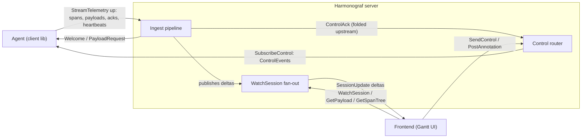

# Harmonograf v1 protocol reference

Low-level design reference for harmonograf's wire protocols. Audience:

- authors of a new client library (Python / TS / Go / Rust) that speaks
  harmonograf,
- engineers debugging a dropped control ack, a missing span, or a
  stalled payload upload,
- anyone wanting a complete picture of the happens-before guarantees
  that the Gantt UI depends on.

The ground truth is the set of `.proto` files in
[`proto/harmonograf/v1/`](../../proto/harmonograf/v1/). This reference
documents semantics, invariants, and sequencing the protos cannot
express. Where snippets appear below, they are cited verbatim from the
protos — if they ever disagree, the protos win.

The three RPC tiers and how they connect agents, the server, and the frontend at a glance:

## Map

| Doc | Topic |
|---|---|
| [`overview.md`](overview.md) | The five RPC-level concerns, why telemetry / control / frontend split three ways, how a new client first attaches. |
| [`telemetry-stream.md`](telemetry-stream.md) | `StreamTelemetry` upstream (`TelemetryUp`) and downstream (`TelemetryDown`) variants, Hello/Welcome, resume_token, Goodbye. |
| [`control-stream.md`](control-stream.md) | `SubscribeControl`, `ControlEvent` → `ControlAck` lifecycle, capability negotiation, multi-stream fan-out, `require_all_acks`. |
| [`frontend-rpcs.md`](frontend-rpcs.md) | UI-facing RPCs: `ListSessions`, `WatchSession`, `GetPayload`, `GetSpanTree`, `PostAnnotation`, `SendControl`, `DeleteSession`, `GetStats`. |
| [`data-model.md`](data-model.md) | Every shared `types.proto` message: `Session`, `Agent`, `Span`, `AttributeValue`, `PayloadRef`, `ErrorInfo`, `TaskPlan`, `Task`, `TaskEdge`, `UpdatedTaskStatus`, `Annotation`, `ControlEvent`, `ControlAck`. |
| [`task-state-machine.md`](task-state-machine.md) | Plan execution protocol: `session.state` schema, reporting tools, orchestration modes, monotonic transitions, 26-kind drift taxonomy, refine pipeline, invariant validator. |
| [`span-lifecycle.md`](span-lifecycle.md) | `SpanStart` / `SpanUpdate` / `SpanEnd`, attribute merging, the `hgraf.task_id` binding attribute, cross-agent links. |
| [`payload-flow.md`](payload-flow.md) | Content-addressed `PayloadRef`s, chunked `PayloadUpload`, client-side eviction, server-side `PayloadRequest` re-requests, the `PayloadAvailable` delta. |
| [`wire-ordering.md`](wire-ordering.md) | Happens-before guarantees, control-ack colocation, duplicate span dedup on reconnect, resume_token semantics. |

## How to read this

Start with [`overview.md`](overview.md) for a ten-minute mental model of
the three RPC channels. Once that sticks, pick whichever downstream doc
matches what you're implementing:

- **Writing a client library** → `telemetry-stream.md` → `control-stream.md` →
  `span-lifecycle.md` → `payload-flow.md` → `task-state-machine.md`.
- **Writing a frontend adapter** → `frontend-rpcs.md` → `data-model.md` → `task-state-machine.md`.
- **Debugging a wire issue** → `wire-ordering.md` first, then whichever
  of the channel docs is relevant.

## Cross-references

- [`docs/design/01-data-model-and-rpc.md`](../design/01-data-model-and-rpc.md) —
  original architectural rationale for the split. Whenever a "why" in
  this reference gets long, the answer usually lives there.
- [`docs/design/12-client-library-and-adk.md`](../design/12-client-library-and-adk.md)
  — design of the Python ADK adapter; see for the rationale behind the
  reporting tools and the walker.
- **Task #7 — Developer guide** — how to build and run the stack, plus
  internal module layout. This reference does not cover local dev setup.
- **Task #6 — User guide** — how the Gantt UI renders what lands on the
  wire. The semantics here become pixels there.
- [`docs/reporting-tools.md`](../reporting-tools.md) — agent-facing
  quick reference for the seven `report_*` tools. See
  [`task-state-machine.md`](task-state-machine.md) for the full contract.
