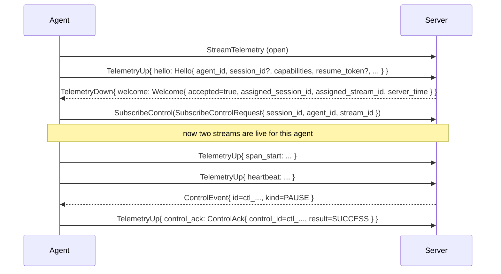

# Overview

Harmonograf exposes **one gRPC service** (`harmonograf.v1.Harmonograf`,
declared in [`service.proto`](../../proto/harmonograf/v1/service.proto))
that hosts every RPC used on the wire — both agent-facing and
frontend-facing. The single-service choice is deliberate: one gRPC
channel is reusable, one auth surface covers everything, and the version
knob is per-service, not per-RPC.

Conceptually the RPCs split into three tiers:

```
+-------------------------+      +-------------------------+
|         Agent           |      |       Frontend          |
| (client library inside  |      | (Gantt console / HTTP)  |
|  the user's agent code) |      |                         |
+-------------------------+      +-------------------------+
           |    ^                            |      ^
 telemetry |    |                            |      |
   up      |    | down      unary /          |      | deltas
           v    |  (Welcome, etc)            v      |
+-------------------------+      +-------------------------+
|     StreamTelemetry     |      |   Frontend UI RPCs      |
+-------------------------+      +-------------------------+
           ^                                 |
           | ControlEvent                    |
+-------------------------+                  |
|    SubscribeControl     |<-----------------+
+-------------------------+    SendControl / PostAnnotation
```

The three tiers are:

1. **Telemetry (`StreamTelemetry`)** — agent → server, bidirectional.
   Spans, payload chunks, heartbeats, task plans, task status updates,
   and **control acks** ride on this one stream. Downstream is reserved
   for handshake (`Welcome`), payload re-requests, and flow-control
   hints.

2. **Control (`SubscribeControl`)** — server → agent, server-streaming.
   Each agent opens one `SubscribeControl` per active telemetry stream
   right after `Welcome` arrives. The server pushes `ControlEvent`s
   (PAUSE, RESUME, STEER, STATUS_QUERY, etc.). Acks do **not** travel
   back on this stream — they ride upstream on `StreamTelemetry` as
   `TelemetryUp.control_ack`.

3. **Frontend RPCs** — frontend → server, unary or server-streaming:

   - `ListSessions` (unary)
   - `WatchSession` (server-streaming — initial burst + live deltas)
   - `GetPayload` (server-streaming — chunked)
   - `GetSpanTree` (unary)
   - `PostAnnotation` (unary; may synthesize a `ControlEvent` under the
     hood)
   - `SendControl` (unary; fans out to every live `SubscribeControl`)
   - `DeleteSession` (unary)
   - `GetStats` (unary)

## Why three tiers?

See [`docs/design/01-data-model-and-rpc.md §4.2.1`](../design/01-data-model-and-rpc.md)
for the full rationale. The short version:

- **Telemetry is high-volume and bursty.** A single LLM response can
  push multiple MB of payload bytes; a busy agent emits spans at tens
  of events per second. Telemetry tolerates buffering and small delays.
- **Control is low-volume and latency-sensitive.** A user hitting PAUSE
  expects the agent to stop within a few frames. Giving control its own
  gRPC stream means a stalled payload upload can never delay a PAUSE —
  the control stream has its own gRPC flow window.
- **Acks still need happens-before.** If an ack arrives at the server,
  every span the client emitted before issuing the ack must already be
  on the wire, so the UI can render "paused at span X" correctly. That
  ordering is free if acks ride the same stream as spans. Hence the
  asymmetry: events flow down on `SubscribeControl`, acks flow up on
  `StreamTelemetry`.

This asymmetry is the single most surprising thing about the protocol.
Every new client adapter forgets it once. See
[`wire-ordering.md`](wire-ordering.md) for the full happens-before
argument.

## First-connect flow

A brand-new agent, on its first RPC to a harmonograf server, does this:



Key points:

- The agent **must** send `Hello` as the first `TelemetryUp` on every
  new telemetry stream. Subsequent streams (e.g. after reconnect) each
  begin with their own `Hello`. Sending a second `Hello` on a live
  stream is an error (see `ingest.handle_message`, which raises
  `ValueError`).
- The server replies with a `Welcome` carrying an `assigned_stream_id`
  that is unique within the agent_id. **Use this id verbatim when
  opening `SubscribeControl`** — the control router keys its
  subscription map by `(agent_id, stream_id)`.
- The agent may open `SubscribeControl` only after it has received
  `Welcome`. Opening it earlier races the ingest pipeline's
  registration of the stream.
- A crashed or restarted agent that reuses the same `agent_id` and a
  non-empty `resume_token` tells the server "I think my last
  acknowledged span was X" — the server doesn't actually store acks
  per-span yet (v0), but the field is already wired so future servers
  can replay from that point. See
  [`wire-ordering.md`](wire-ordering.md).

## Versioning

There is no explicit protocol version field on `Hello`. Instead,
`Welcome.flags` is a `map<string, string>` reserved for future capability
advertisement. v0 leaves it empty. When the server needs to negotiate a
feature (e.g. per-span ack replay), it will announce it in `flags` and
clients that don't recognize the flag must tolerate its absence.

Anything in the protos marked `// Reserved for future use` or `// v0
does not emit these` is a stable extension point: existing clients must
not crash if a server does begin emitting it.
