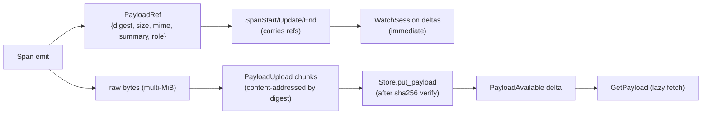
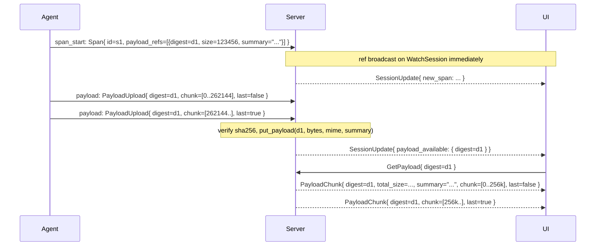
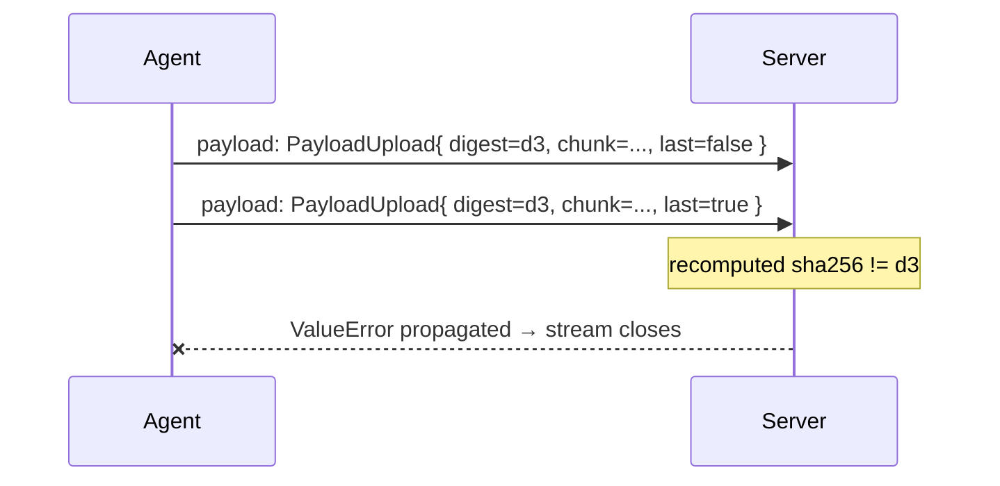

# Payload flow

Large blob bytes — LLM prompts and completions, tool args and results,
images, pasted files — travel on a **separate code path** from span
metadata. Spans carry small, hot-path `PayloadRef` summaries; the bytes
themselves are uploaded chunked, content-addressed, and fetched lazily
by the frontend.

The split is the core reason the timeline stays responsive under
multi-MiB LLM workloads — the Gantt never waits on a payload upload to
render a block.

The hot-path `PayloadRef` and the cold-path bytes travel on different code paths so the timeline never blocks on an upload:



## Payload refs (the hot path)

```proto
message PayloadRef {
  string digest = 1;     // sha256 hex
  int64 size = 2;
  string mime = 3;
  string summary = 4;    // ~200-char preview
  string role = 5;
  bool evicted = 6;
}
```

- **`digest`** is **content-addressed** sha256 hex of the payload
  bytes. Identical bytes share one digest across all spans and
  sessions.
- **`size`** is the intended total size. The client computes this
  locally before starting the upload so the frontend's progress bar
  has a target.
- **`summary`** is a short preview (≈200 chars). Rendered in tooltips
  and the drawer header. **Must be filled** even when the client
  intends to upload bytes — the frontend needs something to show
  before / instead of the full body.
- **`role`** is a logical slot on the owning span. Conventions:
  `"input"`, `"output"`, `"args"`, `"result"`, `"prompt"`,
  `"completion"`. Spans may carry multiple refs distinguished by
  role (e.g., `LLM_CALL` typically has `prompt` and `completion`).
- **`evicted`** — true when the client dropped the bytes under
  backpressure before / during upload. The ref still ships so the UI
  can render the summary, but `GetPayload` will return
  `not_found=true`.

Refs ride on `SpanStart` / `SpanUpdate` / `SpanEnd` `payload_refs`
fields. Merging on the server is **additive by role**: a new ref for
the same role replaces the old one.

## Upload — `PayloadUpload`

Bytes travel on `TelemetryUp.payload`, chunked:

```proto
message PayloadUpload {
  string digest = 1;
  int64 total_size = 2;
  string mime = 3;
  bytes chunk = 4;
  bool last = 5;
  bool evicted = 6;
}
```

Client protocol:

1. Client computes sha256 of the full bytes; that becomes `digest`.
2. Client ships the `PayloadRef` on whatever span message is most
   convenient (SpanStart / SpanUpdate / SpanEnd). **The ref can land
   before the bytes.** The timeline doesn't wait.
3. Client streams `PayloadUpload` chunks on the same telemetry
   stream, interleaved freely with spans and other payloads.
4. On the final chunk, client sets `last=true`.
5. If the client gave up mid-upload (eviction), the final chunk
   should have `evicted=true` and `last=true` — the server records
   the digest as permanently unavailable.

Chunk sizing:

- **Recommended**: up to 256 KiB per chunk.
- **Hard ceiling**: `PAYLOAD_MAX_BYTES = 64 MiB` total per digest in
  `server/harmonograf_server/ingest.py`. Exceeding it aborts the
  assembler and raises a `ValueError` on the stream. The stream does
  **not** close — subsequent chunks for other digests still land.
- Very small payloads may arrive in a single chunk with `last=true`.

Server-side assembly lives in `_PayloadAssembler` in `ingest.py`:

```python
@dataclass
class _PayloadAssembler:
    digest: str
    mime: str
    total_size: int
    chunks: list[bytes] = field(default_factory=list)
    received_bytes: int = 0
    evicted: bool = False
```

Finalization on `last=true`:

1. Concatenate all chunks.
2. Recompute sha256 over the reassembled bytes.
3. **Reject with a digest mismatch error** if the computed digest
   doesn't match the declared `digest`. The assembler is dropped; no
   partial persistence.
4. On match, compute a `summary` (short preview), call
   `store.put_payload(digest, data, mime, summary)`, and drop the
   assembler.

### Client-side eviction

When the client's buffer is under pressure, it may decide to drop a
payload it was going to upload. Two paths:

- **Drop before the first chunk**: just never emit any
  `PayloadUpload` for that digest. Ship the `PayloadRef` with
  `evicted=true` on the span so the frontend knows the bytes aren't
  coming.
- **Drop mid-upload**: emit a final chunk with `evicted=true` and
  `last=true`. The server records the digest as permanently
  unavailable (equivalent to the first path).

Either way, the server marks the digest as evicted in storage; a
later `GetPayload` returns `not_found=true` without re-requesting.

## Server-requested re-upload — `PayloadRequest`

When the frontend calls `GetPayload` on a digest whose bytes never
arrived, the server may ask the client to re-upload:

```proto
message PayloadRequest { string digest = 1; }
```

Delivered on `TelemetryDown`. The client should respond by emitting a
fresh chain of `PayloadUpload` chunks for that digest, or, if the
bytes are truly gone, a single chunk with `evicted=true, last=true`.

v0 server implementation: `PayloadRequest` is issued opportunistically
on drawer-miss fetches. Clients that no longer have the bytes should
respond quickly with the evicted marker — the drawer caller is
blocking on the `GetPayload` stream.

## `PayloadAvailable` delta

Once a payload's bytes land (either from a normal upload chain or in
response to a `PayloadRequest`), the server fans a
`SessionUpdate.payload_available` delta out on every active
`WatchSession`:

```proto
message PayloadAvailable { string digest = 1; }
```

The frontend uses this to refresh any drawer / tooltip that's
currently displaying the ref's summary — now that the bytes exist,
`GetPayload` will return them.

## Download — `GetPayload`

```proto
rpc GetPayload(GetPayloadRequest) returns (stream PayloadChunk);

message GetPayloadRequest {
  string digest = 1;
  bool summary_only = 2;
}

message PayloadChunk {
  string digest = 1;
  int64 total_size = 2;
  string mime = 3;
  string summary = 4;      // first chunk only
  bytes chunk = 5;
  bool last = 6;
  bool not_found = 7;
}
```

Protocol:

- Small payloads arrive in a single chunk with `last=true`.
- Large payloads stream in arbitrary sizes; the client reassembles in
  order. `total_size` on the first chunk is authoritative for progress
  reporting.
- `summary` is echoed only on the first chunk.
- `summary_only=true` → exactly one chunk with empty `chunk`, the
  ref's `summary`, and `last=true`. Used by tooltips that don't need
  the full body.
- `not_found=true` with empty `chunk` and `last=true` means the
  payload was evicted and never reuploaded. The caller should display
  the summary only.

## End-to-end sequences

### Upload → fetch



### Evicted → re-requested → not found

```mermaid
sequenceDiagram
    participant Agent
    participant Server
    participant UI

    Agent->>Server: span_start: Span{ payload_refs=[{digest=d2, summary="...", evicted=false}] }
    Note over Agent: client buffer pressure — drops bytes before emitting chunks
    Agent->>Server: span_update: SpanUpdate{ payload_refs=[{digest=d2, evicted=true}] }
    UI->>Server: GetPayload{ digest=d2 }
    Note over Server: no bytes on disk; opportunistic re-request
    Server->>Agent: TelemetryDown{ payload_request: { digest=d2 } }
    Agent->>Server: payload: PayloadUpload{ digest=d2, evicted=true, last=true }
    Server-->>UI: PayloadChunk{ digest=d2, not_found=true, last=true }
```

### Digest mismatch



The client should treat a stream close after a payload as a protocol
error — reconnect and retry, but double-check its digest computation.
