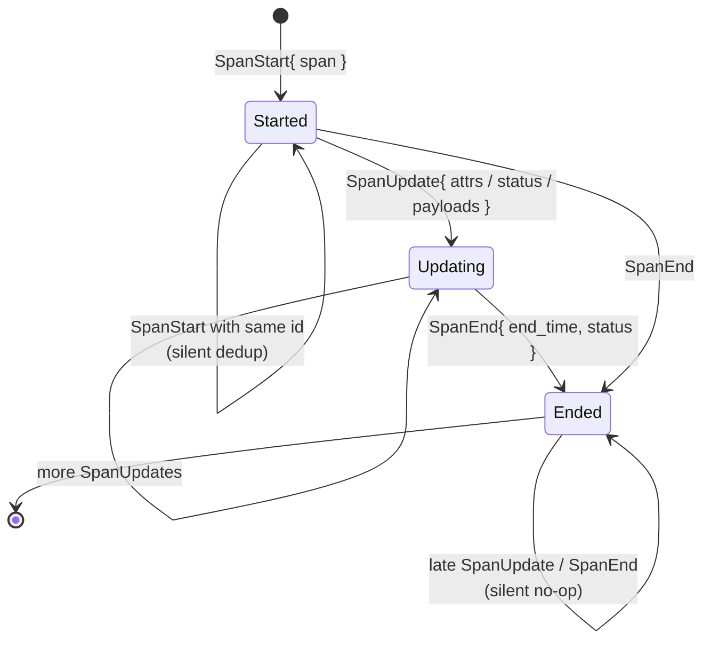
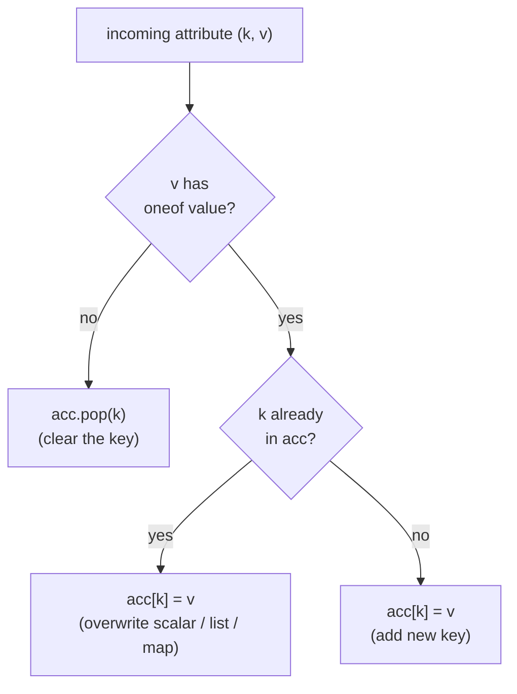
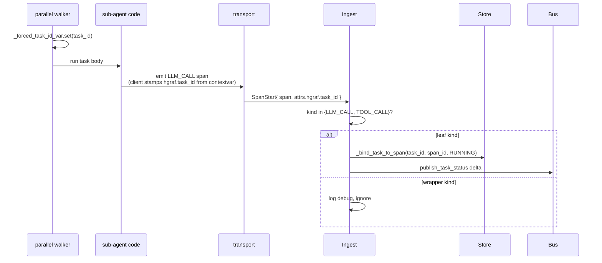
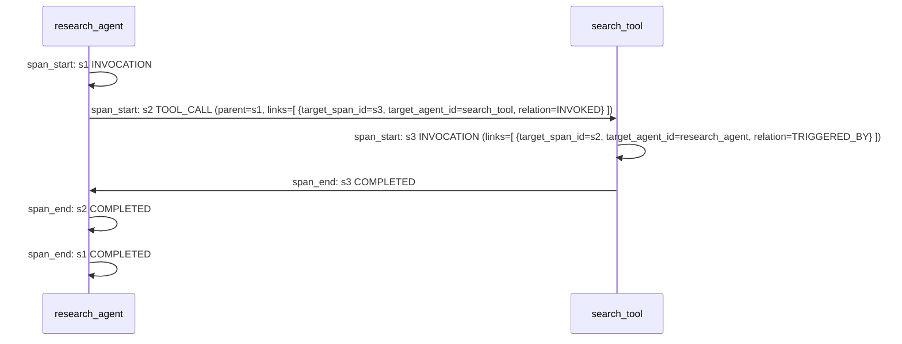

# Span lifecycle

Spans are the core primitive of harmonograf's timeline. Everything the
Gantt renders — every block, every arrow, every drawer payload — comes
from spans. This doc covers the three-message lifecycle, attribute
merging rules, the `hgraf.task_id` binding attribute, and the typed
links that cross agent boundaries.

See [`data-model.md#span`](data-model.md#span) for field-by-field
semantics of the `Span` message itself.

## The three messages

Spans are emitted in three lifecycle-phase messages, all carried on
`StreamTelemetry`:

```proto
message SpanStart  { Span span = 1; }
message SpanUpdate { string span_id = 1; map<string,AttributeValue> attributes = 2;
                     SpanStatus status = 3; repeated PayloadRef payload_refs = 4; }
message SpanEnd    { string span_id = 1; google.protobuf.Timestamp end_time = 2;
                     SpanStatus status = 3; ErrorInfo error = 4;
                     map<string,AttributeValue> attributes = 5;
                     repeated PayloadRef payload_refs = 6; }
```

A span's lifecycle as seen by the server — note that updates and ends after a terminal end are silent no-ops:



### `SpanStart`

Carries the full `Span` minus `end_time`. Invariants:

- `span.id` must be non-empty and globally unique. Recommended: UUIDv7
  so ids are sortable.
- `span.session_id` / `span.agent_id` may override the stream's Hello
  defaults. Ingest auto-registers unknown `(session_id, agent_id)`
  routes on first-sight.
- `span.start_time` should be set by the client. If omitted, ingest
  stamps server wall-clock.
- `span.status` is typically `RUNNING` on start; `PENDING` is also
  valid for pre-queued spans.
- Re-delivery of a known `span.id` is a **no-op** — fast local dedup
  lives in `StreamContext.seen_span_ids`, backed by the storage
  layer's id-uniqueness constraint. This is how the server survives
  client reconnect replay.

### `SpanUpdate`

Incremental updates to a live span.

- `attributes` is merged **additively** onto the stored span. A key
  already present is overwritten; a key not present is added.
- **Clearing an attribute**: send an `AttributeValue` **with no oneof
  set** under the key. The server drops that key from storage. This
  is the only way to delete.
- `status = SPAN_STATUS_UNSPECIFIED` → don't change status.
- `payload_refs` is additive on `role` — a new ref for the same role
  replaces the existing one; a new ref for a new role appends.
- Update for an unknown or already-ended `span_id` is a silent no-op.

### `SpanEnd`

Final state.

- `end_time` may be omitted; ingest stamps server wall-clock as
  fallback.
- `status` **should** be a terminal one (`COMPLETED`, `FAILED`,
  `CANCELLED`). `SPAN_STATUS_UNSPECIFIED` is treated as COMPLETED.
- Any `attributes` / `payload_refs` on `SpanEnd` are merged in with
  the same semantics as `SpanUpdate`. This lets the client attach a
  final LLM completion payload and the finish reason in one message.
- `error` should be populated iff `status == FAILED`.
- After `SpanEnd`, further `SpanUpdate` / `SpanEnd` for the same id
  are silent no-ops.

## Attribute merging

```
final_attributes = reduce(
    lambda acc, msg: merge(acc, msg.attributes),
    [span_start.span.attributes, span_update_1.attributes, ..., span_end.attributes],
    {},
)

def merge(acc, delta):
    for k, v in delta.items():
        if v.WhichOneof("value") is None:   # clear sentinel
            acc.pop(k, None)
        else:
            acc[k] = v
    return acc
```

The merge decision per incoming attribute key — the "no oneof set" sentinel is how clients delete an attribute:



Key namespacing:

- Framework-level attributes should use a dotted prefix (e.g.
  `adk.event_id`, `langgraph.node`). Harmonograf reserves the `hgraf.`
  prefix for its own purposes.
- **Reserved keys:**
  - `hgraf.task_id` — task binding (see next section)
  - `task_report` — proactive task-report string (broadcast as a
    `TaskReport` delta)
  - `drift_kind`, `drift_severity`, `drift_detail`, `error` — stamped
    on the active INVOCATION span by critical drifts
  - `finish_reason` — LLM finish reason, used to detect context
    pressure

## Task binding

Spans that execute a planned task carry an `hgraf.task_id` string
attribute whose value is the task's id. The server uses this to flip
task state as spans move through their lifecycle.

**Which span kinds bind?** Only **leaf execution spans**: `LLM_CALL`
and `TOOL_CALL`. Wrapper spans like `INVOCATION` and `TRANSFER` are
explicitly ignored even when stamped. Rationale:

> A single LLM_CALL or TOOL_CALL span ending does NOT mean "task
> complete" — it is one of N calls the agent makes while executing
> the task. Task completion is driven exclusively by explicit client
> `task_status_update` messages (emitted by the walker after the
> inner-agent generator fully exhausts).
>
> — `server/harmonograf_server/ingest.py :: _handle_span_end`

Binding logic in ingest:

```python
_TASK_BINDING_SPAN_KINDS = frozenset({SpanKind.LLM_CALL, SpanKind.TOOL_CALL})

# on SpanStart:
if task_id and span.kind in _TASK_BINDING_SPAN_KINDS:
    await self._bind_task_to_span(session_id, task_id, span_id, TaskStatus.RUNNING)

# on SpanEnd:
if task_id and ended.kind in _TASK_BINDING_SPAN_KINDS:
    task_status = _span_status_to_task_status(ended.status)
    if task_status in (TaskStatus.FAILED, TaskStatus.CANCELLED):
        await self._bind_task_to_span(ended.session_id, task_id, ended.id, task_status)
    # note: COMPLETED span ends do NOT flip the task — that's driven by
    # explicit reporting tools or TelemetryUp.task_status_update
```

`_bind_task_to_span` is monotonic — once a task is terminal, further
binds are rejected (via the same `_set_task_status` guard used on the
client).

How a leaf span carrying `hgraf.task_id` flips its planned task to RUNNING — wrapper spans (INVOCATION/TRANSFER) never bind:



### How the `hgraf.task_id` gets onto the span

The client adapter stamps it automatically using a
`contextvars.ContextVar[str]` called `_forced_task_id_var`. The
parallel-mode walker sets the var per task before running a sub-agent;
the span emission code reads the var and stamps every leaf span. This
means agents themselves don't need to know about task ids — the
walker's context propagates transparently.

## Cross-span links

Span edges fall into two categories:

- **Intra-agent parent/child** — expressed via `span.parent_span_id`.
  Cheap, implicit, and renders as nested rectangles inside an agent
  row.
- **Cross-span links** — expressed via `span.links[]`. Typed and
  directional; may cross agent boundaries.

```proto
message SpanLink {
  string target_span_id = 1;
  string target_agent_id = 2;   // optional; empty = intra-agent
  LinkRelation relation = 3;
}
```

| `LinkRelation` | Direction | Meaning |
|---|---|---|
| `INVOKED` | caller → callee | "I kicked off the target span" |
| `WAITING_ON` | waiter → blocker | "I'm blocked until the target completes" |
| `TRIGGERED_BY` | callee → caller | Inverse of INVOKED, useful when you don't have the caller id yet |
| `FOLLOWS` | successor → predecessor | Sequential dependency across agents |
| `REPLACES` | new → old | "This span supersedes the target" (e.g. after a REWIND) |

Links become **rendered arrows** on the Gantt. The frontend treats
`INVOKED` + `TRIGGERED_BY` and `WAITING_ON` + `FOLLOWS` as the two
primary edge types, with `REPLACES` drawn with a different marker to
indicate supersession.

### Example — a cross-agent tool call



## Emission ordering

The client library buffers spans in emission order and sends on a
single stream. The server is not required to preserve that order on
the output side — `WatchSession` subscribers may see spans in any
order — but within a single stream, the ordering guarantees are:

- `SpanStart` for a given id is delivered **before** any `SpanUpdate`
  / `SpanEnd` for that id.
- For two spans `A` and `B` where `A` is `B`'s `parent_span_id`,
  `SpanStart(A)` is delivered before `SpanStart(B)`.
- Payload chunks for a given digest are delivered in order; chunks
  for different digests may interleave freely.

See [`wire-ordering.md`](wire-ordering.md) for the full happens-before
argument.

## Failure modes

| Situation | Outcome |
|---|---|
| `SpanStart` with empty `span.id` | `ValueError` raised at ingest; the stream is aborted |
| `SpanStart` for an id already seen on this stream | Silent dedup (no-op) |
| `SpanUpdate` for an unknown `span_id` | Silent no-op |
| `SpanEnd` for an unknown `span_id` | Silent no-op |
| `SpanStart` with `kind = CUSTOM` but empty `kind_string` | Accepted; frontend renders as "custom" |
| `SpanStart` with `kind != CUSTOM` but non-empty `kind_string` | Accepted; `kind_string` is stored as-is but not rendered |
| Attribute with an unknown type oneof | Typically means "clear this key" |
| Stamped `hgraf.task_id` on an `INVOCATION` span | Logged at debug, ignored for binding |
