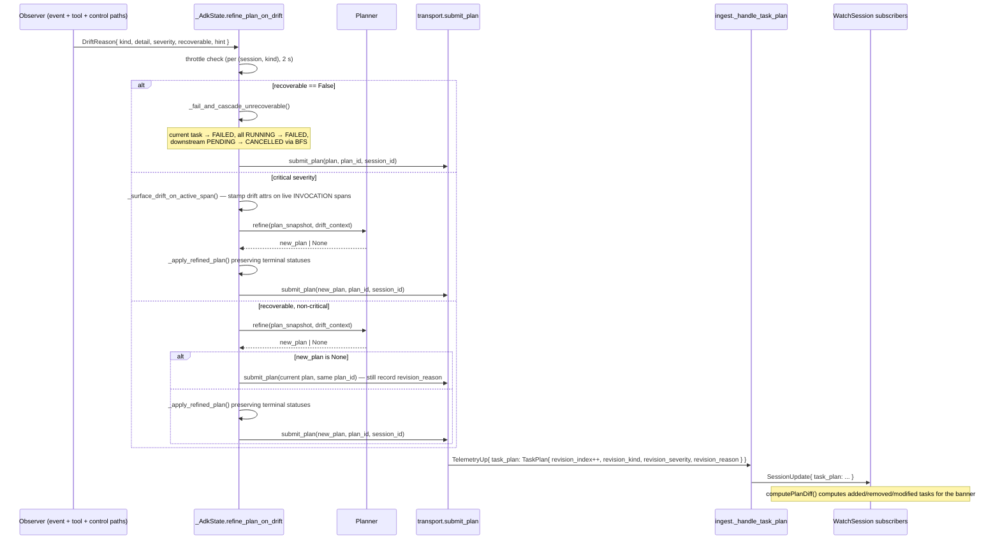

# Task state machine and plan-execution protocol

Harmonograf tracks task progression via **three coordinated channels**,
not via span-lifecycle inference. Spans remain telemetry-only; task
state is driven by explicit signals.

The three channels are:

1. **`session.state`** — ADK's shared mutable dict. Orchestrator writes
   task context; agents read it and write back progress / outcomes.
2. **Reporting tools** — seven `report_*` function tools injected into
   every sub-agent. Agents call them; harmonograf intercepts in
   `before_tool_callback` and applies state transitions.
3. **ADK callback inspection** — `after_model_callback` and
   `on_event_callback` parse response content and events for
   structured signals (function_calls, "Task complete:" markers,
   `state_delta`). Belt-and-suspenders for models that narrate in prose
   instead of calling tools.

The state machine is **monotonic**, walker-owned in parallel mode, and
callback-driven in sequential / delegated modes.

Ground-truth modules:

- [`client/harmonograf_client/adk.py`](../../client/harmonograf_client/adk.py) — `_AdkState`, `_set_task_status`, `detect_drift`, `refine_plan_on_drift`, the drift taxonomy constants.
- [`client/harmonograf_client/state_protocol.py`](../../client/harmonograf_client/state_protocol.py) — all `harmonograf.*` session.state keys + typed readers/writers.
- [`client/harmonograf_client/tools.py`](../../client/harmonograf_client/tools.py) — reporting tool catalogue + sub-agent instruction appendix.
- [`client/harmonograf_client/invariants.py`](../../client/harmonograf_client/invariants.py) — aggregate-state consistency checker.

## `session.state` schema

All keys live under the `harmonograf.` prefix. Any non-harmonograf key
is ignored by this module.

### Harmonograf → Agents (written in `before_model_callback`)

| Key | Type | Meaning |
|---|---|---|
| `harmonograf.current_task_id` | `str` | Active task id. Empty when no task is active. |
| `harmonograf.current_task_title` | `str` | Human-readable title for the active task. |
| `harmonograf.current_task_description` | `str` | Full description. |
| `harmonograf.current_task_assignee` | `str` | Name of the sub-agent the task is assigned to. |
| `harmonograf.plan_id` | `str` | Id of the current plan. |
| `harmonograf.plan_summary` | `str` | Planner's short goal summary. |
| `harmonograf.available_tasks` | `list[dict]` | Each `{id, title, assignee, status, deps}`. |
| `harmonograf.completed_task_results` | `dict[str,str]` | `task_id → summary` from every completed task. |
| `harmonograf.tools_available` | `list[str]` | Reporting tool names wired up for this agent. |

### Agents → Harmonograf (written via `state_delta` or reporting tools)

| Key | Type | Meaning |
|---|---|---|
| `harmonograf.task_progress` | `dict[str,float]` | `task_id → 0.0–1.0` progress hint. Non-monotonic; last-write-wins. |
| `harmonograf.task_outcome` | `dict[str,str]` | `task_id → summary` for terminal outcomes. Written by the reporting-tool interception path. |
| `harmonograf.agent_note` | `str` | Free-form latest note (approach, blocker, reasoning). Surfaced in the Drawer. |
| `harmonograf.divergence_flag` | `bool` | Agent sets True to declare the plan stale; paired with a `report_plan_divergence` call. |

`state_protocol.extract_agent_writes(before, after)` diffs two state
snapshots and returns only the `harmonograf.*` keys the agent added,
changed, or removed. Used by `on_event_callback` and
`after_model_callback` after each turn.

## Reporting tools contract

From [`client/harmonograf_client/tools.py`](../../client/harmonograf_client/tools.py):

| Tool | Purpose | State transition | Drift kind on interception |
|---|---|---|---|
| `report_task_started(task_id, detail)` | Begin work on a planned task | PENDING → RUNNING | — |
| `report_task_progress(task_id, fraction, detail)` | Mid-task ping (optional) | none | — |
| `report_task_completed(task_id, summary, artifacts)` | Terminal success | RUNNING → COMPLETED | — |
| `report_task_failed(task_id, reason, recoverable)` | Terminal failure | RUNNING → FAILED | `task_failed_by_agent` (recoverable=True) or unrecoverable cascade (recoverable=False) |
| `report_task_blocked(task_id, blocker, needed)` | External blocker | stays RUNNING | `task_blocked` |
| `report_new_work_discovered(parent_task_id, title, description, assignee)` | Add a child task | none | `new_work_discovered` |
| `report_plan_divergence(note, suggested_action)` | Plan is stale | sets `harmonograf.divergence_flag=True` | `plan_divergence` |

Every tool returns `{"acknowledged": True}` synchronously; the real
side-effect runs in harmonograf's `before_tool_callback` interception,
which updates `_AdkState` and `session.state` **atomically** before the
tool body executes.

Agents see the instruction appendix from
`tools.SUB_AGENT_INSTRUCTION_APPENDIX`, idempotently prepended by
`augment_instruction`:

```
When you are working on a planned task:
- Call `report_task_started(task_id)` before beginning work
- Call `report_task_completed(task_id, summary=...)` after finishing
- If you discover additional work, call `report_new_work_discovered(...)`
- If you fail, call `report_task_failed(task_id, reason=...)`
- If you are stuck on an external blocker, call `report_task_blocked(task_id, blocker=...)`
- The task_id will be provided in the session state under `harmonograf.current_task_id`.
```

## Orchestration modes

`HarmonografAgent` has three modes, selected by two booleans:

| Mode | `orchestrator_mode` | `parallel_mode` | Who drives the state machine |
|---|---|---|---|
| **Sequential** (default) | `True` | `False` | The coordinator LLM executes the full plan as one user turn; reporting tools drive per-task transitions. |
| **Parallel** | `True` | `True` | A rigid DAG batch walker in `_run_orchestrated_parallel` runs sub-agents directly per task using a forced `task_id` context var, respecting plan edges as dependencies. |
| **Delegated** | `False` | — | A single delegation into the inner agent; the event observer scans the output for drift afterward. The inner agent is in charge of its own task sequencing. |

The **forced task id** is a `contextvars.ContextVar[str]`
(`_forced_task_id_var`). In parallel mode the walker sets it per task
so that all spans emitted inside that asyncio task inherit the
`hgraf.task_id` stamp automatically. This is the mechanism that binds
spans to tasks without agents having to know about task ids.

## State machine

### Allowed transitions

```
                 +---------------+
                 |   PENDING     |
                 +-------+-------+
                         |
                         | report_task_started
                         v
                 +---------------+
                 |   RUNNING     |
                 +--+---+---+----+
                    |   |   |
          completed |   |   | failed / blocked→fail
                    v   v   v
       +-----------+ +------------+ +-----------+
       | COMPLETED | |   FAILED   | | CANCELLED |
       +-----------+ +------------+ +-----------+
             (absorbing)     (absorbing)     (absorbing)

 Also legal:
   PENDING → CANCELLED (cascade from upstream unrecoverable drift)
   PENDING → FAILED    (cascade when the forced-task stamp path can't bind)
```

Terminal states are **absorbing** — any attempt to transition out of
one is rejected by `_set_task_status` and logged at WARNING. The
invariant validator enforces the same rule at aggregate level:

```python
_ALLOWED_TRANSITIONS = {
    "PENDING":   frozenset({"PENDING", "RUNNING", "CANCELLED", "FAILED"}),
    "RUNNING":   frozenset({"RUNNING", "COMPLETED", "FAILED", "CANCELLED"}),
    "COMPLETED": frozenset({"COMPLETED"}),
    "FAILED":    frozenset({"FAILED"}),
    "CANCELLED": frozenset({"CANCELLED"}),
}
```

### Monotonicity guard

Every code path that writes `task.status` **must** go through
`_set_task_status(task, new_status)` in
[`adk.py`](../../client/harmonograf_client/adk.py):

- Same status → no-op, returns True.
- Terminal → anything → REJECTED with a WARNING log, returns False.
- Otherwise → writes, bumps the optional `_TRANSITION_COUNTER` dict,
  returns True.

This makes the historic "COMPLETED → RUNNING" cycle bug structurally
impossible.

### Span → task binding

Spans carry an `hgraf.task_id` attribute (see
[`span-lifecycle.md#task-binding`](span-lifecycle.md#task-binding)).
Only **leaf execution spans** bind: `LLM_CALL` and `TOOL_CALL`.
Wrapper spans (`INVOCATION`, `TRANSFER`) are explicitly ignored —
their lifecycles don't correspond to task execution and letting them
bind would flip tasks COMPLETED the moment the outer agent ended its
turn.

On span start with a valid `hgraf.task_id` and leaf kind:

```
ingest._handle_span_start
  └─ _bind_task_to_span(session_id, task_id, span_id, TaskStatus.RUNNING)
```

On span end with terminal FAILED / CANCELLED:

```
ingest._handle_span_end
  └─ _bind_task_to_span(session_id, task_id, span_id, FAILED/CANCELLED)
```

Plain COMPLETED span ends **do not** flip the task — that's done
exclusively by the explicit `report_task_completed` interception or by
a `TelemetryUp.task_status_update`. See the comment block in
`ingest._handle_span_end` for the rationale.

## Drift taxonomy

The drift pipeline turns "something unexpected happened" into "please
refine the plan (or fail it)." Drifts are produced by three sources:

- `detect_drift(events, current_task, plan_state)` — structural scan
  of ADK events after each turn.
- `detect_semantic_drift(task, result_summary, events)` — textual
  heuristics on task OUTPUTS (task-level, not structural).
- Direct calls from the reporting-tool interception, the control
  router (STEER / CANCEL), and `apply_drift_from_control`.

### Catalogue

Severity legend: `info` (debug log), `warning` (info log + UI
surfacing), `critical` (warning log + error attribute stamped on the
active INVOCATION span). Recoverable `True` means the plan can route
around the drift; `False` means the current task is flipped FAILED and
downstream PENDING tasks cascade to CANCELLED without calling the
planner.

| # | Kind | Severity | Recoverable | Producer | Triggering condition |
|---|---|---|---|---|---|
| 1 | `tool_call_wrong_agent` | info | yes | `detect_drift` | A function_call event came from an agent that isn't the assignee of the current task (orch) or any eligible PENDING task (delegated). |
| 2 | `transfer_to_unplanned_agent` | info | yes | `detect_drift` | An `actions.transfer_to_agent` targets an agent not assigned any task in the plan. |
| 3 | `failed_span` | info | yes | `detect_drift` | Event status FAILED on a span bound to a RUNNING task. |
| 4 | `task_completion_out_of_order` | info | yes | `detect_drift` | A COMPLETED event on a task whose deps aren't all COMPLETED. |
| 5 | `context_pressure` | warning | yes | `detect_drift` | `finish_reason ∈ {MAX_TOKENS, LENGTH, MAX_OUTPUT_TOKENS, TRUNCATED, CONTENT_FILTER}`. |
| 6 | `llm_refused` | warning | yes | `detect_drift` + `detect_semantic_drift` | Response text matches a refusal marker (`"i cannot"`, `"i won't"`, etc.). |
| 7 | `llm_merged_tasks` | info | yes | `detect_drift` + `detect_semantic_drift` | Response text matches a merge marker (`"merging tasks"`, `"consolidating task"`, etc.). |
| 8 | `llm_split_task` | info | yes | `detect_drift` | Response text matches a split marker (`"splitting task"`, `"decompose"`, etc.). |
| 9 | `llm_reordered_work` | info | yes | `detect_drift` | Response text matches a reorder marker (`"out of order"`, `"doing this first"`, etc.). |
| 10 | `multiple_stamp_mismatches` | warning | yes | `detect_drift` | Stateful counter ≥ `_STAMP_MISMATCH_THRESHOLD (=3)` — forced-task-id path has rejected three re-binds on terminal tasks. |
| 11 | `user_steer` | info | yes | control handler (`CONTROL_KIND_STEER`) | User sent a STEER event; the body becomes a hint for refine. |
| 12 | `user_cancel` | critical | **no** | control handler (`CONTROL_KIND_CANCEL`) | User cancelled. Unrecoverable — cascades to FAILED/CANCELLED without calling refine. |
| 13 | `tool_error` | warning | yes | `after_tool_callback` | A tool call raised or returned an error result. |
| 14 | `tool_returned_error` | warning | yes | tool scanner | Tool output looks like an error ("error:", "traceback", "failed to"). |
| 15 | `tool_unexpected_result` | info | yes | tool scanner | Tool returned something shape-unexpected (missing required key, wrong type). |
| 16 | `agent_escalated` | warning | yes | event observer | ADK `actions.escalate = True` — sub-agent asked to escalate. |
| 17 | `agent_reported_divergence` | warning | yes | reporting tool interception | Agent called `report_plan_divergence`. |
| 18 | `unexpected_transfer` | warning | yes | event observer | Transfer to an agent that isn't in the plan's expected next step. |
| 19 | `external_signal` | info | yes | (reserved) | Hook for out-of-band drift injection. |
| 20 | `coordinator_early_stop` | warning | yes | sequential walker | Coordinator closed its turn while PENDING tasks remain — the classifier only scans RUNNING tasks and can't catch this in the normal path. |
| 21 | `task_failed` | warning | yes | `detect_semantic_drift` | Task result contains error markers, or an event has FAILED status / an `error` attr. |
| 22 | `task_failed_by_agent` | warning | varies | `report_task_failed` interception | Driven by the `recoverable` arg of the reporting tool call. |
| 23 | `task_blocked` | info | yes | `report_task_blocked` interception | External blocker reported. |
| 24 | `task_empty_result` | info | yes | `detect_semantic_drift` | Result summary < 20 chars after strip. |
| 25 | `task_result_new_work` | info | yes | `detect_semantic_drift` | Result mentions "need to", "requires", "blocked by", "should also", "further investigation". |
| 26 | `task_result_contradicts_plan` | info | yes | `detect_semantic_drift` | Result mentions "was wrong", "incorrect", "mistake", "contradicts", "reconsider". |
| 27 | `new_work_discovered` | info | yes | `report_new_work_discovered` interception | Agent discovered a child task. |
| 28 | `plan_divergence` | warning | yes | `report_plan_divergence` interception | Agent declared the plan stale. |
| 29 | `upstream_failed` | warning | yes | walker cascade | A task's upstream dep is FAILED — the task can't run. |

(The "~26 kinds" in the task description is the rounded-up count; the
exact total drifts over time as new detectors land. Treat the table as
a living catalogue — new kinds should be appended with severity and
recoverability explicit.)

Markers are matched case-insensitively against response text parts
(refusal / merge / split / reorder). Full marker lists live in
`adk.py` as `_LLM_REFUSAL_MARKERS`, `_LLM_MERGE_MARKERS`,
`_LLM_SPLIT_MARKERS`, `_LLM_REORDER_MARKERS`.

### Refine pipeline



Throttling rule (`_DRIFT_REFINE_THROTTLE_SECONDS = 2.0`):

- Recoverable, non-critical drifts are throttled per `(session_id,
  kind)`. Repeats within the window collapse to one refine.
- Critical drifts and unrecoverable drifts **bypass** the throttle.

Terminal-status preservation in `_apply_refined_plan`:

- If an incoming task has the same id as one already in the plan and
  the existing task is in a terminal state (`COMPLETED` / `FAILED` /
  `CANCELLED`), the existing terminal status is preserved — the
  planner's view of the task's final state is not authoritative over
  the client's ground truth.
- Otherwise, the incoming `status` wins.

Revision bookkeeping on every fire (recoverable or not):

- `plan_state.revisions.append({revised_at, kind, detail, severity,
  reason, drift_kind})`
- `plan.revision_reason = f"{kind}: {detail[:200]}"`
- `plan.revision_kind = kind`
- `plan.revision_severity = severity`
- `plan.revision_index += 1`

## Invariant validator

[`invariants.py`](../../client/harmonograf_client/invariants.py) runs
after each walker turn. It's a read-only aggregate-state checker —
individual writes are already guarded by `_set_task_status`; this
catches compounding bugs that slip past per-write guards.

Checks, in order:

| Rule | Severity | Catches |
|---|---|---|
| `monotonic_state` | error | Illegal transitions that a caller snuck in by mutating `task.status` directly. Tracks `(session, task) → last_seen_status` across calls. |
| `dependency_consistency` | error | Edges referring to non-existent tasks; a COMPLETED task with an incomplete dep. |
| `assignee_validity` | warning | Task assigned to an agent not in `plan_state.available_agents`. |
| `plan_id_uniqueness` | error | Two different plan_ids active under the same hsession. |
| `forced_task` | warning | `_forced_current_task_id` points at a missing / terminal task. |
| `task_results_keys` | warning | `harmonograf.completed_task_results` has keys not in the plan. |
| `revision_history_monotone` | warning | `plan.revision_index` went backwards. |
| `span_bindings` | warning | `task.bound_span_id` references a span that never existed. |

Errors fail pytest assertions; warnings log loudly but do not stop the
run. Use `InvariantChecker()` directly for cross-turn history tracking
in tests; `check_plan_state(state, hsession)` uses a module-level
default.
