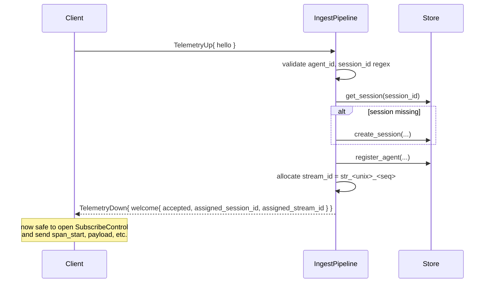
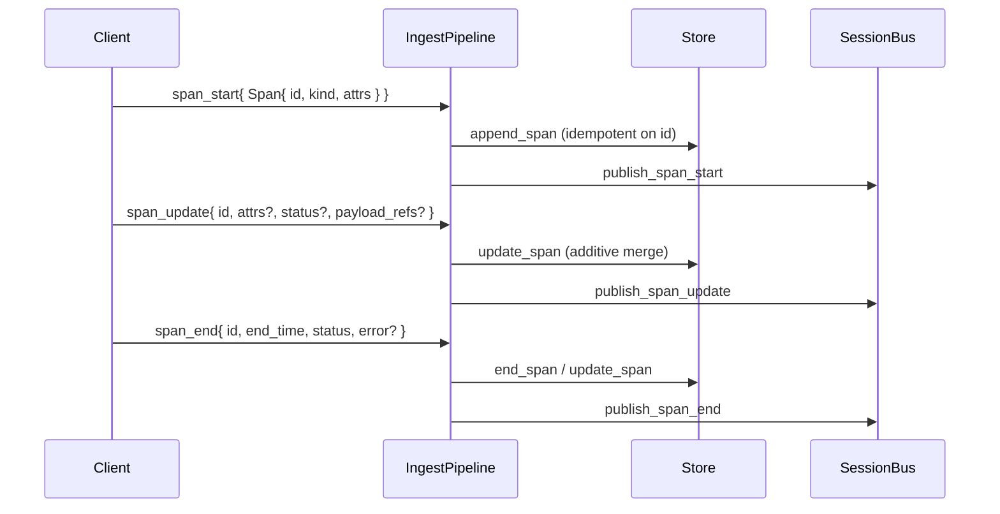
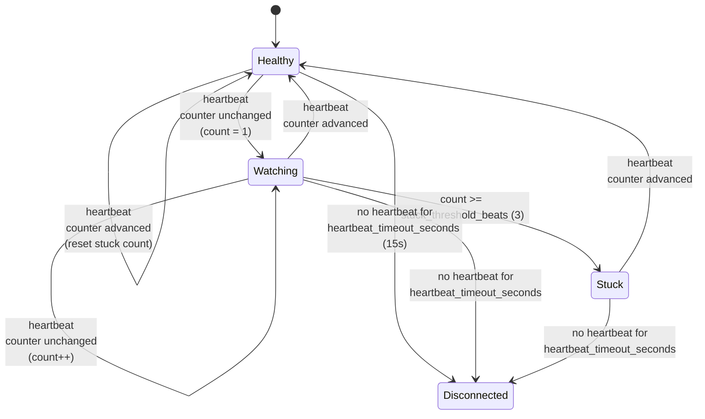
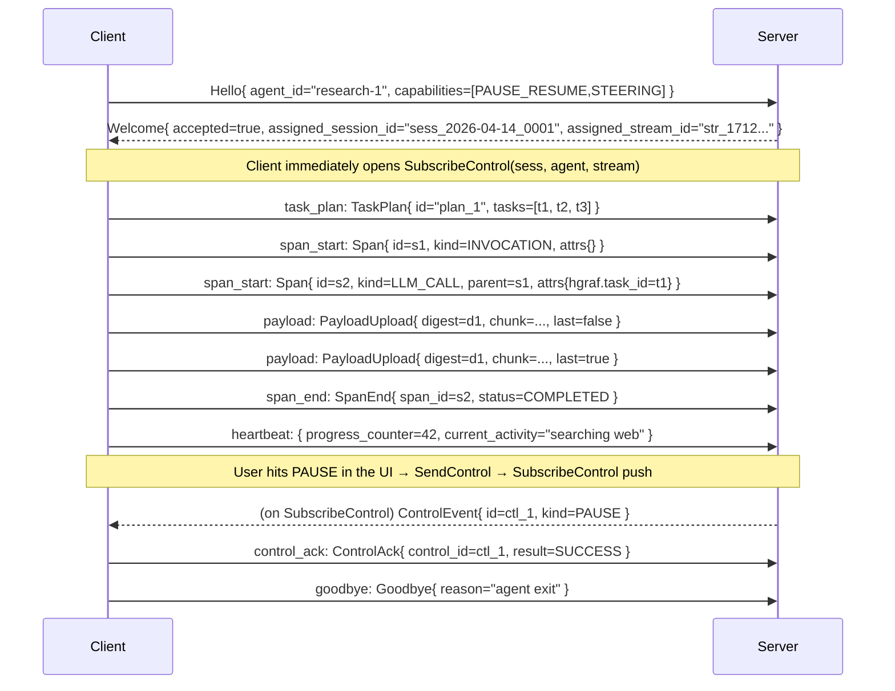

# `StreamTelemetry` reference

```proto
rpc StreamTelemetry(stream TelemetryUp) returns (stream TelemetryDown);
```

`StreamTelemetry` is the high-volume bidirectional stream from an agent
process to the server. Every agent-originated event — spans, payloads,
heartbeats, task plans, control acks, goodbye — rides it. The downstream
is deliberately thin: it carries only the handshake (`Welcome`), server
demands for missing payloads (`PayloadRequest`), flow-control hints, and
`ServerGoodbye`. Control events (PAUSE, STEER, etc.) do **not** come
down this stream; see [`control-stream.md`](control-stream.md).

## Contract summary

| Aspect | Value |
|---|---|
| Direction | Bidirectional streaming |
| First message (client) | `TelemetryUp{ hello: Hello }` — always |
| First message (server) | `TelemetryDown{ welcome: Welcome }` — in response to `Hello` |
| Lifetime | Until client closes (usually after a `Goodbye`), client crashes, or server closes with `ServerGoodbye` |
| Idempotency | Span ids are UUIDv7; the server dedups by id on re-delivery (see [`wire-ordering.md`](wire-ordering.md#duplicate-span-dedup)) |
| Backpressure | gRPC flow control on `TelemetryUp`. Client-side buffer/eviction is in `harmonograf_client.buffer` |

## Upstream — `TelemetryUp`

From [`telemetry.proto`](../../proto/harmonograf/v1/telemetry.proto):

```proto
message TelemetryUp {
  // Reserved: were TaskPlan task_plan = 9 / UpdatedTaskStatus
  // task_status_update = 10 before the goldfive migration (issue #2).
  // Plan + task state now ride inside goldfive_event.
  reserved 9, 10;
  oneof msg {
    Hello hello = 1;
    SpanStart span_start = 2;
    SpanUpdate span_update = 3;
    SpanEnd span_end = 4;
    PayloadUpload payload = 5;
    Heartbeat heartbeat = 6;
    goldfive.v1.ControlAck control_ack = 7;
    Goodbye goodbye = 8;
    goldfive.v1.Event goldfive_event = 11;
  }
}
```

Every `TelemetryUp` carries exactly one oneof variant.

> **Wire type ownership.** `control_ack` carries `goldfive.v1.ControlAck`
> (not a harmonograf type — see
> [`control-stream.md`](control-stream.md)). Fields 9 / 10 are
> **reserved** — they were `TaskPlan` / `UpdatedTaskStatus` before
> the goldfive migration; plan / task state now rides inside
> `goldfive_event = 11`.

### `Hello` (oneof tag 1)

First message on every telemetry stream. Exactly one `Hello` per stream.
A second `Hello` is rejected by ingest (`ingest.handle_message` raises
`ValueError`).

**Lazy Hello** (harmonograf #83 / #85): the reference client transport
defers sending `Hello` until the first real `TelemetryUp` is queued.
The `session_id` stamped on Hello is derived from the first envelope
(so the home session stamps with the correct id from the start). This
eliminates ghost `sess_*` rows that used to appear for processes that
opened a Client but never emitted. See
[ADR 0022](../adr/0022-lazy-hello.md). New clients implementing the
wire do not have to defer Hello, but doing so gives them the same
ghost-session guarantee for free.

```proto
message Hello {
  string agent_id = 1;
  string session_id = 2;
  string name = 3;
  Framework framework = 4;
  string framework_version = 5;
  repeated Capability capabilities = 6;
  map<string, string> metadata = 7;
  string resume_token = 8;
  string session_title = 9;
}
```

| Field | Required | Meaning |
|---|---|---|
| `agent_id` | yes | Client-chosen, persisted to disk. Multiple concurrent streams may share an agent_id. Must be non-empty — `handle_hello` raises otherwise. |
| `session_id` | no | Client-supplied session id. If empty, server auto-generates `sess_YYYY-MM-DD_NNNN` (per-day counter). If supplied and unknown, server **creates it on the fly** (resolved decision A). Regex: `^[a-zA-Z0-9_-]{1,128}$`. |
| `name` | no | Human-readable display name. Defaults to `agent_id` when empty. |
| `framework` | no | `FRAMEWORK_ADK`, `FRAMEWORK_CUSTOM`, or `FRAMEWORK_UNSPECIFIED`. |
| `framework_version` | no | Free-form version string. |
| `capabilities` | no | Agent advertises what control kinds it will honor (see [`control-stream.md`](control-stream.md#capability-negotiation)). |
| `metadata` | no | Free-form key/value. Propagated to `Agent.metadata` and echoed to the frontend. |
| `resume_token` | no | Last span_id the server confirmed before disconnect. Hint for future replay-from logic. v0 server does not currently replay. |
| `session_title` | no | Title to stamp on the session **if this Hello is what creates it**. Ignored when joining an existing session. |

The Hello/Welcome handshake — note that the client must not send any other `TelemetryUp` until `Welcome` returns:



### `SpanStart` (oneof tag 2)

Full span minus `end_time`. See [`span-lifecycle.md`](span-lifecycle.md)
for the complete span model and merging rules.

```proto
message SpanStart {
  Span span = 1;
}
```

### `SpanUpdate` (oneof tag 3)

Incremental updates to a live span. Keys not present in `attributes`
are unchanged. To clear an attribute key, send an `AttributeValue` with
no oneof set.

```proto
message SpanUpdate {
  string span_id = 1;
  map<string, AttributeValue> attributes = 2;
  SpanStatus status = 3;
  repeated PayloadRef payload_refs = 4;
}
```

- `status = SPAN_STATUS_UNSPECIFIED` means "don't change status".
- `payload_refs` is additive — the server merges by role onto the span.
- Update for an unknown `span_id` is a no-op (see `store.update_span`).

### `SpanEnd` (oneof tag 4)

Final state for a span. After `SpanEnd`, further updates for the same
`span_id` are no-ops.

```proto
message SpanEnd {
  string span_id = 1;
  google.protobuf.Timestamp end_time = 2;
  SpanStatus status = 3;
  ErrorInfo error = 4;
  map<string, AttributeValue> attributes = 5;
  repeated PayloadRef payload_refs = 6;
}
```

`end_time` is optional; when absent, ingest stamps server wall-clock.

A typical span travels upstream as three messages — start, optional updates, then end. The server merges them into one row in the store:



### `PayloadUpload` (oneof tag 5)

Chunked out-of-band payload upload. See
[`payload-flow.md`](payload-flow.md) for the full chunking / eviction /
digest verification story.

```proto
message PayloadUpload {
  string digest = 1;        // sha256 hex
  int64 total_size = 2;
  string mime = 3;
  bytes chunk = 4;
  bool last = 5;
  bool evicted = 6;
}
```

- Chunks for distinct digests may interleave freely.
- Chunk size ≤ 256 KiB (recommended; server accepts larger).
- Hard ceiling: **64 MiB per digest** by default
  (`ServerConfig.payload_max_bytes`, CLI `--payload-max-bytes`).
  Exceeding it aborts the assembler with `ValueError`.
- On `last=true`, server recomputes sha256 over the reassembled bytes
  and **rejects the whole payload on mismatch** (`_handle_payload`
  raises). No partial persistence.
- `evicted=true` on `last` means "I gave up; record the digest as
  permanently unavailable." No `chunk` required.

### `Heartbeat` (oneof tag 6)

Periodic liveness + health report. Default cadence is 5s; the server
declares the stream dead after `ServerConfig.heartbeat_timeout_seconds`
(default 15s, CLI `--heartbeat-timeout-seconds`) of silence and closes
it.

```proto
message Heartbeat {
  int64 buffered_events = 1;
  int64 dropped_events = 2;
  int64 dropped_spans_critical = 3;
  int64 buffered_payload_bytes = 4;
  int64 payloads_evicted = 5;
  double cpu_self_pct = 6;
  google.protobuf.Timestamp client_time = 7;
  int64 progress_counter = 8;
  string current_activity = 9;
  int64 context_window_tokens = 10;
  int64 context_window_limit_tokens = 11;
}
```

Server behaviour:

- `last_heartbeat` updated on the agent row.
- **Stuckness detection:** `progress_counter` must advance across
  heartbeats. If the same counter is seen for
  `ServerConfig.stuck_threshold_beats` (default 3, ≈15 s) consecutive
  heartbeats **while an INVOCATION span is RUNNING**, the server
  flips `is_stuck` true and publishes an `AgentStatusChanged` delta.
- `current_activity` is echoed into `AgentStatusChanged.current_activity`
  so the UI updates without waiting for a span update.
- `context_window_tokens` / `context_window_limit_tokens = 0` is treated
  as "not populated" — ingest **drops zero-valued samples** rather than
  writing them. Non-zero samples are persisted and fan out as
  `ContextWindowSample` deltas on `WatchSession`.

Heartbeat handling and the stuck-detection state machine —
`progress_counter` must change between beats or the server escalates
after `stuck_threshold_beats` consecutive identical values:



### `ControlAck` (oneof tag 7)

Response to a `ControlEvent` that the server delivered on
`SubscribeControl`. **This is the canonical reason telemetry is
bidirectional despite being called "telemetry": ack colocation buys
happens-before.**

```proto
message ControlAck {
  string control_id = 1;
  ControlAckResult result = 2;
  string detail = 3;
  google.protobuf.Timestamp acked_at = 4;
}

enum ControlAckResult {
  CONTROL_ACK_RESULT_UNSPECIFIED = 0;
  CONTROL_ACK_RESULT_SUCCESS     = 1;
  CONTROL_ACK_RESULT_FAILURE     = 2;
  CONTROL_ACK_RESULT_UNSUPPORTED = 3;
}
```

- `control_id` must echo the `id` of the `ControlEvent` this is
  responding to.
- `FAILURE` means "I understood the kind but couldn't do it" (e.g.
  rewind target missing). `UNSUPPORTED` means "I advertised a
  `Capability` but can't honor this specific call" — rare; prefer
  `FAILURE`.
- For `CONTROL_KIND_STATUS_QUERY`, the agent's plain-text description
  of its current activity goes in `detail`. The server forwards that
  detail to every `WatchSession` subscriber as a `TaskReport` delta.
- `detail` is otherwise free-form, ≤ a few hundred bytes recommended.

See [`control-stream.md`](control-stream.md#the-ack-path) for the full
round-trip.

### `Goodbye` (oneof tag 8)

Graceful client shutdown.

```proto
message Goodbye { string reason = 1; }
```

Server behaviour (`_handle_goodbye` → `close_stream`): removes the
stream from the registry. If the agent had no other live streams, the
agent row flips to `AGENT_STATUS_DISCONNECTED`. Client should close the
RPC after sending `Goodbye`.

Goodbye handling and the resume-on-reconnect path — note that the agent row only flips to DISCONNECTED when the *last* live stream for that agent_id closes:

```mermaid
sequenceDiagram
    participant C as Client (old stream)
    participant I as IngestPipeline
    participant C2 as Client (reconnect)
    C->>I: goodbye{ reason }
    I->>I: close_stream(ctx)
    alt no other streams for agent_id
        I->>I: agent → DISCONNECTED, publish AgentStatusChanged
    else other streams remain
        I->>I: keep agent CONNECTED
    end
    Note over C2: process restarts; reuses agent_id<br/>persists last seen span_id
    C2->>I: hello{ agent_id, resume_token=last_span_id }
    I-->>C2: welcome{ assigned_stream_id }
    Note over I,C2: v0 server ignores resume_token; client<br/>resends any unconfirmed spans (dedup by id)
```

### `goldfive_event` (oneof tag 11)

Goldfive orchestration event envelope. Carries a
`goldfive.v1.Event` with a typed `payload` oneof:

| Payload | Meaning |
|---|---|
| `run_started` / `run_completed` / `run_aborted` | Run lifecycle |
| `goal_derived` | Goal list and success predicates |
| `plan_submitted` / `plan_revised` | Task plan (first submission or refine) |
| `task_started` / `task_progress` / `task_completed` / `task_failed` / `task_blocked` / `task_cancelled` | Task lifecycle |
| `drift_detected` | Observer-detected drift (plan divergence, loop, refusal, user_steer, user_cancel, etc.) |
| `conversation_started` / `conversation_ended` | Cross-turn chat context |
| `approval_requested` / `approval_granted` / `approval_rejected` | HITL approval flow |
| `agent_invocation_started` / `agent_invocation_completed` | Per-agent invocation boundaries |
| `delegation_observed` | `AgentTool(sub_agent)` call surfaces as a cross-agent edge |

**Per-event session routing** (goldfive #155 / PR #157):
`Event.session_id` (field 5) is stamped by the Runner / Steerer /
Executors on every event so one transport stream can multiplex events
across sessions (e.g. ADK's `AgentTool` mints sub-Runner sessions
inside a single adk-web run). Ingest routes on this field, falling
back to the stream's Hello session when empty. See
[`../design/14-information-flow.md`](../design/14-information-flow.md)
§Tier 3.

Fields 9 and 10 are **reserved** (were `TaskPlan` / `UpdatedTaskStatus`
pre-migration). Plan and task state updates now ride inside
`goldfive_event` via `plan_submitted` / `plan_revised` /
`task_started` / `task_completed` / etc.

## Downstream — `TelemetryDown`

```proto
message TelemetryDown {
  oneof msg {
    Welcome welcome = 1;
    PayloadRequest payload_request = 2;
    FlowControl flow_control = 3;
    ServerGoodbye server_goodbye = 4;
  }
}
```

### `Welcome` (oneof tag 1)

```proto
message Welcome {
  bool accepted = 1;
  string assigned_session_id = 2;
  string assigned_stream_id = 3;
  google.protobuf.Timestamp server_time = 4;
  map<string, string> flags = 5;
  string rejection_reason = 6;
}
```

Sent exactly once per stream, immediately after the server processes
the client's `Hello`.

- `accepted=false` with a non-empty `rejection_reason` means the server
  refuses this stream (e.g. invalid `session_id`). The client should
  close the stream; no `Goodbye` is needed.
- `assigned_session_id` may equal the client's requested id, a freshly
  generated one, or a server-normalized variant.
- **`assigned_stream_id` is required for opening `SubscribeControl`.**
  v0 uses the format `str_<unix>_<seq>` but clients must not parse it.
- `server_time` lets the client detect clock skew; harmonograf stores
  everything in server time, so large skew hurts the timeline.
- `flags` is reserved. Treat unknown keys as opaque and preserve them
  for future reconnect.

### `PayloadRequest` (oneof tag 2)

```proto
message PayloadRequest { string digest = 1; }
```

Server asks the client to re-upload a payload by digest — typically
because a user opened the drawer for a span whose payload bytes were
evicted before upload. Client should respond with a fresh
`PayloadUpload` stream of chunks for that digest, or, if the bytes are
no longer available, send a final chunk with `evicted=true`.

v0 server does emit these on demand for drawer fetches that miss — see
`server/harmonograf_server/storage/payloads.py`.

### `FlowControl` (oneof tag 3)

```proto
message FlowControl {
  enum Action { ACTION_UNSPECIFIED = 0; ACTION_SLOW = 1; ACTION_RESUME = 2; }
  Action action = 1;
}
```

Soft hint. v0 server **does not emit these** — reserved for future
load-shedding. Clients should honor `ACTION_SLOW` by reducing emit
cadence (e.g. dropping heartbeats) and resume on `ACTION_RESUME` or
when the stream stays quiet for a while.

### `ServerGoodbye` (oneof tag 4)

```proto
message ServerGoodbye { string reason = 1; }
```

Server is closing the stream. Client should not reconnect immediately
if `reason` indicates a hard rejection (e.g. protocol violation); for
soft reasons (server shutdown), normal reconnect-with-resume_token is
fine.

## Resume / replay semantics

See [`wire-ordering.md#resume`](wire-ordering.md#resume-token-semantics)
for the full story. tl;dr:

- Client persists the last span_id it confirmed flushed (approx — v0
  doesn't have per-span acks, so "confirmed" means "sent to the stream
  and not crashed").
- On reconnect, `Hello.resume_token` carries that id.
- v0 server ignores `resume_token` (reserved field). Clients should
  still populate it — future servers will replay from that point.
- The client library also dedups on its side: any span it emitted but
  wasn't sure landed should be resent. The server dedups by `Span.id`.

## Complete stream example


