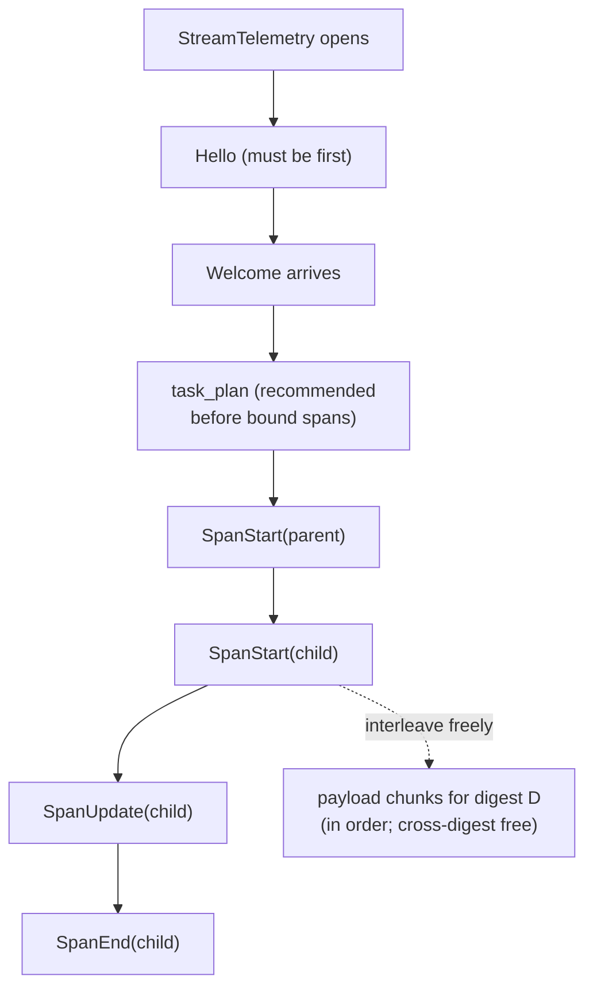
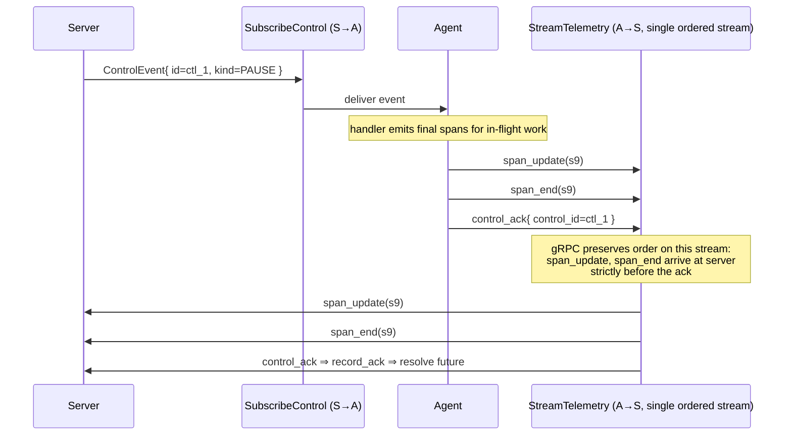

# Wire ordering and reconnect semantics

This doc collects the ordering guarantees harmonograf relies on and the
arguments they follow from. If you're implementing a new client, you
should read this **before** you implement reconnect, because it's the
one place where getting the model wrong produces subtly-wrong timelines
rather than obvious crashes.

## TL;DR

- **Telemetry is ordered per-stream, not globally.** Messages a given
  client emits arrive at the server in the order it emitted them.
- **Control events and control acks ride on separate gRPC streams**,
  but they preserve happens-before via the ack ↔ telemetry colocation
  trick described below.
- **Span ids are UUIDv7** and the server dedups by id, so clients may
  freely replay any span they're not sure the server got.
- **`resume_token` is a forward-looking hint.** v0 server doesn't act
  on it; clients should still populate it so a future server can
  implement per-span replay without a wire change.

## Ordering per stream

### `StreamTelemetry`

gRPC streams are ordered. Within a single `StreamTelemetry` RPC
instance, if the client emits `X` before `Y`, ingest sees `X` before
`Y`. This gives:

1. **`Hello` first**. Always. Ingest rejects a non-Hello first message.
2. **`SpanStart(X)` before any `SpanUpdate(X)` / `SpanEnd(X)`.** This
   is the client library's responsibility — the wire allows arbitrary
   interleave but ingest's storage layer expects start-first.
3. **`SpanStart(parent)` before `SpanStart(child)`.** Not enforced by
   the server (a child span's `parent_span_id` can reference a parent
   that hasn't arrived yet, and the frontend will render the child
   without a parent link until the parent lands). But well-behaved
   clients emit parents first.
4. **Payload chunks for a digest arrive in order.** Chunks for
   different digests may interleave freely.
5. **`task_plan` before the spans it references.** Again — not
   enforced, but task-bound spans emitted before the plan is
   submitted will start in RUNNING without a task row to bind to, and
   later plan submission will have to reconcile. Clients should emit
   the plan first.

Cross-stream ordering is **undefined**. Two concurrent telemetry
streams under the same agent_id see interleaved delivery at the
server; rely on span ids + timestamps, not wire order, to reconstruct.

The five per-stream ordering rules at a glance — the wire allows freedom only for cross-digest payload chunks and unrelated spans:



### `SubscribeControl`

Server-streaming. Control events are ordered per subscription:

- If the server sends `PAUSE(id=ctl_1)` before `RESUME(id=ctl_2)` on a
  given subscription, the agent receives them in that order.
- **Fan-out is not atomic.** If an agent has two live `SubscribeControl`
  subs and the server dispatches `CANCEL` to both, one may receive and
  ack it before the other starts processing. With
  `require_all_acks=false` that's fine — the first ack resolves the
  call. With `require_all_acks=true` the router waits for both.

## Control-ack happens-before

The key trick: **control acks ride upstream on `StreamTelemetry`**,
not on a separate ack RPC and not back on `SubscribeControl`.

### The guarantee

If the server sees `ControlAck{ control_id=ctl_1 }` on stream `S`,
then **every `TelemetryUp` that `S` sent before the ack has already
arrived at the server**. In particular, every `SpanStart` /
`SpanUpdate` / `SpanEnd` the client emitted while handling the control
event is on the wire ahead of the ack.

That's exactly what the UI needs to say "the agent paused at span X"
correctly — the last span before the ack is by definition the last
thing the agent did before handling the pause.

The argument as a sequence — pre-ack spans are guaranteed on the wire ahead of the ack because they share a single ordered gRPC stream:



### Why it's free

The guarantee falls out of gRPC's per-stream ordering. The client
code:

1. Receives `ControlEvent{ id=ctl_1 }` on `SubscribeControl`.
2. Handles the event (pauses, emits any final spans, etc.) — all
   resulting `TelemetryUp` messages are enqueued on `StreamTelemetry`
   in handler order.
3. Enqueues `TelemetryUp{ control_ack: ControlAck{ control_id=ctl_1 } }`
   on `StreamTelemetry` after the last handler-induced span.

Because (2) and (3) go on the same gRPC stream in that order, the
server sees them in that order.

### Why not a separate ack RPC or ride on `SubscribeControl`?

- **Separate ack RPC** — then you need explicit synchronization
  between the ack RPC and telemetry to preserve happens-before,
  plus an extra gRPC stream per agent. Third stream, third reconnect
  path, third flow-control window. No thanks.
- **Ack on `SubscribeControl`** — that would require
  `SubscribeControl` to be bidirectional, and it would couple control
  delivery's flow control with ack delivery. A stalled server-side
  consumer would then also stall ack back-pressure. Worse, the
  happens-before guarantee gets harder: telemetry and the ack now
  travel on different streams, so you'd need an explicit barrier.

See `docs/design/01-data-model-and-rpc.md §4.2.1` for the original
argument.

### What about SendControl responses?

`SendControl` is a unary RPC. Its response is the aggregated outcome
of fan-out to every live `SubscribeControl` subscription for the
target agent. The server's internal `control_router.deliver()` returns
a `DeliveryOutcome` once its `_PendingDelivery.future` resolves — and
that future is resolved by `record_ack` calls that run from the
telemetry ingest path.

Put differently:

```
SendControl (unary)
     ↓
ControlRouter.deliver()
     ↓ fan out ControlEvent
SubscribeControl streams → agents
     ↓ handle, then
StreamTelemetry  → ControlAck
     ↓
ingest.handle_message → ControlRouter.record_ack()
     ↓ resolves pending future
ControlRouter.deliver() returns → SendControl response
```

The happens-before guarantee flows through: the spans that preceded
the ack on the telemetry stream are by definition on the wire by the
time ingest calls `record_ack`, which by definition happens before
`SendControl` returns.

## Duplicate span dedup on reconnect

Span ids are UUIDv7 (sortable, collision-free across reconnects). The
server dedups using two layers:

1. **Per-stream in-memory**: `StreamContext.seen_span_ids` is a set.
   Fast path for "same stream, same id" — ignore.
2. **Storage uniqueness**: `store.append_span` is idempotent on
   `span.id`. A second insert with the same id is either a no-op or
   a merge, depending on whether the stored span is still open.

This means:

- A client may **freely replay** any span it emitted but isn't sure
  the server persisted. Reconnect logic:
  1. On stream close, note the span ids that were enqueued but not
     yet flushed.
  2. Reconnect with a fresh `StreamTelemetry`, send a new `Hello`
     (with `resume_token` set to the last confirmed span id).
  3. Replay the unflushed spans.
  4. Continue normal emission.
- **Dedup is id-based, not content-based.** Two spans with different
  `id`s are two separate spans even if the rest of their content is
  identical. Don't generate ids from content hashes.

## Resume token semantics

```proto
message Hello {
  ...
  string resume_token = 8;  // last span_id the server confirmed
                            // before disconnect, used by the client
                            // to drive replay-from on reconnect.
}
```

v0 notes:

- **The server ignores this field.** It's reserved. But it's already
  in the wire, so a future server can start consuming it without a
  proto change.
- **Clients should still populate it**. Ideally with the last span id
  the client flushed successfully before the stream closed. If no
  span was flushed before close, leave it empty.
- Since the v0 server replies with a `Welcome` that doesn't
  acknowledge a specific span id, "confirmed" for v0 clients means
  "I wrote it to the gRPC stream and the stream did not error before
  I crashed." That's not quite an ack, but it's the best a v0 client
  can do.

Forward-compatible semantics (what a future server **will** do):

- If `resume_token` is populated and the server recognizes it, the
  server will start the replay from that point, and the client is
  free to replay only spans it enqueued *after* that token.
- If `resume_token` is empty or unknown, the server will persist every
  incoming span (dedupping by id), and the client should replay
  everything it isn't sure about.

Either way, a v0-correct client is also forward-compatible: replaying
more than strictly necessary is always safe because of the id-based
dedup.

## Heartbeats and liveness

Heartbeats are not ordered with spans in a semantically meaningful
way — they're just periodic pings. But the server does use them for:

- **Stuckness detection** — see
  [`telemetry-stream.md#heartbeat`](telemetry-stream.md#heartbeat).
  `progress_counter` must advance across heartbeats or the agent is
  declared stuck after `STUCK_THRESHOLD_BEATS = 3` (≈15 s) while an
  INVOCATION is RUNNING.
- **Last-seen wall-clock** — the `last_heartbeat` field on `Agent`.
  If no heartbeat arrives for `HEARTBEAT_TIMEOUT_S = 15 s`, the
  server flips the agent to `DISCONNECTED` and closes its streams.

Clients that fall silent on telemetry but keep a heartbeat thread
alive are treated as connected; clients that emit spans without
heartbeats are treated as connected as long as the stream is active
(spans also reset the liveness clock in the stuck-detection path).

## Goodbye / ServerGoodbye

`Goodbye` (client → server) is a graceful shutdown. Server behavior:

1. `ingest._handle_goodbye` calls `close_stream` which removes the
   stream from the `_streams_by_agent` registry.
2. If the agent has no other live streams, the agent row is flipped
   to `DISCONNECTED` (not `CRASHED` — Goodbye is graceful).
3. All pending control deliveries waiting on this stream resolve as
   the stream disconnects (`control_router.unsubscribe`).

`ServerGoodbye` (server → client) is server-initiated close. Clients
should not reconnect immediately if the `reason` indicates a hard
rejection (protocol violation). For soft reasons (server shutdown),
normal reconnect-with-resume_token is fine.

## Checklist for new clients

If you are implementing a new client library, check every item before
shipping:

- [ ] `Hello` is always the first `TelemetryUp` on every stream.
- [ ] `agent_id` is persisted to disk and reused across restarts.
- [ ] `assigned_stream_id` from `Welcome` is used when opening
      `SubscribeControl`.
- [ ] `SubscribeControl` is opened only after `Welcome` arrives.
- [ ] `ControlAck` for every `ControlEvent` — `SUCCESS`, `FAILURE`, or
      `UNSUPPORTED`. Never silent. The ack rides upstream on
      `StreamTelemetry`, not on `SubscribeControl`.
- [ ] Span ids are UUIDv7 (or at least globally unique across
      restarts).
- [ ] The client library buffers spans and replays on reconnect,
      relying on server-side id dedup.
- [ ] Payload digests are sha256 hex computed over the exact bytes.
      The server recomputes and rejects mismatches.
- [ ] Heartbeats every ≤ 15 s with an advancing `progress_counter`.
- [ ] `Goodbye` on clean exit; the server won't wait the 15 s timeout
      to mark the agent disconnected.
- [ ] `resume_token` populated on reconnect Hellos (forward-compat).
- [ ] Attribute key clears use an `AttributeValue` with no oneof set.
- [ ] `hgraf.task_id` is only stamped on leaf execution spans
      (`LLM_CALL` / `TOOL_CALL`) when task binding is intended.
