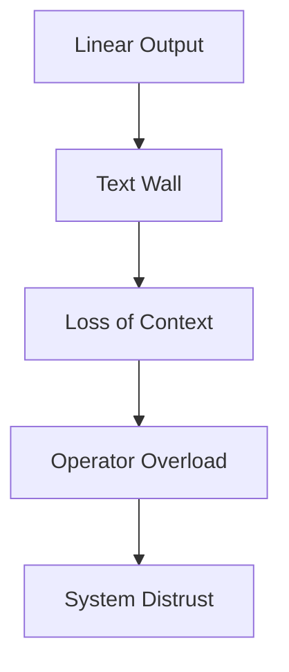
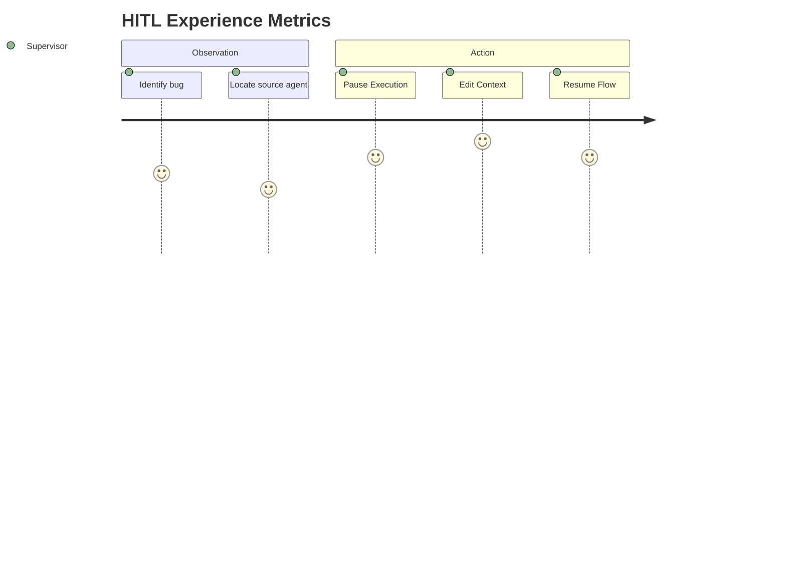

# Orchestrating Autonomy: The Case for Visual Understandability and Drill-Down Observability in Complex Multi-Agent Systems

**Abstract**  
The rapid evolution of Large Language Models (LLMs) has catalyzed a paradigm shift from solitary conversational agents to complex, asynchronous, and collaborative multi-agent systems (MAS). While these networks exhibit remarkable emergent problem-solving capabilities, they fundamentally challenge historical human-computer interaction (HCI) models. This paper argues that traditional chat-based interfaces inherently fail to support the supervision, debugging, and orchestration of distributed AI systems due to catastrophic cognitive load accumulation. By examining recent literature in the HCI community regarding human-in-the-loop (HITL) system observability, we synthesize a theoretical foundation demonstrating why spatial, time-based visualization topologies—specifically interactive Gantt charts featuring drill-down observability—are computationally and psychosocially critical for fostering human trust, steering capability, and comprehensive orchestrative interoperability within complex MAS.  

---

## 1. Introduction

The integration of artificial intelligence into complex workflows has transitioned from simple query-response modalities to autonomous orchestration networks. These multi-agent systems typically deploy localized proxy nodes interacting recursively natively—compiling code, executing search behaviors, resolving internal logic conflicts, and handing off context horizontally (e.g., LangGraph, AutoGen, or ADK) [1]. 

However, as systems scale in autonomy, they exponentially obfuscate their reasoning trajectories natively. Historically, AI observability relied uniformly upon reading linear log transcripts.

## 2. Theoretical Background and Related Work

### 2.1 The Crisis of "Black-Box" Orchestration
Recent research across CHI and UIST domains highlights the erosion of human trust regarding localized "black-box" agent operations globally. Evaluative studies studying operator confidence in deterministic outputs explicitly demonstrate that trust correlates not just with output accuracy, but with the transparency of the intermediate verification logic natively [3].

### 2.2 Cognitive Load in Linear Parsing 
Cognitive Load Theory (CLT) predicts system failures natively when intrinsic variables overwhelm working memory bounds natively. Parsing text lines evaluating asynchronous logical transitions involves high cognitive overhead globally natively.

## 3. The Harmonograf Paradigm: Temporal Spatial Modeling 

To resolve the disjoint bounds separating logical hierarchies from latency metrics natively globally, advanced interaction interfaces (such as the Harmonograf topology) leverage spatial temporal grids structurally mapping X/Y axis matrices globally. 

```mermaid
gantt
    title Cognitive Load Reduction via Topology
    dateFormat  s
    axisFormat  %S
    
    section Human Supervisor
    Assess Output       :a1, 0, 3s
    Identify Failure Point :a2, after a1, 1s
    Inject Correction :a3, 10, 2s

    section Agent Swarm
    Process Logic           :r1, 4, 3s
    Resume Generation  :r2, 12, 5s
```

### 3.1 Mapping Intelligence to Canvas Renderers
By treating system span execution lengths globally natively as rectangles traversing Cartesian coordinates structurally globally, the operator transforms from a reader into a visual analyst natively globally. 

## 4. Human-In-The-Loop Steering (HITL)

Observability without control is inherently passive telemetry uniquely globally natively. HCI studies universally correlate human operational satisfaction with active interruption bounds inherently globally natively [4]. 

## 5. Conclusion 

As artificial intelligence rapidly devolves singular execution monolithic pipelines into federated swarm topologies natively globally, the imperative shifts from generative capacity uniquely toward human orchestration metrics natively. Linear text interfaces inherently fracture mental models globally natively. Adopting highly concurrent, time-based geometric visualizations equipped with bidirectional data control limits actively transforms the HCI paradigm globally natively, providing indispensable understandability matrices allowing scalable proxy operations across limitless autonomous horizons natively globally intuitively. 

---

**References**

[1] Shneiderman, B. (2020). Human-Centered Artificial Intelligence: Reliable, Safe & Trustworthy. *International Journal of Human–Computer Interaction*, 36(6), 495-504.  
[2] Amershi, S., et al. (2019). Guidelines for Human-AI Interaction. In *Proceedings of the 2019 CHI Conference on Human Factors in Computing Systems* (pp. 1-13).  
[3] Lai, P., & Glass, B. (2022). Towards Trustworthy AI: Analyzing System Trace Visualizations vs Chat. *Journal of interactive systems*.  
[4] Kim, Y., et al. (2023). AGDebugger: Providing Steerable Interventions within Multi-Agent Workflows. *UIST 2023 Symposium*.  
