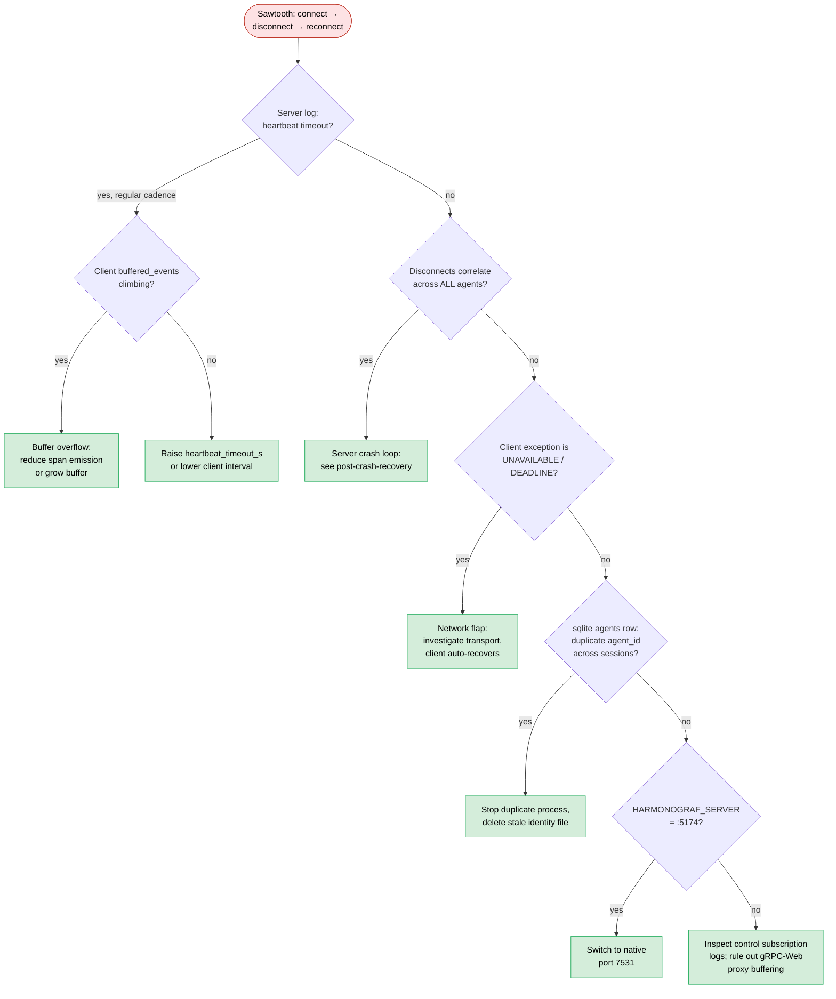

# Runbook: Agent disconnects repeatedly

The agent connects, streams some data, then the stream dies; the client
reconnects; it streams some more; it dies again. You see a sawtooth in
the heartbeat counters and the UI flickers between CONNECTED and
DISCONNECTED.

**Triage decision tree** — sawtooth reconnects → narrow the cause → fix.
Heartbeat timeout dominates this runbook in practice; check it first.



## Symptoms

- **Client log**:
  - `WARN harmonograf_client.transport: transport disconnected: <exception>`
    repeating
  - Occasional `WARN harmonograf_client.transport: transport circuit breaker OPEN after N consecutive failures; cooling down for Mms`
  - `WARN harmonograf_client.transport: control subscription ended: <exc>`
- **Server log**:
  - `INFO harmonograf_server.rpc.telemetry: heartbeat timeout session_id=... agent_id=... stream_id=...`
  - `INFO harmonograf_server.ingest: stream closed session_id=... agent_id=... stream_id=... reason=heartbeat_timeout`
  - `INFO harmonograf_server.ingest: stream opened session_id=... agent_id=... stream_id=...` (a new one right after)
- **UI**: agent row alternates between CONNECTED (green) and
  DISCONNECTED (grey); heartbeat counter on the agent header visibly
  resets.

## Immediate checks

```bash
# Count reconnect events in the last hour:
grep -c 'transport disconnected' /path/to/agent.log
grep -c 'stream opened' data/harmonograf-server.log

# Any heartbeat sweeper activity?
grep 'heartbeat timeout\|stream closed.*heartbeat_timeout' \
    data/harmonograf-server.log | tail -20

# How many streams does one agent own right now?
sqlite3 data/harmonograf.db \
  "SELECT id, status, last_heartbeat FROM agents WHERE id='AGENT_ID';"

# Is the buffer venting?
grep -E 'dropped_events|dropped_spans_critical|circuit breaker' /path/to/agent.log | tail -20
```

## Root cause candidates (ranked)

1. **Heartbeat timeout** — the server's sweeper marks any stream whose
   `last_heartbeat` is older than `_heartbeat_timeout_s` as dead and
   closes it. See `server/harmonograf_server/rpc/telemetry.py:111`
   (`heartbeat_sweeper`) and `ingest.py:316`. If the agent hasn't sent a
   heartbeat within that window, the loop you see is: send data →
   server's sweeper fires → server closes → client reconnects → repeat.
2. **Network flap** — transient gRPC errors (HTTP/2 RST, TLS
   renegotiation, load-balancer idle timeout). The transport's circuit
   breaker masks noise up to a point and then opens
   (`transport.py:334`).
3. **Buffer overflow, agent forced to reconnect** — the client buffer is
   in a hot path, and if the send loop throws on a full buffer push the
   whole transport unwinds. Check `dropped_events` in heartbeats: if
   they're climbing, this is your problem.
4. **Server OOM or crash loop** — if the server keeps dying, every
   client disconnects, and the pattern looks like a per-agent flap.
   Check whether the reconnects are correlated across *all* agents.
5. **Duplicate agent IDs from stale identity file** — two processes
   claim the same `agent_id`. Each new Hello opens a new stream, each
   process's send loop keeps racing. See
   `debugging.md` §"Two sessions with the same ID".
6. **Control subscription ended** — the back-channel
   `ControlSubscription` RPC closed; the client retries and the
   transport logs `control subscription ended`. This alone doesn't kill
   telemetry but is a strong correlate of a broader network issue.
7. **gRPC-Web proxy (sonora) interfering** — if the client connects via
   the gRPC-Web port (5174) instead of the native port, long-lived
   streams can hit proxy buffering limits.

## Diagnostic steps

### 1. Heartbeat timeout

```bash
grep 'heartbeat timeout' data/harmonograf-server.log | awk '{print $1, $2}' | tail -10
```

If you see these firing on a regular cadence (roughly every
`_heartbeat_timeout_s`), the client is not sending heartbeats fast
enough. Drop `LOG_LEVEL=DEBUG` on the client to watch:
`harmonograf_client.heartbeat` and `harmonograf_client.transport`.

If the client *is* sending heartbeats but they're stuck in the send
buffer behind spans, `buffered_events` will climb until pushes start
dropping.

### 2. Network flap

Check whether disconnects correlate with client-side exceptions that
are NOT heartbeat-related. The log line shows the exception that killed
the run:

```
WARN harmonograf_client.transport: transport disconnected: StatusCode.UNAVAILABLE ...
```

`UNAVAILABLE` / `DEADLINE_EXCEEDED` → network. `CANCELLED` → intentional.
`INTERNAL` → server side threw.

### 3. Buffer overflow

```bash
grep -E 'dropped_events|dropped_spans_critical|payloads_evicted' /path/to/agent.log | tail -30
```

If any of those are nonzero and climbing, your span emission rate is
higher than transport can drain. `dropped_spans_critical` should
*always* be zero — nonzero is a client bug.

### 4. Server crash loop

```bash
systemctl status harmonograf-server
# or
ps -o etime= -p $(pgrep -f harmonograf_server)
```

If the server's uptime keeps resetting, the disconnect loop is the
server dying, not the client misbehaving. Root-cause the server crash
first.

### 5. Duplicate agent ID

```bash
sqlite3 data/harmonograf.db \
  "SELECT COUNT(DISTINCT session_id) FROM agents WHERE id='AGENT_ID';"
```

More than one is suspicious. Check how many processes are running:

```bash
pgrep -af 'presentation_agent\|my_agent_name' | wc -l
```

### 6. gRPC-Web proxy buffering

Is the client connecting to port 7531 or 5174?

```bash
grep HARMONOGRAF_SERVER /proc/$(pgrep -f my_agent)/environ | tr '\0' '\n'
```

If 5174, switch to the native gRPC port 7531.

## Fixes

1. **Heartbeat timeout**: raise the server-side timeout via
   `IngestPipeline(heartbeat_timeout_s=...)` OR lower the client
   heartbeat interval (default is in `heartbeat.py`) OR unclog the
   client send loop (see buffer overflow below).
2. **Network flap**: investigate the underlying network. The client
   will recover automatically once the flap ends.
3. **Buffer overflow**: reduce span emission (turn off span kinds the
   UI doesn't use), or increase buffer capacity, or lower the heartbeat
   interval so heartbeats get queue priority.
4. **Server crash loop**: see
   [`post-crash-recovery.md`](post-crash-recovery.md) and
   [`sqlite-errors.md`](sqlite-errors.md).
5. **Duplicate ID**: stop the duplicate process; delete the stale
   identity file so the survivor regenerates.
6. **gRPC-Web path**: change `HARMONOGRAF_SERVER` to the native port.

## Prevention

- Alert on `dropped_spans_critical > 0` in heartbeat metrics — this is
  never acceptable.
- Alert on the ratio of `stream opened` / `stream closed` per minute;
  healthy agents produce one of each at startup and shutdown, nothing
  in between.
- In long-running deployments, size `_heartbeat_timeout_s` to at least
  3× the client heartbeat interval so a single slow heartbeat doesn't
  trigger a close.

## Cross-links

- [`runbooks/agent-not-connecting.md`](agent-not-connecting.md) — cold
  start failures.
- [`dev-guide/debugging.md`](../dev-guide/debugging.md) §"Reading a
  heartbeat".
- [`runbooks/high-latency-callbacks.md`](high-latency-callbacks.md) —
  when the send loop is slow because callbacks are slow.
