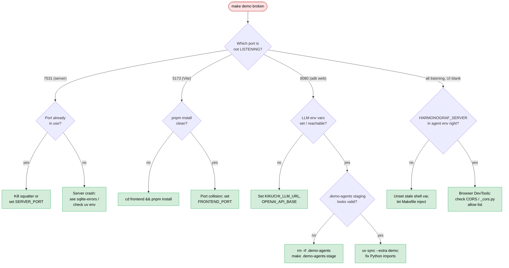

# Runbook: Demo won't start

`make demo` prints its banner, starts a few processes, and then
nothing works: either the UI is blank, the agent never connects, or
processes exit silently.

**Triage decision tree** — three demo processes, three port lookups, three failure modes.



## Symptoms

- **Terminal**: `make demo` prints one of:
  - `[demo] starting harmonograf-server on :7531 ...`
  - `[demo] starting frontend Vite dev server on :5173 ...`
  - `[demo] starting adk web presentation_agent on :8080 ...`
  - `[demo] shutting down...` (unexpectedly soon)
- **Processes**: `ps axf | grep -E 'harmonograf|adk web|vite'` shows
  one or more missing.
- **UI**: `http://127.0.0.1:5173` loads but the session picker is
  empty, or fails with `Server unreachable`.

## Immediate checks

```bash
# Are the three demo processes alive?
pgrep -af 'harmonograf_server'
pgrep -af 'pnpm dev\|vite'
pgrep -af 'adk web'

# Are the three default ports bound?
lsof -nP -iTCP:7531 -sTCP:LISTEN
lsof -nP -iTCP:5173 -sTCP:LISTEN
lsof -nP -iTCP:8080 -sTCP:LISTEN

# Is the LLM endpoint set and reachable?
echo $OPENAI_API_BASE
curl -s $OPENAI_API_BASE/models 2>/dev/null || echo "unreachable"

# Vite logs (stdout of the `make demo` invocation — grep there)
# ADK web logs
```

## Root cause candidates (ranked)

1. **Port already in use** — 7531, 5173, or 8080 is held by another
   process (a previous `make demo`, a frontend dev server from a
   different project, etc.). Vite exits with `EADDRINUSE`; harmonograf
   server crashes; ADK web refuses to bind.
2. **LLM endpoint missing / unreachable** — the presentation agent
   needs a reachable LLM. If `OPENAI_API_BASE` (or `GOOGLE_API_KEY`) is
   unset or points at a dead host, the agent either crashes at import
   or responds with errors on the first turn.
3. **`HARMONOGRAF_SERVER` pointing at the wrong port** — the Makefile
   sets `HARMONOGRAF_SERVER=127.0.0.1:$(SERVER_PORT)` (Makefile ~line
   171); if you overrode it with something stale, the agent connects
   to a dead port. See `Makefile:110`.
4. **`uv` / Python environment broken** — `uv run --extra demo`
   fails because the extras aren't installed, or the venv got wiped.
5. **`.demo-agents/` staging broken** — the Makefile stages a real
   (non-symlink) `presentation_agent` directory under `.demo-agents/`
   before boot (`Makefile:117` target `.demo-agents-stage`). If a
   previous run crashed partway through, the directory may be in a
   bad state.
6. **pnpm / Node mismatch** — the frontend's Vite dev server refuses
   to start because `node_modules` is stale or Node version is wrong.
7. **CORS blocking in the browser** — processes are up, but the
   frontend can't reach the server because the server's CORS allow
   list (`server/harmonograf_server/_cors.py`) doesn't include the
   frontend origin.

## Diagnostic steps

### 1. Port conflicts

```bash
lsof -nP -iTCP:7531 -sTCP:LISTEN
lsof -nP -iTCP:5173 -sTCP:LISTEN
lsof -nP -iTCP:8080 -sTCP:LISTEN
```

If any of them name a different process, kill or reconfigure.

### 2. LLM URL

```bash
env | grep -E 'OPENAI_API_BASE|OPENAI_API_KEY|USER_MODEL_NAME|GOOGLE_API_KEY'
curl -v "$OPENAI_API_BASE/models"
```

### 3. Wrong HARMONOGRAF_SERVER

```bash
grep HARMONOGRAF_SERVER /proc/$(pgrep -f presentation_agent)/environ 2>/dev/null | tr '\0' '\n'
```

Should be `127.0.0.1:7531` by default.

### 4. uv env

```bash
uv run --extra demo python -c 'import harmonograf_client; print(harmonograf_client.__file__)'
uv run --extra demo python -c 'import google.adk'
```

Either import failing → run `uv sync --extra demo`.

### 5. .demo-agents staging

```bash
ls -la .demo-agents/presentation_agent/
cat .demo-agents/presentation_agent/__init__.py
head .demo-agents/presentation_agent/agent.py
```

If the staging looks wrong, blow it away and rerun:

```bash
rm -rf .demo-agents
make .demo-agents-stage
```

### 6. pnpm / Node

```bash
cd frontend && pnpm install
node --version
```

### 7. CORS

Browser DevTools → Network → look for red bars on
`harmonograf.v1.Harmonograf/` calls with CORS errors. If present,
check `_cors.py` for the allow list.

## Fixes

1. **Ports**: kill the squatter, or override via `SERVER_PORT`,
   `FRONTEND_PORT`, `ADK_WEB_PORT` env vars (see `Makefile:113`).
2. **LLM URL**: set `KIKUCHI_LLM_URL` in your shell before
   `make demo`; or point the presentation agent at a different
   provider.
3. **HARMONOGRAF_SERVER**: unset it in your shell and let the
   Makefile set it; or match the server port explicitly.
4. **uv env**: `uv sync --extra demo` at the repo root.
5. **.demo-agents**: remove and re-stage (see diagnostic step 5).
6. **pnpm**: `pnpm install` in `frontend/`.
7. **CORS**: add the frontend origin to `_cors.py` allow list.

## Prevention

- Run `make demo` from a clean shell (no stray env vars).
- Free the demo ports as part of a `make demo-stop` target if you
  have one.
- Document `KIKUCHI_LLM_URL` as a required env var in the
  [`operator-quickstart.md`](../operator-quickstart.md) and
  [`quickstart.md`](../quickstart.md).

## Cross-links

- [`quickstart.md`](../quickstart.md) — getting started from scratch.
- [`operator-quickstart.md`](../operator-quickstart.md) — operator
  setup.
- [`dev-guide/debugging.md`](../dev-guide/debugging.md) §"`make demo`
  starts but nothing works".
- `Makefile:146-190` — demo target source of truth.
