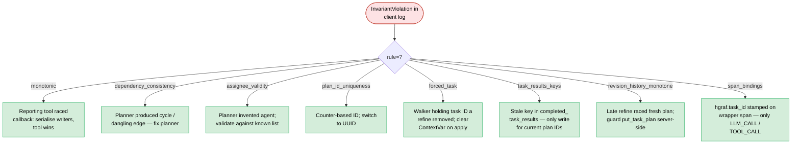

# Runbook: Invariant violations

The client-side `InvariantChecker`
(`client/harmonograf_client/invariants.py`) has fired. You see one or
more `InvariantViolation` lines in the client log and may see the
`ProtocolMetrics.invariant_violations` counter climb on the invocation
span.

**Triage decision tree** — the violation's `rule=` field names the failing
invariant; each rule has a different fix path.



## Symptoms

- **Client log** (example):
  ```
  WARN harmonograf_client.invariants: InvariantViolation(rule='monotonic',
       severity='error', detail='task t3 transitioned COMPLETED -> IN_PROGRESS')
  ```
- **UI**: the invocation span has an `invariant_violations` attribute
  with a nonzero count.
- **Agent log**: may be accompanied by a follow-on drift or refine if
  the violation happens to coincide with a drift detector firing.

## What an invariant violation means

Invariants describe rules the plan state machine is supposed to obey.
A violation is the client saying "I saw a transition that shouldn't
happen". Some violations are bugs (data corruption) and some are
false positives (a rule that's too tight for reality). The rule name
tells you which.

Rules implemented in `invariants.py`:

| Rule | What it checks |
|---|---|
| `monotonic` (`_check_monotonic`, `invariants.py:124`) | Task status only moves forward along the lifecycle graph. |
| `dependency_consistency` (`_check_dependency_consistency`, `:159`) | Edges reference tasks that exist and aren't cyclic. |
| `assignee_validity` (`_check_assignee_validity`, `:188`) | `assignee_agent_id` points at a known agent. |
| `plan_id_uniqueness` (`_check_plan_id_uniqueness`, `:211`) | Plan ID not reused across sessions. |
| `forced_task` (`_check_forced_task`, `:240`) | The ContextVar-forced task in parallel mode is valid. |
| `task_results_keys` (`_check_task_results_keys`, `:275`) | `harmonograf.completed_task_results` keys match plan task IDs. |
| `revision_history_monotone` (`_check_revision_history_monotone`, `:297`) | Plan revision indices are non-decreasing. |
| `span_bindings` (`_check_span_bindings`, `:324`) | Bound spans are leaf-kind and belong to this plan's tasks. |

## Immediate checks

```bash
# Violation summary
grep 'InvariantViolation' /path/to/agent.log | awk -F"rule='" '{print $2}' | awk -F"'" '{print $1}' | sort | uniq -c

# Most recent violation details
grep 'InvariantViolation' /path/to/agent.log | tail -20
```

## Root cause candidates (ranked)

1. **`monotonic`** — a task went backwards. Almost always a race:
   a reporting tool fired after the span-level callback had already
   transitioned the task. Or a refine rebuilt the plan and
   re-introduced a task in an earlier state. See `debugging.md`
   §"A task is marked complete before its span ends" — note the
   decoupling of plan state and span lifecycle.
2. **`dependency_consistency`** — refine produced a plan referencing
   task IDs it also removed, or introduced a cycle. Usually a planner
   bug.
3. **`assignee_validity`** — the planner made up an agent name. Check
   which agents the plan expects vs which have connected.
4. **`plan_id_uniqueness`** — a client restarted without clearing the
   plan-id counter, or two parallel agents both generated plan IDs
   from the same seed.
5. **`forced_task`** — the parallel walker set `_forced_task_id_var`
   to a task that isn't in the current plan, typically because a
   refine removed it.
6. **`task_results_keys`** — the agent wrote
   `harmonograf.completed_task_results[<id>]` for an ID the plan
   doesn't know about.
7. **`revision_history_monotone`** — someone ingested an older
   revision after a newer one (e.g. a late-arriving refine raced a
   fresh plan). Non-fatal but odd.
8. **`span_bindings`** — you stamped `hgraf.task_id` on an INVOCATION
   or another wrapper span, or bound a span to a task that isn't in
   the currently-rendered plan.

## Diagnostic steps

### 1. Monotonic violation

Read the `detail` field: it names the task and the attempted
transition. Then grep for every transition on that task:

```bash
grep 'task <ID>' /path/to/agent.log | tail -30
```

You'll typically see two drivers racing (reporting tool + callback).
If the transition is
`COMPLETED -> IN_PROGRESS`, the reporting tool fired late — check
whether the tool body was delayed by an async await.

### 2. Dependency consistency

```bash
sqlite3 data/harmonograf.db \
  "SELECT task_id, depends_on FROM task_plan_edges WHERE plan_id='PLAN_ID';"
```

Build the graph yourself and find the cycle or the dangling edge.

### 3. Assignee validity

Same check as
[`task-stuck-in-pending.md`](task-stuck-in-pending.md) §5.

### 4. Plan ID uniqueness

Grep for the duplicated plan ID:

```bash
sqlite3 data/harmonograf.db \
  "SELECT id, session_id FROM task_plans WHERE id='PLAN_ID';"
```

### 5. Forced task

```bash
grep '_forced_task_id_var\|forced_task_id' /path/to/agent.log | tail -20
```

### 6. task_results_keys

```bash
grep 'harmonograf.completed_task_results' /path/to/agent.log | tail -20
```

### 7. Revision history

```bash
sqlite3 data/harmonograf.db \
  "SELECT revision_index, revision_kind, created_at FROM task_plans
   WHERE id='PLAN_ID' ORDER BY created_at;"
```

If `revision_index` doesn't strictly increase with `created_at`, a
late-arriving refine raced.

### 8. Span bindings

```bash
sqlite3 data/harmonograf.db \
  "SELECT id, kind FROM spans WHERE session_id='SESSION_ID' AND json_extract(attributes, '$.\"hgraf.task_id\"') IS NOT NULL;"
```

Any `kind` other than LLM_CALL / TOOL_CALL is a violation source.

## Fixes

1. **Monotonic race**: serialise the writers — either trust the
   reporting tool and skip the callback's transition, or vice versa.
   The canonical decision is: reporting tool wins.
2. **Dependency**: fix the planner; use the invariant checker in dev
   (`dev-guide/debugging.md` §"Running the checker in dev") against a
   captured bad plan.
3. **Assignee**: tighten the planner's agent-name validation against
   the known-agents list.
4. **Plan ID uniqueness**: use a UUID, not a counter.
5. **Forced task**: when the walker applies a refined plan, clear
   `_forced_task_id_var` before resetting.
6. **task_results_keys**: only write result keys for task IDs in the
   current plan.
7. **Revision history**: guard `put_task_plan` to reject lower
   revisions (server-side).
8. **Span binding**: only stamp `hgraf.task_id` on leaf-kind spans.
   See `_TASK_BINDING_SPAN_KINDS` in `ingest.py`.

## Prevention

- Run `check_plan_state` in CI against every canned plan fixture.
- Add a per-rule metric on `invariant_violations` so you can tune
  false positives.
- For the monotonic rule in particular, add a unit test that races
  reporting-tool vs callback and asserts exactly one transition
  happens.

## Cross-links

- [`dev-guide/debugging.md`](../dev-guide/debugging.md) §"Invariant
  violations" and §"Using the invariant checker in dev".
- `client/harmonograf_client/invariants.py` — rule source.
- [`runbooks/task-stuck-in-pending.md`](task-stuck-in-pending.md) /
  [`task-stuck-in-running.md`](task-stuck-in-running.md) — symptoms
  that often co-occur with monotonic violations.
