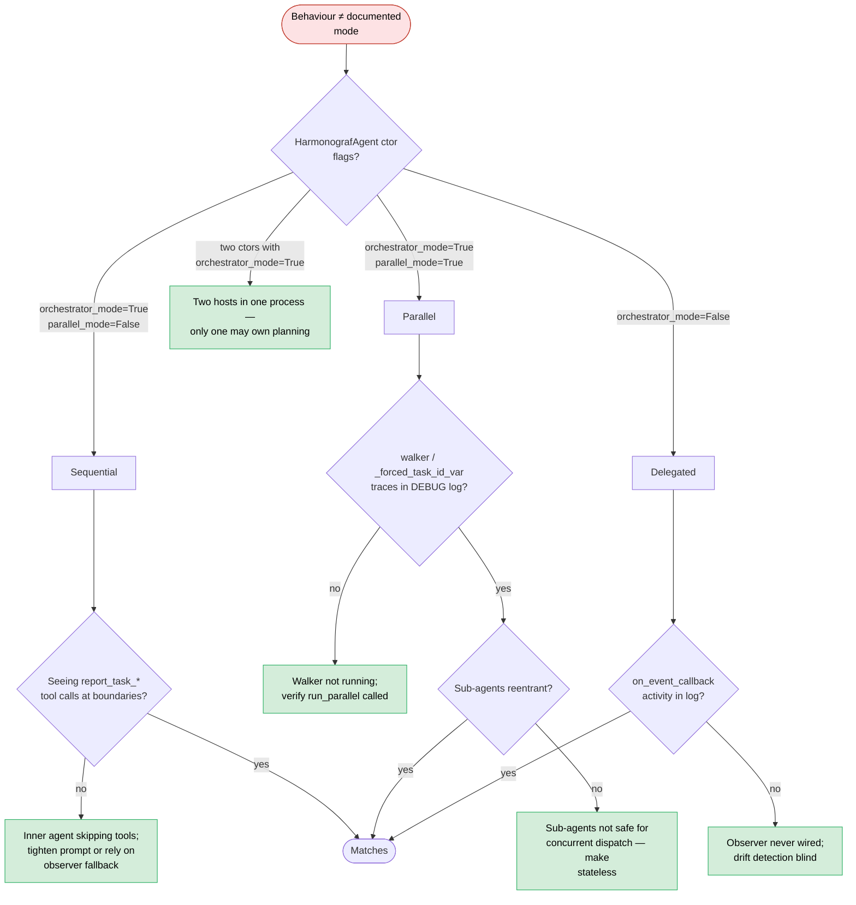

# Runbook: Orchestration mode mismatch

The agent behaves in a way that doesn't match its documented mode:
tasks advance in unexpected ways, refines don't fire, or a sub-agent
takes over planning when it shouldn't. Often traces back to running
in a mode the code wasn't designed for.

**Triage decision tree** — first determine which of the three modes is
actually configured, then check that runtime behaviour matches that mode.



## Symptoms

- **Client log** (at DEBUG):
  - `DEBUG harmonograf_client.adk: maybe_run_planner: SKIP reason=is_harmonograf_agent_without_host inv_id=...`
    (`adk.py:1884`) — the agent decided not to plan.
  - Traces of the walker (`_forced_task_id_var`) in sequential mode,
    or absence of walker traces in parallel mode.
- **UI**: task lifecycle doesn't match `docs/protocol/task-state.md`
  — e.g. tasks advance even though no reporting tool was called
  (callback fallback kicked in, suggesting sequential mode); or
  multiple tasks are RUNNING simultaneously in what you thought was
  sequential mode (walker is actually running).
- **Behavioural**: drift detectors fire from unexpected callback
  paths.

## The three modes (from AGENTS.md)

1. **Sequential** (default, `orchestrator_mode=True,
   parallel_mode=False`) — the whole plan is fed as one user turn;
   task lifecycle is reported via reporting tools; callbacks are the
   belt-and-suspenders.
2. **Parallel** (`orchestrator_mode=True, parallel_mode=True`) — the
   rigid DAG batch walker drives sub-agents directly per task,
   binding `_forced_task_id_var` per dispatch.
3. **Delegated** (`orchestrator_mode=False`) — one delegation with an
   event observer scanning for drift; the inner agent owns task
   sequencing.

## Immediate checks

```bash
# What construction arguments did the running agent use?
grep -rn 'HarmonografAgent(' /path/to/agent_src/
# Or, if you have process access:
ps -o args= -p $(pgrep -f my_agent)

# Walker traces in the log? (parallel-only)
grep -E '_forced_task_id|walker|rigid.?dag' /path/to/agent.log | tail -20

# Planner SKIP reasons?
grep 'maybe_run_planner: SKIP' /path/to/agent.log | tail -20

# Observer fallback activity? (delegated-only)
grep -E 'on_event:|observer' /path/to/agent.log | tail -20
```

## Root cause candidates (ranked)

1. **Constructed in sequential mode but the plan is meant to run
   parallel** — `parallel_mode=False` (default). Tasks serialise;
   user expected concurrency.
2. **Constructed in parallel mode but sub-agents aren't configured
   for it** — `parallel_mode=True` but the dispatched sub-agents are
   not reentrant; the walker crashes or the first task hangs.
3. **Constructed in delegated mode expecting the observer to catch
   drifts** — `orchestrator_mode=False`; you expected the
   reporting-tools path to drive transitions, but the observer is
   the only thing running.
4. **Mode flipped between runs** — a hot-reload or config change
   swapped modes without clearing `_AdkState`; stale state from the
   previous mode leaks into the new one.
5. **Sub-agent thinks it's the host** — a sub-agent was
   accidentally constructed with `orchestrator_mode=True`; both it
   and the real host try to plan.
6. **Planner silent in sub-agent** — the sub-agent has no planner,
   so `maybe_run_planner` skips with
   `is_harmonograf_agent_without_host` (`adk.py:1884`); you expect it
   to plan but it won't, and the host didn't either.
7. **Walker started but ContextVar didn't propagate** —
   `_forced_task_id_var` is set on the outer task but an inner
   `asyncio.create_task(...)` captured the ContextVar state *before*
   the set, so the inner work runs with `None`. See `debugging.md`
   §"`_forced_task_id_var` is `None` when you didn't expect it".

## Diagnostic steps

### 1. Pick the mode

Inspect the construction:

```bash
grep -rn 'HarmonografAgent(' /path/to/agent_src/
```

Look for `orchestrator_mode`, `parallel_mode`, and `planner` args.
That tells you unambiguously which of the three modes the process is
in.

### 2. Confirm behavior matches

- Sequential → you should see `report_task_*` tool invocations at
  every task boundary.
- Parallel → you should see `_forced_task_id_var` set per task in
  DEBUG logs; multiple tasks may be RUNNING concurrently.
- Delegated → almost no reporting-tool calls, most transitions come
  from `on_event_callback`.

### 3. Sub-agent-as-host

Grep every `HarmonografAgent(` construction in your repo. If more
than one has `orchestrator_mode=True` in the same process, you're
running two hosts.

### 4. Planner config in sub-agents

```bash
grep 'maybe_run_planner: SKIP reason=is_harmonograf_agent_without_host' /path/to/agent.log
```

If present, the sub-agent consciously declined to plan. If you
wanted it to, pass a planner.

### 5. ContextVar propagation

py-spy dump → find the frame that called `asyncio.create_task`; if
it happened before `_forced_task_id_var.set(...)`, you have a
propagation hole.

## Fixes

1. **Wrong mode**: change the construction. For parallel work, use
   `parallel_mode=True`. Test with a minimal plan before full load.
2. **Sub-agent not reentrant**: make the sub-agent stateless or
   single-flight; don't use parallel mode until that's true.
3. **Wrong planner placement**: move the planner to the real host;
   make sub-agents planner-less.
4. **Mode flipped between runs**: always fully restart the process
   when changing modes; never hot-reload across a mode change.
5. **Two hosts**: fix construction so exactly one
   `HarmonografAgent` has `orchestrator_mode=True`.
6. **Silent sub-agent planner**: pass a planner *or* accept that the
   sub-agent inherits its plan from the host.
7. **ContextVar propagation**: set the ContextVar before any
   `asyncio.create_task`; or explicitly pass the task id through as
   an argument.

## Prevention

- Log the mode on agent startup at INFO level (not DEBUG) so you can
  grep for it after the fact.
- In tests, assert that exactly one orchestrator exists per process.
- Add a CI test per mode that sanity-checks lifecycle traces.

## Cross-links

- `AGENTS.md` §"Plan execution protocol" — canonical mode
  descriptions.
- [`dev-guide/debugging.md`](../dev-guide/debugging.md) §"Common 'but
  that's impossible' causes" — ContextVar gotchas.
- [`runbooks/plan-never-gets-submitted.md`](plan-never-gets-submitted.md)
  — mode-related planner skip reasons.
- [`runbooks/task-stuck-in-pending.md`](task-stuck-in-pending.md).
