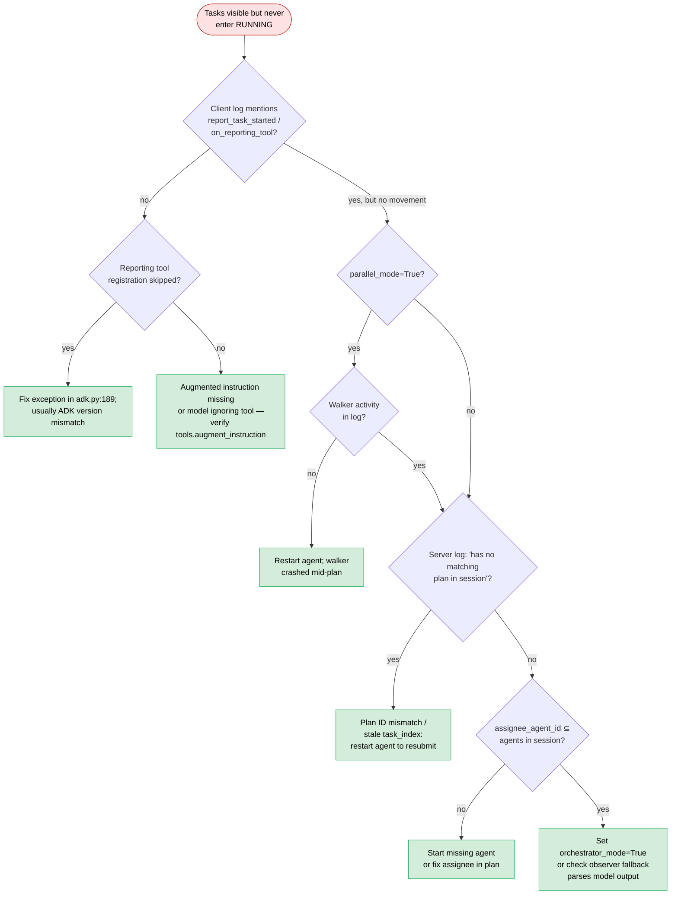

# Runbook: Task stuck in PENDING

The plan is rendered, tasks are visible in the Gantt and drawer, but
they never transition to RUNNING. The current-task strip stays empty
or keeps displaying "no current task".

**Triage decision tree** — plan exists, tasks frozen at PENDING. The dominant
cause is the LLM never calling `report_task_started`; check that first.



## Symptoms

- **UI**: task rows are greyed out in the Gantt; drawer says
  `0/N tasks running`.
- **Client log** (nothing helpful by default, but with `LOG_LEVEL=DEBUG`):
  - `DEBUG harmonograf_client.adk: ...` callback traces showing no
    `state.on_task_start` lines
  - Possibly `WARN harmonograf_client.invariants: InvariantViolation(...)`
    on attempted transitions (see
    [`invariant-violations.md`](invariant-violations.md))
- **Server log**:
  - `DEBUG harmonograf_server.ingest: hgraf.task_id=... on span=... has no matching plan in session=...`
    (`ingest.py:714`)
  - `WARN harmonograf_server.ingest: task_status_update for unknown task plan_id=... task_id=...`
    (`ingest.py:680`)

## Immediate checks

```bash
# Is the plan actually in sqlite?
sqlite3 data/harmonograf.db \
  "SELECT id, revision_index, revision_kind, summary FROM task_plans
   WHERE session_id='SESSION_ID' ORDER BY revision_index DESC LIMIT 5;"

# What statuses do the tasks have?
sqlite3 data/harmonograf.db \
  "SELECT id, status, bound_span_id, assignee_agent_id FROM task_plan_tasks
   WHERE plan_id='PLAN_ID';"

# Did any span ever bind to a task?
sqlite3 data/harmonograf.db \
  "SELECT id, kind, name FROM spans
   WHERE session_id='SESSION_ID'
     AND json_extract(attributes, '$.\"hgraf.task_id\"') IS NOT NULL
   LIMIT 10;"

# Was a reporting tool ever intercepted?
grep 'report_task_started\|reporting_tools_invoked\|_AdkState' /path/to/agent.log | tail -20
```

## Root cause candidates (ranked)

1. **Agent never called `report_task_started`** — the most common.
   Reporting-tool calls are what drive transitions in sequential /
   delegated modes. If the LLM didn't call the tool (or the tool wasn't
   injected into the sub-agent because the instruction augmentation was
   skipped), nothing moves. See `tools.augment_instruction` and
   `_AdkState.on_reporting_tool` in `client/harmonograf_client/adk.py`.
2. **Parallel walker not advancing** — in parallel mode
   (`parallel_mode=True`), the rigid DAG walker sets
   `_forced_task_id_var` before dispatching each task. If the walker
   crashed or was never started, no ContextVar is set and spans arrive
   without `hgraf.task_id`. The server will log
   `hgraf.task_id=... on span=... has no matching plan in session=...`
   — except actually it won't, because the attribute is absent
   altogether; look for empty `attributes` on spans that should have
   been bound.
3. **Plan never registered in the session's task index** — the server's
   `_task_index[session_id]` is populated from `_handle_task_plan`
   (`ingest.py:654`). If the task plan was ingested before the server
   restarted and wasn't rebuilt on boot, `_bind_task_to_span` hits the
   storage scan fallback (`ingest.py:704`) and may still miss if the
   plan_id stamped on the span doesn't match the stored plan.
4. **Plan ID mismatch between agent and server** — the agent thinks the
   current plan is `plan_123` but the server stored it as `plan_456`
   because the agent re-submitted and the server deduped. Task updates
   land under a plan nobody is listening for.
5. **Assignee agent never connected** — tasks can't report progress
   because the assignee doesn't exist. The task row will be annotated
   with an agent that isn't in the session's agent list.
6. **`HarmonografAgent` running in mode that bypasses reporting
   tools** — `orchestrator_mode=False` with an inner agent that doesn't
   use reporting tools. Observer fallback should catch this, but if
   `after_model_callback` can't parse the responses, nothing happens.
7. **Reporting-tool registration skipped** — look for:
   `DEBUG harmonograf_client.adk: reporting tool registration skipped: <exc>`
   (`adk.py:189`). If registration raised, the tools exist as names
   only and are never intercepted.

## Diagnostic steps

### 1. Did the LLM call the tool?

With `LOG_LEVEL=DEBUG` on the client:

```bash
grep -E 'report_task_|on_reporting_tool|_AdkState' /path/to/agent.log | head -40
```

If you see zero `report_task_*` lines, the LLM never called the tool.
Either the instruction augmentation was skipped (grep for
`reporting tool registration skipped`) or the model isn't following
the instruction.

### 2. Parallel walker

```bash
grep -E 'walker|_forced_task_id|parallel' /path/to/agent.log | tail -30
```

If `parallel_mode=True` and there's no walker activity, check whether
`HarmonografAgent.run_parallel` was actually called.

### 3. Task index

```bash
# After a server restart, the index is empty until a plan is
# re-ingested; force it by listing plans:
sqlite3 data/harmonograf.db \
  "SELECT id, session_id, created_at FROM task_plans
   ORDER BY created_at DESC LIMIT 10;"
```

If the plan exists in sqlite but the server hasn't seen a
`_handle_task_plan` for it since startup, restart the agent (which will
re-submit the plan).

### 4. Plan ID mismatch

Compare what the agent thinks the plan ID is vs what the server stored:

```bash
grep 'plan_id=\|submit_plan\|plan refined' /path/to/agent.log | tail -20
sqlite3 data/harmonograf.db \
  "SELECT id, revision_index FROM task_plans WHERE session_id='SESSION_ID'
   ORDER BY revision_index DESC LIMIT 5;"
```

### 5. Assignee

```bash
sqlite3 data/harmonograf.db \
  "SELECT DISTINCT assignee_agent_id FROM task_plan_tasks WHERE plan_id='PLAN_ID';"
sqlite3 data/harmonograf.db \
  "SELECT id FROM agents WHERE session_id='SESSION_ID';"
```

The first list should be a subset of the second.

### 6. Mode bypass

Check the `HarmonografAgent` construction:

```bash
grep -E 'HarmonografAgent\(|orchestrator_mode|parallel_mode' /path/to/agent_source.py
```

### 7. Tool registration failure

```bash
grep 'reporting tool registration skipped\|reporting-tool registration raised' /path/to/agent.log
```

If present, the tools weren't injected into any sub-agent. The traceback
in the message will name the culprit.

## Fixes

1. **LLM not calling tool**: verify the instruction was augmented
   (`tools.augment_instruction`), and that the model can see the tool
   names. Turn on verbose logging and confirm the tool appears in the
   request.
2. **Parallel walker stopped**: re-run the agent; if a crash took the
   walker out mid-plan, the plan is in an unrecoverable state in memory.
3. **Task index stale**: restart the agent so it resubmits the plan,
   OR clear `_task_index` by restarting the server.
4. **Plan ID mismatch**: stop and restart the agent to force a clean
   submit.
5. **Missing assignee**: start the missing agent process; reconfigure
   the plan's `assignee_agent_id` to a name that matches a real agent.
6. **Mode bypass**: explicitly set `orchestrator_mode=True` unless you
   know the inner agent fully controls its own reporting.
7. **Tool registration crash**: fix the cause of the exception in
   `reporting tool registration skipped: <exc>`; common culprit is an
   ADK version mismatch in `agent.py:123`.

## Prevention

- Add a health check that asserts every session has at least one task
  in RUNNING or COMPLETED within N seconds of the plan being submitted.
- In CI, assert that every plan submission results in at least one
  `report_task_started` within the first invocation.
- Pin the ADK version so `reporting tool registration skipped` doesn't
  re-appear after an upgrade.

## Cross-links

- [`reporting-tools.md`](../reporting-tools.md) — reporting tool
  reference.
- [`dev-guide/debugging.md`](../dev-guide/debugging.md) §"A task won't
  advance".
- [`runbooks/task-stuck-in-running.md`](task-stuck-in-running.md) — the
  symmetric case.
- [`runbooks/orchestration-mode-mismatch.md`](orchestration-mode-mismatch.md)
  — picking the right mode.
