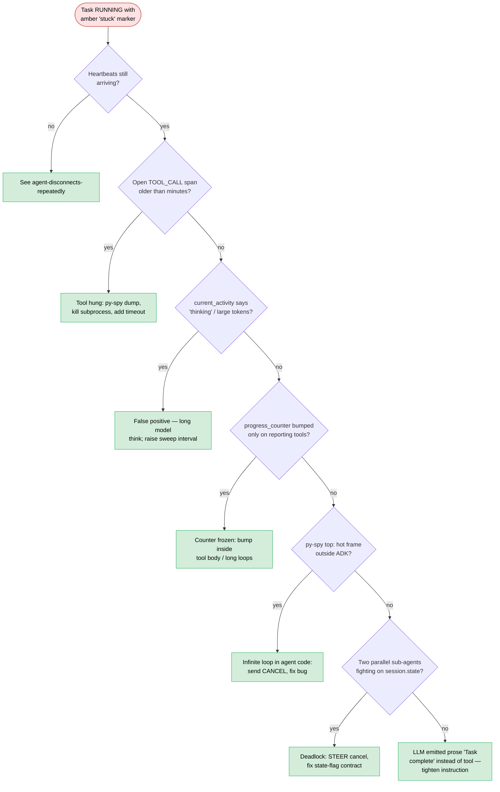

# Runbook: Task stuck in RUNNING

> **Post-goldfive note.** Task state transitions and drift throttling
> live in [goldfive](https://github.com/pedapudi/goldfive). `adk.py`
> line-number references below are historical; check goldfive's
> `DefaultSteerer` for current implementation.

A task entered RUNNING and never completes. The agent row has an amber
"stuck" marker; heartbeats still arrive; spans still end, but the task
itself never progresses.

**Triage decision tree** — distinguish "actually slow" from "actually wedged".
Heartbeats arriving + `progress_counter` frozen is the canonical wedge signal.



## Symptoms

- **UI**: agent header shows `⚠ stuck` (liveness tracker flagged it);
  current-task strip shows a RUNNING task with a steadily increasing
  age and no progress bar movement.
- **Server log / heartbeat bus**:
  - `STUCK_THRESHOLD_BEATS = 3` consecutive unchanged heartbeats
    (`server/harmonograf_server/ingest.py:64`) published via
    `publish_agent_status(..., stuck=True)`.
  - Not a distinct log line by default — look at heartbeat deltas on
    the bus or the agent header.
- **Client log**:
  - Heartbeats still arriving (`harmonograf_client.heartbeat`), but
    `progress_counter` is unchanged across consecutive heartbeats.

## Immediate checks

```bash
# Are heartbeats arriving at all?
sqlite3 data/harmonograf.db \
  "SELECT id, last_heartbeat, status FROM agents WHERE id='AGENT_ID';"
date +%s

# What is the agent currently doing, per its own accounting?
grep -E 'current_activity|progress_counter' /path/to/agent.log | tail -20

# What's the most recent span from this agent?
sqlite3 data/harmonograf.db \
  "SELECT id, kind, name, status, start_time, end_time FROM spans
   WHERE agent_id='AGENT_ID' ORDER BY start_time DESC LIMIT 5;"

# Is there an open span that never ended?
sqlite3 data/harmonograf.db \
  "SELECT id, kind, name, start_time FROM spans
   WHERE agent_id='AGENT_ID' AND end_time IS NULL ORDER BY start_time DESC LIMIT 10;"

# Did a drift ever fire?
grep -E 'drift observed|plan refined|refine:' /path/to/agent.log | tail -20
```

## Root cause candidates (ranked)

1. **Model is genuinely thinking for a long time** — long prompts,
   tool-calling chains, or a model that's stalling on retry. Heartbeats
   still arrive, `current_activity` reflects the thinking step, no spans
   end. This is a false positive on "stuck".
2. **Tool call hung** — an external tool (DB, HTTP, subprocess) is
   blocking. The TOOL_CALL span is open; the callback for
   `after_tool_callback` has not fired.
3. **`progress_counter` not being incremented** — the agent is making
   progress but isn't incrementing the counter, so the server's stuck
   detector fires even though everything is fine. See
   `server/harmonograf_server/ingest.py:565`.
4. **Infinite loop in the agent code** — not the model; the wrapper
   around it. Typical culprit: a while-loop polling some state that
   never changes.
5. **Deadlock on `session.state`** — two parallel sub-agents fighting
   over the shared dict, one spinning waiting for a state flag the
   other never sets.
6. **Reporting-tool side effect never fired** — the LLM emitted
   `report_task_completed` text instead of calling the tool. Goldfive's
   steerer never gets the signal. See goldfive's steerer logs.
7. **Drift throttled** — a detected drift that would have refined the
   plan was suppressed by `_DRIFT_REFINE_THROTTLE_SECONDS = 2.0`
   (`client/harmonograf_client/adk.py:378`). Usually not the root
   cause, but it can mask repeated tool failures as a single stuck
   task.

## Diagnostic steps

### 1. Long thinking

Check `context_window_tokens` on the heartbeat. Large prompts → long
thinks. Correlate with `harmonograf_client.adk` DEBUG logs showing
`before_model_callback` but no `after_model_callback`.

### 2. Tool hang

```bash
# Which span is open?
sqlite3 data/harmonograf.db \
  "SELECT id, kind, name, start_time FROM spans
   WHERE agent_id='AGENT_ID' AND end_time IS NULL
     AND kind='TOOL_CALL' ORDER BY start_time DESC LIMIT 5;"
```

If a TOOL_CALL has been open for minutes, the tool is blocked. Take
a py-spy on the process:

```bash
py-spy dump --pid $(pgrep -f 'my_agent') | head -80
```

Look for `_run_tool` or the tool's own frames.

### 3. Progress counter frozen

Search for how the agent increments the counter:

```bash
grep -n 'progress_counter\|bump_progress\|record_progress' /path/to/agent_code
```

If the counter is only bumped on reporting-tool calls and the agent
is doing work that doesn't call them, the server's "stuck" signal is
spurious.

### 4. Infinite loop

```bash
py-spy top --pid $(pgrep -f 'my_agent')
```

A hot frame that is clearly not in the ADK / model path is your
culprit.

### 5. session.state deadlock

`harmonograf.current_task_id`, `harmonograf.task_progress`, etc., are
the shared keys. If two agents are both waiting for one of them, dump
the state:

```python
# In a REPL attached to the agent process:
from google.adk.sessions import InMemorySessionService  # or whatever
print(session.state)
```

### 6. Reporting tool not invoked

```bash
grep -E 'reporting_tools_invoked|before_tool_callback.*report_task' /path/to/agent.log | tail -20
```

Zero hits → the LLM is describing completion in prose, not invoking
the tool. `after_model_callback` has a text-marker fallback for
"Task complete:" but it is best-effort.

### 7. Drift throttle

```bash
grep 'refine: throttled' /path/to/agent.log | tail -10
```

If you see repeated throttle messages, the drift *is* firing but the
refine is being suppressed. That is by design for 2 second windows,
but if you see many throttles over minutes, the underlying detector
is in a tight loop.

## Fixes

1. **Long thinking**: raise the stuck threshold via the sweep interval
   in `heartbeat_sweeper(..., interval_s=...)` or accept the false
   positive.
2. **Tool hang**: kill the tool subprocess; fix the timeout on the tool
   implementation.
3. **Progress counter frozen**: call `state.on_progress()` or whichever
   helper your agent exposes inside long-running tool loops.
4. **Infinite loop**: fix the bug, restart the agent. For an
   emergency, send `CANCEL` via the control router to force-terminate
   the run.
5. **session.state deadlock**: send `STEER(cancel)` to free the run,
   then fix the state-flag contract.
6. **Reporting tool not invoked**: tighten the instruction template so
   the model always calls `report_task_completed`. Or rely on the
   observer fallback in `after_model_callback`.
7. **Drift throttle**: look at the *underlying* drift kind and fix the
   detector — it shouldn't fire more than once per real event.

## Prevention

- For long-running tools, always increment `progress_counter` inside
  the tool body, not only at completion.
- Add a fail-fast timeout to every tool implementation (ADK `time_limit`
  on tools, or explicit `asyncio.wait_for` in the tool body).
- Alert when a task has been RUNNING longer than 3× the expected
  duration for its kind.

## Cross-links

- [`dev-guide/debugging.md`](../dev-guide/debugging.md) §"An agent is
  stuck" and §"Reading a heartbeat".
- [`runbooks/drift-not-firing.md`](drift-not-firing.md) — when you
  *want* a drift but nothing happens.
- [`user-guide/troubleshooting.md`](../user-guide/troubleshooting.md)
  §"Plan stuck / not progressing" — UI-side counterpart.
