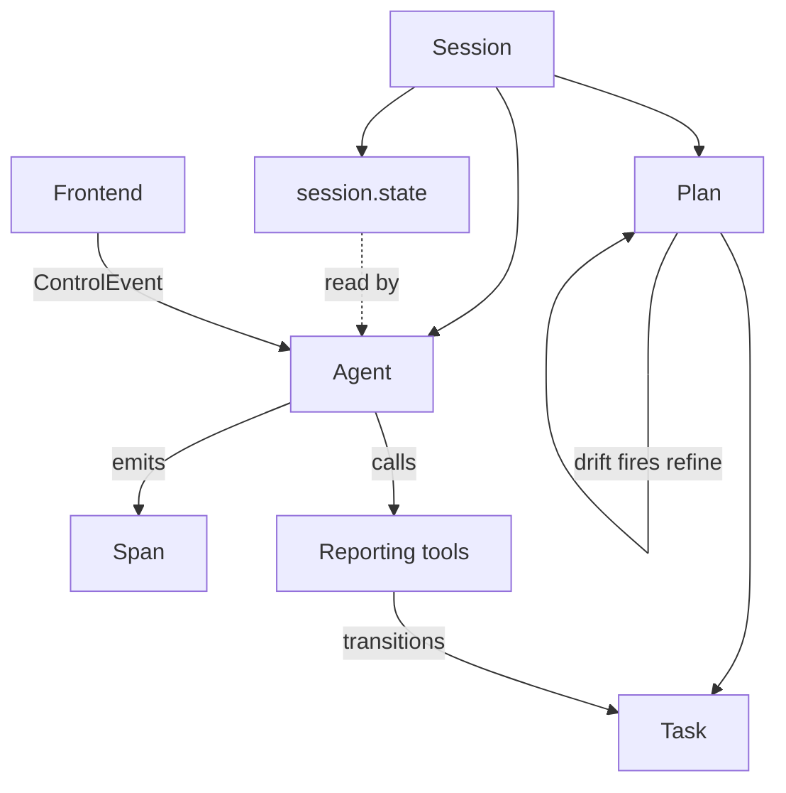
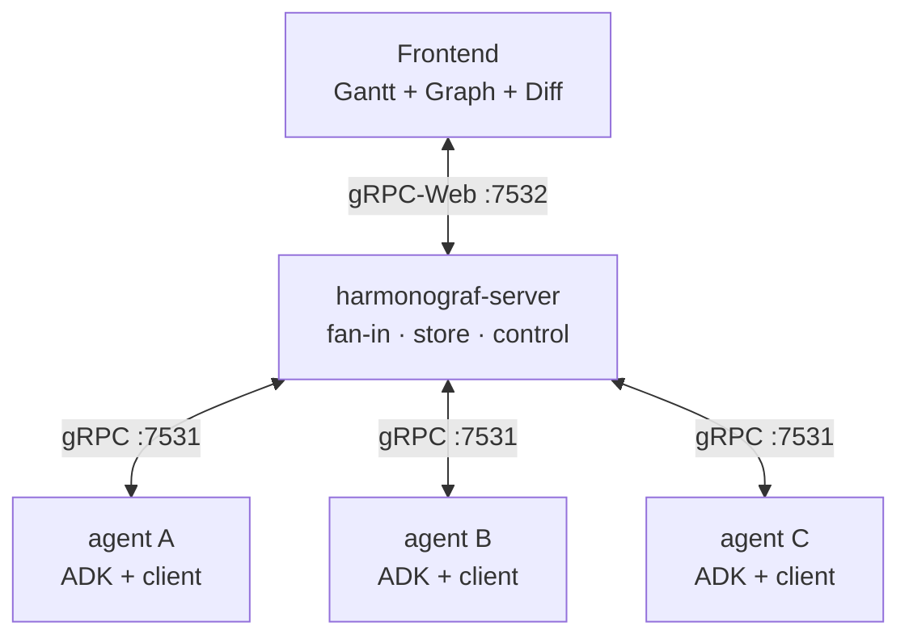
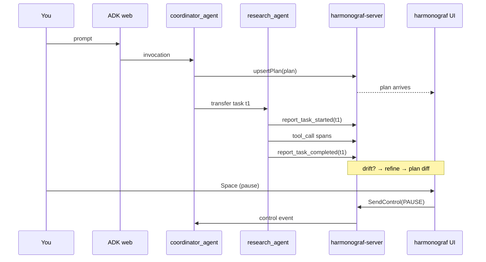

# The 15-minute tour

This is a narrative walk-through. By the end you should know what harmonograf
is, what problem it solves, what the main primitives are, how the three
components fit together, and what happens end-to-end when you type a prompt
into an agent. It's written to be read in roughly fifteen minutes.

If you want to skip straight to running the demo, read
[docs/quickstart.md](../quickstart.md) instead. Come back here afterwards to
understand what you were looking at.

---

## 1. The problem (2 min)

An LLM agent is easy to observe. You wrap each model call and each tool call
in a span, nest them into a tree, and render the tree as a waterfall. Done.

A *multi-agent* system breaks that model in four different ways.

**The plan is not the trace.** Real agent rollouts begin with a plan — a
structured list of tasks, usually with dependencies — and the whole point of
the run is to execute that plan. A span tree knows nothing about the plan. It
just shows you "whatever happened, in whatever order it happened". If the
plan changes halfway through (an agent discovers a missing step, a tool
errors, a reviewer flags an issue and a debugger is added), you see a
different tree — you don't see the *change*.

**Task state cannot be inferred from span lifecycle.** Harmonograf's own
earlier iterations tried this and got burned. A sub-agent whose span closes
is not necessarily done: it may have returned control while a background tool
continues. An LLM that emits "task complete" in prose may not have finished
anything. "I will complete the task" parses the same as "task complete".
Concurrent sub-agents running a parallel DAG produce ordering bugs whenever
state transitions are tied to callbacks instead of to the agent explicitly
announcing them.

**Observability without intervention is half a tool.** Multi-agent runs are
long, multi-step, and expensive. If you can see that an agent is stuck but
your only recourse is to kill the process and start over, you'll throw away
twenty minutes of work every time a small thing goes wrong. The console has
to let you *intervene* — pause, resume, steer, send a note — on the same
connection the telemetry came up on.

**Framework sandboxes are real.** ADK and frameworks like it run agents under
strict lifecycle hooks with tight restrictions on how you can influence
execution from outside. Any design that assumes "just attach a debugger and
patch the flow" doesn't work. Coordination has to go through the official
seams — session state, tool calls, event callbacks — or it doesn't work at
all.

Harmonograf is the console we wanted for this problem. Plan-aware. Explicit
about task state. Honest about drift. Bidirectional on the wire. Respectful
of the framework.

Longer-form version: [docs/overview.md](../overview.md).

---

## 2. The mental model in one page (3 min)

Every primitive you need to know fits on one page. Memorize these, and the
rest of the UI is self-explanatory. The deep version lives in
[mental-model.md](mental-model.md).

Here is the concept map — nine nouns, the relationships you'll see on the wire and in the UI:

- **Session.** A single agent run. Has an id, a title, a start time, maybe
  an end time, and a list of agents that participated. One harmonograf
  session corresponds to one user-facing invocation — one prompt, one roll-out.
- **Agent.** An actor inside the session. `coordinator_agent`,
  `research_agent`, `reviewer_agent`, etc. Has a name, a framework (usually
  ADK), and a connection to the server.
- **Span.** An event with a duration. Every LLM call, tool call, transfer,
  user message, agent message, and invocation is a span. Spans are *telemetry
  only* — they no longer drive task state. Think of them as the fine-grained
  record of what happened.
- **Task.** A unit of work the planner emitted. Has an id, a title, a
  description, an assignee (which agent is supposed to do it), and a status
  (`PENDING`, `RUNNING`, `COMPLETED`, `FAILED`). Tasks live in a plan.
- **Plan.** The DAG of tasks the planner built up front. Nodes are tasks,
  edges are dependencies. A session can have several plans over its
  lifetime — the original, plus any revisions after a drift event.
- **Drift.** When reality diverges from the plan. A tool errored. An agent
  refused. A new sub-task was discovered. The plan is stale. There are about
  two dozen drift kinds, each with defined semantics.
- **Refine.** The planner's response to drift. Harmonograf fires a
  *deferential refine* — a structured call back into the planner with the
  current plan and the drift context. The planner returns a revised plan.
  The frontend renders the diff as a banner with added / removed / reordered
  tasks.
- **Reporting tools.** The protocol agents use to tell goldfive what
  they're doing. `report_task_started`, `report_task_progress`,
  `report_task_completed`, `report_task_failed`, `report_task_blocked`,
  `report_new_work_discovered`, `report_plan_divergence`. Every
  sub-agent under `goldfive.wrap(...)` gets these tools injected
  automatically by goldfive's ADK adapter. Goldfive owns them; see
  [docs/reporting-tools.md](../reporting-tools.md) for the redirect.
- **session.state / SessionContext.** ADK's shared mutable dict.
  Goldfive's `SessionContext` carries the current task (and the rest of
  the plan-execution state) on `session.state`. Harmonograf does not
  write it — post-migration that's goldfive's job.
- **Control events.** Out-of-band instructions from the frontend to the
  agents: pause, resume, steer, cancel. They ride down a separate gRPC
  stream and are acknowledged upstream on the telemetry stream. The
  server records every control event as an **Intervention** on the
  session, surfaced in the Trajectory view.
- **Interventions.** Harmonograf's unified chronological log of every
  point the plan changed direction — user-driven (STEER / CANCEL /
  PAUSE) or autonomous (drift). Rendered on the Trajectory view as a
  horizontal marker ribbon with glyph-by-kind, color-by-source, and
  severity rings (harmonograf#69 / #76).

That's it. Nine primitives. Everything else in harmonograf is plumbing
around these.

---

## 3. The three components (2 min)

Harmonograf is three processes that share one data model.

**Client library** (`client/`). Embedded inside each agent process. Exposes
`Client` for span transport (with lazy Hello so no ghost sessions are
created under ADK), `HarmonografSink` (a `goldfive.EventSink`) to ship
plan/task/drift events up the telemetry stream, `HarmonografTelemetryPlugin`
(ADK `BasePlugin`) that emits spans on lifecycle callbacks and stacks
per-ADK-agent ids so the tree renders one row per agent, and an
`observe(runner)` helper that attaches both in one line. The
orchestration logic — task state machine, drift taxonomy, refine
pipeline, planner — lives in
[goldfive](https://github.com/pedapudi/goldfive); the harmonograf client
is the observability tap on top of it.

**Server** (`server/`). Terminates every client connection. Owns the
canonical timeline. Persists it to SQLite (or in-memory for tests). Fans out
live updates to any number of frontend subscribers. Routes control messages
from the frontend to the correct agent. Aggregates intervention history
across annotations, drift ring, and plan revisions. It is the fan-in
point: many clients, one server, one UI.

**Frontend** (`frontend/`). A React/Vite app. Talks gRPC-Web to the
server. Six views: Sessions picker, Activity (Gantt), Graph, Trajectory,
Notes, Settings. Renders the Gantt canvas, the agent topology graph, the
intervention timeline, the plan-revision banner and drawer, the inspector
drawer, the transport bar. Live-subscribes to every session update; no
refresh needed.

All three components share one data model, defined in
`proto/harmonograf/v1/*.proto` and regenerated via `make proto`. See
[docs/protocol/](../protocol/index.md) for the wire reference.

---

## 4. Click to completed Gantt chart (5 min)

Let's follow a single prompt through the whole stack. Imagine you've opened
the ADK web UI at `http://127.0.0.1:8080` and typed:

> Build a slide deck about the Python programming language with five slides,
> including an example snippet.

Here is the same rollout at a glance, before the prose walk-through. Each step is one beat in the timeline; drift and intervention are points where the loop diverges from the happy path.

Now in detail, at a level you can see in the harmonograf UI:

**Step 1 — the coordinator plans.** ADK routes your prompt to
`presentation_agent_orchestrated`. Under `goldfive.wrap(...)`, goldfive's
`Runner` owns the outer loop and asks `LLMGoalDeriver` + `LLMPlanner`
to derive a goal and emit a plan with tasks like `research_python`,
`design_outline`, `build_slides`, `review`. Goldfive fires
`PlanSubmitted`; `HarmonografSink` ships it up as a
`TelemetryUp.goldfive_event`; the server stores it and pushes a
`DELTA_TASK_PLAN` to every subscribed frontend.

**Step 2 — the frontend learns about the session.** The harmonograf UI's
session picker auto-selects the newest live session. Under lazy Hello
(harmonograf#85), the session id pinned on the row is the outer `adk-web`
session id, not a synthetic `sess_…` placeholder. The Activity (Gantt)
view renders one row per ADK agent as each agent emits its first span —
the coordinator appears first, then the specialists as goldfive
dispatches them. The task panel under the Gantt shows the plan; the
plan-revision banner briefly flashes that a new plan arrived.

**Step 3 — the first task starts.** Goldfive picks `research_python` and
dispatches `research_agent` via its ADK adapter. The `research_agent` row
appears on the Gantt the moment the plugin sees `before_agent_callback`.
Its first model turn produces a `report_task_started(task_id="t1")` call;
goldfive's `DefaultSteerer` intercepts it, transitions the task PENDING
→ RUNNING, and fires a `TaskStarted` event. The sink ships it, the
server updates its index, and the frontend repaints the bar.

**Step 4 — tool calls stream in.** `research_agent` makes a few tool calls:
a web search, a summarize call, maybe a payload-producing call that returns
a big document. Each becomes a span emitted upstream on the telemetry
stream. If the payload is big enough, the client library uploads it as
content-addressed chunks on the same stream. The frontend draws each tool
call as a colored bar on the `research_agent` row, breathing on a 2s loop
while it's still running. See
[docs/user-guide/gantt-view.md](../user-guide/gantt-view.md) for the bar
vocabulary.

**Step 5 — the task completes, the next one starts.** `research_agent`
calls `report_task_completed(task_id="t1", summary="Python is a...")`.
Goldfive's steerer transitions the task RUNNING → COMPLETED and fires
`TaskCompleted`. Goldfive dispatches the next task (`build_slides`) to
`web_developer_agent`. That agent's row auto-registers on its first span,
and a bezier curve — a cross-agent edge — connects the transfer span to
the new invocation.

**Step 6 — something drifts.** The `reviewer_agent` runs and finds an
issue with the generated HTML. It calls
`report_new_work_discovered(parent_task_id="t3", title="fix HTML bug",
assignee="debugger_agent")`. Goldfive emits a `DriftDetected` event with
kind `new_work_discovered`, fires a *refine* — a deferential call back
into the planner with the current plan and the drift context — and the
planner returns a revised plan with a new task spliced in. Goldfive
emits `PlanRevised`. Harmonograf stores the new revision, diffs it
against the previous plan, and the frontend renders the diff as a banner
("plan revised: +1 task"). Open the plan-diff drawer to see the added
task highlighted, or switch to **Trajectory** (↪ in the nav rail) to see
the whole intervention history — every drift, every plan revision,
every user-control event — as a horizontal marker ribbon. Click the new
marker to see drift kind, severity, body, author, and outcome
(`plan_revised:r2`). See
[docs/user-guide/trajectory-view.md](../user-guide/trajectory-view.md).
In the Gantt itself the drift also materializes a `goldfive` actor row
at the top of the plot — part of the actor attribution model
([docs/user-guide/actors.md](../user-guide/actors.md)). Full mechanism:
[docs/protocol/task-state-machine.md](../protocol/task-state-machine.md)
(which redirects to goldfive for the authoritative protocol).

**Step 7 — you intervene.** Say you notice `debugger_agent` is taking too
long. You press Space to pause all agents, or click a specific row to
pause just that agent. Alternatively, open the inspector drawer's
Control tab on the stuck span and type a STEER ("ignore the HTML
validator warnings and ship"). The frontend sends a `SendControl` RPC
to the server; the client's `ControlBridge` validates the STEER body
(harmonograf#72) and delivers it to goldfive's `ControlChannel`. The
server stamps `author` + `annotation_id` and records it on the session
as an Intervention. A new marker appears on the Trajectory view. If you
STEER the same target twice inside five minutes, the two interventions
**merge** into one card (harmonograf#81 / #87 user-control dedup).
Acknowledgments ride upstream on the telemetry stream so the Gantt
shows "paused at span X" in the right position. See
[docs/user-guide/control-actions.md](../user-guide/control-actions.md)
for every handle you have.

**Step 8 — completion.** The coordinator calls `report_task_completed` on
the root task. The session's status flips to `COMPLETED`. The Gantt shows a
session-completed badge at the top of the timeline. You can now scroll,
zoom, click any bar to open the inspector drawer and see arguments, return
values, errors, payloads. See
[docs/user-guide/drawer.md](../user-guide/drawer.md).

That's a full rollout. Nine primitives, three components, one canonical
timeline.

---

## 5. Where to go next (1 min)

You've got the tour. The next read depends on why you're here.

- **"I want to run this on my own agents."** → [docs/quickstart.md](../quickstart.md),
  then [docs/user-guide/](../user-guide/index.md), then
  [docs/reporting-tools.md](../reporting-tools.md) for how to instrument your
  agents.
- **"I want to modify harmonograf."** → [docs/dev-guide/](../dev-guide/index.md),
  starting at [setup.md](../dev-guide/setup.md) and
  [architecture.md](../dev-guide/architecture.md).
- **"I want to understand the protocol."** →
  [docs/protocol/](../protocol/index.md), starting at
  [overview.md](../protocol/overview.md).
- **"I want the primitives explained in depth."** →
  [mental-model.md](mental-model.md).
- **"I want to see how harmonograf terminology maps to ADK / OTel / other
  frameworks."** → [terminology-map.md](terminology-map.md).
- **"I want the whole site map."** → [docs/index.md](../index.md).

---

## Self-check — ten questions

By the end of the tour you should be able to answer all ten. If you can't,
re-read the relevant section.

1. Why can't you infer task state from span lifecycle?
2. What is the difference between a span and a task?
3. What is a plan, and how is it represented?
4. Name three drift kinds and one thing each triggers.
5. What does `report_task_completed` actually do, given that its body just
   returns `{"acknowledged": true}`?
6. What is written into `session.state` under the `harmonograf.` prefix,
   and who writes it?
7. What are the three components, and which one owns the canonical
   timeline?
8. Why do control acks ride upstream on the telemetry stream instead of on
   the control stream?
9. What is a refine, and what produces a plan diff?
10. What does the frontend do when you press Space on the Gantt view?

Answers are scattered across this document. If you want one-stop lookup,
the [mental-model](mental-model.md) page covers every concept in depth, and
[docs/protocol/](../protocol/index.md) covers the wire-level answers.
