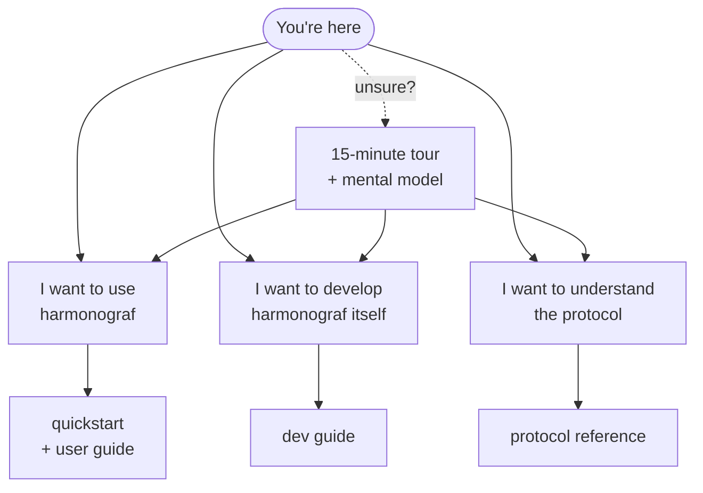

# Welcome to harmonograf

This is the front door. If you just landed in this repository and have no idea
what harmonograf is, or why it exists, or where the documentation lives — start
here.

Harmonograf is the **observability + HCI companion to
[goldfive](https://github.com/pedapudi/goldfive)** for multi-agent
systems. Think of it as what you'd want if you were trying to run a
fleet of LLM agents that cooperate on real work: a live Gantt chart of
what every agent is doing, a plan of what they're *supposed* to be
doing, a visible diff whenever reality and the plan drift apart, a
chronological log of every intervention (yours or autonomous), and a
bidirectional channel so you can actually steer the run instead of just
watching it.

Six views in the nav rail: **Sessions**, **Activity** (Gantt, one row
per ADK agent), **Graph** (agent topology), **Trajectory**
(intervention history ribbon), **Notes**, **Settings**. The headline
screen is Activity — time on the horizontal axis, a colored bar for
every LLM call, tool call, transfer, or task. Underneath it:
goldfive's explicit task state machine, drift taxonomy, and refine
pipeline, with a protocol designed so the frontend can talk back to the
agents on the same connection the telemetry came up on.

## Three doors

There are three kinds of reader who walk into harmonograf. The diagram below sketches the reading paths — pick the door that matches why you're here, or take the tour first and decide afterwards.

The three readers:

### I want to *use* harmonograf on my own agents

You're embedding the client library into your agents and running the server
and frontend to watch them. Go to:

- **[docs/quickstart.md](../quickstart.md)** — clone to running demo in under
  ten minutes.
- **[docs/user-guide/](../user-guide/index.md)** — the complete UI reference:
  Gantt view, graph view, inspector drawer, control actions, keyboard
  shortcuts, troubleshooting.
- **[docs/operator-quickstart.md](../operator-quickstart.md)** — server flags,
  retention, health probes, auth.
- **[docs/reporting-tools.md](../reporting-tools.md)** — the protocol your
  agents use to tell harmonograf what they're doing.

### I want to *develop* harmonograf itself

You're modifying the client library, server, frontend, or protos. Go to:

- **[docs/dev-guide/](../dev-guide/index.md)** — the full developer guide,
  ten files covering setup, architecture, per-component internals, testing,
  debugging, protos, and contribution workflow.
- **[docs/dev-guide/setup.md](../dev-guide/setup.md)** — day-one setup: clone,
  install, smoke-test, common pitfalls.
- **[docs/dev-guide/architecture.md](../dev-guide/architecture.md)** — the
  three-component architecture, the end-to-end span walk-through, where things
  live.
- **[docs/design/](../design/)** — the original per-component design notes.

### I want to *understand the protocol*

You're writing a new client adapter, debugging a wire issue, or implementing
a frontend against harmonograf. Go to:

- **[docs/protocol/](../protocol/index.md)** — the protocol reference. Ten
  files covering the three RPC channels, the data model, the task state
  machine, span lifecycle, payload flow, and wire-ordering guarantees.
- **[docs/protocol/overview.md](../protocol/overview.md)** — start here for the
  ten-minute mental model of telemetry / control / frontend-RPC tiers.
- **[docs/protocol/task-state-machine.md](../protocol/task-state-machine.md)**
  — the plan-execution protocol: session.state keys, reporting tools, drift
  taxonomy, refine pipeline.

## Before you pick a door: take the tour

If you don't yet have the vocabulary to know which door is yours, take the
**[15-minute tour](15-minute-tour.md)** first. It walks you from "never heard
of harmonograf" to "can run the demo and explain what they're seeing" in
about fifteen minutes of reading. You come out with a working mental model of
sessions, agents, spans, tasks, plans, drift, and refine — enough to pick the
right door without getting lost.

Companion reading once the tour clicks:

- **[mental-model.md](mental-model.md)** — the core primitives (sessions,
  agents, spans, tasks, plans, drift, refine, reporting tools, session.state,
  ContextVars, control events, annotations, payloads) explained as one
  cohesive model rather than a glossary.
- **[terminology-map.md](terminology-map.md)** — visual map showing how
  harmonograf concepts relate to ADK, OpenTelemetry, and other agent-framework
  terminology you may already know.

## The whole docs tree

For the complete site map of every document in `docs/`, grouped by audience,
see **[docs/index.md](../index.md)**.

For the project's charter and plan-execution protocol, see
**[AGENTS.md](../../AGENTS.md)**.

For the top-level tagline, architecture diagram, and README quickstart, see
**[README.md](../../README.md)**.
