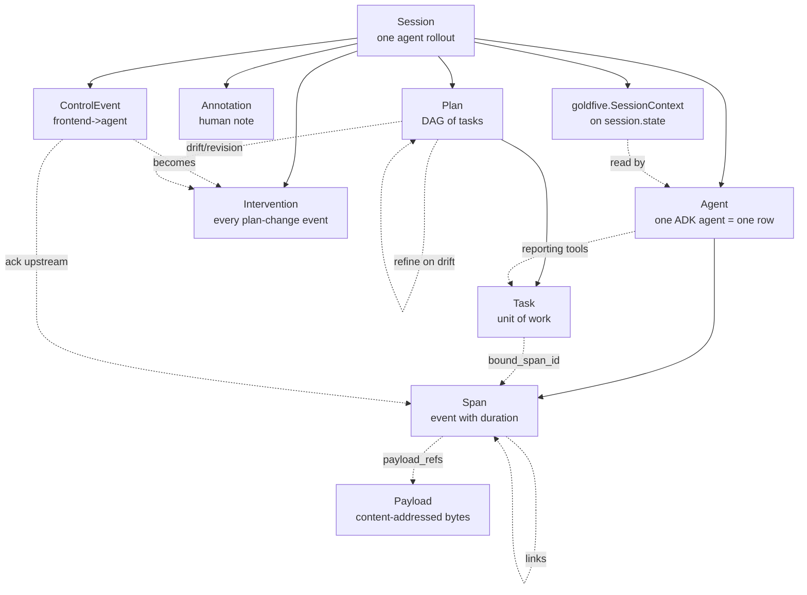
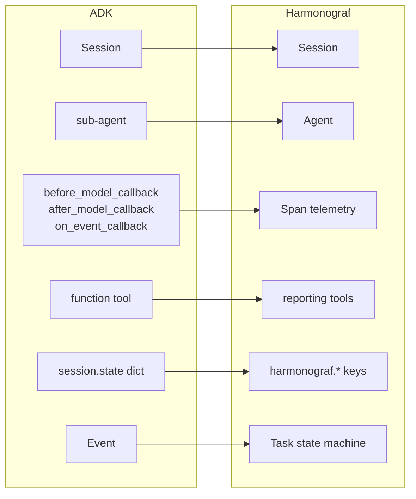
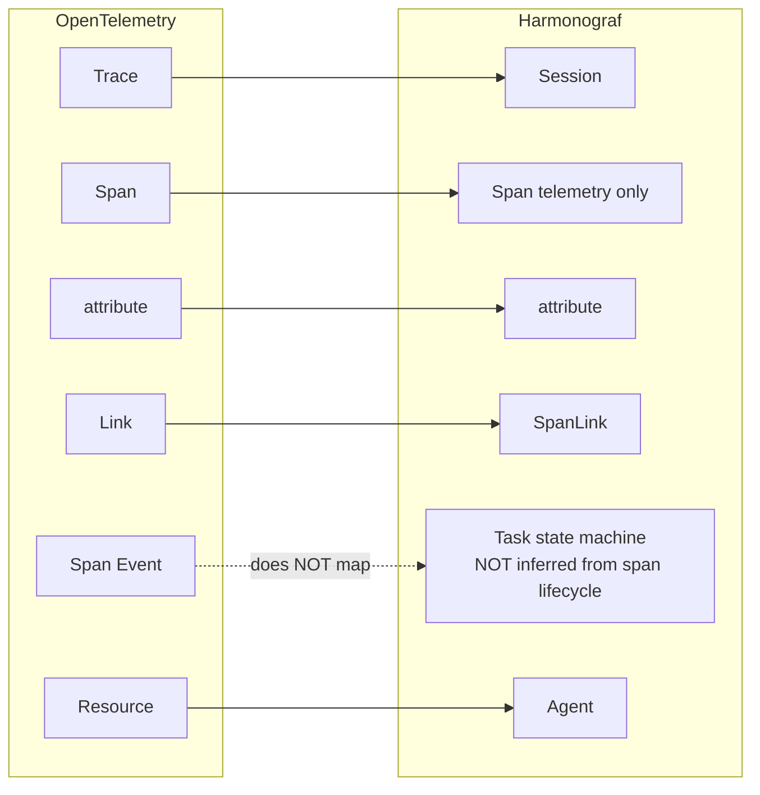
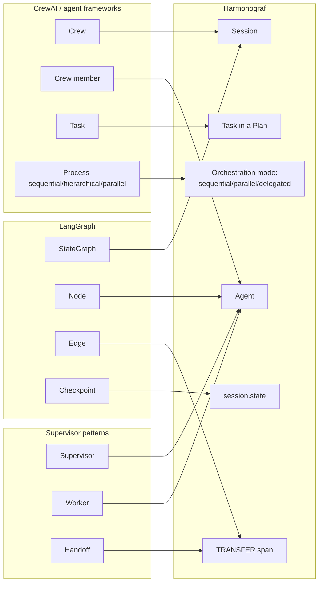

# Terminology map

Harmonograf reuses words from several neighboring worlds — ADK,
OpenTelemetry, general agent-framework discourse — and sometimes gives
them slightly different meanings. This page maps harmonograf vocabulary
to the vocabulary you may already carry in from elsewhere, so you can
translate without having to relearn.

If you are coming in cold with no prior vocabulary, skip this page and
read [mental-model.md](mental-model.md) instead.

---

## The primitives, at a glance

Read the diagram as "these are the nouns and how they reference each
other on the wire". The dashed arrows are indirect relationships (by id
rather than by containment). The plan-refine self-loop is the dynamic
part: drift produces a revised plan, which supersedes the previous one.

---

## ADK terms → harmonograf terms

If you've been building on Google's Agent Development Kit, most of the
concepts line up cleanly — harmonograf was designed around ADK first.

In prose:

- **ADK `Session` → harmonograf `Session`.** Same thing, same id.
- **ADK sub-agent → harmonograf `Agent`.** One ADK sub-agent = one
  harmonograf agent row on the Gantt.
- **ADK callbacks → harmonograf spans.** Every
  `before_model_callback` / `after_model_callback` / `before_tool_callback`
  / `before_agent_callback` / `after_agent_callback` fires a span
  emission. Harmonograf attaches to these callbacks via
  `HarmonografTelemetryPlugin`. Agent callbacks also stack
  `per_agent_id` so the Gantt renders one row per ADK agent
  (harmonograf#74 / #80).
- **ADK function tools → goldfive reporting tools.** The seven
  `report_*` tools are ordinary ADK function tools, injected by
  `goldfive.adapters.adk.ADKAdapter`. Goldfive's `DefaultSteerer`
  intercepts them in `before_tool_callback` to apply state transitions
  and fire events. Harmonograf observes those events via
  `HarmonografSink`, it does not intercept the tools.
- **ADK `session.state` dict → goldfive's `SessionContext` on `session.state`.**
  Goldfive owns the session-state protocol post-migration. The old
  `harmonograf.*` keys are retired; see
  `goldfive.adapters._adk_plugin.SESSION_CONTEXT_STATE_KEY`.
- **ADK events → harmonograf drift signals.** `on_event_callback`
  watches for `transfer`, `escalate`, and `state_delta` events as
  belt-and-suspenders drift signals.
- **What ADK does NOT have: an explicit task state machine, a plan DAG,
  drift kinds, refines, a canonical cross-agent timeline, or a
  bidirectional coordination channel.** Those are what harmonograf
  adds on top.

For the deep ADK integration details see
[docs/dev-guide/client-library.md](../dev-guide/client-library.md) and
[docs/design/12-client-library-and-adk.md](../design/12-client-library-and-adk.md).

---

## OpenTelemetry terms → harmonograf terms

Distributed-tracing terminology is a trap: the words are familiar but
the semantics diverge in critical places.

Where OTel and harmonograf line up:

- **OTel trace ↔ harmonograf session.** One trace = one session.
- **OTel span ↔ harmonograf span.** Same shape: id, parent_id, kind,
  name, start, end, attributes, links.
- **OTel attributes ↔ harmonograf attributes.** `AttributeValue`
  supports the same primitive types.
- **OTel link ↔ harmonograf `SpanLink`.** Same cross-trace / cross-span
  causality edge.
- **OTel resource ↔ harmonograf `Agent`.** A "resource" in OTel is the
  process emitting spans; a harmonograf agent is the equivalent scope.

Where they diverge — and where the divergence matters:

- **OTel infers "task state" from span lifecycle. Harmonograf does
  not.** In OTel, a finished span means an operation finished. In
  harmonograf, a finished span means a piece of telemetry finished; the
  task state is tracked separately via the reporting tools, precisely
  because span lifecycle gets task state wrong in multi-agent
  rollouts. This is the central architectural bet — see
  [docs/overview.md](../overview.md) for the motivation.
- **OTel has no concept of a plan.** Harmonograf's plan layer
  (`TaskPlan`, `Task`, `TaskEdge`) has no OTel analogue. A plan is not
  an otel thing.
- **OTel has no concept of drift or refine.** There is no OTel
  primitive that says "the plan changed". You'd have to bolt it on.
- **OTel has no bidirectional channel.** OTel is emit-only. Harmonograf's
  `SubscribeControl` has no OTel equivalent.
- **OTel spans can be re-parented / retroactively edited. Harmonograf
  spans are append-only once started.** See
  [docs/protocol/span-lifecycle.md](../protocol/span-lifecycle.md).

Practical advice: if you find yourself thinking "but in OTel we'd...",
pause and check whether the OTel instinct is driving you back toward
span-inferred state. That's the trap.

---

## Agent-framework terms → harmonograf terms

Every agent framework has its own vocabulary. Here is a rough map.

Key correspondences:

- **Crew / graph / supervisor "container" → harmonograf `Session`.**
  Whatever top-level object your framework uses to bundle agents, it
  maps onto a session.
- **Crew member / graph node / worker → harmonograf `Agent`.**
- **Crew task / graph node-as-task / worker assignment → harmonograf
  `Task`.** Note the distinction: harmonograf separates the *agent*
  (who does the work) from the *task* (what work is done), even though
  in some frameworks they're fused.
- **Process mode (sequential / hierarchical / parallel) → harmonograf
  orchestration mode (`sequential` / `delegated` / `parallel`).**
  Harmonograf's parallel mode uses a rigid-DAG walker with a
  forced-task-id ContextVar; see
  [docs/protocol/task-state-machine.md](../protocol/task-state-machine.md).
- **Handoff / transfer / delegation → harmonograf `TRANSFER` span,
  plus a cross-agent `SpanLink`.** Transfers are the things that
  originate the bezier curves on the Gantt view between agent rows.
- **Checkpoint / shared memory → harmonograf `session.state` with the
  `harmonograf.*` keys.**

If your framework doesn't have an explicit plan-versus-execution split,
expect harmonograf's plan layer to feel unfamiliar at first. The
mental-model page walks through it step by step:
[mental-model.md](mental-model.md).

---

## UI vocabulary

The frontend has a few words that don't map onto the backend primitives
one-to-one. Here are the ones that trip people up:

| UI term | Backend primitive | Notes |
|---|---|---|
| **Sessions view** | the session picker | One row per ADK session post-lazy-Hello (harmonograf#85). |
| **Activity view** | the Gantt view | The main timeline. Selected from the nav rail under the `!` icon. |
| **Graph view** | agent topology graph | Nodes = ADK agents, edges = transfers / tool invocations. |
| **Trajectory view** | the intervention history ribbon (#69 / #76) | One marker per Intervention; glyph-by-kind, color-by-source, severity ring. |
| **Notes view** | session-wide annotation stream | Every annotation posted on the session. |
| **Row** | an `Agent` | One row per ADK agent — auto-registered from first-span hints (harmonograf#74 / #80). |
| **goldfive row** | the synthetic actor row for goldfive events | Drift and user-steer events materialise bars here. |
| **Bar** | a `Span` | Color = span kind, fill pattern = status. |
| **Ghost bar** | a predicted span from a `Task` (dashed, 30% opacity) | The planner's prediction; replaced by a real bar once the task actually runs. |
| **Breathing bar** | a running span | 2-second pulse animation while `end_time` is null. |
| **Cross-agent edge** | a `SpanLink` of kind transfer | Bezier curve between two bars on different rows. |
| **Plan-revision banner** | a refine result | Appears when a new plan revision arrives. |
| **Plan-diff drawer** | the diff against the previous revision | Shows added / removed / reordered / re-parented / re-assigned tasks. |
| **Intervention marker** | one `Intervention` | On Trajectory; clickable popover with author, body, outcome. |
| **Intervention card dedup** | user-control merging within 5 min | Second STEER/CANCEL/PAUSE on the same target collapses into the first card (harmonograf#81 / #87). |
| **Current task strip** | the task currently bound to the active span | Post-migration the source is goldfive's `SessionContext`, not `harmonograf.*` keys. |
| **Live-tail cursor** | server's `latest_span_time` per session | The right-edge follower on the Gantt. |
| **Transport bar** | frontend control emitting `SendControl` events | Pause / resume / follow-live / zoom. |
| **Inspector drawer** | the `GetSpanTree` or task-specific data for the selection | Tabs: Summary, Task, Payload, Timeline, Links, Annotations, Control. |
| **Attention badge** | computed by the server's liveness tracker | Highlights stuck / slow agents on the session picker. |

For the full UI reference see
[docs/user-guide/index.md](../user-guide/index.md). For keyboard
shortcuts specifically,
[docs/user-guide/keyboard-shortcuts.md](../user-guide/keyboard-shortcuts.md).

---

## Common false friends

A short list of terms that sound the same in two worlds but mean
different things.

- **"Event"**. In OTel, a point-in-time annotation on a span. In ADK,
  a message on the event stream. In harmonograf, a control event. Three
  different concepts. Always prefix the term with the world you're in.
- **"State"**. In ADK, `session.state` is a mutable dict. In
  harmonograf, "task state" is the monotonic state machine
  (`PENDING → RUNNING → COMPLETED/FAILED`). The two are unrelated
  except that harmonograf happens to write some of its task context
  into ADK's state dict.
- **"Plan"**. In some frameworks, a plan is an LLM's chain-of-thought
  scratchpad. In harmonograf, a plan is a structured DAG artifact with
  an id, a revision, and stored tasks and edges.
- **"Task"**. In OTel, often a synonym for span. In harmonograf, a
  task is an object in the plan layer, completely disjoint from any
  span.
- **"Transfer"**. In ADK, a sub-agent handoff. In harmonograf, a span
  with kind `TRANSFER`, which is exactly the same underlying operation
  — the vocabulary agrees here.
- **"Ack"**. In most RPC systems, a per-message ack on whatever stream
  sent the message. In harmonograf, control events ride down on
  `SubscribeControl` but their acks ride **upstream** on
  `StreamTelemetry`, for happens-before ordering with spans. See
  [docs/protocol/wire-ordering.md](../protocol/wire-ordering.md).

---

## Where to go from here

- **[15-minute-tour.md](15-minute-tour.md)** — the narrative
  walk-through.
- **[mental-model.md](mental-model.md)** — the primitives explained as
  a cohesive model.
- **[docs/protocol/data-model.md](../protocol/data-model.md)** — the
  wire-level shape of every entity mentioned here.
- **[docs/protocol/task-state-machine.md](../protocol/task-state-machine.md)**
  — the plan / state / drift / refine machinery in full detail.
