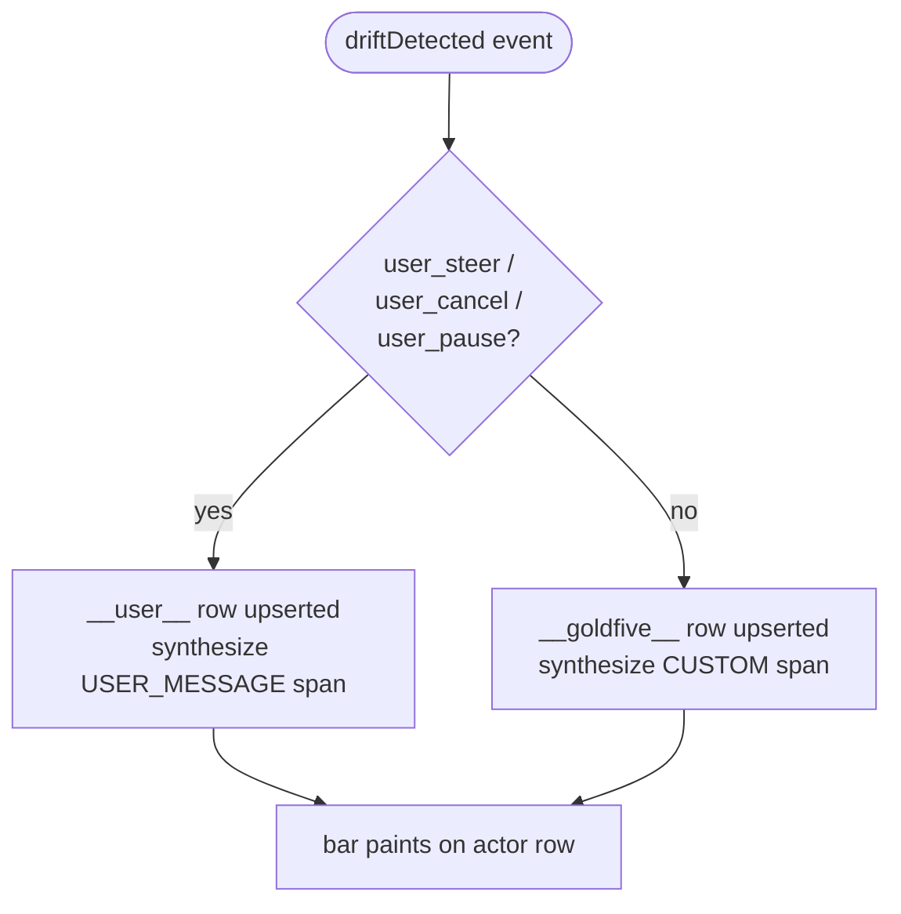

# Actors — who's really in the run?

A harmonograf session is not just the worker agents. There are two other
parties who *act on* the run from outside the agent code: **you** (the
operator, via the UI) and **goldfive** (the orchestrator, via drift
detection, refines, and plan revisions). This page is about how harmonograf
makes those two parties visible as first-class rows across every view.

## The problem

In an earlier iteration of harmonograf, drifts and user steerings showed up
as banner pills, drawer entries, and colored pivots — but they were never
visually attributed to who caused them. The worker agents had rows and
bars; the orchestrator and the operator did not. If you wanted to answer
"did that plan revision come from the LLM noticing something, or from me
clicking Pause?", you had to read the drift kind and infer.

Attributing drifts to explicit actors solves that. Both the orchestrator and
the operator get their own rows, their own colors, and their own spans, so
their activity reads the same way as any worker agent's activity.

## Synthetic actor IDs

Two reserved agent IDs are used for these rows:

| Actor ID | Display label | Meaning |
|---|---|---|
| `__user__` | `user` | You. Anything drift-kinded `user_steer`, `user_cancel`, or `user_pause` gets attributed here. |
| `__goldfive__` | `goldfive` | The orchestrator. Every other drift kind — model-initiated, executor-initiated, tool failures, discoveries — gets attributed here. |

Both prefixes are reserved (`__…__`); real agent IDs never collide. The
rows are managed by `frontend/src/theme/agentColors.ts` and
`frontend/src/rpc/goldfiveEvent.ts` — in particular, they have fixed colors
outside the hashed `schemeTableau10` palette so a real agent's color can
never shadow them.

| Actor | Color | Rationale |
|---|---|---|
| `user` | warm pastel (`#d0bcff`) | Reads as "person" at a glance. |
| `goldfive` | cool cyan (`#80deea`) | Reads as "orchestrator / infrastructure". |

## When they materialize

Actor rows are **lazy**. Neither row appears until the session produces an
event that attributes to it. An agentic run that never drifts and never
gets steered will show only its worker rows — no `goldfive` row, no `user`
row.

The materialization rule is in `ensureSyntheticActor()` in
`frontend/src/rpc/goldfiveEvent.ts`:

The event flow:

1. A drift is detected — either by the client library (tool error, agent
   reported divergence), the orchestrator (plan divergence, unexpected
   transfer), or the user (steering, cancel, pause).
2. The server fans it out as a `goldfive.v1.Event` with `drift_detected`.
3. The frontend's goldfive-event dispatch appends a `DriftRecord` to the
   session's drift ring *and* synthesizes a span on the appropriate actor
   row.
4. The actor row is upserted into `store.agents` if it isn't already there
   (with `connectedAtMs = 1` so real agents — which connect later — sort
   below it).

## Row ordering

Actor rows always render **above** real worker rows on the Gantt. This is
because the actors are the *sources* of the work: goldfive emitted the plan
and reacts to drift, the operator steers the run, and the workers execute
what comes out the other side. Showing them at the top reads like a stage
where the directors sit above the players.

The ordering trick is in the upsert call: synthetic actors are marked with
`connectedAtMs = 1`, which beats anything that was created from a real
connection (real `AgentConnected` events carry absolute wall-clock values,
so even a session that started at epoch 0 is beaten by 1 ms). The metadata
flag `harmonograf.synthetic_actor = "1"` lets view code detect and style
these rows specifically (e.g. different row label styles, the lack of a
"framework" pill, etc.).

## Reading activity on the actor rows

On the **Gantt**, actor-row spans look like any other span — a colored bar
at the time of attribution — with a few differences:

- The `__user__` row emits `USER_MESSAGE`-kinded spans so they read as
  "something the user did" in the legend.
- The `__goldfive__` row emits `CUSTOM`-kinded spans with a `drift.kind`
  attribute on them; click one to open the inspector drawer and see the
  full drift context (kind, severity, detail, target task id, target agent
  id).
- Both rows persist the synthesized span into the spans store as
  `harmonograf.synthetic_span = true`, so downstream code can distinguish
  them from client-reported spans if needed.

On the **Trajectory view**, the same drifts power the ribbon's drift
markers. Stars (★) are the actor=user drifts, circles (●) are the actor=
goldfive drifts. The color is severity in both cases. See
[trajectory-view.md](trajectory-view.md#reading-the-ribbon).

On the **Graph view**, actor rows appear as participant lanes alongside
the real agents; messages between actors and agents render with the same
arrow / label vocabulary as agent-to-agent transfers.

## Replay across reconnects

Drift events are fanned out live, but they're *also* replayed during the
initial burst when a frontend (re)subscribes. The server keeps a bounded
in-memory ring of recent drifts (up to 500 per session, managed by
`IngestPipeline` in `server/harmonograf_server/ingest.py`) and re-emits
them on the WatchSession initial burst. Without this, a frontend that
connects after the drift has already fired would see worker rows only —
the actor rows would stay hidden, because they're lazy-materialized from
the drift events themselves.

Implementation detail: this replay step is step 4b.1 of the initial burst
in `server/harmonograf_server/rpc/frontend.py`'s WatchSession. The server
iterates `self._ingest.drifts_for_session(session_id)` and re-emits each
as a `goldfive.v1.Event` with `drift_detected` before dropping into the
live-tail loop.

## Interacting with actor rows

Most interactions behave like any other agent row:

- **Click a bar** on the actor row → inspector drawer opens on the
  synthesized drift span. The drawer's **Summary** tab shows the drift
  kind + severity + detail; the **Payload** tab shows the raw attributes.
- **Hover** → the popover shows `kind · severity — detail` just like the
  trajectory ribbon does.
- **Focus / hide** toggles on the gutter work the same way as on worker
  rows (see
  [gantt-view.md#focused-and-hidden-agents](gantt-view.md#focused-and-hidden-agents)).
  If you want a stripped-down Gantt without the actor rows for a
  screenshot, hide them.

## Frequently asked

**Why aren't control actions (pause / resume) synthesized as spans?** They
*are* — but only when they cause a drift. A pause that is acknowledged
without changing the plan shape is telemetry on the control stream, not a
drift. If you pause and the planner decides to refine in response (e.g.
because the pause made a task blocked), the resulting drift shows up on
the `__user__` row.

**Can I disable actor rows?** Not via a toggle, but if a session never
drifts, neither row materializes. The design decision was to make the
feature free-on-no-drift rather than opt-in.

**Why are the actor IDs double-underscored?** To reserve them from the
agent-id namespace. Client libraries that accidentally name an agent
`user` or `goldfive` won't collide — the `__…__` pair is explicitly
documented as harmonograf-reserved.

**Does this change goldfive?** No. All of the attribution happens in
harmonograf's frontend and server. Goldfive emits the same
`drift_detected` events it always has; harmonograf synthesizes the actor
rows and spans on top.

## Related pages

- [Trajectory view](trajectory-view.md) — the other place actor-attributed
  drifts show up, as ribbon markers.
- [Tasks and plans](tasks-and-plans.md#drift-kinds) — the full drift kind
  taxonomy with icons and categories.
- [Gantt view](gantt-view.md) — the main home of the actor rows.
- [Control actions](control-actions.md) — how you send steerings that
  become `user_steer` drifts.
