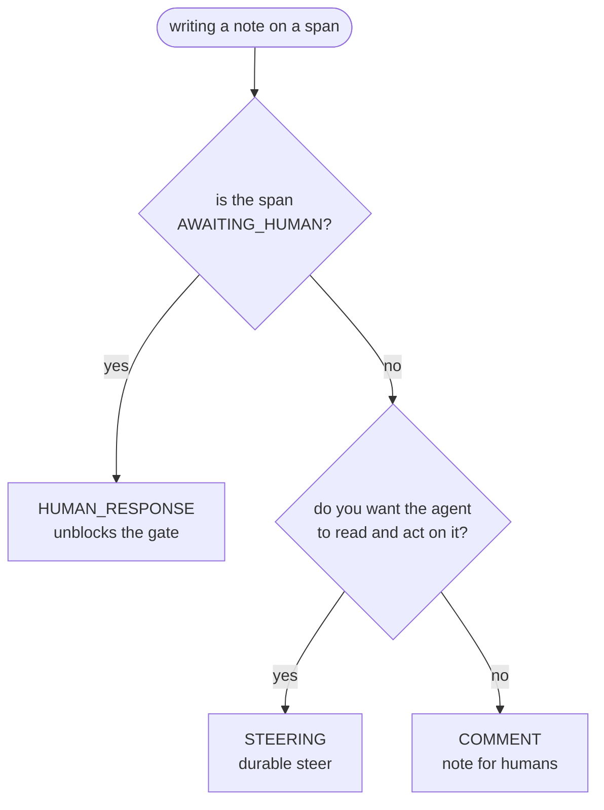

# Annotations

Annotations are human-authored notes attached to a span. They live
alongside the span in the store, show up as pins over the Gantt, and are
persisted server-side so a session's annotation history is preserved
across reloads.

There are three annotation **kinds**, and the distinction matters because
the server and client libraries treat them differently.

Picking the right kind comes down to who you're writing for: yourself, the agent, or a gate the agent is waiting on. The decision tree below covers every case.

## The three kinds

| Kind | Semantics | Typical use |
|---|---|---|
| `COMMENT` | Pure note. Informational. Does not flow back to the agent as input. | Post-mortem markers, "look at this", code-review style notes. |
| `STEERING` | A steering instruction for the agent. May be picked up by the client library and merged into the next turn. | "Stop calling grep, use ripgrep." The same intent as a STEER control, but as durable text instead of a one-shot payload. |
| `HUMAN_RESPONSE` | A reply to a span that is blocked on a human (`AWAITING_HUMAN`). | Answering an agent's clarifying question. |

**What determines which to use?** The kind is a declaration of *intent*:

- Use **COMMENT** when you are writing a note for yourself or a
  teammate, not for the agent.
- Use **STEERING** when you want the agent to read the note and change
  what it's doing.
- Use **HUMAN_RESPONSE** only when the span is explicitly awaiting a
  human decision (status `AWAITING_HUMAN`).

The client library is responsible for honoring the kind. A
well-behaved client will route `STEERING` annotations into the next
model turn and `HUMAN_RESPONSE` annotations into the awaiting gate. A
client that ignores `STEERING` annotations won't break — they'll still
be stored — but they won't have the intended effect. If your agent
ignores steering annotations, open an issue against the client library
or use a `STEER` control (see [control-actions.md](control-actions.md))
instead.

## Where to annotate

Annotations can be posted from several surfaces:

### Drawer → Annotations tab

The most deliberate surface. Open the [drawer](drawer.md#annotations-tab)
on the span you want to annotate, switch to the Annotations tab, type in
the textarea, and click **Post comment**. This tab posts with kind
`COMMENT`.

Posted annotations land in the store optimistically (you see them
immediately) and are upserted with the canonical record when the server
acks. If the server rejects, the annotation renders in an error state.

Errors render inline; the text field retains its value on failure so
you can retry without retyping.

### Span popover → Annotate

Right-click a span or hover it to open the
[popover](drawer.md#span-popover), then click **Annotate**. This
shortcut uses `window.prompt` for the text, which is fast but not
resizable. Good for single-sentence notes.

Kind: `COMMENT`.

### Span context menu

Right-clicking a span also exposes an **Annotate** entry via
`SpanContextMenu.tsx`. Same behavior as the popover shortcut.

### Global `a` shortcut

`a` is reserved in `shortcuts.ts` for "annotate selected span" and will
open an inline editor when task #14 lands. Today the handler is a stub —
use the drawer or the popover instead.

### Steering from the popover is a control, not an annotation

The popover's **Steer** button sends a `STEER` **control**, not a
`STEERING` annotation. The two are related but different:

- A **STEER control** is a one-shot message. It goes through the
  control channel, is acked, and disappears. Fast and explicit.
- A **STEERING annotation** is a durable note. It's stored on the span,
  visible to anyone who opens the drawer later, and can be re-read by
  the client on subsequent turns.

Use the control when you want to course-correct right now; use the
annotation when you want the steer to be part of the session record.

## Where annotations show up

Once posted, annotations are visible in these places:

- **Drawer → Annotations tab** — the authored-by-you list for the
  selected span. Errors and pending states render inline.
- **Pin strip** over the Gantt — a compact row of pin markers across
  the top of the plot; each pin corresponds to a span that has at least
  one annotation. Click a pin to jump to that span and open the drawer.
- **Notes section** in the nav rail (the ✎ icon) — a session-wide list
  of every annotation, sorted by time. Useful for a post-hoc walk-through
  of what was said where.

## Who wrote what

Each annotation stores an `author` field. The default author is `user`,
set client-side when you post from the frontend. A deployment that
authenticates multiple operators can override the author string
server-side; as of iter16 there is no user-identity system in the
frontend itself.

## Deleting / editing

Annotations are append-only in the current iter. There is no UI to
delete or edit an annotation once posted. If you need to retract
something, add a follow-up annotation.

## Related pages

- [Drawer → Annotations tab](drawer.md#annotations-tab) — the primary compose surface.
- [Control actions → Steer](control-actions.md#steer) — the one-shot sibling of a STEERING annotation.
- [Tasks and plans → Drift kinds](tasks-and-plans.md#drift-kinds) — `user_steer` fires when the planner attributes a replan to an operator steer (via either control or annotation).
