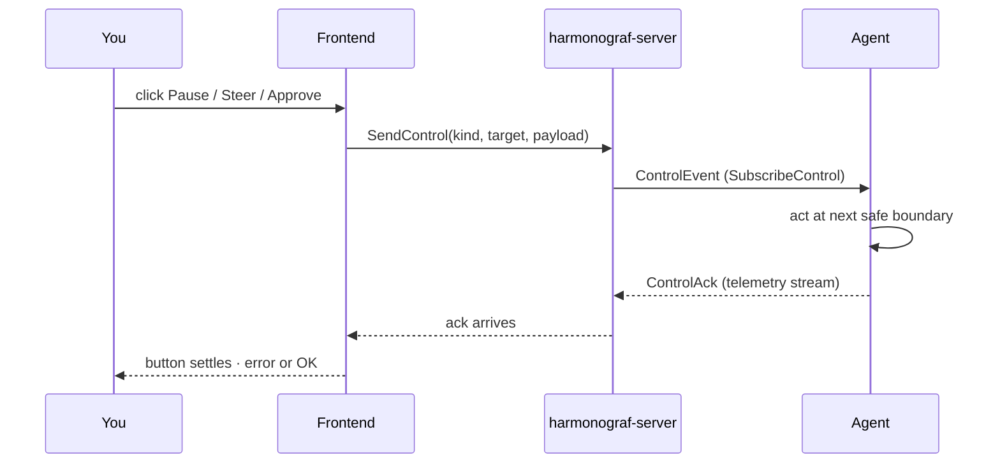

# Control actions

Control actions are the ways harmonograf pushes back into a running agent.
Everything you do through these surfaces turns into a **control message**
on the session's control channel, routed from the frontend through the
server to one or more client processes.

This page is the reference: what each action does, where you invoke it,
and what "capability negotiation" means when your agent doesn't implement
some of them.

## The control lifecycle

A control action is a small round-trip: a UI surface emits a `ControlEvent`, the server routes it to the right agent over `SubscribeControl`, the agent acts at its next safe boundary, and the ack rides back upstream on the telemetry stream where the UI sees it.

## The control kinds

`ControlKind` — the wire enum the frontend can send:

| Kind | What it asks the agent to do |
|---|---|
| `PAUSE` | Stop doing new work at the next safe boundary (typically the next model turn). In-flight tool calls finish. |
| `RESUME` | Resume after a pause. |
| `CANCEL` | Cancel the current invocation. Harder stop than pause — any in-flight tool call aborts if the client supports it. |
| `REWIND_TO` | Roll back to the span id in the payload and continue from there. Requires the agent to have checkpoints. |
| `INJECT_MESSAGE` | Inject a user-turn message into the conversation. |
| `APPROVE` | Approve a span that is blocked on a human decision (`AWAITING_HUMAN`). |
| `REJECT` | Reject the same. Payload may contain a rejection reason. |
| `INTERCEPT_TRANSFER` | Block an in-flight agent transfer. |
| `STEER` | Deliver a free-text instruction to the agent. The client decides how to merge it into the model turn. |
| `STATUS_QUERY` | Ask the agent to report its current activity. The response is surfaced through the ack detail. |

The frontend sends these via `sendControl`
(`frontend/src/rpc/hooks.ts`). Every control carries a `sessionId`, an
optional `agentId` and `spanId` target, a `kind`, and an opaque byte
payload.

## Capability negotiation

Not every agent supports every control. When an agent connects via
`Hello`, it advertises a **capability set** which the server forwards to
the frontend. The enum is `Capability`:

| Capability | Controls it unlocks |
|---|---|
| `PAUSE_RESUME` | `PAUSE`, `RESUME` |
| `CANCEL` | `CANCEL` |
| `REWIND` | `REWIND_TO` |
| `STEERING` | `STEER`, `INJECT_MESSAGE` |

The frontend does **not hide** buttons for controls an agent hasn't
advertised today — send is best-effort and a server- or client-side
rejection will surface as an error string in the originating surface
(e.g. the drawer's Control tab inline error line). This keeps control
discoverable even when the capability set is stale, at the cost of some
confusing failure modes. Read the error if a button seems to do nothing.

Approve/reject and status-query are always available — they're not
gated on a capability flag because every agent is expected to handle
them (or silently ack if they cannot).

## Where controls live in the UI

Four surfaces emit control messages today:

### 1. Transport bar (session-wide)

The transport bar at the bottom of the [Gantt view](gantt-view.md) has
session-wide transport buttons:

- **⏸ Pause** — pauses **every agent** currently known to the session.
  Under the hood it sends a `PAUSE` control to each agent id in the
  session's agent list, plus it freezes the renderer so bars stop
  extending. The status indicator switches from `LIVE` to `⏸ AGENTS
  PAUSED`.
- **▶ Resume** — the inverse. Unfreezes the renderer, re-enables
  live-follow, sends `RESUME` to every agent.
- **↩ Follow live** — appears when live-follow is off (because you
  panned or paused). Viewport-only; does not send a control.
- **⏮ Rewind to selected** and **⏹ Stop** — these are currently
  placeholders in the transport bar (disabled when there's no session,
  wired to `sendControl` in a later task). Use the drawer's Control tab
  for the working versions.
- **+ / −** zoom buttons — viewport-only.

Pause/resume on the transport bar is best-effort: the renderer goes into
the paused state immediately (so you see the frozen view) regardless of
whether the controls were acked. If the agents don't actually honor the
control, span data will resume streaming in as soon as you resume — but
the visual freeze is local.

### 2. Drawer → Control tab (span-scoped)

The [drawer's Control tab](drawer.md#control-tab) is where you do
precise, span-scoped control. The span's agent id and span id are
already filled in, so whatever you send targets that agent.

- **Approve / Reject** — visible only when the span is in the
  `AWAITING_HUMAN` state. `APPROVE` sends with no payload; `REJECT`
  sends with a default "rejected" payload.
- **Steer** — a textarea and a `Send steer` button. The text becomes the
  payload of a `STEER` control.
- **Pause agent / Resume / Cancel / Rewind to here** — each sends a
  control scoped to this span's agent. `Rewind to here` uses the span
  id as the payload (so the agent knows which checkpoint to roll back
  to).
- Errors render as a red inline line under the buttons.

### 3. Span popover (quick-look)

The popover anchored to a span (hover or click) has a compact action
row:

- **Steer** — opens an inline steering editor with two modes:
  - **⚡ Cancel & redirect** — the payload is JSON `{mode:"cancel", text}`.
    The client is expected to cancel the current run and pick up the
    steer text as the redirect.
  - **+ Add to queue** — JSON `{mode:"append", text}`. The steer is
    queued for the next model boundary instead of cancelling in
    flight.
  - `⌘↵` sends, `Esc` closes.
- **Annotate** — a `window.prompt` shortcut for leaving a comment on
  this span. Same as posting a `COMMENT` from the drawer's
  Annotations tab; see [annotations.md](annotations.md).
- **Copy id** — span id to clipboard.
- **Open drawer** — closes the popover and selects the span in the
  [drawer](drawer.md).

The popover is pin-able (📌 in the top-right). Pinned popovers stack
and don't auto-dismiss when another span is clicked — useful for
comparing two spans side-by-side or keeping a steer prompt staged.

### 4. Graph view — `↻ Status` button

Every agent header in the [Graph view](graph-view.md) has a small
`↻ Status` button. Clicking it sends a `STATUS_QUERY` control targeted
at that agent. The first ack's `detail` string is returned and feeds
into the agent's task report line on the header box. See
[STATUS_QUERY](#status-query) below for the contract.

## Action reference

### Pause / Resume

- Scope: per-agent (drawer) or session-wide (transport bar).
- Payload: empty.
- Expected behavior: the agent stops accepting new turns at the next
  safe boundary. In-flight LLM calls and tool calls finish on their
  own. `RESUME` resumes normal operation.
- Visual effect: transport bar switches between `LIVE` and `⏸ AGENTS
  PAUSED`. The renderer stops extending running bars.

### Cancel

- Scope: per-agent (drawer) or session-wide (transport bar `⏹`, when
  wired).
- Payload: empty.
- Expected behavior: the agent cancels the in-flight invocation. Harder
  than pause — tool calls abort if the framework supports it.
- Result: the cancelled span transitions to `CANCELLED` status and its
  bar renders with the diagonal-hatch cancellation look.

### Rewind

- Scope: per-span (drawer "Rewind to here"). The span id is the
  payload.
- Expected behavior: the agent rolls back state to the selected span
  and resumes from there. Requires checkpointing support on the agent
  side.
- Not all agents implement this — the drawer sends regardless and
  surfaces the error if the client rejects.

### Steer

- Scope: per-span (drawer or span popover).
- Payload: the text (or a JSON envelope from the popover's two-mode
  editor).
- Expected behavior: the agent merges the text into the next model
  turn, either by replacing the in-flight run (`cancel` mode) or by
  queueing it (`append` mode).
- Steering is the primary way to push back on a long-running agent
  without cancelling.
- Note: the `a` and `s` global shortcuts (annotate / steer) are reserved
  in `shortcuts.ts` but their handlers are stubbed pending task #14.
  Use the popover or drawer until that lands.

### Approve / Reject

- Scope: per-span. Only meaningful when the span status is
  `AWAITING_HUMAN` (the agent has explicitly blocked for a human
  decision).
- Payload: empty for approve, a short reason string for reject.
- Visual: the span renders with a red outline and a 1s pulse while
  `AWAITING_HUMAN`. After the control is acked, the span transitions to
  `OK` (approve) or `CANCELLED`/`ERROR` (reject).

### Status query

- Scope: per-agent. Exposed on the Graph view's agent header as the
  `↻ Status` button.
- Payload: empty.
- Ack semantics: `sendStatusQuery` awaits the first ack and returns its
  `detail` string. The detail is expected to be a short sentence the
  agent uses to describe what it's doing right now. It feeds into the
  agent's `taskReport` (or `currentActivity`) which the Graph header
  line re-reads.
- Timeout: 8 seconds. On error the call resolves to `''` — the button
  just stops spinning.
- Useful when an agent looks stuck: a successful status query proves
  the agent is at least still responsive.

### Inject message / intercept transfer

Both exist in the protocol but are not wired to a frontend control
today. Reserved for a future iter.

## Right-clicking a span

`SpanContextMenu.tsx` provides a right-click menu with the same quick
actions as the popover action row (steer, annotate, copy id, open
drawer). Think of it as a keyboard/pointer parity surface — use whichever
is faster.

## Confirmation policy

Harmonograf does not prompt for confirmation on any control action
today. Pause/resume/cancel/steer/approve/reject all take effect
immediately on click. Be careful with **Cancel** on a long-running
production run — there is no undo.

The one exception is the popover's steer editor, which requires you to
explicitly pick a mode (Cancel & redirect vs. Add to queue) before the
Send button is enabled — the modes are mutually exclusive and the
default is `cancel`.

## Related pages

- [Drawer → Control tab](drawer.md#control-tab) — the main surface.
- [Tasks and plans](tasks-and-plans.md) — drift kinds include `user_steer`
  and `user_cancel` when your controls trigger a replan.
- [Annotations](annotations.md) — the distinction between a steer and an annotation.
