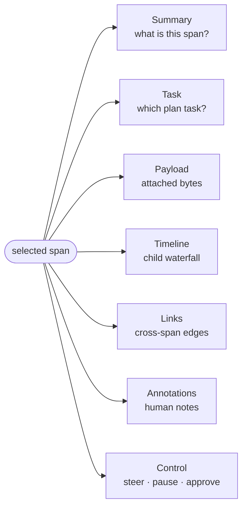

# The inspector drawer

The inspector drawer is the deep surface for one selected span. It slides in
from the right of the shell when you click a span on the [Gantt](gantt-view.md)
or an activation box on the [Graph](graph-view.md), and holds seven tabs of
detail plus a live "current task" header.

## Opening, closing, and what it binds to

- **Open:** click a span, press `j`/`k` to walk spans, or click an
  activation on the Graph. The drawer is open iff `selectedSpanId` is set.
- **Close:** click the ✕ in the drawer header, press `Esc`, or click empty
  canvas. The drawer state and task selection are cleared.
- **Live binding:** the drawer subscribes to its session's span store, so
  the content repaints whenever the selected span mutates — new attributes
  arrive, `endMs` fills in, a `task_report` attribute lands, etc. You do
  not need to reopen.

The drawer also performs **reverse reconciliation**: when you select a
span, it walks the TaskRegistry to find whichever task is bound to that span
(`task.boundSpanId === selected`) and sets the current task selection
accordingly. This is why clicking a span also highlights the matching task
chip in the task panel and on the Graph.

## The "Current task" header

Above the tabs the drawer reserves a small section for the session's
**current task** (the task the `TaskRegistry` is tracking as RUNNING, or the
most recently completed one if nothing is running). It shows:

- Title, status chip, description.
- Assignee agent id.
- A blue highlight border when the selected span's `hgraf.task_id` attribute
  matches the current task's id — i.e. "the span you're looking at is part
  of the current task".

This section exists alongside the [CurrentTaskStrip](tasks-and-plans.md#currenttaskstrip)
at the top of the shell: both read from the same source, the header is
specific to the drawer so you can see the task without leaving the drawer.

## The seven tabs at a glance

The drawer's body is a tab strip. Each tab answers a different question about the selected span — what it is, what task it belongs to, what payloads it carried, what it spawned, what links to it, what humans said about it, and what you can do to it.

## Tabs

| Tab | Contents |
|---|---|
| **Summary** | Status, agent, span id, parent id, duration, error (if any), full attribute table. |
| **Task** | Task report, model thinking, agent role, plan revisions for this task's plan, orchestration events timeline. |
| **Payload** | Attached payloads, one per role tab, lazy-loaded on demand. |
| **Timeline** | Per-child waterfall for nested spans under this one. |
| **Links** | Cross-span links grouped by relation (INVOKED, TRIGGERED_BY, WAITING_ON, FOLLOWS, REPLACES). |
| **Annotations** | Compose a comment on this span. See [annotations.md](annotations.md). |
| **Control** | Agent controls scoped to this span: approve/reject, steer, pause/resume/cancel, rewind-to. See [control-actions.md](control-actions.md). |

### Summary tab

The default landing tab. Reads like a debug dump:

- **Status** (`OK`, `ERROR`, `AWAITING_HUMAN`, `CANCELLED`).
- **Agent** id (monospace).
- **Span ID** and parent id if set.
- **Duration** — `formatDuration(ms)` for completed spans, `running` while
  the span is open.
- An inline **error block** when `span.error` is populated, showing the
  error type, message, and stack (when the client uploaded one).
- A full **Attributes** table. Values are shown raw except strings that look
  like JSON (start with `{` or `[`) — those are parsed and pretty-printed
  with a simple syntax highlighter. This is the default you want for
  inspecting ADK `tool.args` / `tool.result` strings.

Use the Summary tab to verify *what* the span actually is when something
looks wrong. If the Gantt shows a TOOL_CALL with no glyph and weird timing,
the Summary tab is where you'll see `tool.args` and `tool.result` side by
side.

### Task tab

The Task tab is the "what is the agent thinking" surface. It pulls from
several attributes the client may have written to this span:

- **Running indicator** — if the span is still open, a live dot + `Running`
  label, and a `💭 Thinking` annotation when `has_thinking` is true.
- **Current Task report** — the `task_report` attribute, shown in a
  monospace pre block. This is what the agent is telling harmonograf it's
  doing right now.
- **Model thinking** — prefers `llm.thought` (the HarmonografAgent
  aggregate), falls back to `thinking_text` and then `thinking_preview`
  (the plugin's streaming capture). Rendered monospace, ≤300px tall with
  its own scroll. The label says `(live)` when the span is still running
  and `has_thinking` is true.
- **Agent Role** — the `agent_description` attribute, if the client wrote
  one on the span.
- **Plan revisions** — the full revision history for the plan this span's
  task belongs to (falls back to the current RUNNING plan if the span
  isn't task-bound). See [Plan revisions](#plan-revisions-section) below.
- **Orchestration events** — an embedded
  [OrchestrationTimeline](#orchestration-events-section).

If none of the first four blocks has content, the tab shows
`No task information available.` and still renders the plan-revisions and
orchestration-events sections.

In this release: iter16's thinking-integration task (#4) is widening the
set of attributes this tab reads and surfacing deeper summaries. Assume the
layout may grow.

#### Plan revisions section

Lists every revision of the plan for this task, newest first. The latest
entry expands by default; older entries collapse.

Each row shows:

- A drift-kind icon, label, and category badge (driven by
  `parseRevisionReason` against `frontend/src/gantt/driftKinds.ts`).
- Relative timestamp (`HH:MM:SS`).
- Diff counts `+N -M ~K` and a `⇄` marker when the DAG edges changed.
- The revision reason detail.
- When expanded, the diff body: chips for added/removed tasks, a list of
  modified tasks with change descriptions, and a note when the DAG edges
  changed.

This is the same data the [PlanRevisionBanner](tasks-and-plans.md#planrevisionbanner)
surfaces in transient pills — the drawer is the history, the banner is the
ambient alert.

#### Orchestration events section

An embedded `OrchestrationTimeline` bounded to the last 20 events for the
session. It reports start / progress / complete / fail / block /
discovered / divergence events as the plan executes. Filter controls at
the top of the component let you restrict by kind, agent, time window,
and toggle noise-collapse for repeated progress ticks.

### Payload tab

Spans can carry one or more payloads — the full prompt, the full model
response, a tool result, an uploaded image, etc. The Payload tab renders
them.

- If the span has **no payload refs**, the tab reads
  `No payload attached to this span.`
- When there are multiple payloads, a sub-tab row at the top lets you pick
  which one is active. Sub-tabs use the `role` field if present (e.g.
  `prompt`, `response`, `result`), otherwise `payload N`.
- Each payload shows a header line with the first 12 chars of its digest,
  the MIME type, and the byte size.
- If the client *summarized* the payload at stream time, the summary
  renders under the header as a dim paragraph — this is always available
  even when the full bytes aren't loaded.
- The bytes are **not fetched eagerly**. Click **Load full payload** to
  fire the `getPayload` RPC. While loading, you see `Loading…`; on error,
  a red error line.

Rendering by MIME:

| MIME pattern | Renderer |
|---|---|
| `image/*` | `` with an object URL; revoked on unmount. |
| `application/json` | Pretty-printed JSON with syntax highlighting. Falls back to plain `<pre>` if parsing fails. |
| `text/*` | Plain `<pre>`. |
| Anything else | Hex dump of the first 4 KiB, with a `…(truncated)` suffix when more bytes exist. |

**Evicted payloads.** The client library may have dropped a payload under
backpressure (memory pressure, too many in-flight) rather than uploading it.
In that case the payload ref still exists with `evicted: true` — the tab
renders `Payload was not preserved (client under backpressure).` plus
whatever summary the client wrote before eviction. See
[Troubleshooting](troubleshooting.md#payloads-are-missing).

### Timeline tab

Shows a child waterfall: every span whose `parentSpanId` equals the
selected span, laid out as a horizontal track relative to the parent's
time range. Each child is a row with its kind/name label on the left and a
blue bar on the right. Positions are percentages of the parent's total
duration.

- Empty state: `No children recorded for this span.`
- Running parents use `now` as the end for scaling; running children
  extend out to the parent's end.

This tab is useful when you want to see what an INVOCATION decomposed into
without opening each child individually. For sibling-level relationships,
use the [Gantt](gantt-view.md) instead.

### Links tab

Groups the span's `links` array by `LinkRelation`. The tab shows an empty
state when the span has no links.

Groups render in a fixed order: `INVOKED`, `TRIGGERED_BY`, `WAITING_ON`,
`FOLLOWS`, `REPLACES`. Each row in a group shows the target agent id and
first 12 chars of the target span id. Clicking a row re-selects the drawer
on that target span.

This is how you walk across a TRANSFER → target invocation → return chain.
The [Graph view](graph-view.md) visualizes the same information spatially.

### Annotations tab

Compose a `COMMENT`-kind annotation on this span. A textarea plus a
`Post comment` button. Errors render inline under the button. Annotations
committed here appear in the Notes view and in the annotation pin strip
over the Gantt.

For the deeper model (`COMMENT` vs `STEERING` vs `HUMAN_RESPONSE`) see
[annotations.md](annotations.md).

### Control tab

Agent controls scoped to this span. See
[Control actions](control-actions.md) for the full reference on what each
control does, server capability negotiation, and when to use which.
Summarized here:

- **Approve / Reject** — shown when the span's status is `AWAITING_HUMAN`.
- **Steer** — a free-text box plus a send button. Sends a `STEER` control
  with the text as the payload.
- **Transport** — pause agent, resume agent, cancel, rewind to here.
- **Errors** — displayed inline under the buttons.

## Related pages

- [Gantt view](gantt-view.md) — how you select what the drawer shows.
- [Tasks and plans](tasks-and-plans.md) — for the current-task header and plan-revision content.
- [Control actions](control-actions.md) — detailed behavior of the Control tab.
- [Annotations](annotations.md) — the three annotation kinds.
