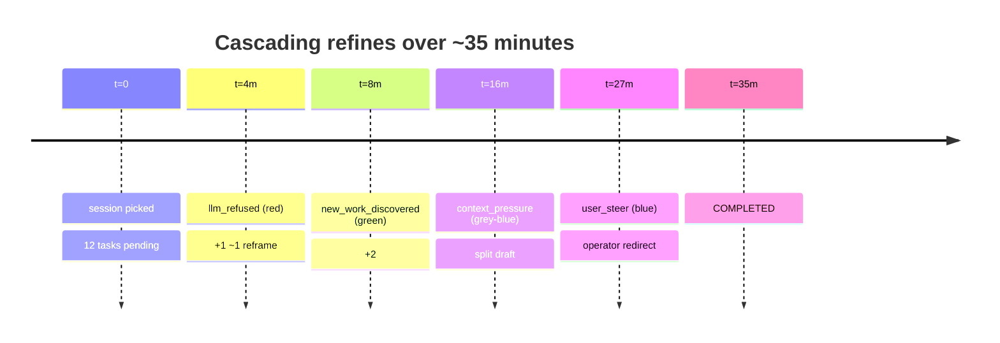

# Scenario: long-running plan with multiple refines and drift cascades

A large plan (twelve tasks) running over ~30 minutes. Four drift events
fire, each producing a plan revision. The second drift discovers new
work, the third hits a context pressure wall, the fourth is an operator
steer. This scenario is about **reading the cascade** without losing the
thread of what happened.

Four drifts hit one long session, each producing a plan revision. Use this as a map for the timeline below.



## Set-up

- Agents: `writer-coordinator` (`SEQ`), `drafter`, `fact-checker`,
  `editor`.
- Initial plan: twelve tasks — outline, draft N sections, fact-check,
  edit, finalize. All assigned across the three specialists.
- Session runs for ~35 minutes. Operator is occasionally in the room.

## Timeline

### t=0 — session picked

Normal `SEQ` start. Current task strip reads
`Currently: Outline · RUNNING · SEQ · writer-coordinator`. Task panel
shows twelve rows, one RUNNING.

### t=4 min — first drift: `llm_refused`

The drafter calls an LLM that flat-out refuses the request (safety
filter). The client catches this in `after_model_callback` and stamps
`drift_kind = "llm_refused"` on the active INVOCATION. The planner
refines.

UI:

- Pill: red `🚫 Refused` with detail `LLM refused to draft section 3:
  safety filter`. Diff counts `+1 ~1`.
- Revision adds a `Reframe section 3` task, modifies the original
  `Draft section 3` description to carry the refusal note.
- Task panel grows by one row.

### t=8 min — second drift: `new_work_discovered`

The fact-checker finds two dates that need additional primary sources
and calls `report_new_work_discovered` (see
[`docs/reporting-tools.md`](../../reporting-tools.md)). The planner accepts and splits the
check-sources work into two new tasks.

UI:

- Pill: green `✨ New work` with detail `discovered: 2 dates need
  primary sources`. Diff counts `+2 ~0`.
- Drawer → Task → Plan revisions now shows two entries. The banner
  pill stack may have already popped the first off.

### t=16 min — third drift: `context_pressure`

The drafter's LLM context is filling up as the draft grows. The model
returns with `finish_reason = "MAX_TOKENS"`. The harmonograf client
stamps `drift_kind = "context_pressure"` on the INVOCATION and fires a
refine that splits the long draft task into two shorter drafts.

UI:

- Pill: grey-blue `⚡ Context limit`.
- Plan diff: `+1 ~1`. The splitter inserts a new task, shrinks the
  original. Modified chip shows `Draft part 2 of 2`.
- This is the in-this-release path for noticing context pressure until
  the context window overlay task lands. See
  [gantt-view.md → context window overlay](../gantt-view.md#context-window-overlay-in-this-release).

### t=20 min — drafter goes quiet

No new bars on `drafter`'s row for several minutes. You switch to the
Graph view. The `drafter` header has gone amber with a ⚠ stuck label
(the liveness tracker flagged an open INVOCATION with no recent
progress). See [graph-view.md → agent headers](../graph-view.md#agent-headers).

Click `↻ Status` on the drafter header. The button spins, then within
8 seconds the task report line updates to `Waiting on fact-checker for
citation list`. Not actually stuck — waiting on a cross-agent
dependency that harmonograf can't see from span structure.

You might annotate the drafter span with a `COMMENT`:
`"waiting on cross-agent, not hung"` (drawer → Annotations tab,
[annotations.md → drawer annotations tab](../annotations.md#drawer--annotations-tab)).

### t=22 min — fourth drift: `user_steer`

You decide the draft is going too long and push a steer. Hover the
drafter's active INVOCATION on the Gantt, click **Steer** in the
popover, pick **+ Add to queue** (you don't want to interrupt the
current turn), type `"Cut section 4 to two paragraphs."`, `⌘↵`.

UI:

- The popover closes.
- Within a few seconds, the drafter's next LLM_CALL bar opens and
  carries your steer text in its prompt payload (verify with the
  [Payload tab](../drawer.md#payload-tab) → Load full payload).
- Pill: blue `👆 User steered` with detail `Cut section 4 to two
  paragraphs`. Diff counts `+0 ~1`.


### t=34 min — plan completes

The editor's final INVOCATION closes. All twelve-plus-inserted tasks
are `COMPLETED`. Current task strip reads `Currently: Finalize ·
COMPLETED · SEQ · editor`. Four plan revisions in the history.

## How to read the cascade

Four drifts in a 35-minute run. The banner is transient (pills dismiss
in ~4 s) and dedupes on identical `revisionReason` strings, so it is
lossy by design. The **drawer → Task → Plan revisions** section is
the durable record; open it on any task-bound span of this plan and
scroll.

Reading order:

1. **Sort by timestamp.** Revisions list newest-first. The latest is
   expanded by default; click older rows to expand.
2. **Eyeball the category strip** across every revision. Red
   (`llm_refused`), green (`new_work_discovered`), grey-blue
   (`context_pressure`), blue (`user_steer`). Four different
   categories = cascade with heterogeneous causes.
3. **Cross-reference the orchestration events** at the bottom of the
   Task tab. Filter by kind to see only `divergence` events, for
   example — see [drawer.md → orchestration events section](../drawer.md#orchestration-events-section).
4. **For each revision, check `drift_severity`.** In this cascade:
   `llm_refused` is critical, `context_pressure` is warning,
   `new_work_discovered` and `user_steer` are info. You can ignore
   info-severity drifts during triage.
5. **Use `COMMENT` annotations to mark your own observations** so your
   future self has context. They persist on reload and show as pins
   over the Gantt.

## Log lines / attributes

Four `drift_kind` values appear on their respective INVOCATIONs:
`llm_refused`, `new_work_discovered`, `context_pressure`, `user_steer`.
Each `TaskPlan` revision carries matching `revision_kind` and
`revision_severity`.

On the drafter's pre-split INVOCATION (just before `context_pressure`):

```
finish_reason = "MAX_TOKENS"
drift_kind    = "context_pressure"
drift_detail  = "MAX_TOKENS at section 5"
```

On any LLM_CALL following the `user_steer`:

```
hgraf.task_id = "draft-4"
steer.merged  = "Cut section 4 to two paragraphs."
```

Server-side logs show a `refine` call for each drift; the frontend
does not drive refines — see
[tasks-and-plans.md → plan revisions](../tasks-and-plans.md#plan-revisions--live-replans).

## Patterns to notice

1. **Long sessions always have banner gaps.** Never trust the pill
   stack as a record; always read the drawer's Plan revisions section.
2. **Drift kinds come in waves.** `context_pressure` often follows
   a `new_work_discovered` that added length. Treat the cascade as
   causally linked, not independent.
3. **Amber ≠ dead.** Always `STATUS_QUERY` before cancelling a
   stuck-looking agent; waiting on another agent is a legitimate idle
   state that looks identical to "process hung" from the Gantt alone.
4. **Steer control vs. steer annotation matters in long sessions.**
   One-shot controls (fast) leave no durable record beyond the drift
   revision; if you want to leave a persistent "this is why I
   intervened" note, post a `STEERING` annotation alongside the
   control. See [annotations.md → steering from the popover](../annotations.md#steering-from-the-popover-is-a-control-not-an-annotation).
5. **Session-level triage lives in the drawer's Task tab.** Don't try
   to eyeball cascades from the Gantt alone — it is span-oriented,
   not plan-oriented. The task panel + Task tab are the plan-oriented
   surfaces.

## Related

- [cookbook.md → compare two plan revisions](../cookbook.md#4-compare-two-plan-revisions)
- [cookbook.md → filter and triage by drift kind](../cookbook.md#7-filter-and-triage-by-drift-kind)
- [cookbook.md → confirm an agent is still alive](../cookbook.md#10-confirm-an-agent-is-still-alive-when-the-ui-looks-frozen)
- [tasks-and-plans.md → drift kinds](../tasks-and-plans.md#drift-kinds)
- [faq.md → how do I know the context window is full](../faq.md#how-do-i-know-the-context-window-is-full)
