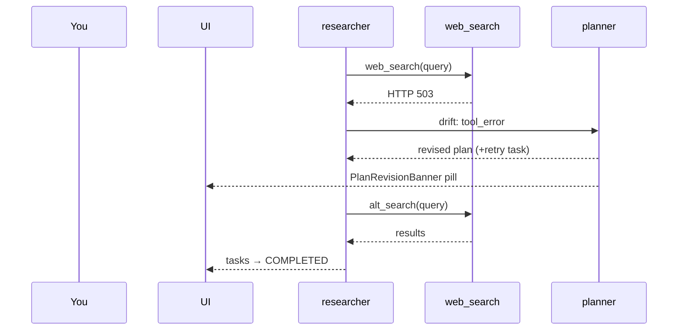

# Scenario: single-agent research assistant with a tool error

One agent. A plan with three tasks: "search the web", "read top three
results", "summarize". The search tool raises an HTTP 503 on the first
call, which fires a `tool_error` drift, which produces a plan revision,
which the agent then executes to completion.

This is the smallest complete scenario in harmonograf. Use it to calibrate
what a healthy refine cycle looks like.

The full arc as a sequence — agent, tool, planner, UI — so you know what to look for at each beat:



## Set-up

- One agent: `researcher` (ADK, `FRAMEWORK_ADK`).
- Orchestration mode: **sequential** (default). Mode chip on the current
  task strip reads `SEQ`.
- Tools: `web_search(query)`, `read_url(url)`, no approval gate.
- Planner: `HarmonografAgent` with the default drift taxonomy. See
  [tasks-and-plans.md → drift kinds](../tasks-and-plans.md#drift-kinds).
- Capabilities advertised in `Hello`: `PAUSE_RESUME`, `STEERING`. No
  `REWIND`.

The agent opens a session `sess_2026-04-14_0007`, title "Researcher
demo", then sends its first `Hello`.

## Timeline

### t=0 — session picked, Gantt loads

You pick the session from [⌘K](../sessions.md#opening-the-picker). The
Gantt renders:

- Agent gutter: one row, `researcher`, green status dot.
- Plot: one live INVOCATION bar breathing on the live edge. Recessed
  render (INVOCATION is a container).
- Current task strip: `Currently: Search the web · RUNNING · SEQ ·
  researcher`. No thinking dot yet.
- Transport bar: `LIVE`.
- Task panel: 3 rows — one RUNNING, two PENDING.


### t=2s — first LLM call opens

Inside the INVOCATION, an `LLM_CALL` span opens. The bar breathes and
starts drawing streaming ticks on its trailing edge — the model is
emitting tokens. The drawer is not open yet.

Log lines on the server side: `ingest._ensure_route` reports the new
span; the bus fans out a `SessionUpdate` to the frontend's
`WatchSession`. You do not see these in the UI — they are server logs.

### t=5s — tool call opens and immediately fails

The LLM decides to call `web_search("2026 arm m-series benchmarks")`. A
`TOOL_CALL` span opens under the INVOCATION. Roughly 400 ms later the
tool raises `HTTPError: 503 Service Unavailable`.

What you see in the UI:

- The TOOL_CALL bar switches to error fill (MD3 error hue) and gets a
  red warning glyph. See
  [gantt-view.md → reading a bar](../gantt-view.md#reading-a-bar--kinds-status-decorations).
- The drawer (if you clicked the bar) shows `status = FAILED` with an
  inline error block: `HTTPError / 503 Service Unavailable / …stack`.
- The INVOCATION is still RUNNING — the agent has not given up, it is
  going to replan.

**Span attributes worth noting** (visible in the drawer's Summary tab
attributes table):

```
tool.name        = "web_search"
tool.args        = "{\"query\":\"2026 arm m-series benchmarks\"}"
error            = "HTTPError: 503 Service Unavailable"
drift_kind       = "tool_error"
drift_severity   = "warning"
```

The `drift_kind` is also stamped on the **active INVOCATION** span, not
just the failed tool — this is how the planner knows to fire a refine.
See `docs/protocol/data-model.md :: Span.attributes`.

### t=5.2s — PlanRevisionBanner fires

A red pill slides in at the top of the shell: **⚠ Tool error** with
detail `HTTPError 503 from web_search` and diff counts `+1 ~1`. The pill
auto-dismisses in ~4 seconds.


Meanwhile the task panel updates: the previous tasks stay but the
`Search the web` row's description now reads `(retry with fallback
tool)` and a new row `Retry search via alternate engine` appears.

### t=5.3s — drawer shows the revision

Open the drawer on the INVOCATION and switch to the **Task** tab. Scroll
to the **Plan revisions** section. The latest revision is expanded:

- Icon: `⚠ Tool error` (red category).
- Timestamp: `00:00:05`.
- Diff counts: `+1 -0 ~1`.
- Added task: `Retry search via alternate engine`.
- Modified task: `Search the web` — description updated.
- Revision reason detail: `tool_error: HTTPError 503 from web_search`.

See [drawer.md → plan revisions section](../drawer.md#plan-revisions-section).

### t=7s — retry succeeds

A new LLM call opens. The model picks up the revised plan from
`session.state.harmonograf.available_tasks` and calls the alternate
search. Tool call succeeds, `read_url` opens for each of the top three
results, then a summarizer LLM call closes out.

The task panel walks through the statuses as the agent reports each
transition via the reporting tools (`report_task_started`,
`report_task_completed`). See `AGENTS.md` for the full protocol and
`docs/reporting-tools.md` for the tool contract.

### t=22s — invocation completes

The outer INVOCATION bar turns solid (no breathing), status chip on the
current task strip switches to `COMPLETED`, the assignee thinking dot
disappears. The strip sticks on the last completed task because
`getCurrentTask()` falls back to most-recently-completed when nothing is
RUNNING. See [tasks-and-plans.md → currenttaskstrip](../tasks-and-plans.md#currenttaskstrip).

## What the UI looks like at the end

- Gantt: one long recessed INVOCATION, with a failed TOOL_CALL early on,
  then a chain of successful TOOL_CALL and LLM_CALL children through to
  completion.
- Task panel: 4 rows (original 3 + the inserted retry), all COMPLETED.
- Drawer → Task → Plan revisions: 2 entries. The initial plan and the
  `tool_error` revision.
- No stuck markers, no orange "AWAITING_HUMAN" bars, no attention chip.


## Patterns to notice

1. **A tool error does not end the run** — the planner's job is to
   recover from drift, not bail. The `FAILED` span stays visible as a
   permanent record of the error.
2. **The drift kind is stamped on two spans**: the TOOL_CALL that
   failed (so the drawer's Summary tab shows it) and the active
   INVOCATION (so the planner can find it). Grep for `drift_kind =
   "tool_error"` in either.
3. **The banner is lossy, the drawer is lossless.** Miss the pill? The
   Plan revisions section is always there.
4. **Task panel rows are reactive** — you do not refresh; rows mutate as
   the `TaskRegistry` upserts.
5. This scenario never needs the Graph view. Single-agent runs with no
   transfers are best read on the Gantt.

## Related

- [cookbook.md → compare two plan revisions](../cookbook.md#4-compare-two-plan-revisions)
- [faq.md → why did the plan get revised mid-run](../faq.md#why-did-the-plan-get-revised-mid-run)
- [tasks-and-plans.md → drift kinds](../tasks-and-plans.md#drift-kinds)
- `docs/protocol/task-state-machine.md`
