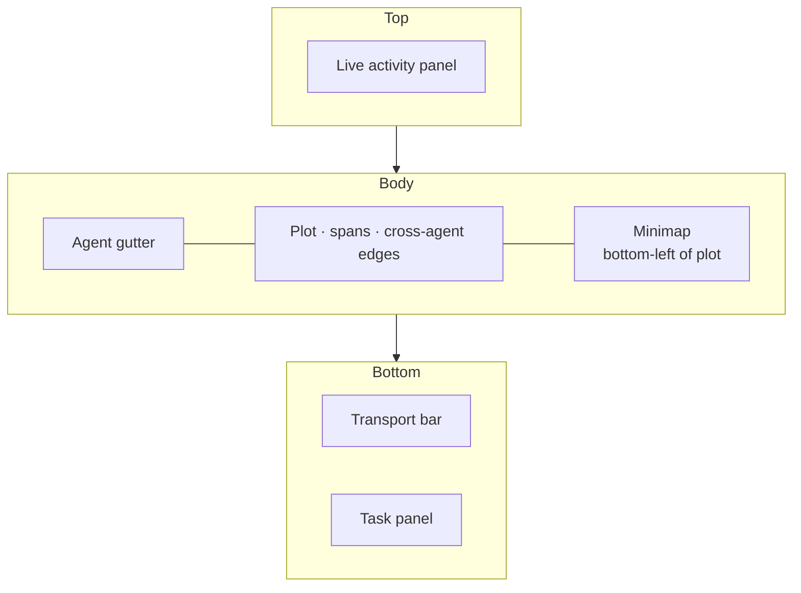
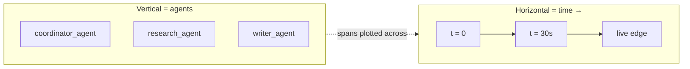
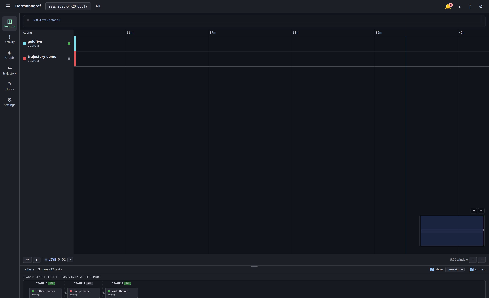

# Gantt view

The Gantt is the default view (`Sessions` in the nav rail). It is the
highest-density surface in harmonograf: one row per agent along the
vertical axis, time on the horizontal axis, and a colored bar ("span") for
every unit of work the agent reported.

If in doubt about a glyph or color, open the **legend** from the `?` button
on the app bar — it is the authoritative visual reference and mirrors every
renderer symbol.

## Region map

The Gantt view stacks a few panels around a central plot. Use this map to find what each region is called when you read the rest of the page.

## Layout recap

| Region | Purpose |
|---|---|
| **Live activity panel** (top) | Rolling summary of currently-running invocations across all agents. Collapsible. |
| **Agent gutter** (left) | One row per agent. Status dot, name, and focus/hide toggles live here. |
| **Plot** (middle) | The actual Gantt. Spans render as bars; cross-agent edges draw as bezier links. |
| **Minimap** (bottom-left, inside plot) | Full-session overview with a viewport rectangle. |
| **Transport bar** (below plot) | Pause / resume / follow-live / zoom. See [Control actions](control-actions.md). |
| **Task panel** (bottom) | Collapsible at-a-glance task list. Resize by dragging the top edge. |

## Reading the axes

Time runs horizontally; agents are stacked vertically, **one row per ADK
agent**, positioned by start and end time. Cross-agent edges (the bezier
curves) connect a TRANSFER on one row to the invocation it kicked off on
another row.

### Per-agent rows (#80)

A single `goldfive.wrap` run drives a tree of ADK agents —
typically a coordinator, a handful of specialists, AgentTool wrappers,
and occasionally a `SequentialAgent` / `ParallelAgent` container. The
Gantt puts each one on its own row.

The row label comes from the ADK agent's `name` (e.g. `coordinator`,
`research_agent`, `writer_agent`); the row id is
`<client.agent_id>:<adk_agent_name>` under the hood, stamped by the
client's `HarmonografTelemetryPlugin` via `before_agent_callback` /
`after_agent_callback`.

If you're looking at an older session recorded before harmonograf#80
landed, every agent collapses onto the client-root row. Fresh sessions
on a current client render one row per sub-agent; no migration is
required.

## Reading a bar — kinds, status, decorations

Each bar is a **span** reported by the client library. The main signals you
can read off a bar without opening the drawer:

**Color → kind.** Harmonograf uses one hue per span kind. The full palette
is in the legend; the condensed version:

| Kind | Meaning |
|---|---|
| `INVOCATION` | Top-level agent turn. Renders recessed because it's a container. |
| `LLM_CALL` | A model request. |
| `TOOL_CALL` | A function/tool invocation. |
| `USER_MESSAGE` / `AGENT_MESSAGE` | Inbound / outbound conversational turns. |
| `TRANSFER` | A hand-off to another agent — these are the bars that originate cross-agent edges. |
| `WAIT_FOR_HUMAN` | Agent is blocked on a human decision. See [Control actions](control-actions.md). |
| `CUSTOM` / planned | Framework-specific or predicted. Planned spans render dashed at 30% opacity. |

**Fill and outline → status.**

| State | Look |
|---|---|
| Running | Bar **breathes** on a 2s loop and extends with live time. `endMs` is still null. |
| Completed | Solid fill, no animation. |
| Failed | Fill switches to the MD3 error hue; a red warning glyph overlays. |
| Cancelled | Diagonal hatch, 30% opacity. |
| Replaced | 30% opacity solid (superseded by a REPLACES link). |
| Awaiting human | Red outline, 1s pulse, error-container fill. See [Control actions](control-actions.md#approvereject). |

**Icons and glyphs.** At widths ≥ 12px, the renderer draws a small glyph for
every kind (◉ invocation, ✦ LLM, ⚙ tool, ↪ transfer, ⏸ wait, 👤/💬 message,
◌ planned). Below 12px the glyph is omitted to stop the row from looking
noisy. Running LLM bars also get **streaming ticks** — thin white marks on
the trailing edge, one per `streaming_tick` the client reported.

**Cross-agent edges.** A bezier curve drawn at 40% opacity between a
TRANSFER and its invoked child on another agent row. Arrowhead at the target.
These edges are the visual signature of a delegation.

### Delegation edges

When a coordinator agent calls `AgentTool(sub_agent)`, goldfive observes
the tool call on its registry-dispatch side and emits a
`DelegationObserved` event. Harmonograf paints an extra edge for each
such event — dashed, 30% opacity, colored with the goldfive actor cyan
(`#80deea`) — running from the coordinator's row to the sub-agent's row
at the moment of delegation. A small `↪↪` glyph sits at the midpoint.

These edges sit alongside the regular TRANSFER arrows above: a TRANSFER
arrow means "the framework recorded a handoff span"; a delegation edge
means "goldfive's registry saw a registered agent call another
registered agent as a tool." The generic TOOL_CALL span the telemetry
plugin emits on the coordinator's row is not enough to reconstruct this
cross-row relationship, so goldfive fills it in.

## Navigating — pan, zoom, and selection

### Mouse

- **Click** a bar — selects it, opens the [drawer](drawer.md).
- **Hover** a bar — pops a [quick-look popover](drawer.md#span-popover) with
  summary, status, duration, latest thinking (if live), and quick actions.
- **Right-click** — context menu (copy id, annotate, steer — see
  [Control actions](control-actions.md#right-clicking-a-span)).
- **Scroll wheel** — pan horizontally when the cursor is in the plot.
- Click + drag inside the **minimap** to seek.

### Keyboard

Every shortcut is documented in [keyboard-shortcuts.md](keyboard-shortcuts.md).
The Gantt-specific subset:

| Key | Action |
|---|---|
| `←` / `→` | Pan 10% — handler reserved, not yet wired. |
| `+` / `=` / `-` | Zoom in / out. |
| `f` | Fit session to viewport (resets zoom to 1 hour window). |
| `l` | Return to live cursor. |
| `j` / `k` | Select next / previous span (sorted by start time across all agents). |
| `[` / `]` | Focus previous / next agent row. |
| `g` / `⇧g` | Jump to first / last agent. |
| `Space` | Toggle live follow (pause all agents is on the transport bar). |
| `Esc` | Close drawer / clear selection. |

Note: the arrow-key pan handlers exist in `shortcuts.ts` but are intentionally
no-ops pending the task-#11 renderer wiring. Use the minimap or the zoom
buttons until that lands.

## Minimap

The minimap is fixed at 240×120 in the bottom-left of the plot and always
visible. It shows:

- One thin row per agent with a tinted rect for every span.
- A semi-transparent blue rectangle marking the main viewport. The rect
  tracks the real viewport as you pan or zoom.
- +/- buttons for coarse zoom (same effect as the transport bar).

Interaction:

- **Click** anywhere on the minimap — seeks the main viewport so that the
  click position becomes the left edge.
- **Drag** — seeks continuously. The main Gantt repaints in real time.

The minimap reads its time range from the union of all spans across every
agent, so an agent that just joined will grow the minimap's horizontal
extent and shift the viewport rectangle accordingly.

## Live follow

When `liveFollow` is on (the default after picking a session), the renderer
keeps the right edge of the viewport pinned to "now" as new spans stream in.
Any manual pan or minimap drag disables live follow and replaces the LIVE
badge on the transport bar with `○ Viewport locked`. Press **L** or click
the **↩ Follow live** button on the transport bar to re-attach.

Pausing agents also unfollows live (since "now" isn't moving any more).
Resuming agents re-attaches.

**Caveat on completed sessions (#89 in flight).** When you open a
completed session the viewport currently opens to a window past the
last span, and the LIVE badge may briefly show in the header even
though the run is long finished. Pan left to reach the session's
actual time range. A UX fix is tracked as harmonograf#89; until it
lands, either press **F** to fit the whole session or drag the minimap
to the spans region.

## Actor rows — `user` and `goldfive`

Beyond the rows for the worker agents that connect into a session, the
Gantt will grow two synthetic rows on demand: `user` (warm pastel) and
`goldfive` (cool cyan). These represent the two parties that act on a run
from outside agent code — the operator, via the UI, and the goldfive
orchestrator, via drift detection and refines.

The rows are lazy — they appear the first time the session emits a drift
that attributes to them, and sit above the worker rows (they're the
sources of work, not the performers of it). Click any bar on one of these
rows to open the inspector drawer on the drift that produced it.

The full attribution rules, row ordering trick, and the list of drift
kinds that land on each row live on the dedicated [Actors](actors.md)
page.

## Focused and hidden agents

You can focus a specific agent row with `[` / `]` or by clicking its name in
the gutter. A focused row is highlighted but others remain visible.

To **hide** an agent row entirely, use the gutter's hide toggle. Hidden
agents are persisted in the UI store and the renderer filters them out of
the plot (but not the minimap, so you can still see they exist). `showAll`
on the UI store clears the hidden set.

## Context window overlay

Each agent row can show a per-agent context-window overlay along the bottom
of its gutter, rendering the model's prompt-token usage across session time.
The overlay is driven by heartbeat samples the client library stamps with
`context_window_tokens` / `context_window_limit_tokens` — see
[protocol/telemetry-stream.md](../protocol/telemetry-stream.md#heartbeat) for
the wire shape.

Colors cross the 0.5 / 0.75 / 0.9 thresholds (green → yellow → orange → red)
so a glance at the Gantt tells you which agents are under budget pressure.
Toggle the overlay off from the drawer's **View** tab if you want to see only
spans. The per-agent header chip next to the agent name always shows the
current ratio regardless of the overlay toggle.

## When the plot is empty

If you pick a session and see nothing:

- The session may have zero agents yet. Check the [Graph view](graph-view.md)
  for a list — it also renders the `agent count` in its header.
- The session may be live but extremely quiet; bars under a couple of pixels
  wide are still drawn but invisible. Zoom in with `+`.
- The agent may be connected but not reporting spans. See
  [Troubleshooting](troubleshooting.md#gantt-is-empty).

## Related pages

- [Graph view](graph-view.md) — the same run as a sequence diagram.
- [Drawer](drawer.md) — everything about the span you just clicked.
- [Control actions](control-actions.md) — pause, steer, rewind, approve.
- [Keyboard shortcuts](keyboard-shortcuts.md)
