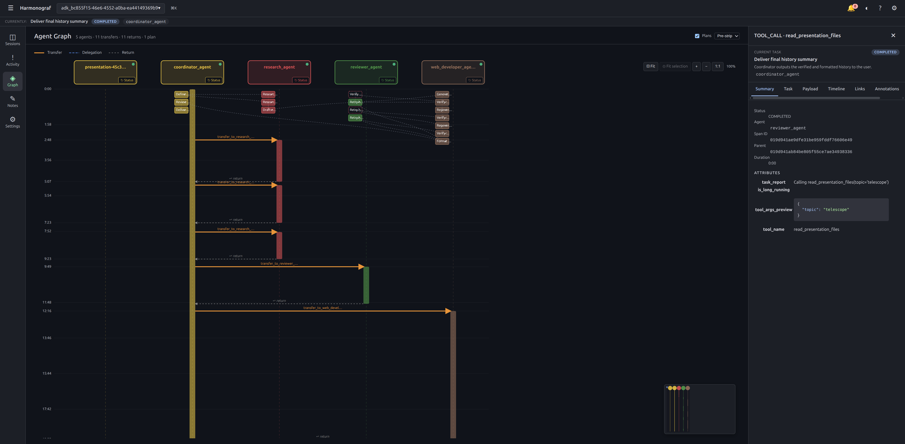
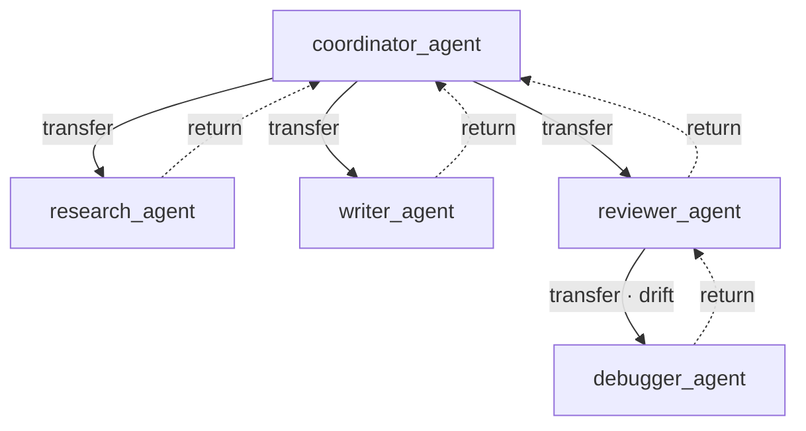

# Graph view

Switch to the Graph view from the nav rail (the ◈ icon, labeled "Graph").
This is the same session you see on the [Gantt](gantt-view.md), re-rendered
as a **sequence diagram**: one vertical column per agent, time flowing down,
cross-agent interactions drawn as horizontal arrows between columns.

Use the Graph when you want to reason about **who talked to whom** instead of
**what happened when**. The Gantt is density-optimized; the Graph is
flow-optimized.

## Example topology

A typical multi-agent run looks like the diagram below: a coordinator delegates to specialists, each specialist may invoke its own tools or transfer onward, and returns flow back up the chain. The Graph view is this topology with time running downward.

## Layout

- **Time label column** — the narrow strip on the left with `m:ss` marks.
- **Agent columns** — one per agent, at fixed 200px spacing. Header at the
  top, lifeline (dashed) running the full plot height.
- **Activation boxes** — 16px-wide boxes on each lifeline marking open
  INVOCATION spans. Filled ~85% while running, ~55% once complete.
- **Arrows** — transfer, delegation, and return arrows between columns.
- **Pre-strip task chips / ghost activations** — optional, toggled from the
  header. Shows the plan on top of the live activity.

## Agent headers

Each column gets a rounded header box tinted with the agent's assigned
color:

- **2px border + soft glow halo** while the agent has a running invocation.
- **Amber border + halo + "⚠ stuck" label** when the liveness tracker has
  flagged the agent as stuck (an open INVOCATION with no recent progress).
- **Status dot** in the top-right: green for connected, red for crashed,
  grey for disconnected, amber for stuck.
- **Task report line** (up to 2 lines) pulled from `agent.taskReport` or
  `agent.currentActivity`. This is the freshest human-readable string the
  agent has reported.
- **`↻ Status` button** in the bottom-right. Clicking it sends a
  `STATUS_QUERY` control to the agent; the response updates the task
  report line within a few seconds. See
  [Control actions](control-actions.md#status-query).

Click an agent header to focus that agent in the session's UI state.

## Activation boxes

A filled box on an agent's lifeline marks the time range of one INVOCATION
span on that agent. Running invocations render with a pulsing border; a
small pulsing blue dot overlays when `has_thinking` is true.

Clicking an activation selects the underlying span and opens the
[drawer](drawer.md), exactly like clicking a bar on the Gantt.

## Arrows — transfer, delegation, return

Three arrow kinds, color-coded:

| Arrow | Color | Style | Meaning |
|---|---|---|---|
| **Transfer** | orange (`#e8953a`) | solid 2.5px | Explicit hand-off — a `TRANSFER` span on the source agent whose `INVOKED` link points at the destination's invocation. |
| **Delegation** | blue (`#5b8def`) | dashed 1.5px | Inferred from a cross-agent INVOCATION parent when no explicit transfer span exists. |
| **Return** | grey (`#888`) | dashed 1.2px, italic "return" label | Implicit return edge drawn at the end of a delegated invocation. |

Arrow y-position is the time the destination invocation started (so the head
lands on the top edge of the target's activation box). The label above the
arrow is truncated to ~22 characters; the full span name is in the drawer.

Arrow counts are summarized in the panel header: `N transfers · M delegations ·
K returns`.

## Following message flow

A typical exercise: "trace how the supervisor agent ended up calling the
researcher, then the writer, then itself." On the Graph:

1. Start at the supervisor's column.
2. Walk down its lifeline until you hit a transfer arrow.
3. Follow the arrow to the researcher's column — note the label is the
   transfer span's name.
4. Inside the researcher's activation box, look for the next outbound
   arrow.
5. When the researcher's activation ends, expect a return arrow (grey,
   dashed) back up to the supervisor's column.

If any of those arrows is missing, either the transfer was never reported
(see [Troubleshooting](troubleshooting.md#plan-looks-wrong)) or the
delegation was inferred from the parent span alone and the "return" couldn't
be computed. The latter is common with ADK's observer mode — the Graph
still renders the arrow as dashed blue (delegation) without a matching
return.

## Task plan overlay

The right side of the Graph header has a `Plans` checkbox and a render-mode
dropdown. With plans visible, the Graph additionally renders the current
`TaskPlan` for each agent as one of three layouts:

| Mode | Look |
|---|---|
| **Pre-strip** | A reserved strip on the left of each column packed with task chips (one per task, stacked vertically). Chips use the same status palette as the task panel. |
| **Ghost** | Each task is drawn as a dashed 25%-opacity box directly on the lifeline, positioned at the task's `predictedStartMs` for its `predictedDurationMs`. Shows where the renderer *expects* work to land. |
| **Hybrid** | Both: a compact 28px strip and the ghost boxes. |

The mode is persisted in `localStorage` under `harmonograf.taskPlanMode`, so
your preference survives reload.

Hovering a task chip pops a card (Title · description · assignee · status ·
dependencies). Clicking it selects the task and, if the task is bound to a
span, opens the drawer on that span.

Dependency edges between tasks draw as dashed grey bezier curves between the
corresponding chips or ghost boxes.

## Zoom and minimap

The Graph view has an embedded minimap in the corner showing the full agent
topology with a viewport rectangle over the currently-visible region. Click
or drag on the minimap to pan. Wheel-zoom in the main plot is cursor-anchored
(range 0.25x–4x); keyboard shortcuts `⌘+` / `⌘-` / `⌘0` also zoom and reset.
Pan via primary-button drag on empty space, middle-click drag, or spacebar +
drag. Viewport state (zoom level, scroll offset) persists across session
switches via `uiStore.graphViewport`.

Fit-to-content and fit-to-selection buttons live in the overlay toolbar.

## When the Graph is empty

An empty Graph means one of:

- Zero agents registered. The header reads `0 agents` and the plot is a
  blank grid. Check that your agents are actually connecting — see
  [Troubleshooting](troubleshooting.md#agents-arent-showing-up).
- Agents exist but no activations yet. Each agent has a header box and a
  lifeline but no boxes. The agents have registered via `Hello` but haven't
  opened any INVOCATION spans.
- The Graph header says `No agent interactions detected yet.` — there's
  activity but no cross-agent transfers. Perfectly fine for a single-agent
  run.

## Related pages

- [Gantt view](gantt-view.md) — density-optimized companion view.
- [Tasks and plans](tasks-and-plans.md) — what task chips and ghost boxes mean.
- [Control actions: STATUS_QUERY](control-actions.md#status-query) — the `↻ Status` button.
