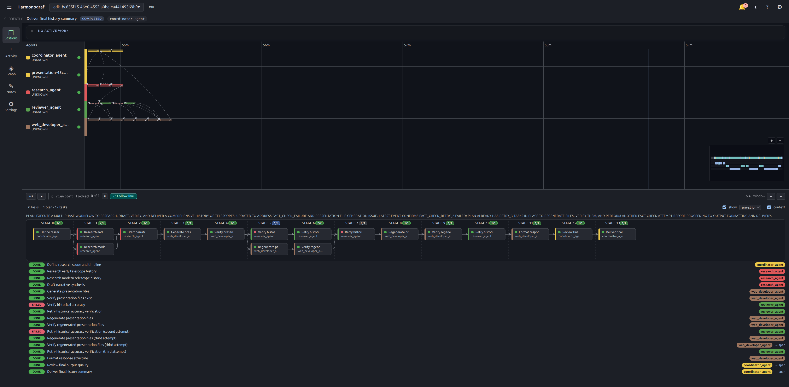
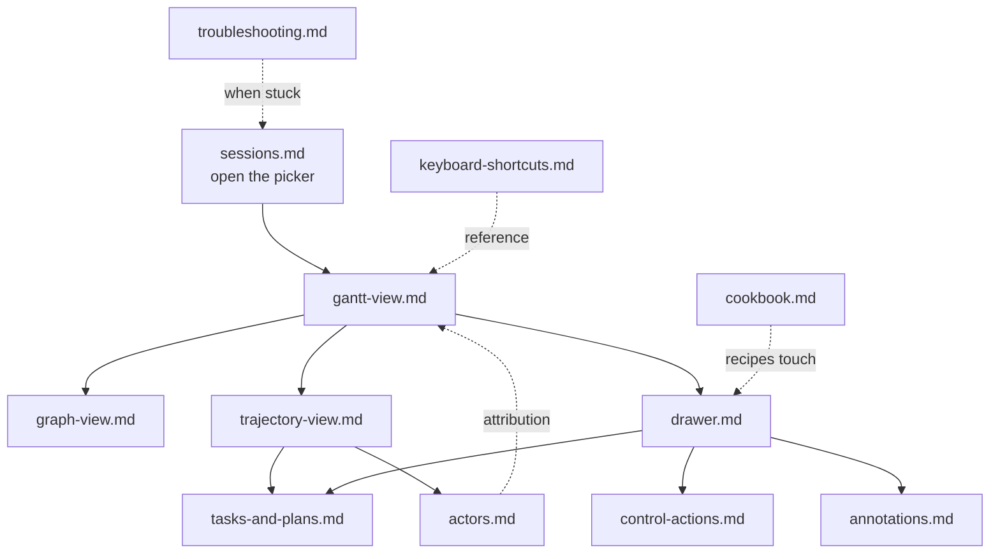

# Harmonograf user guide

Harmonograf is a console for watching, inspecting, and steering multi-agent
runs. An agent process embeds the `harmonograf_client` library, connects to a
server, and streams a timeline of everything it does (LLM calls, tool calls,
transfers, plan progression). The frontend you're reading about renders that
timeline live and gives you handles to push back — pause, steer, approve,
cancel, rewind.

This guide is aimed at engineers who already have agents reporting into a
harmonograf server and want to know how to drive the UI. It's organized as a
reference: pick the page that matches what you're looking at on screen.

## Orientation — regions of the shell

Harmonograf uses a single-window layout. Every page of this guide refers to
one of the regions below. Mentally tag them as you read.

| Region | Where | What it is |
|---|---|---|
| **App bar** | top strip | Session picker, attention badge, theme menu, legend button, settings. |
| **Current task strip** | directly below app bar | Live current-task readout: title, status, orchestration mode chip, assignee, thinking dot, in-flight tool badge. |
| **Plan revision banner** | below current task strip | Ephemeral pills announcing plan revisions as they arrive (auto-dismiss after ~4s). |
| **Nav rail** | left edge | Switches between Sessions (Gantt), Activity, Graph, **Trajectory**, Notes, Settings. |
| **Main area** | center | The current view — Gantt, Graph, etc. |
| **Inspector drawer** | right edge, slides in | Deep inspector for the selected span or task. Tabs: Summary, Task, Payload, Timeline, Links, Annotations, Control. |
| **Transport bar** | bottom of Gantt view | Pause / resume agents, live-follow toggle, elapsed clock, zoom. |
| **Task panel** | below transport bar | Collapsible at-a-glance list of tasks across all plans in the session. Resizable. |
| **Minimap** | inside the Gantt, bottom-left | Full-session overview with a draggable viewport indicator. |
| **Session picker** | modal, ⌘K | Fuzzy picker for live / recent / archived sessions. |
| **Legend** | modal, ? button on app bar | Icons, colors, and shapes used across the Gantt and Graph views. |
| **Help overlay** | modal, ⇧? | Keyboard shortcut cheatsheet. |

Most panels are live-subscribing: they repaint whenever a span, agent, task,
or annotation mutates in the backing store. You do not need to refresh.

## How the pages relate

The user guide is a map of the UI. Most pages start from the Gantt and branch outward into the inspector drawer or the graph view; a few are reference (shortcuts, troubleshooting) you grab when you need them.

## Contents

1. [Sessions — picker, filters, attention badges](sessions.md)
2. [Gantt view — reading the timeline](gantt-view.md)
3. [Graph view — sequence/topology and message flow](graph-view.md)
4. [Trajectory view — plan review, steering, and drift analysis](trajectory-view.md)
5. [Actors — user and goldfive as first-class rows](actors.md)
6. [The inspector drawer](drawer.md)
7. [Tasks and plans](tasks-and-plans.md)
8. [Control actions — pause, resume, steer, rewind, approve](control-actions.md)
9. [Annotations](annotations.md)
10. [Keyboard shortcuts](keyboard-shortcuts.md)
11. [Troubleshooting](troubleshooting.md)

## Conventions in this guide

- **Code paths** are relative to the repo root. For example,
  `frontend/src/lib/shortcuts.ts` is the source of truth for the keyboard map.
- **Screenshots** live under `docs/images/`. Filenames follow the pattern
  `NN-description.png` and are referenced inline throughout the guide.
- **In this release** means a feature that recently shipped (the sequence-
  diagram minimap/zoom, deeper thinking surfacing, context-window overlay)
  and may still be rough at the edges.
- The UI calls the main view "Sessions" in the nav rail and "Gantt" everywhere
  else. Both refer to the same page (`navSection === 'sessions'`).

## A very short tour

1. Press **⌘K** (or **/**) — the [session picker](sessions.md) opens. Pick a
   live session.
2. The [Gantt view](gantt-view.md) renders. The [current task strip](tasks-and-plans.md)
   shows what the agent is working on right now.
3. Click a bar on the Gantt — the [drawer](drawer.md) slides in with everything
   known about that span.
4. Press **Space** to pause all agents, **L** to jump the viewport back to the
   live edge, **?** to open the legend, **⇧?** for shortcuts.
5. Switch to **Graph** in the nav rail to see the same run as a
   [sequence/topology diagram](graph-view.md), or to **Trajectory** to
   review how the plan evolved from rev 0 to now.

That's the core loop. The rest of this guide digs into each surface.
