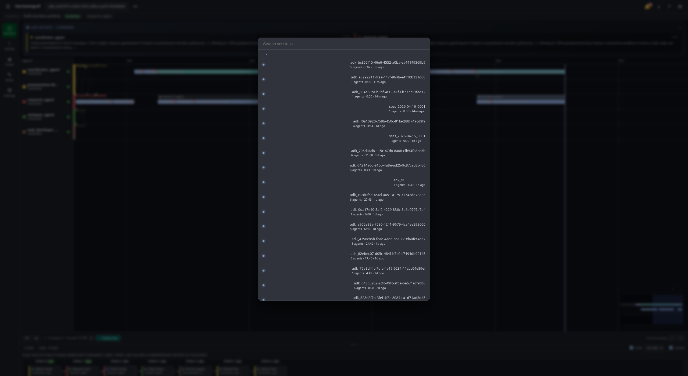
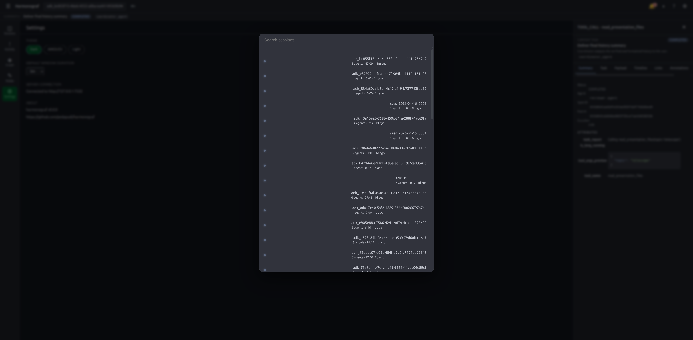
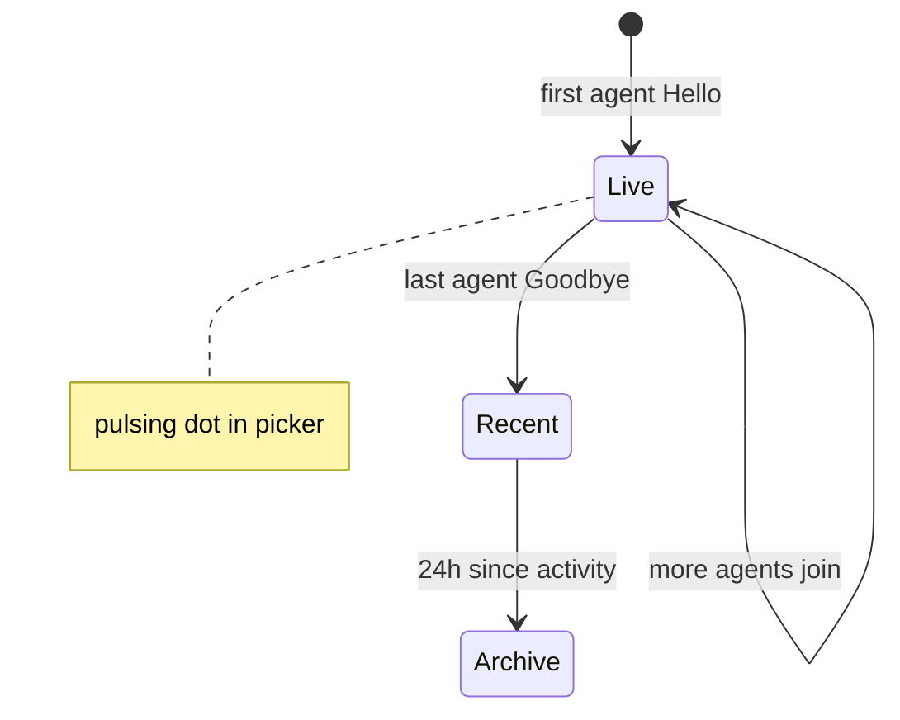

# Sessions

A **session** is one end-to-end run as reported by one or more agent
processes. Agents register with the server under a session id; harmonograf
lists every session the server currently knows about, grouped by liveness and
recency.

Everything else in the UI is scoped to the currently-selected session.
Selecting a different session reloads the Gantt, Graph, drawer, transport
bar, and task panel.

## One session per run (post lazy Hello, #84 / #85)

Each end-to-end `goldfive.wrap` invocation corresponds to exactly one
harmonograf session — the outer adk-web session id. A single run may
drive a tree of ADK agents through AgentTool sub-Runners, each of
which mints its own ADK session id, but the client's telemetry
plugin caches the ROOT adk-web session id on first `before_run_callback`
and stamps every subsequent span with it. The plan view, Gantt, and
intervention history all land on the same session row.

As of lazy Hello (harmonograf#85), constructing the client no longer
opens a `StreamTelemetry` — the `Hello` frame is deferred until the
first envelope arrives on the ring buffer. Importing
`harmonograf_client` in a launcher or notebook no longer mints a ghost
session that clutters the picker. If you expected a session to appear
and don't see one, the agent likely hasn't emitted anything yet.

## Opening the picker

Three ways, all equivalent:

- Press **⌘K** (or **Ctrl+K** on Linux/Windows).
- Press **/** — this is an alias intended to read as "search".
- Click the session title in the app bar (the button with the ▾ marker next
  to the Harmonograf wordmark).

The picker is a modal with a search field at the top and three sections:
**Live**, **Recent (last 24h)**, and **Archive**. It focuses the search field
on open, so you can start typing immediately.

## Searching and filtering

Typing in the search field performs a case-insensitive substring match across
the session title and the session id (`SessionPicker.tsx :: buckets`). There
is no fancy syntax — just type a word.

Clear the search field to see the full list again.

## How a session moves through the picker

A session is bucketed by its server status plus the age of its last activity. Live rows have at least one connected client; once every client disconnects the row falls into Recent, and 24h later it ages into Archive.

## Live / Recent / Archive — how a session is bucketed

Sessions come from `ListSessions` on the server and are classified by
`bucketSessions`:

| Bucket | Criterion |
|---|---|
| **Live** | Status is `LIVE`. These rows also get a small pulsing dot in front of the title. |
| **Recent** | Not live, but last activity is within the last 24 hours. |
| **Archive** | Older than 24h. Collapsed to the first three entries by default — click **Show all** to expand (capped at 50 rows per open). |

Each row shows the title, agent count, session duration, relative last-activity
timestamp, and — if any spans need attention — a red `N need attention` chip
on the right. Click a row to pick it and close the modal.

## Attention badges

The app bar's bell icon aggregates the attention count across every session
the server has reported. The count comes from
`RpcSession.attentionCount`, which the server computes per session from spans
in the `AWAITING_HUMAN` state (plus any other raised-flag kinds the server
defines).

Per-session attention is also surfaced on the right edge of a session row in
the picker. Both places use the same number.

Clicking the app-bar bell is a no-op placeholder today — it does not open a
queue view yet. Use the picker to jump into the offending session directly.

## Server unreachable — the mock fallback

When the frontend can't reach the server, `ListSessions` errors and the picker
falls back to a built-in demo set (`SessionPicker/mockSessions.ts`). In that
state:

- A dim `Server unreachable — showing demo sessions.` banner appears under
  the search field.
- The app bar reads the attention count off the mock sessions too.
- The picker operates normally over the mock data so you can poke around.

If the server is reachable but no sessions exist, you'll see
`Waiting for agents to connect…` in the picker body instead. This is the
real empty state — no mock substitution.

## Deleting / replaying sessions

Neither action is surfaced in the frontend today. The session picker is
read-only: you can pick, but you cannot delete or reset from the UI. Session
lifecycle (create, end, prune) is currently driven from the server side.

This page will grow a delete / replay section once those capabilities are
wired up. In the meantime, see [Troubleshooting](troubleshooting.md) for what
to do about stuck or wedged sessions.

## Session state after picking

Once you pick a session, the rest of the shell binds to it immediately:

- The [current task strip](tasks-and-plans.md) starts rendering the live
  current task.
- The [Gantt view](gantt-view.md) opens a stream watcher on that session.
- The transport bar starts its elapsed clock from zero.
- Keyboard nav (`j`/`k`, `[`/`]`, etc.) now operates on spans and agents
  inside this session.

Switching sessions is cheap — the old watcher is closed and a new one opens.
Your viewport zoom, theme, and task-plan rendering preference are preserved
across the switch.

## Related pages

- [Gantt view](gantt-view.md) — what you see after picking a session.
- [Troubleshooting: agent won't connect](troubleshooting.md#agents-arent-showing-up)
