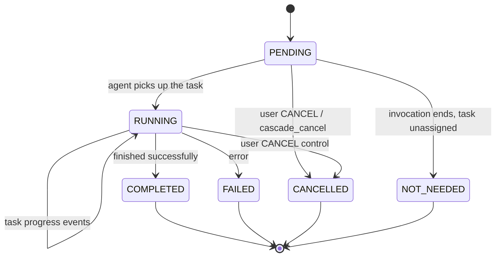
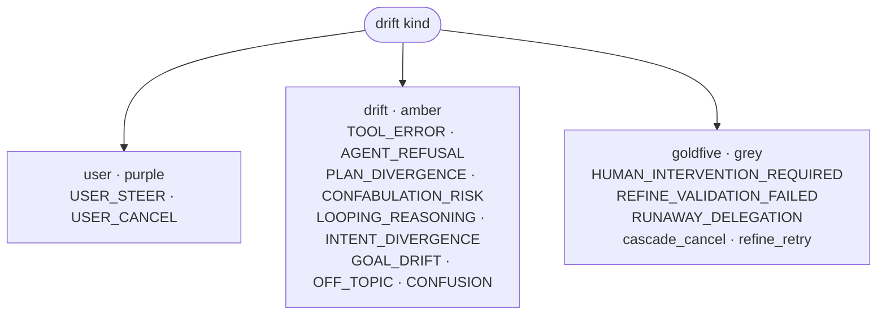
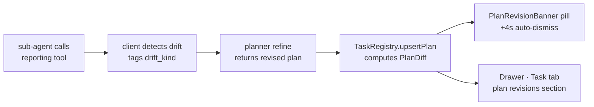

# Tasks and plans

Harmonograf tracks plan execution through three coordinated channels —
session state, reporting tools, and ADK callback inspection. The UI
surfaces the resulting task registry in a few places; this page maps those
surfaces to what they mean and how to read them.

If you want the protocol-level view of how plan execution is tracked, read
`AGENTS.md` in the repo root. This page is about the frontend.

## What's a task? What's a plan?

A **task** is a single unit of planned work: title, description, assignee,
status, optional `predictedStartMs` / `predictedDurationMs`, optional
`boundSpanId`. Tasks have six legal statuses:

| Status | Meaning |
|---|---|
| `PENDING` | In the plan, not yet picked up by an agent. |
| `RUNNING` | An agent has claimed the task and is working on it. |
| `COMPLETED` | Finished successfully. |
| `FAILED` | Finished with an error. |
| `CANCELLED` | Explicitly cancelled by the user (`CANCEL` control) or by goldfive (`cascade_cancel`). |
| `NOT_NEEDED` | Overlay-era terminal state (goldfive#141-144). The invocation ended without this task being needed — it was part of the original plan but the agent's work didn't require it. |

Task state is monotonic — it only moves forward. The diagram below shows the legal transitions; you'll never see a task move backwards on the task panel.

`PENDING → NOT_NEEDED` at invocation end is expected under the overlay
model. If a task stays PENDING indefinitely while agents are still
actively running, that's a bug; see
[runbooks/task-stuck-in-pending.md](../../runbooks/task-stuck-in-pending.md).

A **plan** is an ordered (and possibly DAG-shaped) collection of tasks
plus `edges` expressing task dependencies. A plan also carries a
`revisionReason` — the drift kind + detail that caused the most recent
revision. Plans can be revised multiple times during a session; the
frontend keeps the full revision history per plan.

A session can have multiple plans — typically one per orchestrator agent,
but nothing stops a session from carrying several parallel plans. The
[task panel](gantt-view.md#task-panel) and the task-plan overlay in the
[Graph view](graph-view.md#task-plan-overlay) list all plans in the session.

## CurrentTaskStrip

The slim strip directly below the app bar is the **CurrentTaskStrip**.
It always reflects the live "current task" for the session:

The strip decides what to show by calling `store.getCurrentTask()`, which
returns the RUNNING task when one exists and otherwise the most recently
completed task, so the strip never goes blank mid-session.

Left to right:

| Element | Meaning |
|---|---|
| `Currently:` | Static label. |
| Title | `task.title` (falls back to `task.id`). Tooltip shows the description. |
| **Status chip** | PENDING / RUNNING / COMPLETED / FAILED / CANCELLED. The strip turns slightly "hotter" (border color + `data-running="true"`) while RUNNING. |
| **Mode chip** | `SEQ`, `PAR`, or `OBS` — the [orchestration mode](#orchestration-modes) of the assignee agent. Hover for a tooltip that explains the mode. |
| Assignee | `task.assigneeAgentId` in monospace. |
| **Thinking dot** | A tiny pulsing blue dot next to the assignee when the assignee agent currently has a span with `has_thinking=true`. |
| **Tool badge** | The name of the in-flight tool call, if the current task's span is inside a TOOL_CALL right now. |

All of this is driven by live subscriptions to `store.tasks`, `store.spans`,
and `store.agents`. Any signal can disappear or change without a page
reload. If the current task ends and no new RUNNING task is promoted, the
strip sticks to the completed task so you still have context.

### Orchestration modes

The mode chip corresponds to the executor chosen when the agent's
`goldfive.Runner` was constructed:

| Chip | Mode | Tooltip |
|---|---|---|
| `SEQ` | **Sequential** (`SequentialExecutor`) | Single-pass coordinator LLM executes the full plan; lifecycle reported via reporting tools. |
| `PAR` | **Parallel** (`ParallelDAGExecutor`) | Rigid DAG batch walker drives sub-agents directly, respecting plan edge dependencies. |
| `OBS` | **Delegated / Observer** | Inner agent owns its sequencing; goldfive watches for drift after the fact. |

The strip reads the mode from the assignee agent's metadata. Agents
without metadata don't render a chip.

Which mode runs is determined by how the agent's `goldfive.Runner` was
constructed, not by anything the UI controls.

!!! tip "Observation vs orchestration in the demo"
    The reference demo ships two ADK agents side by side:
    `presentation_agent` (observation — plain ADK tree with
    `HarmonografTelemetryPlugin`) and `presentation_agent_orchestrated`
    (orchestration — the same tree wrapped with `goldfive.wrap(...)`).
    Orchestration mode is where you actually see goldfive plan,
    dispatch, fire drift, and surface HITL/steering seams end-to-end.
    In observation mode the coordinator's instruction text does the
    routing and harmonograf only sees per-span telemetry — no plan, no
    drift events. Both variants appear in `adk web`'s picker once
    `make demo` has staged them.

## PlanRevisionBanner

Whenever a plan's `revisionReason` changes, a pill appears in the
**PlanRevisionBanner** row directly below the current-task strip. Each
pill announces one revision and auto-dismisses after 4 seconds. Up to
three pills stack FIFO when revisions arrive in a burst.

A pill contains:

- **Drift icon + color** in a left border. See [drift kinds](#drift-kinds)
  below.
- **Label** (e.g. "Tool error", "New work", "Reordered").
- **Detail** — the part of the `revisionReason` after the `kind:` prefix,
  or the label if there's no detail.
- **Diff counts** `+N -M ~K` when a `PlanDiff` is attached to this
  revision (computed by `TaskRegistry.upsertPlan` when it recognizes a
  change).

The banner is transient. To see the full revision history, open the
[drawer → Task tab](drawer.md#plan-revisions-section).

## Drift kinds

Every revision reason is tagged with a **drift kind** — the reason
goldfive decided to revise, or the signal a detector fired. The
canonical taxonomy lives in
[`goldfive/v1/types.proto` `DriftKind`](https://github.com/pedapudi/goldfive/blob/main/proto/goldfive/v1/types.proto)
— harmonograf reflects whatever goldfive emits. The current kinds:

| Kind | Category | When it fires |
|---|---|---|
| `USER_STEER` | user | Operator sent a STEER control / posted a STEERING annotation. |
| `PLAN_DIVERGENCE` | divergence | Three-stage function_call gate (goldfive#178): an agent called a tool that belongs to another layer of the plan. |
| `CONFABULATION_RISK` | divergence | Three-stage gate: an agent called a tool that doesn't exist in the registry — model hallucinated the name. |
| `CONFUSION` | divergence | Planner couldn't reconcile the agent's output with the plan. |
| `INTENT_DIVERGENCE` | divergence | Agent's output drifted from the original user intent. |
| `AGENT_REFUSAL` | error | Agent refused a request (safety / policy). |
| `TOOL_ERROR` | error | A tool call failed. |
| `LOOPING_REASONING` | error | Tool-loop detector (goldfive#181/#186) fired — same tool+args, same tool-name pattern, or alternating pair repeating beyond threshold. |
| `RUNAWAY_DELEGATION` | structural | One agent is delegating to sub-agents at a pathological rate. |
| `REFINE_VALIDATION_FAILED` | structural | Goldfive's planner refine emitted an invalid plan. |
| `HUMAN_INTERVENTION_REQUIRED` | error | Goldfive's intervention ladder reached the rung where only a human can resolve the situation. |
| `GOAL_DRIFT` | divergence | Goal-aware refiner noticed the run moved away from the goal. |
| `OFF_TOPIC` | divergence | Model started discussing something unrelated to the goal. |

### Severity

Each drift carries a severity (`info` / `warning` / `critical`) that
drives the timeline ring color and the PlanRevisionBanner pill
coloring. `CRITICAL` severity includes `CONFABULATION_RISK` (34) —
hallucinated tool names — and `RUNAWAY_DELEGATION` (35);
`HUMAN_INTERVENTION_REQUIRED` (37) and `GOAL_DRIFT` (38) ride at
warning. Refer to goldfive's drift enum for the authoritative severity
mapping.

### User-control drifts

`USER_STEER` and (where goldfive emits it) a `user_cancel` equivalent
are special in the aggregator: they fold into the authoring
annotation's intervention card via `annotation_id` propagation
(goldfive#176 / harmonograf#75). One card per operator intervention,
even though the wire emits three events (annotation + drift + plan
revision).

### Frontend rendering is tree-agnostic

`frontend/src/lib/interventions.ts` and the InterventionsTimeline
component render whatever kind string the server emits. New kinds
added to goldfive tomorrow work without a harmonograf change — the
source trichotomy (`user` / `drift` / `goldfive`) is the only
taxonomy knowledge baked into the view.

The drift taxonomy clusters by source on the InterventionsTimeline
(user / drift / goldfive) and by severity for colour. Use this map
when triaging a noisy session — start by deciding which source
bucket the marker belongs to, then drill in on the specific kind.

**Source** groups the kinds for rendering:

- `user` (purple) — operator-initiated (STEER / CANCEL).
- `drift` (amber) — detectors fired on agent behaviour.
- `goldfive` (grey) — autonomous orchestrator action (escalation ladder).
- `structural` (blue / grey) — the plan shape changed for reasons unrelated
  to correctness.

Unknown kinds (legacy revisions, new kinds added to the planner that
haven't landed on the frontend yet) fall back to a `Plan revised` grey
pill. You can still read the raw reason in the pill body.

## Task panel (bottom of Gantt)

Below the Gantt's transport bar there's a resizable **task panel**
(`gantt-task-panel`). It's a live list of every task across every plan in
the session:

- **Collapsible** — click the resize handle or collapse button. Collapsed
  it's 28px tall with just a header; expanded, the height is persisted to
  `localStorage` under `harmonograf.taskPanelHeight`.
- Columns: title, status, assignee name, predicted start/duration.
- Click a task to select it; if the task is bound to a span, the
  [drawer](drawer.md) opens on that span too.
- The task panel **mirrors** the chips the Gantt renderer paints inside
  the plot. If you see a task here but not on the Gantt, the task's
  assignee may be hidden — unhide from the gutter (see
  [gantt-view.md](gantt-view.md#focused-and-hidden-agents)).

## Task-plan overlay on the Graph view

See [Graph view → Task plan overlay](graph-view.md#task-plan-overlay). The
overlay comes in three modes (`pre-strip`, `ghost`, `hybrid`) persisted to
`localStorage`, with hover cards and clickable task chips that hop into
the drawer when a span binding exists.

## How a plan revision happens

A revision is a small loop: an agent calls a reporting tool, the client library detects drift, the planner emits a new plan, the registry diffs it against the previous revision, and a pill plus drawer entry surface in the UI.

## Plan revisions — live replans

The planner can revise plans mid-run. Every revision produces:

1. A new plan snapshot in the TaskRegistry.
2. A `PlanDiff` describing the delta (added, removed, modified tasks;
   whether the DAG edges changed).
3. A **PlanRevisionBanner** pill (auto-dismissing).
4. A new entry in the **Plan revisions** section of the
   [drawer's Task tab](drawer.md#plan-revisions-section).

The revision flow is triggered by drift detection in the client library
(`refine` calls back into the planner with the current plan + drift
context). The frontend doesn't drive replans — it only visualizes them.

When you see a pill, the corresponding plan history entry is already in
the drawer; open the drawer on any span in that plan and the latest
revision expands by default.

## Related pages

- [Drawer: Task tab](drawer.md#task-tab) — full plan revision history and orchestration events timeline for one task.
- [Graph view: Task plan overlay](graph-view.md#task-plan-overlay) — chips and ghosts on the sequence diagram.
- [Control actions: STATUS_QUERY](control-actions.md#status-query) — asking an agent what it's working on.
- `AGENTS.md` — protocol-level detail on how tasks are tracked (state keys, reporting tools, callback inspection).
