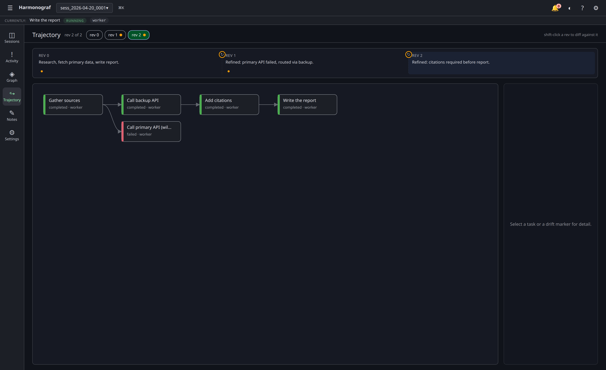
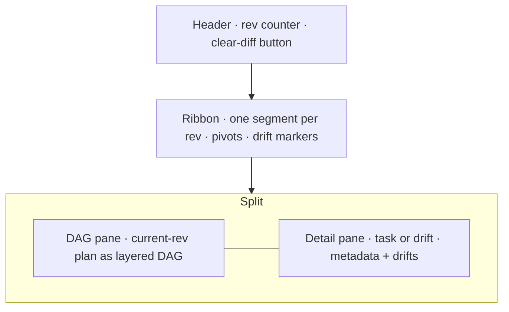
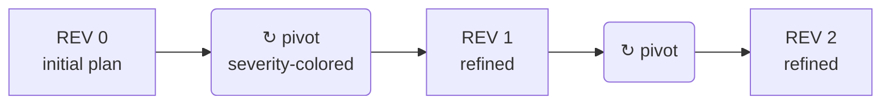
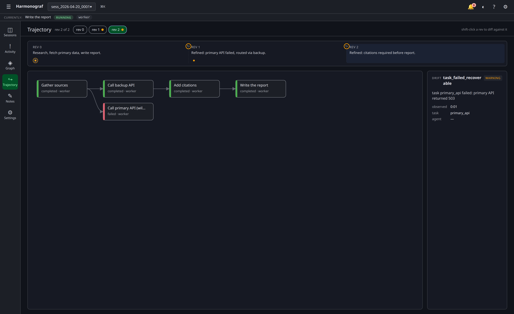
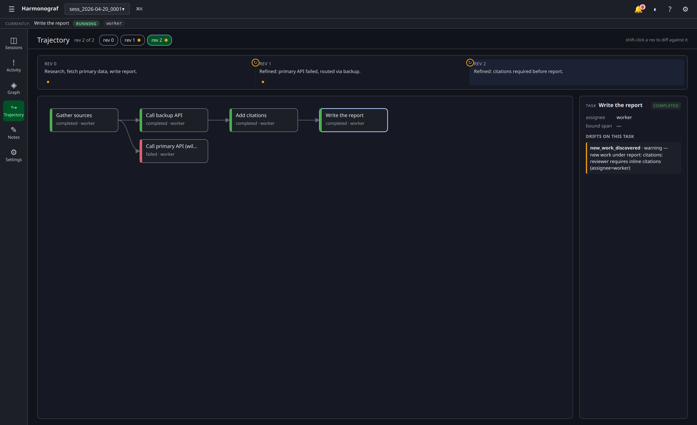

# Trajectory view

The Trajectory view (`Trajectory` in the nav rail) is harmonograf's dedicated
surface for **plan review, steering, and drift analysis**. Where the Gantt
answers "what happened, when?", the Trajectory answers "how did this plan get
from rev 0 to where it is now, and why did it change?".

It unifies two things that used to live in separate places — the plan DAG and
the plan-diff history — into one pane, anchored on a horizontal ribbon of
revisions. The DAG shows the current plan; the ribbon shows the plan over
time; the detail pane on the right shows whatever you last clicked.

## When to use it

The Gantt shows a ticker-tape of spans. That works well when you're chasing a
specific invocation or looking at overall pacing, but it hides two things
that plan-driven runs really care about:

- **Plan structure.** Which tasks depend on which? Where is the DAG branchy
  vs. linear? A flat task panel can't show dependencies at a glance.
- **How the plan evolved.** Between the initial plan and "now" there may be
  several refines, each triggered by a different drift. The Gantt shows the
  *effect* of each refine (a new bar starts, an old bar fails) but not the
  *replan* — which tasks were added, removed, reworded, or reassigned.

The Trajectory is the pane you open when you want to answer "why is the plan
shaped like this?" or "what did rev 2 change about rev 1?".

## Region map

| Region | What it is |
|---|---|
| **Header** | Title, rev counter (`rev N of M`), hint about shift-click-to-diff, and a `clear diff` button when a compare rev is pinned. |
| **Rev chips** | One clickable chip per rev on the far right of the header. Click = pin a rev; shift-click = diff against it. |
| **Ribbon** | One horizontal segment per rev. Between segments, a pivot glyph (↻) colored by severity. Each segment carries a row of drift markers for drifts observed during that rev. |
| **DAG pane** | The current rev rendered as a layered DAG (left-to-right Kahn topological layout). One card per task; arrows for edges; drift-count badges on tasks that accumulated drifts. |
| **Detail pane** | On the right. Shows whatever you last selected — a task card (assignee, bound span, drifts on this task) or a drift marker (kind, severity, detail, observed time, task id, agent id). |

## Reading the ribbon

The ribbon is the spine of the view. It reads like a timeline of the planner's
decisions: one segment per rev, pivot glyphs at the boundaries where a refine
fired, drift markers on each segment marking the drifts that happened while
that rev was live.

Each segment shows:

- **Rev number and summary.** `REV 1 — Refined: primary API failed, routed via backup.` The summary text comes from the planner's `summary` field on the revised plan.
- **A row of drift markers** beneath the label. One marker per drift observed during that rev. Circles (●) are model/runner-authored drifts; stars (★) are user-authored pivots (`user_steer`, `user_cancel`, `user_pause`). Both are colored by severity — blue (info) · amber (warning) · red (critical).
- **A pivot glyph (↻)** at the *start* of the segment (except rev 0). The pivot is colored by the revision's severity, so the eye can trace catastrophic replans from info-level tweaks by color alone.

### Drift severity, not drift count

Harmonograf leans on severity rather than drift count because *some drift is
expected*. A reasoning model that re-routes around a failed API, or that
notices a missed citation and adds a task, is doing its job. Those events
should render but not scream. A plan divergence or a tool refusal is what you
want to jump to.

The severity palette is consistent across the ribbon, the pivot glyphs, the
task cards, and the detail pane:

| Severity | Color | What it usually means |
|---|---|---|
| `info` | blue | Model-initiated refinement, discovery, reordering |
| `warning` | amber | Recoverable failure, divergence, unexpected transfer |
| `critical` | red | Unrecoverable failure, plan contradiction, refusal |

(Drift *kinds* are documented on [tasks-and-plans.md](tasks-and-plans.md#drift-kinds);
the trajectory view groups by severity because that's the axis that matters
for prioritization.)

## The DAG pane

The DAG is a left-to-right Kahn topological layout: every task's horizontal
position is its longest-path distance from a root, so edges always go right.
Within a layer, tasks are stacked vertically.

Each card shows:

- **Title** on the first line.
- **Status and assignee** on the second line (e.g. `completed · worker`).
- **A 6px color bar** on the left edge encoding task status:

  | Status | Color |
  |---|---|
  | `PENDING` / `UNSPECIFIED` / `CANCELLED` | grey |
  | `RUNNING` | blue |
  | `COMPLETED` | green |
  | `FAILED` | red |
  | `BLOCKED` | amber |

- **A severity-colored drift badge** in the top-right corner of the card when
  one or more drifts point at that task. The badge number is the drift count;
  the color is the worst severity observed.

Click a card to select the task. The detail pane on the right loads with the
task's description, assignee, and the list of drifts that pointed at it. If
the task has a `boundSpanId`, the inspector drawer also opens on that span so
you can drill into the actual execution without leaving the view.

### Drift detail

Click a drift marker on the ribbon — the detail pane shows the drift's kind,
severity, detail string, observed time, the task id it targeted, and the
agent id that reported it.

This is the fastest way to answer "why did this rev happen?". Start on the
pivot glyph that separates rev N-1 from rev N, hit the drift marker that
sits on rev N-1's segment, and you'll see the planner-facing reason.

## Diffing two revs

The trajectory view is also a plan-diff view. Shift-click any rev chip to pin
it as a **compare rev**. The current rev renders with diff marks overlaid:

- **Added** tasks (present in current, absent from compare) get a green dashed
  outline.
- **Modified** tasks (same id, different title/description/assignee) get a
  blue dashed outline.
- **Removed** tasks (present in compare, absent from current) render as a
  stripped-down list in a "Removed in rev" aside on the right of the DAG so
  they don't corrupt the current-rev layout.

The rev counter in the header updates to read
`rev 2 of 2 · comparing to rev 0`. Click `clear diff` to go back to straight
current-rev view.

You can shift-click any rev against any other rev — `rev 0` against `rev 2`,
`rev 1` against `rev 0`, etc. The diff is computed live from the stored
revisions; nothing is pre-baked.

## Task detail

Clicking a task card pins it in the detail pane:

You get the task's title, status, assignee, bound span id, and a **Drifts on
this task** section listing every drift whose `task_id` pointed at this task
across all revs. Each row is colored by severity and shows `kind · severity
— detail`.

If the task is bound to a real span (`boundSpanId`), clicking it also opens
the inspector drawer on that span — so you can read the trajectory narrative
here and drop into the execution detail without navigating away.

## Live updates

The Trajectory view live-subscribes to the same registries the Gantt does
(`store.tasks`, `store.drifts`, `store.spans`). As the agent runs:

- New plans push new segments onto the ribbon, with the latest rev auto-
  selected.
- New drifts materialize as markers on whichever segment was live when they
  were observed.
- Status changes repaint the corresponding card on the DAG.

If you've pinned a specific rev (clicked a chip), the live pin *sticks* — the
ribbon will keep growing, but the DAG and detail pane stay on the rev you
chose. Click the latest chip (or any chip) again to un-pin.

## Interaction summary

| Input | Result |
|---|---|
| Click a rev chip | Pin that rev as the current rev. |
| Shift-click a rev chip | Pin that rev as the compare rev (enables diff mode). |
| Click `clear diff` | Exit diff mode. |
| Click a task card | Pin the task in the detail pane. Open the inspector drawer on the bound span if one exists. |
| Click a drift marker on the ribbon | Pin the drift in the detail pane. |

Nav: the Trajectory view lives at `navSection === 'trajectory'` in the UI
store; it's reachable from the nav rail (`↪ Trajectory`) alongside Sessions,
Activity, Graph, Notes, and Settings.

## Related pages

- [Tasks and plans](tasks-and-plans.md) — the task state machine, drift kind
  taxonomy, and the PlanRevisionBanner that announces new revs as they land.
- [Actors and attribution](actors.md) — how the synthetic `__user__` and
  `__goldfive__` actor rows get populated from the same drifts the Trajectory
  ribbon shows.
- [Gantt view](gantt-view.md) — the other half of the picture (spans, agent
  rows, cross-agent edges).
- [Control actions](control-actions.md) — how to steer a run (the steerings
  you send show up as `user_steer` markers on the ribbon).
